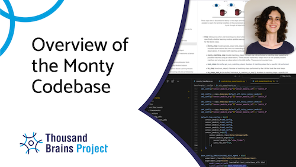
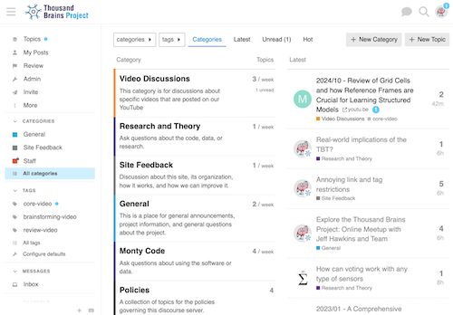

# Welcome to the Monty repository!
*An open-source, sensorimotor learning system following the principles of the neocortex.*

[](https://github.com/thousandbrainsproject/tbp.monty/actions/workflows/monty.yml)

This repository contains the first implementation of a **sensorimotor learning system** from the **Thousand Brains Project at Numenta**. We lovingly call it **Monty** after Vernon Mountcastle, who proposed cortical columns as a repeating functional unit across the neocortex.

This is an open-source project by Numenta, partially funded by the Gates Foundation.

Please find our [**full documentation** here](https://thousandbrainsproject.readme.io/)

Our [**API documentation** here](https://api-monty.thousandbrains.org).

# Getting Started

You can find detailed instructions on how to install the project requirements and how to get started [here](https://thousandbrainsproject.readme.io/docs/getting-started)

# Current Performance
We regularly evaluate this system against a set of sensorimotor tasks, summarized in the **[benchmark experiments](./benchmarks/configs/)**. Any time a functional change is made to the code, these experiments are rerun, and results are updated.

You can find our current performance on these benchmarks as well as an explanation of them [here](https://thousandbrainsproject.readme.io/docs/benchmark-experiments).


# Contributing

Are you interested in contributing? Check out our tips and guidelines [here](https://thousandbrainsproject.readme.io/docs/contributing).

Before contributing, please sign our Contributor License Agreement (CLA). You can find the CLA and guidelines [here]( https://thousandbrainsproject.readme.io/docs/contributor-license-agreement).

# Disclaimer
This is not production-ready code. It is an **early beta version** that is under active development. This early beta version is functional but evolving. Expect frequent changes as we develop core features.

You can find a list of the systems **current capabilities and application criteria** [here](https://thousandbrainsproject.readme.io/docs/application-criteria).

You can find our **project road map** and details on the next features we are working on [here](https://thousandbrainsproject.readme.io/docs/project-roadmap).

# More Information and Updates
As mentioned above, we have extensive **documentation** of this project [here](https://thousandbrainsproject.readme.io/).
[](https://thousandbrainsproject.readme.io/)

We also publish our meeting recordings on **YouTube** on the [Thousand Brains Project channel](https://www.youtube.com/@thousandbrainsproject).
[](https://www.youtube.com/@thousandbrainsproject)

If you want to use this code, contribute to it, ask questions or propose ideas, please consider joining [our discourse channel](https://thousandbrains.discourse.group/).
[](https://thousandbrains.discourse.group/)

If you would like to receive updates, follow us on [Bluesky](https://bluesky.social/thousandbrainsproject) or [Twitter](https://x.com/1000brainsproj) or [LinkedIn](https://www.linkedin.com/showcase/thousand-brains-project/).

If you have further questions or suggestions for collaborations, don't hesitate to contact us directly at **ThousandBrains@numenta.com**.

# Citing the Project
If you're writing a paper that references the Thousand Brains Project, please cite our overview paper:
```
@misc{TBP_Overview,
	title = {The Thousand Brains Project},
	url = {https://www.numenta.com/wp-content/uploads/2024/06/Short_TBP_Overview.pdf},
	author = {Clay, Viviane and Leadholm, Niels and Hawkins, Jeff},
	month = jun,
	year = {2024},
}
```

# License

The MIT License. See the [LICENSE](LICENSE) for details.
