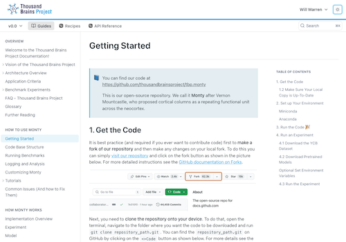
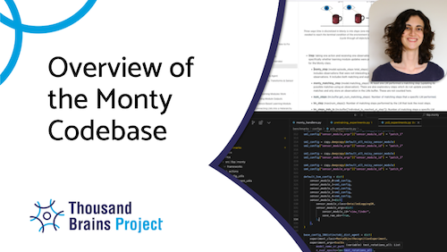
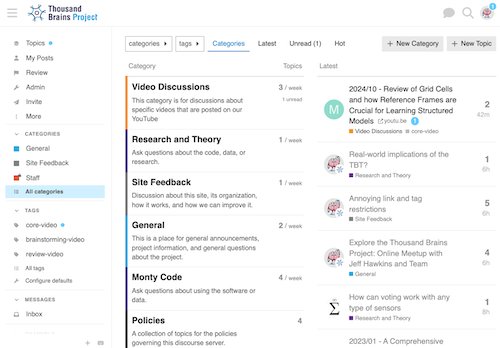

# Welcome to the Monty Repository!

*An open-source, sensorimotor learning system following the principles of the neocortex.*

[](https://opensource.org/licenses/mit)

[](https://github.com/thousandbrainsproject/tbp.monty/actions/workflows/monty.yml)

This repository contains the first implementation of a **sensorimotor learning system** from the **Thousand Brains Project**. We lovingly call it **Monty** after Vernon Mountcastle, who proposed cortical columns as a repeating functional unit across the neocortex.

This is an open-source project that was initially started at Numenta. The Thousand Brains Project is now an independent non-profit, partially funded by the Gates Foundation.

Please find our [**full documentation** here](https://docs.thousandbrains.org/)

Our [**API documentation** here](https://api-monty.thousandbrains.org).

# Getting Started

You can find detailed instructions on how to install the project requirements and how to get started [here](https://docs.thousandbrains.org/docs/getting-started)

# Current Performance
We regularly evaluate this system against a set of sensorimotor tasks, and report results in **[benchmark experiments](./benchmarks/)**. Any time a functional change is made to the code, these experiments are rerun, and results are updated. Configs for these experiments can be found in the [src/tbp/monty/conf/experiment/](./src/tbp/monty/conf/experiment/) folder.

You can find our current performance on these benchmarks as well as an explanation of them [here](https://docs.thousandbrains.org/docs/benchmark-experiments).


# Contributing

Are you interested in contributing? Check out our tips and guidelines [here](https://docs.thousandbrains.org/docs/contributing).

Before contributing, please sign our Contributor License Agreement (CLA). You can find the CLA and guidelines [here]( https://docs.thousandbrains.org/docs/contributor-license-agreement).

# Disclaimer
This is not production-ready code. It is an **early beta version** that is under active development. This early beta version is functional but evolving. Expect frequent changes as we develop core features.

You can find a list of the systems **current capabilities and application criteria** [here](https://docs.thousandbrains.org/docs/application-criteria).

You can find our **project road map** and details on the next features we are working on [here](https://docs.thousandbrains.org/docs/project-roadmap).

# More Information and Updates
As mentioned above, we have extensive **documentation** of this project [here](https://docs.thousandbrains.org/).

[](https://docs.thousandbrains.org/)

We also publish our meeting recordings on **YouTube** on the [Thousand Brains Project channel](https://www.youtube.com/@thousandbrainsproject).

[](https://www.youtube.com/@thousandbrainsproject)

If you want to use this code, contribute to it, ask questions or propose ideas, please consider joining [our discourse channel](https://forum.thousandbrains.org/).

[](https://forum.thousandbrains.org/)

If you would like to receive updates, follow us on [Bluesky](https://bsky.app/profile/thousandbrains.org) or [Twitter](https://x.com/1000brainsproj) or [LinkedIn](https://www.linkedin.com/company/thousand-brains-project/).

If you have further questions or suggestions for collaborations, don't hesitate to contact us directly at **info@thousandbrains.org**.

# Citing the Project
If you're writing a publication that references the Thousand Brains Project, please cite 

[TBP white paper](https://arxiv.org/abs/2412.18354):
```
@misc{thousandbrainsproject2024,
      title={The Thousand Brains Project: A New Paradigm for Sensorimotor Intelligence},
      author={Viviane Clay and Niels Leadholm and Jeff Hawkins},
      year={2024},
      eprint={2412.18354},
}
```


If you would like to refer to Monty's capabilities and advantages over deep learning, please cite

[Thousand-Brains Systems: Sensorimotor Intelligence for Rapid, Robust Learning and Inference](https://doi.org/10.1162/NECO.a.1508):
```
@article{thousand-brains_systems_2026,
	title = {Thousand-{Brains} {Systems}: {Sensorimotor} {Intelligence} for {Rapid}, {Robust} {Learning} and {Inference}},
	volume = {38},
	issn = {0899-7667, 1530-888X},
	url = {https://direct.mit.edu/neco/article/38/6/845/136222/Thousand-Brains-Systems-Sensorimotor-Intelligence},
	doi = {10.1162/NECO.a.1508},
	number = {6},
	urldate = {2026-06-10},
	journal = {Neural Computation},
	author = {Leadholm, Niels and Clay, Viviane and Knudstrup, Scott and Lee, Hojae and Hawkins, Jeff},
      month = may,
	year = {2026},
	pages = {845--896},
}

```

If you would like to reference the theory behind this novel AI approach, here you can find a list of [neuroscience theory papers](https://docs.thousandbrains.org/docs/further-reading#our-papers).


# License

The MIT License. See the [LICENSE](LICENSE) for details.
