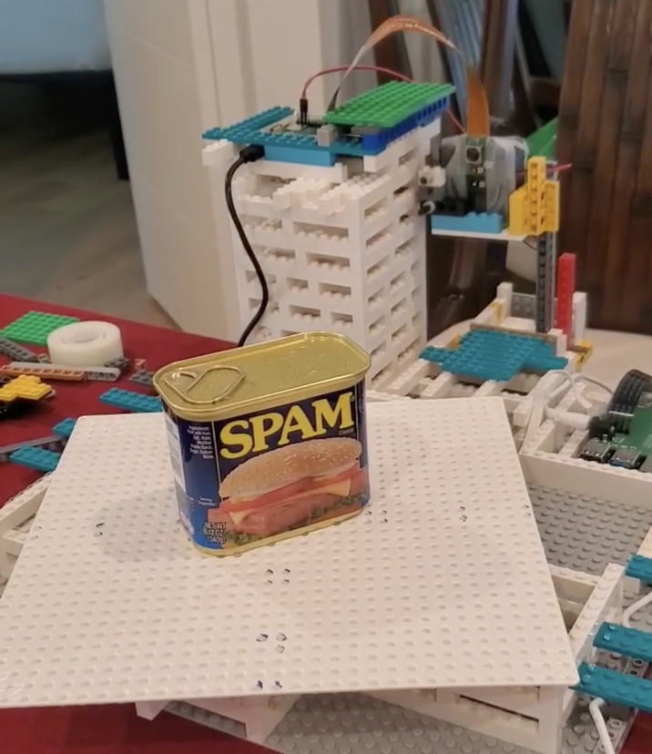
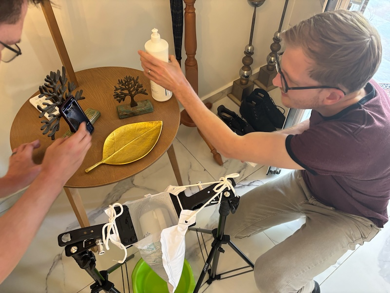

This page showcases some projects that were realized using the Monty code-base. If you have a project that you would like to see featured here, simply create a PR adding it to this page.

Please make sure your project is well documented, including a README on how to run it and ideally some images or video showcasing it. Feel free to also include a video or image here. Please also keep your description on this page short and concise.

# Monty for Object Detection With the iPad Camera

[2023/03 - Monty's First Live Demo in the Real World](https://www.youtube.com/watch?v=KcE004QbuSw)

This is the first real-world demo of Monty the TBP team came up with. We used the iPad camera to take an image of an object. Monty then moves a small patch over this image and tries to recognize the object.

See the [monty_lab project folder](https://github.com/thousandbrainsproject/monty_lab/tree/main/monty_meets_world) for more details.

# LEGO Robot

The first example of Monty moving its sensors in the real-world.

Follow the [LEGO tutorial](../how-to-use-monty/tutorials/using-monty-for-robotics.md#example-3-lego-based-robot) to try this out yourself.

See the [everything_is_awesome repository](https://github.com/thousandbrainsproject/everything_is_awesome) for more information.

Watch the video:

[2025/05 - Robot Hackathon Presentations](https://www.youtube.com/watch?v=_u7STtACQ50)

# Ultrasound Perception

Using sensorimotor AI to guide ultrasound.

Follow the [ultrasound tutorial](../how-to-use-monty/tutorials/using-monty-for-robotics.md#example-2-ultrasound) for more details.

See the [ultrasound_perception repository](https://github.com/thousandbrainsproject/ultrasound_perception) for more information.

Watch the video:

[2025-05 Ultrasound Presentation and Demo](https://www.youtube.com/watch?v=-zrq0oTJudo)
