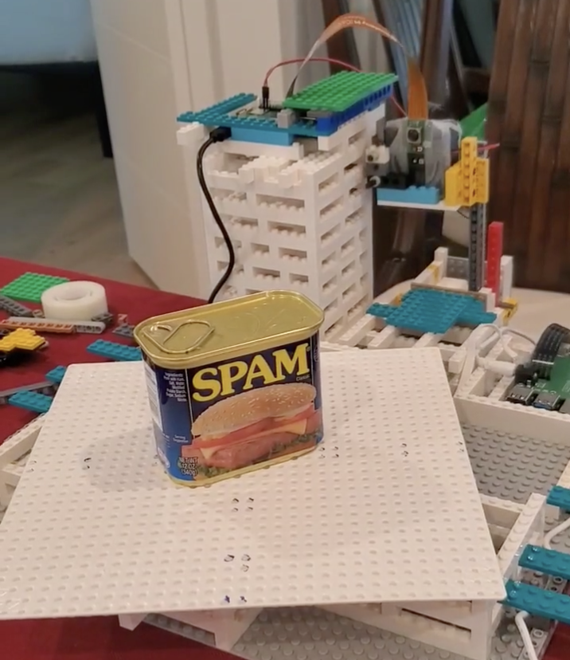

This page showcases some projects that were realized using the Monty code-base. If you have a project that you would like to see featured here, simply create a PR adding it to this page.

Please make sure your project is well documented, including a README on how to run it and ideally some images or video showcasing it. Feel free to also include a video or image here. Please also keep your description on this page short and concise.

# Monty for Object Detection With the iPad Camera

[2023/03 - Monty's First Live Demo in the Real World](https://www.youtube.com/watch?v=KcE004QbuSw)

This is the first real-world demo of Monty the TBP team came up with. We used the iPad camera to take an image of an object. Monty then moves a small patch over this image and tries to recognize the object.

See the [monty_lab project folder](https://github.com/thousandbrainsproject/monty_lab/tree/main/monty_meets_world) for more details.

# LEGO Robot

The first example of Monty moving its sensors in the real-world.

Follow the [LEGO tutorial](../how-to-use-monty/tutorials/using-monty-for-robotics.md#example-3-lego-based-robot) to try this out yourself.

See the [everything_is_awesome repository](https://github.com/thousandbrainsproject/everything_is_awesome) for more information.

Watch the video:

[2025/05 - Robot Hackathon Presentations](https://www.youtube.com/watch?v=_u7STtACQ50)

# Ultrasound Perception

[Monty for Ultrasound - A Real World Challenge](https://youtu.be/qhrHyTYVPgo?si=J5xmF6PtSERiZ-vV)

Using sensorimotor AI to guide ultrasound.

Follow the [ultrasound tutorial](../how-to-use-monty/tutorials/using-monty-for-robotics.md#example-2-ultrasound) for more details.

See the [ultrasound_perception repository](https://github.com/thousandbrainsproject/ultrasound_perception) for more information. The repository  also includes a downloadable dataset and benchmarks.

Watch the video of the first demo:

[2025-05 Ultrasound Presentation and Demo](https://www.youtube.com/watch?v=-zrq0oTJudo)

# Undergraduate Dissertation Community Project
## Robotic Object Recognition for Thousand-Brains Systems

**Author:** Zachary Danzig from Loughborough University  
**Links:** [tbp.monty Fork](https://github.com/Zinxiee/tbp.monty) | [Maixsense A010 Python Package](https://github.com/Zinxiee/Maixsense-A010-Python-Package) | [3D Model Dataset](https://github.com/Zinxiee/tbp.monty/releases/tag/dataset_scans_(shining_3d)) | [Robotic Object Recognition For Thousand Brain Systems.pdf](https://github.com/user-attachments/files/30555412/Robotic.Object.Recognition.For.Thousand.Brain.Systems.pdf)  

This community project expands upon the Thousand Brains Project by designing and constructing a system capable of multimodal sensing and movement. The core aim is to enable the learning and recognition of real-world objects in a human-like way (sensorimotor learning), helping to bridge the framework's sim-to-real gap. While Monty has primarily been validated in simulated environments, this dual-agent sensorimotor system tests how Monty performs on physical hardware in the real world.  

**Dual-agent Sensorimotor Setup**  
  
*The dual-agent sensorimotor setup featuring the Ufactory Lite 6 with mounted A010 ToF sensor and Zed 2i stereo camera, with the mc_fox object in view.*

### Key Features
* **Distant Agent Implementation:** Developed around the Zed 2i stereo camera to extend the existing [Monty Meets World](https://docs.thousandbrains.org/docs/project-showcase#monty-for-object-detection-with-the-ipad-camera) pipeline.
* **RGBD Scene Indexing:** Supports continual capture and indexing of RGBD scenes.
* **Surface Agent Implementation:** Built using a Maixsense A010 ToF sensor mounted to a Ufactory Lite 6 robot arm.
* **Custom Integration:** Integrated with Monty through a custom environment, environment interface, and motor-policy.
* **Hardware Tooling:** Includes a reverse-engineered Python package that exposes programmatic control of the Maixsense A010 sensor.
* **Object Dataset:** Evaluated the system against a structured eight-object dataset with defined orientations suitable for evaluating recognition accuracy, continual learning, and rotation invariance. As an extension to the project, a 3D Model Dataset was scanned in and made available to the community.

Note that this project does not integrate the different modalities at the same time. Each agent is run independently. 

### Results and Findings
* The Distant Agent demonstrated reliable supervised recognition with sub-degree rotation errors. 
* The Surface Agent exposed critical hardware limitations regarding Time-of-Flight (ToF) scattering on non-flat geometries which heavily restricted Surface Agent experiments. 
* This work provides a real-world starting point for testing the framework's physical deployment and constraints.

[Surface Agent Demo with TBP Mug](https://youtube.com/shorts/E8tcEsyo7-U)  

### Monty Meets World Proof of Concept
At the start of this project a proof of concept was demonstrated by reproducing the Monty Meets World Experiment above. For information on how this was done, see the following links: [Explanation](https://forum.thousandbrains.org/t/design-of-final-year-undergraduate-project-with-the-inclusion-of-the-tbp/417/30?u=zachary_danzig) | [Experiment YAML](https://github.com/Zinxiee/tbp.monty/blob/main/src/tbp/monty/conf/experiment/zachs_examples/zachs_monty_meets_world.yaml) | [Demo](https://youtu.be/a9u1Y3Amlxc).  

For more about this project, visit the links above or see the [Discourse community topic](https://forum.thousandbrains.org/t/design-of-final-year-undergraduate-project-with-the-inclusion-of-the-tbp/417).

Watch the presentation:

[07/2026 - Robotic Object Recognition for Thousand Brains Systems](https://www.youtube.com/watch?v=3wgHNqkRekM)
