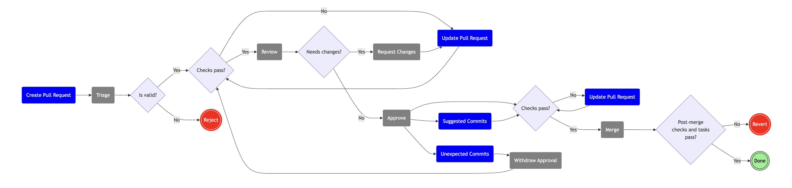

The Pull Request flow begins when you **Create a Pull Request** to our [GitHub repository](https://github.com/thousandbrainsproject/tbp.monty/pulls).

# 1. Triage

A **Maintainer** will check the Pull Request for validity. If it is invalid, it will be **Rejected**. The **Maintainer** should include an explanation for why the Pull Request has been rejected.

A valid Pull Request is on-topic, well-formatted, and contains expected information.

A **Maintainer** will apply the appropriate labels (`triaged` at a minimum) as part of **[Triage](../guides-for-maintainers/triage.md#pull-request-triage)**.

A **Maintainer** may also assign the Pull Request to one or more **Maintainers** for **Review** by adding them to the "Assignees" list.

> [!NOTE]
> **Maintainers**
>
> When assigning the Pull Request for **Review**, please keep in mind that _all assigned_ **Maintainers** must **Approve** the Pull Request before it can be **Merged**.
>
> Use the "Assignees" list to assign the Pull Request to a **Maintainer**. The "Reviewers" list may include others that contributed to reviewing the Pull Request.

## Reject

If your Pull Request has been **Rejected** and you want to resubmit it, you should start over and **Create a new Pull Request** with appropriate changes. Depending on the reason for rejection, it might be good to [submit an RFC](../request-for-comments-rfc.md) first.

# 2. Review and Request Changes

Automated checks run against the Pull Request as part of the **Review**. If the automated checks fail, you should **Update the Pull Request**.

If all automated checks pass, **Maintainers** will **Review** the Pull Request. If changes are needed, **Maintainers** will **Request Changes**.

> [!NOTE]
> **Maintainers**
>
> A handy link to [view Pull Requests that were **Triaged** and are ready for your **Review**](https://github.com/thousandbrainsproject/tbp.monty/pulls?q=is%3Aopen+is%3Apr+label%3Atriaged+review-requested%3A@me)

# 3. Update Pull Request

If automated checks fail or **Maintainers** **Request Changes**, you are responsible for **Updating the Pull Request**. Once you have updated it, the Pull Request will again enter **Review**.

# 4. Approve

Once all assigned **Maintainers** (listed in the "Assignees" list) **Approve** your Pull Request, your Pull Request is eligible to be **Merged**.

If the automated checks fail while your Pull Request is **Approved**, it is your responsibility to **Update the Pull Request**.

**Maintainers** may delay **Merging** your Pull Request to accommodate any optional commits implementing non-blocking suggestions from the **Review** (these are depicted as **Suggested Commits** in the flow diagram).

Once your Pull Request is **Approved**, if you make any unexpected commits that do not implement non-blocking suggestions from the **Review** (these are depicted as **Unexpected Commits** in the flow diagram), **Maintainers** may **Withdraw Approval** and the Pull Request will need to be **Reviewed** again.

> [!CAUTION]
> _**Maintainers**_
>
> _The reason for you to **Withdraw Approval** would be to communicate the need for additional **Review** after unexpected changes. If you do not **Withdraw Approval**, other **Maintainers** may interpret the Pull Request as **Approved** and merge it._

# 5. Merge

> [!CAUTION]
> _**Maintainers**_
>
> _All assigned **Maintainers** must **Approve** the Pull Request before it can be **Merged**._
>
> _As of this writing (October 2024), GitHub does not provide a mechanism to enforce this._

**Maintainers** will **Merge** your **Approved** Pull Request.

> [!NOTE]
> **Maintainers**
>
> The commit message for the merge commit should comply with [RFC 10 Conventional Commits](https://github.com/thousandbrainsproject/tbp.monty/blob/main/rfcs/0010_conventional_commits.md).
>
> We use the following commit types:
>
> * `fix`: Fix to a bug in the **src/tbp/monty** codebase. This correlates with `PATCH` in [RFC 7 Monty versioning](https://github.com/thousandbrainsproject/tbp.monty/blob/main/rfcs/0007_monty_versioning.md).
> * `feat`: Introduction of a new feature to the **scr/tbp/monty** codebase. This correlates with `MINOR` in [RFC 7 Monty versioning](https://github.com/thousandbrainsproject/tbp.monty/blob/main/rfcs/0007_monty_versioning.md).
> * `build`: Change to the build system or external dependencies.
> * `ci`: Change to our GitHub Actions configuration files and scripts.
> * `docs`: Documentation only update.
> * `perf`: Performance improvement.
> * `refactor`: A **src/tbp/monty** code change that neither fixes a bug nor adds a feature.
> * `style`: Change that does not affect the meaning of the code (white-space, formatting, etc.).
> * `test`: Adding or correcting tests.
> * `chore`: The commit is a catch all for work outside of the types identified above. For example, the commit affects infrastructure, tooling, development, or other non-Monty framework code.
> * `rfc`: RFC proposal.
> * `revert`: Commit that reverts a previous commit.
>
> Breaking changes are communicated by appending `!` after the type. This correlates with `MAJOR` in [RFC 7 Monty versioning](https://github.com/thousandbrainsproject/tbp.monty/blob/main/rfcs/0007_monty_versioning.md).

> [!NOTE]
> **Maintainers**
>
> Verify that `Co-authored-by` headers added by GitHub to the commit message are correct. Sometimes, when you merge the `main` branch into a Pull Request, GitHub will automatically add you as a co-author of that Pull Request. As this is not what we consider authorship, please ensure you remove any `Co-authored-by` headers of this nature.
>
> Leave any legitimate `Co-authored-by` headers in place, e.g., from commits cherry-picked into the Pull Request.

After **Merge**, automated post-merge checks and tasks will run. If these fail, the Pull Request will be **Reverted**. If they succeed, you are **Done** 🥳🎉🎊.

## Revert

If your Pull Request is **Reverted**, you should start over and **Create Pull Request** with the appropriate changes.
