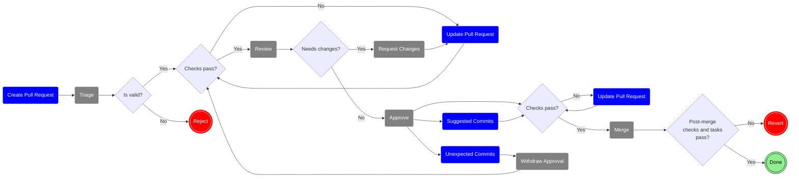

```mermaid
flowchart LR
  CPR(Create Pull Request):::contributor --> T(Triage):::maintainer
  T --> V{Is valid?}
  V -- Yes --> RCP{Checks pass?}
  RCP -- No --> UPR(Update Pull Request):::contributor
  UPR --> RCP
  V -- No --> X(((Reject))):::endFail
  RCP -- Yes --> R(Review):::maintainer
  R --> C{Needs changes?}
  C -- Yes --> RC(Request Changes):::maintainer
  RC --> UPR
  C -- No --> A(Approve):::maintainer
  A --> NBCP
  A --> SC(Suggested Commits):::contributor
  SC --> NBCP{Checks pass?}
  A --> UC(Unexpected Commits):::contributor
  UC --> WA(Withdraw Approval):::maintainer
  WA --> RCP
  NBCP -- No --> UPR2(Update Pull Request):::contributor
  UPR2 --> NBCP
  NBCP -- Yes --> M(Merge):::maintainer
  M --> AMCP{Post-merge<br/>checks and tasks<br/>pass?}
  AMCP -- No --> RV(((Revert))):::endFail
  AMCP -- Yes --> D(((Done))):::endSuccess

  classDef contributor fill:blue,stroke:white,color:white
  classDef maintainer fill:gray,stroke:white,color:white
  classDef endFail fill:red,stroke:white,color:white
  classDef endSuccess fill:lightgreen,stroke:black,color:black
```
