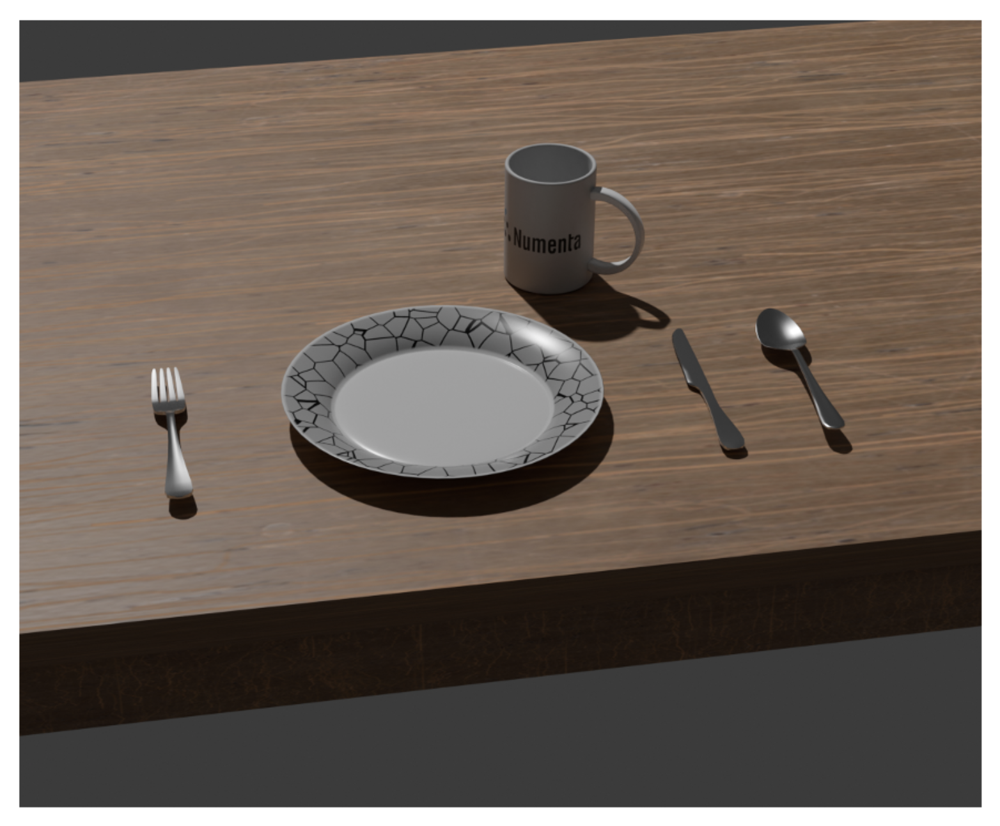
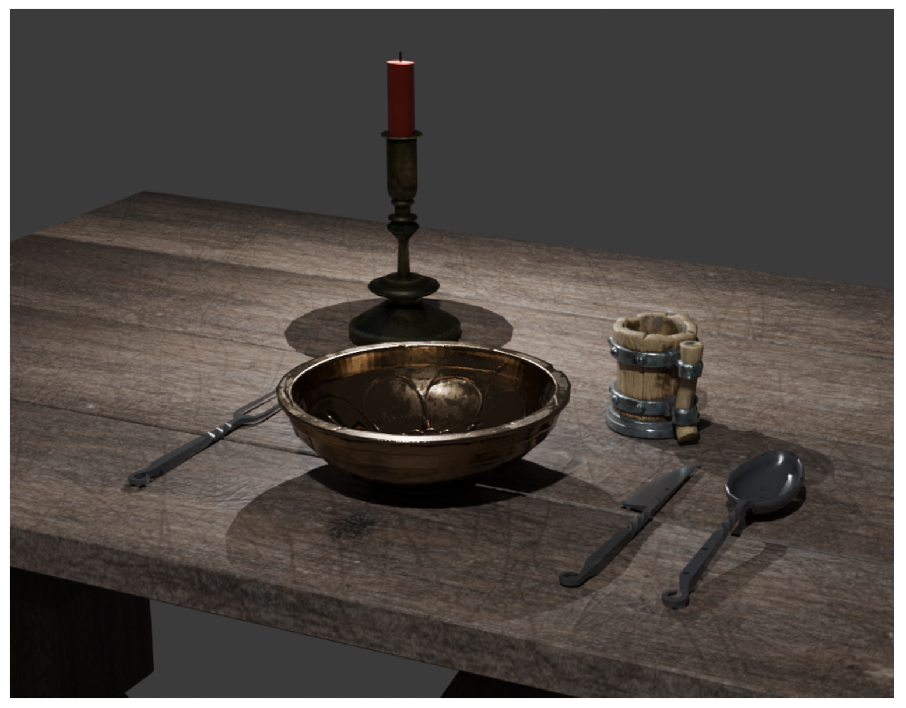

We have implemented the ability to encode object IDs using sparse-distributed representations (SDRs), and in particular can use this as a way of capturing similarity and dissimilarity between objects. Using such encodings in learned [Hierarchical Connections](add-top-down-connections.md), we should observe a degree of natural generalization when recognizing compositional objects.

For example, assume a Monty system learns a dinner table setting with normal cutlery and plates (see examples below). Separately, the system learns about medieval instances of cutlery and plates, but never sees them arranged in a dinner table setting. Based on the similarity of the medieval cutlery objects to their modern counterparts, the objects should have considerable overlap in their SDR encodings.

If the system was to then see a medieval dinner table setting for the first time, it should be able to recognize the arrangement as a dinner-table setting with reasonable confidence, even if the constituent objects are somewhat different from those present when the compositional object was first learned.

We should note that we are still determining whether overlapping bits between SDRs is the best way to encode object similarity. As such, we are also open to exploring this task with alternative approaches, such as directly making use of values in the evidence-similarity matrix (from which SDRs are currently derived).

*Example of a standard dinner table setting with modern cutlery and plates that the system could learn from.*

*Example of a medieval dinner table setting with medieval cutlery and plates that the system could be evaluated on, after having observed the individual objects in isolation.*
