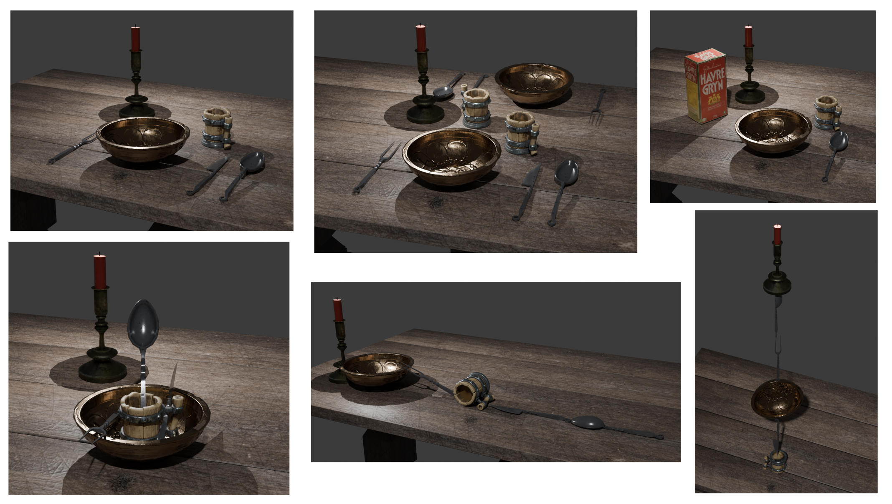

We have developed an initial dataset based on recognizing a variety of dinner table sets with different arrangements of plates and cutlery. For example, the objects can be arranged in a normal setting, or aligned in a row (i.e. not a typical dinner-table setting). Similarly, the component objects can be those of a modern dining table, or those from a "medieval" time-period. As such, this dataset can be used to test the ability of Monty systems to recognize compositional objects based on the specific arrangement of objects, and to test generalization to novel compositions.

By using explicit objects to compose multi-part objects, this dataset has the advantage that we can learn on the component objects in isolation, using supervised learning signals if necessary. It's worth noting that this is often how learning of complex compositional objects takes place in humans. For example, when learning to read, children begin by learning individual letters, which are themselves composed of a variety of strokes. Only when letters are learned can they learn to combine them into words. More generally, disentangling an object from other objects is difficult without the ability to interact with it, or see it in a sufficient range of contexts that it's separation from other objects becomes clear.

However, we would eventually expect compositional objects to be learned in an unsupervised manner. When this is consistently possible, we can consider more diverse datasets where the component objects may not be as explicit. At that time, the challenges described in [Figure out Performance Measure and Supervision in Heterarchy](../cmp-hierarchy-improvements/figure-out-performance-measure-and-supervision-in-heterarchy.md) will become more relevant.

*Example of compositional objects made up of modern cutlery and plates.*

*Example of compositional objects made up of medieval cutlery and plates.*
