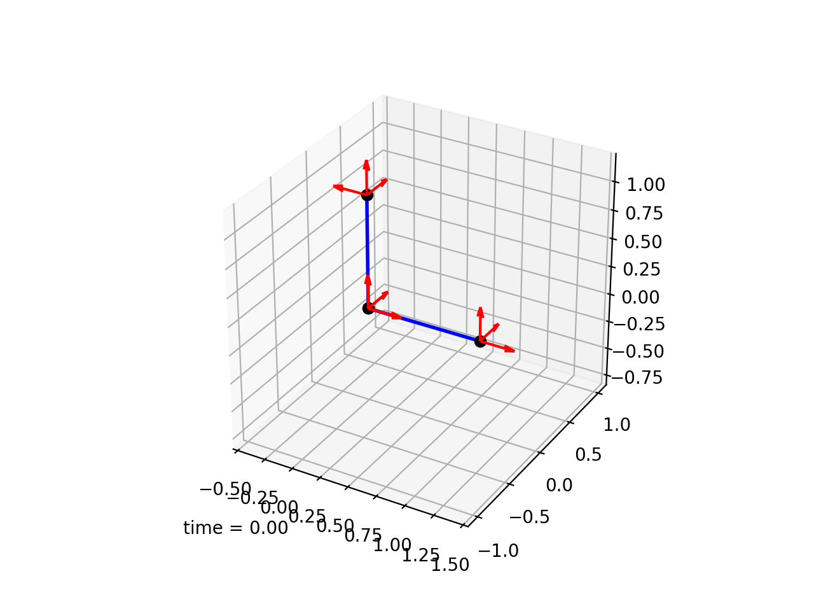

This item relates to the broader goal of [modeling object behaviors in Monty](../../theory/recent-progress/object-behaviors.md#implementation-in-monty).

We can test Monty's ability to model object behaviors with successively more difficult tasks:

**Level 1:** 
- Objects that move repeatedly in the same way
  
**Level 2:** 
- Different morphologies with the same behavior
- Same behavior at varying orientations on morphologies
- Objects that stop moving at some points in the sequence

**Level 3:**
- One object has multiple behaviors at different locations

**Level 4:**
- Same behavior at varying speeds

**Level 5:**
- Behaviors that involve a change in features instead of movement

## Initial Experiment Setup
- 1 sensor patch that gets processed by 2 SMs (one for static and one for moving features) and sent to 2 LMs.
- Supervision during learning -> provide object ID, pose & state in sequence at each step.
- Evaluate accuracy & speed of recognizing behavior & morphology ID, pose & state (+visualize).
- Could start with 2D environment to make the state dimension easier to visualize (keep in mind potential difficulty in extracting movement from a 3D depth image).

## Existing Test Environment
An early version of a simple object behavior environment can be found [here](https://github.com/thousandbrainsproject/monty_lab/tree/main/object_behaviors). It can be used to simulate physical joints and springs and retrieve locations and orientations in CMP format. See a simple example of a stapler below.
