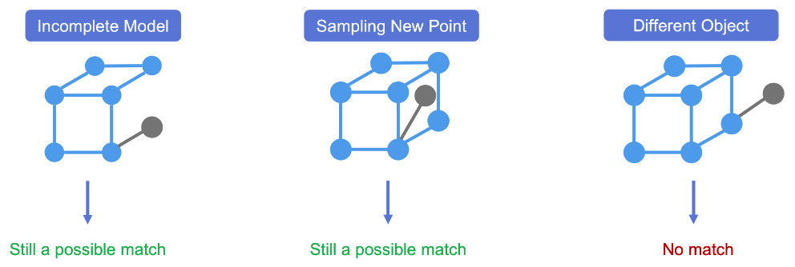

As described in [this document](https://www.overleaf.com/read/qxchttxzpfnd#ea9111) (section 3.3.2), Monty's object models have no concept of whether the absence of a point in the model means that the object doesn't exist there or the sensor hasn't explored this area yet.

The figure above illustrates the problem with the current algorithm and incomplete models. Assume we are trying to infer a cube. There is no mechanism to distinguish between the scenario on the left (learned a partial model of the cube and sampling a new point on it) and the one on the right (sampling a point that is not on the cube). (The one in the middle relates to [surface representations to allow for sparser models](../learning-module-improvements/better-model-surface-representation.md).) In the case on the left, we would want to keep the cube hypothesis and extend the model for the cube with new points. In the case on the right, we would want to say that we are not on a cube anymore. Currently, this is what happens in both cases.

It's unclear how this would best be solved. A possibility would be to use heuristics of how an object's surface might continue based on the already stored surface models. One could also store points in the model that represent the end of an object (although this seems to already be encoded in the existing surface normals). 

Another alternative might be leveraging gradual, unsupervised learning in the context of an ever-changing environment. For example, if moving to a new location results in a sensed feature that was not predicted, this results in a prediction error (suggesting we have moved off of the object). However, the object's reference frame might slightly increment a weight that captures whether the feature there is actually part of the reference frame. After only a couple exposures, this weight would be insufficient to result in the model predicting that feature - i.e. it is still not considered part of the object model. However, given sufficient, repeated exposures, this weight would become strong enough that the feature is now a permanent part of the model, and it is predicted at that location. Given the gradual nature of this weight increase, spurious associations of objects (e.g. two objects that happen to be next to one another at a point in time) would not be learned.

Such an approach relates to the unsupervised learning mechanism we have implemented in the [constrained object models](../../how-monty-works/learning-module/object-models.md#object-models), as well as the idea of a "permanence" associated with a binary synaptic connection in biological neurons (e.g. see this [paper](https://www.frontiersin.org/journals/neural-circuits/articles/10.3389/fncir.2016.00023/full)). This could also be complemented with [different learning modules having different learning rates](learning-and-forgetting-speed-parameter.md) for their feature-location binding, such that some (including the equivalent of the hippocampus) have a lower threshold for expanding their existing models. Ideally, this would move Monty even further in the direction of not having a separation between learning and inference.