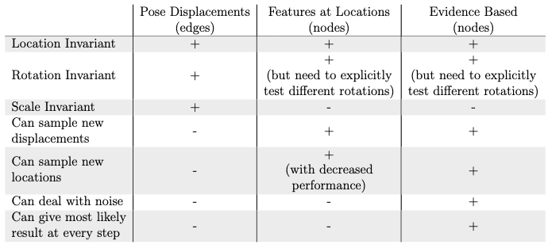

When developing Monty, we explored several different learning module approaches. There were three major LM versions we implemented (you can still run them all in Monty). The first LM implementation (`DisplacementGraphLM`) used edges and movements to recognize objects, while the latter two used nodes and locations. The difference between the two node-based LMs was that the first version (`FeatureGraphLM`) would delete a hypothesis after one inconsistent observation, while the second version (`EvidenceGraphLM`) would associate a continuous evidence score with each hypothesis which made it more robust to noise. Between those two, the evidence-based approach was clearly favored. However, when moving from edge- to node-based matching we lost some desirable properties, such as very efficient pose recognition as well as scale recognition. For a full comparison, see the table below or read more [here](../../how-monty-works/learning-module.md).

The idea behind the future work item here is to try and recover some of the desirable properties of the edge-based matching approach by developing a hybrid algorithm. The main reason we moved away from edge-based models and matching is that it was not sampling invariant. That means, one had to sample the same movements during inference as were taken during learning (although they could be in a new order). This was an unreasonable assumption. 

With the node-based matching approach, we can sample new locations and displacements on an object and still recognize it robustly. Recent additions to Monty, such as the [saliency-based](../../how-monty-works/sensor-module/salience-sm.md) policy, can now be leveraged to sample very similar locations and displacements during learning and inference (e.g. always moving between eyes, mouth, and nose of a face instead of along random trajectories). We could therefor try a hybrid approach, where our existing models additionally store edges for the most frequently taken displacements on an object. If during inference one of the movements can be matched to a stored edge in the graph, pose and scale can be resolved extremely quickly. If there is no match to an edge, inference will still work as usual, using the stored nodes.

The hybrid approach would need to take into account non-consecutive movements on existing edges. So after visiting a stored edge, the next movement might not correspond to another stored edge (which the `DisplacementGraphLM` algorithm assumes).