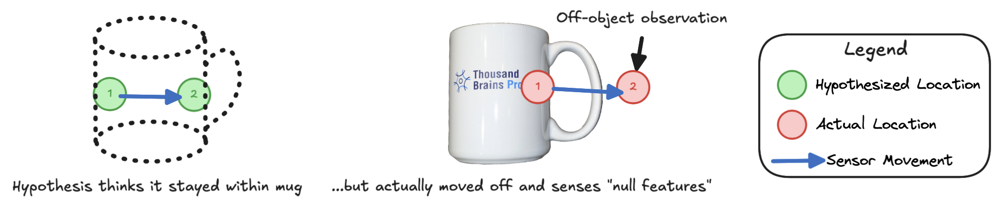
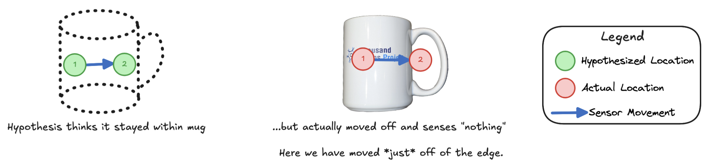

There are a few instances where Monty can move off of an object, sensing nothing/empty space (or at least no morphological features). For example, this can occur due to a saccade moving off the object and pointing at a void (such as the sky), or a touch-based agent leaving the surface of an object.

Currently we have methods to move the sensor back onto the object, however we do not make use of the information that there was no object at the perceived location before doing so. This is valuable information, as the absence of the object at a location will be inconsistent with some object and pose hypotheses - hypotheses that should therefore have their associated evidence reduced. This setup is shown in the diagram below.

*Example of a sensor moving off of an object and observing nothing.*

To address this, we need to update how these observations are processed such that:
1. These observations are formulated as an appropriate "null"-type observation - there is no surface to observe, and so there should be no morphological features. However, there would still be a location (e.g. where the finger tip is hovering, or an eye looking into the far distance), and there can be non-morphological features like color. In the `State` class, this would likely involve setting the morphological features to a `None` type value.
2. These observations are still passed to the learning module.
3. If a hypothesis predicts an observation, then the learning module's evidence update appropriately results in negative evidence, as no object model should ever store a "null" feature that would match this observation.

### What if a hypothesis itself has moved out of the model?

See [Use Out of Model Movements](./use-out-of-model-movements.md)

### What if the movement is just off the surface of the object?

This situation is shown in the below diagram:

*Example of a sensor moving off of an object and observing nothing when it is close to the object's surface.*

In this case, while some hypotheses on the surface of the object might be close (even within the neighborhood tolerance) to the sensors actual location, these will receive negative evidence, as they will predict being on the actual object. This is the desired behavior, as the LM should not predict that it is still on the object if it is no longer sensing it. However, we should keep this effect in mind when testing this as it might cause "almost correct" hypotheses to get a lot of negative evidence and thereby lead to some performance drops.

### Gotchas to Watch Out For

From an initial look, this change might appear relatively straightforward, however we have found ourselves repeatedly facing conceptual or practical issues when visiting this task. A few potential gotchas to consider:
1. We need to ensure that any change to how sensor modules pass these observations to an LM does not interfere with the existing policies. In particular, the distant agent's random saccade policy has an `undo_last_action` that moves the sensor back onto the object if it moves off of it. Similarly, after performing a hypothesis testing jump, a `handle_failed_jump` process reverses the last action. Ideally we would still perform these corrective actions, but only after the LMs have a chance to process the observation.
2. During learning, we want to ensure that observations associated with these "null" morphological features are not stored, i.e. are not learned as part of any model.
3. The FeatureChangeSM has additional logic for determining when to pass an observation to the LMs, and this needs to be accounted for in any changes.
4. The buffer uses information about off-object observations to filter data, so some elements here may need updating.
5. There is a [discontinued RFC on this topic](https://github.com/thousandbrainsproject/tbp.monty/pull/425/files) which has some useful discussion of the above points.

### Outcome Measures
- We anticipate that the primary benefit of this change will be that Monty can use off-object observations to more quickly eliminate hypotheses; this will result in fewer steps before convergence. In particular, this should reduce the number of `monty_steps`, which include steps where we currently do not pass any information to LMs because Monty is "off object".
- With follow-up work on [Use of Out of Model Movements](./use-out-of-model-movements.md), off-object observations can also help boost accuracy on certain challenging classification tasks. See this separate Future Work item for more details.
- Until the [Use of Out of Model Movements](./use-out-of-model-movements.md) item has been completed, large movements off object may overly punish reasonable hypotheses before we can move back onto the object. Practically, this may reduce accuracy on some of the benchmarks. It is therefore suggested when implementing off-object observations that their use can be toggled via a hyperparameter, as we may find that we need to keep them unused in our benchmarks until the second stage (out-of-model-movement processing) is completed.

> [!NOTE]
> The instance where Monty moves onto *another* object (for example, a distant wall, or an occluding robotic hand) is already handled by the existing matching process in Monty. In particular, this should result in unexpected sensory input if an LM believes it is still on the original object, and therefore will (correctly) result in negative evidence. This instance is therefore not considered the "off object" setting described above that we wish to resolve.