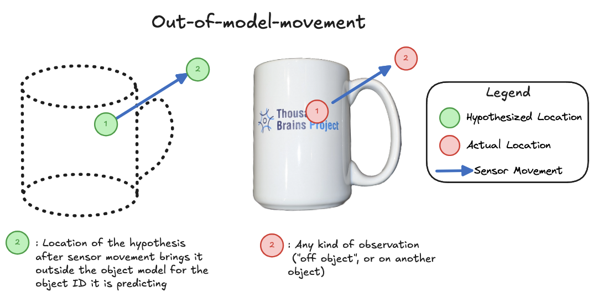

This task relates to [Use Off Object Observations](./use-off-object-observations.md), and so it is recommended that you read that description first. We also recommend that Use Off Object Observations is completed before beginning work on Use Out-of-Model Movements.

Consider the situation described under using off-object observations. What if a hypothesis actually believes it moved out of the model's space? Or alternatively, what if Monty senses something (such as another object), but the hypothesis again believes it has moved out of the model's space? This setup is shown diagrammatically below:

*Example of a sensor movement resulting in the hypothesis moving out of the learned model of an object. Note a hypothesis need not be correct to become out-of-model; a hypothesis simply needs to move far away from any learned model points.*

> [!NOTE]
> In the past we have sometimes referred to this as an "out of reference frame" movement. However, it is most accurate to describe the reference frame as the unbounded representational space where a model is learned. As such, describing it as an out-of-model-movement (OOMM) is more accurate.

We believe the best approach is that the LM would retain the OOMM hypothesis for a short period of time (perhaps 2-3 steps in the current, discrete version of Monty). If it then moves back into the model space before this time has elapsed, then the hypothesis can continue to accumulate evidence.

If a hypothesis stays outside of the model space for too long however, then the hypothesis should receive strong negative evidence. In the resampling version of Monty, this would effectively be handled by the evidence slope being sufficiently small that the hypothesis is deleted.

This approach ensures that a Learning Module is not expected to maintain a long-term memory of objects it is not currently on. At the same time, it means that we can move out of a model, which can be a useful way to test other hypotheses (i.e. for objects where we do expect to find something there). By then moving back onto the object and continuing to accumulate evidence, certain hypotheses can continue to grow.

## Outcome Measures
-  Together with the changes introduced by [Use Off Object Observations](./use-off-object-observations.md), we believe that appropriate handling of OOMM will improve Monty's accuracy on certain challenging recognition tasks.
- In particular, consider the instance where Monty has two hypotheses, which are a number "1" and a number "7", or a letter "i" vs a short vertical bar "ı" without a dot.
- When the actual object observed is the one with fewer features / a smaller model (the "1" rather than the "7", or the i without a dot (ı) rather than "i"), then Monty currently cannot recognize the object. If it moves to the location where it might expect the upper bar of a seven, or the dot of an i, it will perceive nothing. Without processing this observation, Monty cannot distinguish the hypotheses. Thus, off-object observations are necessary to resolve this issue.
- In addition however, resolving this setting also requires maintaining the correct hypothesis (1 or ı, respectively), which this Future Work item addresses.
- With these two changes in place, we expect the incorrect hypothesis for the larger model (7 or i) to receive negative evidence, while the correct hypothesis for the smaller model is maintained such that it can continue to accumulate evidence, and ultimately win out.
- This scenario would benefit from explicitly testing and examining once these changes have been made, which may require creating specific experimental setups.

## Other details
- If a most-likely-hypothesis moves out of a model and becomes "clamped" at that evidence value as a result, it should not continue to pass information up in a hierarchy of LMs. Intuitively, if we believe we are on a mug at location x, and then move to location y which is off of the mug, then we should not communicate to the next LM in the hierarchy that there is a mug at location y.
- What about object permanence, for example when moving back to where the object was after a significant period of time has elapsed? This should be captured via hierarchy - a higher-level LM would have a scene-like representation, and could use top-down biasing to help the LM in question recall what object it had just been observing. The mechanism here for OOMM only maintains hypotheses for a short period of time as a brief trace to enable returning to an object if a sensor strays off of it.

### What if the movement is just off the surface of the object?
- This scenario is described under [Use Off Object Observations](./use-off-object-observations.md). One challenge is that, because a hypothesis moving just off an object may be very close to model points, it will not be "protected" from negative evidence by OOMM clamping. As such, an off-object observation will cause an evidence loss for this hypothesis in a way that a more displaced (OOMM) hypothesis would not experience. This might be such a rare "edge case" that it is insignificant, but it's something to be aware of. If it does present an issue, we can explore more intelligent methods for determining when a hypothesis has undergone an OOMM.

## Potential "gotchas" to be aware of:
- Currently hypotheses receive negative evidence when they move out of the model; by making the proposed change, we may find that certain *incorrect* hypotheses are eliminated more slowly. However, in practice, the window for maintaining an OOMM hypothesis is so short that it will hopefully have a negligible impact on the number of matching steps for convergence. Moreover, this change may be necessary to enable Monty to accommodate sparser models, which is one of our current aims (see [Use Models With Fewer Points](./use-models-with-fewer-points.md)). Without this, we risk punishing hypotheses that are simply between stored points in a sparse model.
- We previously performed some early experiments evaluating the immediate elimination of hypotheses that undergo out-of-model-movements. We found that when there is no location noise, it can help reduce the hypothesis space without any negative impact on accuracy. However, as uncertainty about where the sensor is located was introduced, often good hypotheses were eliminated. We expect that the approach proposed here (clamp hypotheses for a few steps before deleting them) should help prevent this from happening.
- Finally, see our [discontinued RFC on this topic](https://github.com/thousandbrainsproject/tbp.monty/pull/366/files) for potential considerations around unsupervised learning and incomplete models. These will likely require returning to in the future as a follow-up task.