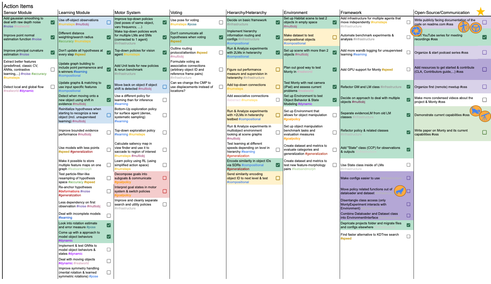

# Tasks on our Roadmap

We have a high-level overview table of tasks on our roadmap [here](https://docs.google.com/spreadsheets/d/10b0FR9YdFYqfhIiGMpZsjmN2OAbNAjp4m_hLBCV161I/edit?usp=sharing).

These are tasks where we have a rough idea of how we want to achieve them but we haven't necessarily scheduled when we will work on them or who will work on them. **We welcome anyone who would like to pick up one of these tasks and contribute to it.**

Tasks are categorized in two ways:

- **Which part of Monty does it touch?** This is represented in the columns, and is organized into Sensor Module, Learning Module, Motor System, Voting, Hierarchy, Environment, Framework, and Open-Source/Communication. 
- **Which capabilitie(s) does it improve?** This is represented by hashtags (#) at the end of the task description. We keep track of the progress on the capabilities in the column on the right. Each task should improve at least one capability but can contribute to multiple.

Tasks that are done have a check mark next to them and are shaded in green. When a task gets checked off, it will add progress to the corresponding capabilities on the right.

# What the TBP Team @Numenta is Working on

Some of the tasks are under active development by our team or scheduled to be tackled by us soon. Those are shaded in color. Below the main table, you can find a **list of our past and current milestones** with more detailed descriptions, timeline, and who is working on it. The colors of the milestones correspond to the colors in the main table.

**Tasks that are actively worked on have a little player icon on them.** Each member of our TBP team has an icon and we drag it to the task they are currently working on. This way we can get a quick impression of which parts and capabilities are currently being worked on at a glance.

We also have two stars that mark the current top two priorities of the TBP team.

# How you can Contribute

We are happy if one of the tasks on this list piques your interest and you would like to contribute by tackling it!

We usually have some rough ideas of how we want to implement these tasks. These are usually written out in the corresponding sections under the "Future Work" category (sorted by Monty components, corresponding to the columns in the table above). **Please have a read of the task outlines there before starting to work on one of them**. If an item is on our roadmap document that you are interested in, but we don't have any details written out yet, please feel free to contact us and we can update the documentation.

Once you have a concrete idea of how you would like to tackle a task (whether it is similar to how we outlined it or different), the **first step is to [open an RFC](../contributing/request-for-comments-rfc.md)  describing your planned approach**.

**Once your RFC is merged and active, we will add a player icon for you on the table** (using your GitHub or discourse profile picture). This way we can keep an overview of which parts of the code people are currently working on. If you decide not to pursue the implementation further, please notify us so that someone else can pick up the task.

> 📘 More Ways to Contribute
>
> Besides these more involved and research/code heavy tasks on our roadmap, there are many other ways you can get involved and support this project. Check out our page on [ways to contribute](../contributing/ways-to-contribute-to-code.md) to find out what best matches your skillset and interests.

# Tasks that are not on this Sheet

Obviously, this table doesn't cover everything we want the system to eventually be able to do or all the ideas you might be coming up with. 

This **table only contains tasks where we already have a more concrete idea of how we want to implement them**. There are many topics where we are still actively brainstorming for solutions. We have a **[collection of open questions here](../how-monty-works/open-questions.md).** And if you are interested in our thoughts on them, the best place is to watch our meeting recordings on [our YouTube channel](https://www.youtube.com/@thousandbrainsproject).

We also welcome contributions that are not related to any of these tasks. Please remember to [fill out an RFC first](../contributing/request-for-comments-rfc.md) before working on a larger change. For a list of ways you can contribute besides code, see [this guide](../contributing/contributing.md).
