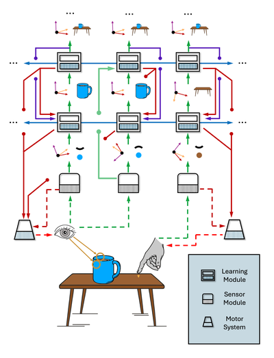

# Why Heterarchy?

We use the term **heterarchy** instead of hierarchy to express the notion that **information flow in Monty is not purely feed-forward** (+ feedback in reverse order) as in many classical views of hierarchy. Even though we do speak of lower-level LMs and higher-level LMs at times, this does not mean that information strictly flows from layer 0 to layer N in a linear fashion.

First of all, there can be **skip connections**. A low-level LM or even an SM can directly connect to another LM which represents far more complex, high-level models and which might additionally get input from other LMs that has been processed by several other LMs before. Therefore, it is difficult to clearly identify what layer an LM is in based on the number of previous processing steps performed on its input. Instead LMs could be grouped into collections based on who votes with each other, which is defined by whether there is overlap in the objects they model.

Second, we have several other channels of communication in Monty that do not implement a hierarchical forward pass of information (see figure below). An LM can receive **top-down input** from higher-level LMs (LMs that model objects which are composed of object parts modeled in the receiving LM) as biasing context. Another top-down input to the LM is the goal state, used for modeling hierarchical action policies. Finally, the LM receives **lateral inputs from votes** and **recurrently updates its internal representations**.

Lastly, each LM can send motor outputs directly to the motor system. Contrary to the idea that sensory input is processed through a series of hierarchical steps until it reaches the motor area which then produces action plans, we look at each LM as a complete sensorimotor system. Motor output is not exclusive to the end of the hierarchy, but rather occurs at every level of sensory processing.

Due to those reasons we call Monty a heterarchical system instead of a hierarchical system. Despite that, we often use terminology as if we did have a conventional hierarchical organization, such as top-down and bottom-up input and lower-level and higher-level LMs.

# Bottom-up Connections

Connection we refer to as bottom-up connections are connections from SMs to LMs and connections between LMs that communicate an LMs output (the current most likely object ID and pose) to the main input channel of another LM (the current sensed feature and pose). **The output object ID of the sending LM then becomes a feature in the models learned in the receiving LM.** For example, the sending LM might be modeling a tire. When the tire model is recognized, it outputs this and the recognized location and orientation of the tire relative to the body. The receiving LM would not get any information about the 3D structure of the tire from the sending LM. It would only receive the object ID (as a feature) and its pose. This LM could then model a car, composed of different parts. Each part, like the tire, is modeled in detail in a lower-level LM and then becomes a feature in the higher-level LMs' model of the car.

The receiving LM might additionally get input from other LMs and SMs. For example, the LM modeling the car could also receive low-frequence input from a sensor module and incorporate this into its model. This input however is usually not as detailed as the input to the LM that models the tire. We do not want to relearn a detailed model of the entire car. Instead we want to **learn detailed models of its components and then compose the components into a larger model**. This way we can also reuse the model of the tire in other higher-level models such as for trucks, busses, and wheel barrels.

# Top-down Connections

Top-down connections can bias the hypothesis space of the receiving LM, similar to how votes can do this. They contain a **copy of the output from a higher-level LM**. For example, if a higher-level LM recognizes a car, this can bias the lower level LMs to recognize the components of a car. Compared to votes, in this case the sending and receiving LMs do not have models of the same object. Instead, you could compare this to **associative connections that are learning through past observed co-occurrence**. Essentially, the lower-level LM would learn "Previously when I received car at this pose as top-down input, I was sensing a tire, so I am also more likely to be observing a tire now". The car might have been recognized before the tire, based on other parts of the car or its rough outline. Importantly, the top down connection does not only include object but also pose information. Overall, **top-down input allows for recognizing objects faster given context from a larger scene or object**.