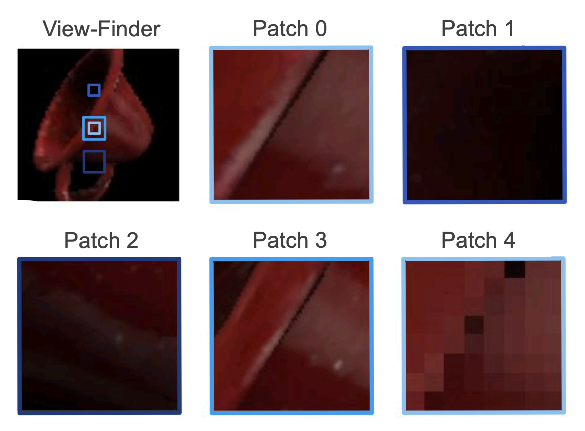
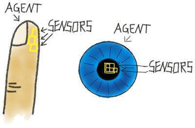
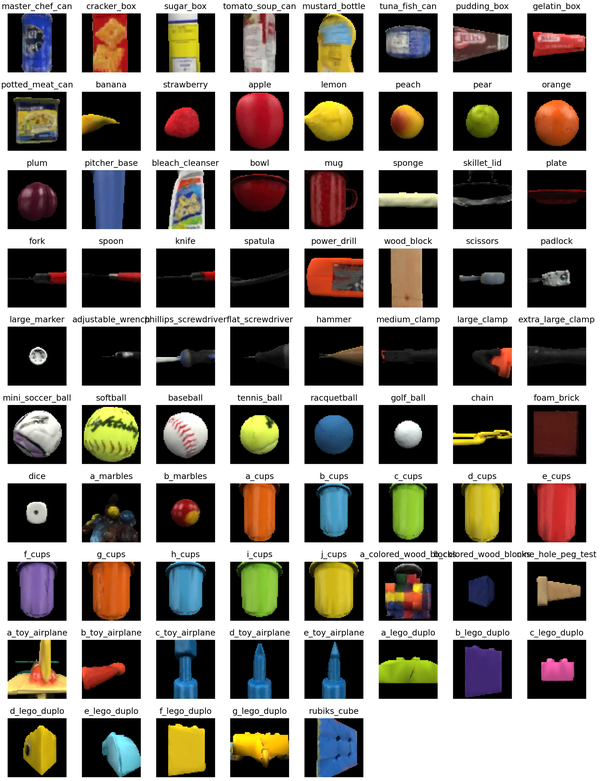

The 3D environment used for most experiments is **Habitat**, wrapped into a class called `EnvironmentDataLoader`. This class returns observations for given actions.

The environment is currently initialized with one agent that has N sensors attached to it using the `PatchAndViewFinderMountConfig`. This config by default has two sensors. The first sensor is the **sensor patch** which will be used for learning. It is a **camera, zoomed in 10x** such that it only perceives a small patch of the environment. The second sensor is the view-finder which is at the same location as the patch and moves together with it but its camera is not zoomed in. This one is only used at the beginning of an episode to get a good view of the object (more details in the policy section) and for visualization, but not for learning or inference. The agent setup can also be customized to use more than one sensor patch (such as in `TwoLMMontyConfig` or `FiveLMMontyConfig`, see figure below). The configs also specify the type of sensor used, the features that are being extracted, and the motor policy used by the agent.

Generally, one can also initialize multiple agents and connect them to the same Monty model but there is currently no policy to coordinate them. The difference between adding more agents vs. adding more sensors to the same agent is that **all sensors connected to one agent have to move together** (like neighboring patches on the retina) while **separate agents can move independently** like fingers on a hand (see figure below).

The currently most used environment is an **empty space with a floor and one object** (although we have started experimenting with multiple objects). The object can be initialized in different rotations, positions and scales but currently does not move during an episode. For objects, one can either use the default habitat objects (cube, sphere, capsule, ...) or the YCB object dataset (Calli et al., 2015), containing 77 more complex objects such as a cup, bowl, chain, or hammer, as shown in figure below. Currently there is no physics simulation so objects are not affected by gravity or touch and therefore do not move.

Of course, the DataLoader classes can also be customized to use different environments and setups as shown in the table below. We are not even limited to 3D environments and can for example let an agent move in 2D over an image such as when testing on the Omniglot dataset. The only crucial requirement is that we can use an action to retrieve a new, action-dependent, observation from which we can extract a pose.

> [!NOTE] 
> For some examples of how to use Monty with other environments than Habitat (or even in the real world), see [this tutorial](../how-to-use-monty/tutorials/using-monty-in-a-custom-application.md).

 

| List of all data loader classes    | Description                                                                                                                                                                                                                                                                                                                              |
| ---------------------------------- | ---------------------------------------------------------------------------------------------------------------------------------------------------------------------------------------------------------------------------------------------------------------------------------------------------------------------------------------- |
| **EnvironmentDataLoader**          | Base data loader class that implements basic **_iter_** and **_next_** functionalities and episode and epoch checkpoint calls.                                                                                                                                                                                                           |
| **EnvironmentDataLoaderPerObject** | Dataloader for testing on the environment with one object. After each epoch, it removes the previous object from the environment and loads the next object in the pose provided in the parameters.                                                                                                                                       |
| **InformedEnvironmentDataLoader**  | Dataloader that allows for input-driven, model-free policies (using the previous observation to decide the next action). It implements the find_good_view function and other helpers for the agent to stay on the object surface. It also supports jumping to a target state when driven by model-based policies, although this is a TODO to refactor "jumps" into motor_policies.py. |
| **OmniglotDataLoader**             | Dataloader that wraps around the Omniglot dataset and allows movement along the stroke of the different characters. Has similar cycle_object structure as EnvironmentDataLoaderPerObject.                                                                                                                                                |

 

| List of all data set classes and environments | Description                                                                                                                                                                                                                                                                                                                                                                                               |
| --------------------------------------------- | --------------------------------------------------------------------------------------------------------------------------------------------------------------------------------------------------------------------------------------------------------------------------------------------------------------------------------------------------------------------------------------------------------- |
| **EmbodiedEnvironment**                       | Abstract environment class.                                                                                                                                                                                                                                                                                                                                                                               |
| **HabitatEnvironment**                        | Environment that initializes a 3D Habitat scene and allows interaction with it.                                                                                                                                                                                                                                                                                                                           |
| **RealRobotsEnvironment**                     | Environment that initializes a real robots simulation (gym) and allows interaction with it.                                                                                                                                                                                                                                                                                                               |
| **OmniglotEnvironment**                       | Environment for the Omniglot dataset. This is originally a 2D image dataset but reformulated here as stroke movements in 2D space.                                                                                                                                                                                                                                                                        |

We also have the `ObjectBehaviorEnvironment` class in the `monty_lab` repository (`object_behaviors/environment.py`) for testing moving objects. However, this class still needs to be integrated into the main framework.
