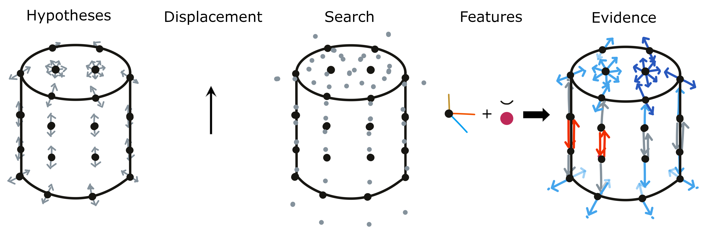
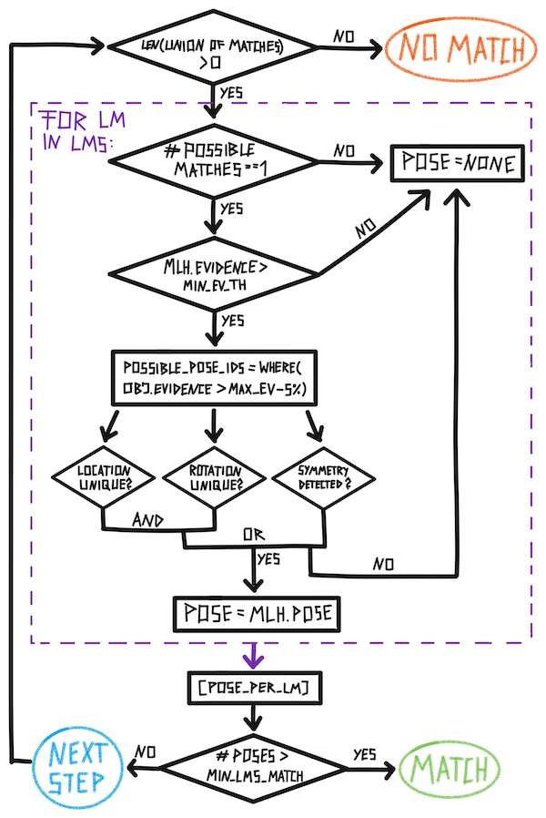

We explain the evidence-based learning module in detail here since it is the current default LM. However, a lot of the following content applies to all graph-based LMs or LMs in general.

The next sections will go into some more detail on how the hypothesis initialization and update works in the evidence LM. We use the movement on a colored cylinder shown in the figure below as an example.

# Initializing Hypotheses

At the first step of an episode we need to **initialize our hypothesis space**. This means, we define which objects and poses are possible.

At the beginning of an episode, we consider all objects in an LMs memory as possible. We also consider any location on these objects as possible. We then **use the sensed pose features** (point normal and principal curvature direction) **to determine the possible rotations of the object**. This is done for each location on the object separately since we would have different hypotheses of the object orientation depending on where we assume we are. For example, the rotation hypothesis from a point on the top of the cylinder is 180 degrees different from a hypothesis on the bottom of the cylinder (see figure below, top).

By aligning the sensed point normal and curvature direction with the ones stored in the model we usually get two possible rotations for each possible location. We get two since the curvature direction has a 180-degree ambiguity, meaning we do not know if it points up or down as we do with the point normal.

For some locations, we will have more than two possible rotations. This is the case when the first principal curvature (maximum curvature) is the same as the second principal curvature (minimum curvature) which happens for example when we are on a flat surface or a sphere. If this is the case, the curvature direction is meaningless and we sample N possible rotations along the axis of the point normal.

After initializing the hypothesis space we **assign an evidence count to each hypothesis**. Initially, this is 0 but if we are also observing pose-independent features such as color or the magnitude of curvature we can already say that some hypotheses are more likely than others (see figure below, bottom). We do not exclude hypotheses based on the feature since we might be receiving noisy data.

![Mechanism for initializing hypotheses from one observation. (Top row) Initializing possible poses. For this, we use all points in the stored model as possible locations and for each location, we calculate how we could rotate the sensed pose features such that they align with the stored pose features. (Bottom row) Initializing evidence counts for all hypotheses. If we do not sense any features, the evidence count is 0 for all possible poses as signified in grey in the top right. We can then use sensed features and compare them to stored features at the locations in the model. If the difference is low, we add evidence proportional to that difference. The colors of dots in the model (bottom left) signify the stored color at that node. Colors in the hypothesis space (right) signify evidence where grey=0, yellow=medium, and red=high evidence.](../figures/how-monty-works/evidence_init_all.png)

To **calculate the evidence** update we take the difference between the sensed features and the stored features in the model. At any location in the model where this difference is smaller than the `tolerance` value set for this feature, we add evidence to the associated hypotheses proportional to the difference. Generally, we **never use features to subtract evidence**, only to add evidence. Therefore, if the feature difference is larger than the tolerance (like in the blue and flat parts of the cylinder model in the figure above) no additional evidence is added. The feature difference is also normalized such that we add a maximum of 1 to the evidence count if we have a perfect match and 0 evidence if the difference is larger than the set tolerance. With the `feature_weights` parameter, certain features can be weighted more than others.

In the example shown in the figure below, we initialize two pose hypotheses for each location stored in the model except on the top and bottom of the cylinder where we have to sample more because of the undefined curvature directions. Using the sensed features we update the evidence for each of these pose hypotheses. In places of the model where both color and curvature match, the evidence is the highest (red). In places where only one of those features matches, we have a medium-high evidence (yellow) and in areas where none of the features match we add 0 evidence (grey).

# Updating Evidence

At every step after the first one we will be able to **use a pose displacement for updating our hypotheses and their evidence**. At the first step we had not moved yet so we could only use the sensed features. Now we can look at the difference between the current location and the previous location relative to the body and calculate the displacement.

The relative displacement between two locations can then be used in the model's reference frame to test hypotheses. The displacement is only regarding the location while the rotation of the displacement will still be in the body's reference frame. **To test hypotheses about different object rotations we have to rotate the displacement accordingly**. We take each hypothesis location as a starting point and then rotated the displacement by the hypothesis rotation. **The endpoint of the rotated displacement is the new possible location for this hypothesis.** It basically says "If I would have been at location X on the object, the object is in orientation Y and I move with displacement D then I would now be at location Z. All of these locations and rotations are expressed in the object's reference frame.

![Updating evidence using two steps. First, we move upwards and sense red and curved features (top row). Then we move right and sense blue and curved features (bottom row). At each step, we take the hypotheses from the previous step (first column) and combine them with the sensed displacement (second column). Wherever these hypotheses combined with the displacement end up, defines our search locations (third column). We then look at the points stored in the model that are near each search location and compare the features stored there with the sensed features to update the evidence for each hypothesis (fourth and fifth column). Colors represent evidence values where dark blue=low, light blue=medium low, grey=0, orange=medium high, and red=high. Arrows in the left column signify pose hypotheses. Arrows in the right column signify the hypothesis plus the displacement and the updated evidence for this hypothesis.](../figures/how-monty-works/evidence_update2.png)

Each of these new locations now needs to be checked and the information stored in the model at this location needs to be compared to the sensed features. Since the model only stores discrete points we often do not have an entry at the exact search location but look at the nearest neighbors (see section the next section for more details).

We now use both morphology and features to update the evidence. **Morphology** includes the distance of the search location to nearby points in the model and the difference between sensed and stored pose features (point normal and curvature direction). If there are no points stored in the model near the search location then our hypothesis is quite wrong and we subtract 1 from the evidence count. Otherwise, we calculate the angle between the sensed pose features and the ones stored at the nearby nodes. Depending on the magnitude of the angle we can get an evidence update between -1 and 1 where 1 is a perfect fit and -1 is a 180-degree angle (90 degrees for the curvature direction due to its symmetry). For the evidence update from the **features**, we use the same mechanism as during initialization where we calculate the difference between the sensed and stored features. This value can be between 0 and 1 which means at any step the evidence update for each hypothesis is in [-1, 2].

The evidence value from this step is **added to the previously accumulated evidence for each hypothesis**. The previous evidence and current evidence are both weighted and if their weights add up to 1 the overall evidence will be **bounded** to [-1, 2]. If they add up to more than 1 the evidence can grow infinitely. The current default values are 1 for both weights such that the evidence grows and no past evidence gets forgotten. However, in the future bounded evidence might make more sense, especially when the agent moves from one object to another and past evidence should not be relevant anymore. Whether bounded or not, the evidence value of a hypothesis expresses the likelihood of a location and rotation hypothesis given the past sequence of displacements and features.

At the next step, the previous steps' search locations become the new location hypotheses. This means that the next displacement starts where the previous displacement ended given the hypothesis.

Evidence updates are **performed for all objects in memory**. This can be done **in parallel** since the updates are independent of each other.

# Search Radius and Distance Weighting

As mentioned above, we look at the **nearest neighbors of each search location** since the object model only stores discrete locations. To do this we use kd tree search and retrieve `max_nneighbors` nearest neighbors.

To make sure that the nearest neighbors are actually close to the search location we threshold them using the `max_match_distance` parameter. If a nearest neighbor is further away than this distance, it does not get considered. This defines the **search radius**.

When calculating the evidence update for a given hypothesis we first calculate the evidence for all points in the search radius. Then we use the **best match** (the point with the highest evidence) to update the overall evidence of this hypothesis. This makes sure that we do not introduce noise when features in a model change quickly. As long as there is a good match stored in the model near the search location we add high evidence. It does not matter if the model also contains points that do not match so well but are also nearby.

To incorporate some knowledge about surface into this search we do not use a circular radius but instead, **inform it by the sensed point normal**. The idea is that we want to search further into the directions perpendicular to the point normal (along the surface) than in the direction of the point normal (off the surface). This is visualized in figure below.

We modulate the influence of the point normal (or the flatness of the search sphere) by the sensed curvature. If we sense a curvature close to 0 we are on a flat surface and want to have a flat search radius. If we sense a curvature with high magnitude we want to use an almost circular search radius.

To implement these notions we use a **custom distance measure** that takes the point normal and curvature magnitude into account. This distance is then used for thresholding and leads to considering more points along the surface and fewer outside the surface (see above figure, bottom row).

# Features and Morphology

As mentioned before, features can only add evidence, not subtract it. **Morphology (location and pose feature match) can add and subtract evidence.** This is because we want to be able to recognize objects even when features are different. For example, if we have a model of a red coffee mug and are presented with a blue one we would still want to recognize a coffee mug.

The idea is that features can add evidence to make recognition faster but they can not make a hypothesis less likely. This is only halfway achieved right now since we consider relative evidence values and if features add evidence for some hypotheses and not for others it also makes them implicitly less likely and can remove them from possible matches.

A future solution could be to store multiple possible features or a range of features at the nodes. Alternatively, we could separate object models more and have one model for morphology which can be associated with many feature maps (kind of like UV maps in computer graphics). This is still an area of active conceptual development.

# Most Likely Hypothesis and Possible Matches

We use continuous evidence values for our hypotheses but for some outputs, statistics, and the terminal condition we need to threshold them. This is done using the `x_percent_threshold` parameter. This parameter basically defines how confident we need to be in a hypothesis to make it our final classification and move on to the next episode.

The **threshold is applied in two places**: To determine **possible matches** (object) and **possible poses** (location and rotation). In both cases, it works the same way. We look at the maximum evidence value and calculate x percent of that value. Any object or pose that has evidence larger than the maximum evidence minus x percent is considered possible.

The larger the x percent threshold is set, the more certain the model has to be in its hypothesis to reach a terminal state. This is because the terminal state checks if there is only one possible hypothesis. If we, for instance, set the threshold at 20%, there can not be another hypothesis with an evidence count above the most likely hypothesis evidence minus 20%.

![Thresholding evidence values to obtain possible matches and poses. The highest pose evidence within an object becomes the object’s evidence (top row). The highest evidence over all objects is the models current most likely hypothesis (MLH, indicated by a yellow dot). We then apply the x percent threshold to objects and poses separately (bottom row). In this case, objects 0 and 2 are considered possible. Object 1 has an evidence count that is too low compared to the most likely object. Object 3 has no evidence above 0 and is therefore automatically not possible. We apply the same procedure to the poses. Possible poses for objects 1 and 2 are more transparent as in practice these are only calculated for the most likely object.](../figures/how-monty-works/possible_matches.png)

Besides possible matches and possible poses, we also have the **most likely hypothesis**. This is simply the maximum evidence of all poses. The most likely hypothesis within one object defines this object's overall evidence and the most likely hypothesis overall (the output of the LM) is the maximum evidence value over all objects and poses.

Finally, when an object has no hypothesis with a positive evidence count, it is not considered a possible match. If all objects have only negative evidence we do not know the object we are presented with and the LM creates a new model for it in memory.

# Voting with Evidence

Voting can help to **recognize objects faster** as it helps integrate information from multiple matches. Generally, the learning module is designed to be able to recognize objects on its own simply through successive movements. With voting we can achieve **flash inference** by sharing information between multiple learning modules. Note that even though the example in the figure below shows voting between two surface-based sensors, voting also **works across modalities**. This is because votes only contain information about possible objects and their poses which is modality agnostic.

![Vote sent from LM 1 to LM 2 and used to update the evidence in LM 2. The two LMs receive input from two different poses on the mug and two different SMs (left). The possible poses and their evidence in LM 1 are sent to LM 2. In order to put them into the reference frame of LM 2 we need to account for the relative displacement between SM 1 and SM 2 and transform the poses accordingly (top right). The hypotheses of LM 2 are then updated by looking at the nearest neighbor votes of each (bottom right). After voting we have a clear most likely pose in LM 2 that is consistent with the inputs from SM 1 and SM 2.](../figures/how-monty-works/voting.png)

At each step, after an LM has updated its evidence given the current observation, the LM sends out a vote to all its connected LMs. This **vote contains its pose hypotheses and the current evidence for each hypothesis**. The evidence values are **scaled to [-1, 1]** where -1 is the currently lowest evidence and 1 is the highest. This makes sure that LMs that received more observations than others do not outweigh them. We can also only transmit part of the votes by setting the `vote_evidence_threshold` parameter. For instance if this value is set to 0.8, only votes with a scaled evidence above 0.8 are being send out. This can dramatically reduce runtime.

The votes get **transformed using the displacement between the sensed input poses**. We assume that the models in both LMs were learned at the same time and are therefore in the same reference frame. If this does not hold, the reference transform between the models would also have to be applied here.

Once the votes are in the receiving LMs reference frame, the receiving LM updates its evidence values. To do this, it again looks at the nearest neighbor to each hypothesis location, but this time the **nearest neighbors in the votes**. The distance-weighted average of votes in the search radius (between -1 and 1) is added to the hypothesis evidence.

# Terminal Condition

In our current experiment set up, we divide time into episodes. **Each episode ends when a terminal state is reached**. In the object recognition task this is either **no match** (the model does not know the current object and we construct a new graph for it), **match** (we recognized an object to correspond to a graph in memory), or **time out** (we took a maximum number of steps without reaching one of the other terminal states). This means, each episode contains a variable amount of steps and after every step, we need to check if a terminal condition was met. This check is summarized in the figure below (except for time out which is checked separately in the code).

This check can be divided into **global Monty checks and local LM checks** (purple box). An individual LM can reach its terminal state much earlier than the overall Monty system. For example, if one LM does not have a model of the shown object it will reach no match quite fast while the other LMs will continue until they recognize the object. Or one LM might receive some unique evidence about an object and recognize it before all other LMs do. The episode only ends once _min_lms_match_ LMs have reached the terminal 'match' state.

