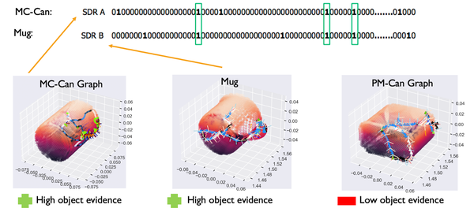
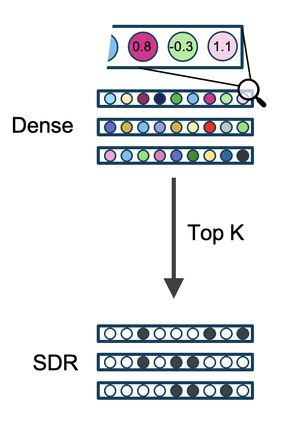
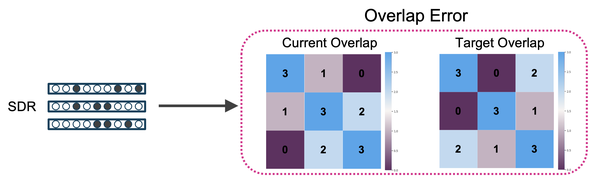
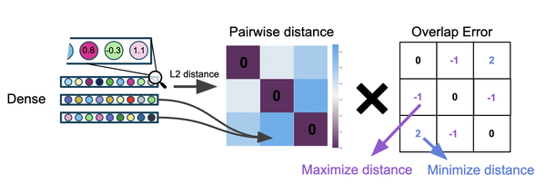

In a hierarchy of Learning Modules (LMs), the higher-level LM receives the output of the lower-level LM. This output represents features at poses, the same as the output of sensor modules. The features that an LM outputs are descriptors of the model it recognized internally, for instance, an object ID and its pose. It is advantageous if the object IDs are descriptive enough that similarity metrics can be applied. When similarity is incorporated into the object representations, similar objects can be treated similarly, allowing the higher-level LM to generalize to variability in object structures. For example, a car should be recognized regardless of the brand of tires that are on it. This is analogous to an LM recognizing slightly different shades of blue at the same location on an object.

We choose Sparse Distributed Representations (SDR) to represent objects and use overlap as a similarity metric (i.e., higher overlap of bits translates to higher similarity of objects). As a brief reminder, SDRs are high-dimensional, binary vectors with significantly more 0 than 1 bits. The choice of SDRs as a representation for objects allows us to benefit from their useful properties, such as high representational capacity, robustness to noise, and ability to express unions of representations. 

The problem of encoding object representations into SDRs is twofold: 

1. Estimating the similarity between stored graphs.
2. Creating SDR representations with overlaps matching the desired similarity.

# Similarity Estimation

Ideally, objects that share morphological features (e.g., cylinder-like) or non-morphological features (e.g., red) should be represented with high bit overlaps in their SDR representations, as shown in the figure below. Estimating the similarity between 3D graphs is not a trivial problem; however, the notion of _evidence_ can help us rank objects by their similarity with respect to the most likely object of an episode.

Consider a learning module actively sensing a single object environment (e.g., a fork). The EvidenceGraphLM initializes a hypothesis space of possible locations and poses on _all graphs_ in its memory (e.g., fork, knife, and mug). With every observation, the LM accumulates evidence on each valid hypothesis across all objects. In this case, the fork and knife will accumulate relatively more evidence than the mug, as shown in the figure below (left). Therefore, we use the difference between the evidence scores of the best hypothesis for each object (i.e., relative evidence) to represent similarity (i.e., comparable evidence means high similarity, as shown in the figure below). 

These relative evidence scores are then linearly mapped to the desired bit overlap range (e.g., [-8,0] -> [0,41] where 41 would be the number of on bits in each SDR and, therefore, the maximum overlap). Each episode populates a single row of the target overlaps matrix because it estimates the pairwise similarity of all objects with respect to the sensed object (i.e., most-likely object).

It is important to note that since the hypothesis space already considers all possible locations and orientations of the objects, we do not have to align (i.e., translate or rotate) the graphs for comparison; this is already performed while initializing the hypotheses space. For simplicity, we only show a single best hypothesis on the objects in the figure above, but matching considers all existing hypotheses. _Similarity estimation is a byproduct of evidence matching and comes at virtually no extra computational cost._

# Encoding Similarity in SDRs

We now take the matrix of target overlaps ([0, 41] in the figure above, [0, 3] in the figure below) and generate SDRs from it. The highest amount of overlap is represented by the values on the diagonal (i.e., the overlap of an SDR with itself) and is always the same as the number of active bits in the SDR, defining its sparsity. We impose these pairwise target overlap scores as a constraint while creating SDR representations. This problem can be thought of as an optimization problem with the objective of minimizing the difference between the actual SDR overlap and this matrix of target overlaps. 

Consider a set of objects and their pairwise target overlap (extracted from evidence scores); the goal is to create SDRs (one for each object) with pairwise overlaps matching the target overlaps. One _seemingly_ simple solution is to directly optimize the object SDR representations to the desired bit overlaps. However, optimizing binary vectors can prove challenging due to sharp gradients. In what follows, we describe a simple encoding mechanism and provide a step-by-step toy example for creating and optimizing these SDRs from real-valued representations. It is important to note that while the following approach uses gradient descent, it should not be viewed as an instance of _deep learning_ as there are no perceptrons, non-linear activation functions, or hidden weights.

## Initializing the Object Representations

The goal is to _create_ object SDRs with target overlaps; therefore, we first randomly initialize real-valued object representations. Each dense vector represents a single object and has the size of the desired SDR length. We also define a _Top-K_ readout function, which converts the dense representation to SDR with the desired sparsity (i.e., K is the number of active bits in each SDR). In this toy example, we use a size of 10 total bits for each SDR with 3 active bits (i.e., 70% sparsity). _Note that these are not the typical values we use in SDRs but are only used here for visualization purposes_. More typical values would be 41 bits on out of 2048 possible (98% sparsity). Three objects are initialized, as shown in the figure below.

## Calculating the Overlap Error

In this step, we quantify the error in overlap bits between the randomly initialized representations and the target overlaps. The error is calculated from the difference between the current and target overlaps. The error matrix is the same size as the overlap matrices, with values indicating whether two representations need to become more or less similar (i.e., the sign of the error) and by how much (i.e., the magnitude of the error).

## Optimizing the Representations

The error in overlap bits cannot be used to optimize the object SDRs directly since the top K function is not differentiable. We, therefore, apply it as a weight on the pairwise distance of the dense representations. The pairwise distance is calculated using the L2 distance function between each pair of dense vectors. Note that these vectors are initially random and are not derived from evidence values. If the overlap error indicates that two objects should be more similar, we minimize the distance between these two objects in Euclidean space and vice versa. This indirectly minimizes the overall error in pairwise overlap bits. Note that gradients only flow through the dense similarity calculations and are not allowed to flow through the Top-K readout function as indicated in the overview figure by _Stop Gradient_.

# Implementation in Monty

The encoding algorithm is implemented as an LM Mixin by the name `EvidenceSDRLMMixin`. This Mixin overrides the initialization of the LM, and the`post_episode` function to collect evidence values after each episode and use them to optimize a set of object representations. We define the `EvidenceSDRGraphLM`, which incorporates the Mixin and can be used as a drop-in replacement for `EvidenceGraphLM`when defining an experiment config.