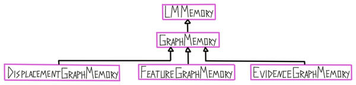

Learning modules are the core modeling system of Monty. They are responsible for learning models from the incoming data (either from a sensor module or another learning module). Their input and output formats are features at a pose. **Using the displacement between two consecutive poses, they can learn object models of features relative to each other and recognize objects** that they already know, independent of where they are in the world. How exactly this happens is up to each learning module and we have several different implementations for this.

Generally, each learning module contains a buffer, which functions as a short term memory, and some form of long term memory that stores models of objects. Both can then be used to generate hypotheses about what is currently being sensed, update, and communicate these hypotheses. If certainty about a sensed object is reached, information from the buffer can be processed and integrated into the long term memory. Finally, each learning module can also receive and send target states, using a goal state generator, to guide the exploration of the environment.

# Different Phases of Learning

The learning module is designed to be able to **learn objects unsupervised, from scratch**. This means it is not assumed that we start with any previous knowledge or even complete objects stored in memory (even though there is an option to load pre-trained models for faster testing). This means that the models in graph memory are updated after every episode and **learning and inference are tightly intertwined**. If an object was recognized, the model of this object is updated with new points. If no object was recognized, a new model is generated and stored in memory. This also means that the **whole learning procedure is unsupervised** as there are no object labels provided \[[1](#footnote1)].

To keep track of which objects were used for building a graph (since we do not provide object labels in this unsupervised learning setup) we store two lists in each learning module: `target_to_graph_id` and `graph_id_to_target`. `target_to_graph_id` maps each graph to the set of objects that were used to build this graph. `graph_id_to_target` maps each object to the set of graphs that contain observations from it. These lists can later be used for analysis and to determine the performance of the system but they are not used for learning. This means learning can happen completely unsupervised, without any labels being provided.

There are two modes the learning module could be in: **training** and **evaluation**. They are both very similar as both use the same procedure of moving and narrowing down the list of possible objects and poses. **The only difference between the two is that in the training mode the models in graph memory are updated after every episode.** In practice, we currently often load pre-trained models into the graph memory and then only evaluate these. This avoids computation to first learn all objects before every evaluation and makes it easier to test on complete, error-free object models. However, it is important to keep in mind that anything that happens during evaluation also happens during training and that these two modes are almost identical. Save for practical reasons (to save computational time) we would never have to run evaluation as we perform the same operations during training as well. Just as in real life, we want to think of systems as always learning and improving and never reaching a point where they only perform inference.

The training mode is split into two phases that alternate: The matching phase and the exploration phase. During the **matching phase** the module tries to determine the object ID and pose from a series of observations and actions. This is the same as in evaluation. After a terminal condition is met (object recognized or no possible match found) the module goes into the **exploration phase**. This phase continues to collect observations and adds them into the buffer the same way as during the previous phase, only the matching step is skipped. The exploration phase is used to add more information to the graph memory at the end of an episode. For example, the matching procedure could be done after three steps telling us that the past three observations are not consistent with any models in memory. Therefore we would want to store a new graph in memory but a graph made of only three observations is not very useful. Hence, we keep moving for `num_exploratory_steps` to collect more information about this object before adding it to memory. This is not necessary during evaluation since we do not update our models then.

 

# Specific Implementations

The details of specific implementations, approaches, results, and problems are too much for this overview document. They will therefore be written out in separate documents and linked here. For more details just talk to the person listed below.

- [Graph learning (using explicit 3D models)](https://www.overleaf.com/6437721771jccycdnsskvd): TODO Viviane

> 🚧 TODO: this link is behind a login on Overleaf

| List of all learning module classes | Description                                                                                                                                                                                                                                                                                                                                                 |
| ----------------------------------- | ----------------------------------------------------------------------------------------------------------------------------------------------------------------------------------------------------------------------------------------------------------------------------------------------------------------------------------------------------------- |
| **LearningModule**                  | Abstract learning module class.                                                                                                                                                                                                                                                                                                                             |
| **LearningModuleBase**              | Basic LM class.                                                                                                                                                                                                                                                                                                                                             |
| **GraphLM**                         | Learning module that contains a graph memory class and a buffer class. It also has properties for logging the target and detected object and pose. It contains functions for calculating displacements, updating the graph memory and logging. Class is not used on its own but is super-class of DisplacementGraphLM, FeatureGraphLM, and EvidenceGraphLM. |
| **DisplacementGraphLM**             | Learning module that uses the displacements stored in graph models to recognize objects.                                                                                                                                                                                                                                                                    |
| **FeatureGraphLM**                  | Learning module that uses the locations stored in graph models to recognize objects.                                                                                                                                                                                                                                                                        |
| **EvidenceGraphLM**                 | Learning module that uses the locations stored in graph models to recognize objects and keeps a continuous evidence count for all its hypotheses.                                                                                                                                                                                                           |

Since we currently focus on learning modules that use 3D object graphs, we will explain the workings of Monty on this example here in some more detail. **Using explicit 3D graphs makes visualization more intuitive and makes the system more transparent and easier to debug. This does not mean that we think the brain stores explicit graphs!** We are using graphs while we are nailing down the framework and the Cortical Messaging Protocol. This is just one possible embodiment of a learning module. How we represent graphs inside a learning module has no effect on the other components of Monty or the general principles of Monty. Explicit graphs are the most concrete type of model that uses reference frames and helped us think through a lot of problems related to that so far. In the future, we may move away from explicit graphs towards something more like HTM in combination with grid-cell like mechanisms but for now, they can help us understand the problems and possible solutions better.

The evidence-based LM is currently the default LM used for benchmarking the Monty system. We will therefore go into a bit more detail on this in [Evidence Based Learning Module](evidence-based-learning-module.md). The other approaches listed above are not under active development. DisplacementGraphLM and FeatureGraphLM are maintained but do not support hierarchy.

# The Buffer (STM)

Each learning module has a buffer class which could be compared to a short term memory (STM). The buffer only stores information from the current episode and is reset at the start of every new episode. Its content is used to update the graph memory at the end of an episode. (The current setup assumes that during an episode only one object is being explored, otherwise the buffer would have to be reset more often). The buffer is also used to retrieve the location observed at the previous step for calculating displacements. Additionally, the buffer stores some information for logging purposes.

# The Graph Memory (LTM)

Each learning module has one graph memory class which it uses as a long term memory (LTM) of previously aquired knowledge. In the graph learning modules, the memory stores explicit object models in the form of graphs (represented in the ObjectModel class). The graph memory is responsible for storing, updating, and retrieving models from memory.

# Object Models

Object models are stored in the graph memory and typically contain information about one object. The information they store is encoded in reference frames and contains poses relative to each other and features at those poses. There are currently two types of object models:

**Unconstrained graphs** are instances of the GraphObjectModel class. These encode an object as a graph with nodes and edges. Each node contains a pose and a list of features. Edges connect each node to its k nearest neighbors and contains a displacement and a list of features. More information on graphs will be provided in the next sections.

**Constrained graphs** are instances of the GridObjectModel class. These models are constrained by their size, resolution, and complexity. Unconstrained graphs can contain an unlimited amount of nodes and they can be arbitrarily close or far apart from each other. Constrained graphs make sure that the learned models have to be efficient by enforcing low resolution models for large objects such as a house and high resolution models for small objects such as a dice. This is more realistic and forces Monty to learn compositional objects which leads to more efficient representations of the environment, a higher representational capacity, faster learning, and better generalization to new objects composed of known parts. The three constraints on these models are applied to the raw observations from the buffer to generate a graph which can then be used for matching in the same way as the unconstrained graph. More information on constrained graphs will be provided in the following sections.

![Three constraints are enforced on constrained graph models. Max_size is defined in cm so if it is for example set to 10, it means the learned object models can cover an area of **10**cm3 If max_voxels_per_dim would be set to 4 (as shown in this figure), then each voxel would be of size **2**cm3 and any locations within that voxel cannot be distinguished. Max_nodes is the number of voxels that will be selected to become nodes in the graph that is eventually used for matching.](../figures/how-monty-works/graph_constrains.png)

# Graph Building

A graph is constructed from a list of observations (poses, features). Each observation can become a node in the graph which in turn connects to its nearest neighbors in the graph (or by temporal sequence), indicated by the edges of the graph. **Each edge has a displacement associated with it** which is the action that is required to move from one node to the other. Edges can also have other information associated with them, for instance, rotation invariant point pair features (Drost et al., 2010). **Each node can have multiple features associated with it** or simply indicate that the object exists there (morphology). Each node must contain location and orientation information in a common reference frame (object centric with an arbitrary origin).

## What are Point Normals and Principal Curvatures?

See the video in this section for more details: [Point Normals and Principal Curvatures](observations-transforms-sensor-modules.md#point-normals-and-principal-curvatures)

**Similar nodes in a graph** (no significant difference in pose or features to an existing node) **are removed** (see above figure) and nodes could have a variety of features attached to them. Removing similar points from a graph helps us to be more efficient when matching and avoids storing redundant information in memory. This way we store more points where features change quickly (like where the handle attaches to the mug) and fewer points where features are not changing as much (like on a flat surface).

# Building Constrained Graphs

When using constrained graphs, each learning module has three parameters that constrain the size (`max_size`), resolution (`num_voxels_per_dim`), and complexity (`max_nodes`) of models it can learn. These parameters do not influence what an LM sees, they only influence what it will store in memory. For example if an LM with a small maximum model size is moving over a large object, it will perceive every observation on the object and try to recognize it. However, it will not be able to store a complete model of the object. It might know about subcomponents of the object if it has seen them in isolation before and send those to other LMs that can model the entire large object (usually at a lower resolution). Once we let go of the assumption that each episode only contains one object, we also do not need to see the subcomponents in isolation anymore to learn them. We would simply need to recognize them as separate objects (for example because they move independently) and they would be learned as separate models.

To generate a constrained graph, the observations that should be added to memory are first sorted into a 3D grid. The first observed location will be put into the center voxel of the grid and all following locations will be sorted relative to this one. The size of each voxel is determined by the maximum size of the grid (in cm) and the number of voxels per dimension. If more than 10% of locations fall outside of the grid, the object can not be added to memory.

After all observations are assigned to a voxel in the grid, we retrieve three types of information for each voxel:

- The **number of observations** in the voxel.

- The **average location** of all observations in the voxel.

- The **average features** (including pose vectors) of all observations in the voxel.

Finally, we select the _k_ voxels with the highest observation count, where _k_ is the maximum number of nodes allowed in the graph. We then create a graph from these voxels by turning each of the _k_ voxels into a node in the graph and assigning the corresponding average location and features to it.

When updating an existing constrained object model, the new observations are added to the existing summary statistics. Then the new k-winner voxels are picked to construct a new graph.

The three grids used to represent the summary statistics (middle in figure above) are represented as sparse matrices to limit their memory footprint.

# Using Graphs for Prediction and Querying Them

We can use graphs in memory to predict if there will be a feature sensed at the next location and what the next sensed feature will be, given an action/displacement (**forward model**). This prediction error can then be used for graph matching to update the possible matches and poses.

A graph can also be queried to provide an action that leads from the current feature to a desired feature (**inverse model**). This can be used for a goal-conditioned action policy and more directed exploration. To do this we need to have a hypothesis of the object pose.

# Footnotes

<a name="footnote1">1</a>: Resetting the buffer at the end of an episode is a weak supervisory signal if we are changing the object after each episode (although two consecutive episodes may be showing the same object from different angles). However, we are already testing the system in multi object scenarios where there is no external signal indicating when a sensor moves on to a new object.