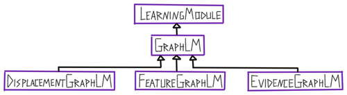
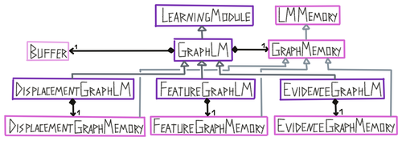

![Information flow in a graph learning module. At each step the LM receives features and a pose as input. Using the previous observation stored in the buffer it can calculate a pose displacement. This displacement together with the sensed features is used to evaluate all current hypotheses and update them. In the evidence LM this means updating their evidence, in the other two LMs it means to remove the hypotheses from the list of hypotheses if incoming information is inconsistent with the model’s predictions. Using the current hypotheses and their evidence the LM can then output a vote which is sent to any connected LMs. If there are incoming votes, they will be used for another hypothesis update. Additionally, incoming top-down input can be used to modulate the evidence for different hypotheses. After this, the LM outputs its most likely hypothesis (object ID and pose) and a goal state (used for action selection). The goal state is produced by the goal state generator which can use a higher-level goal state and the LMs internal state and models to decide on the best goal state to output. Once matching is completed, the list of features and poses in the buffer can be used to update the graph memory.](../figures/how-monty-works/learning_module.png)

# Output Types

A learning module can have **three types of output at every step**. All three outputs are instances of the State class and adhere to the Cortical Messaging Protocol. 

## Pose and Features

The first one is, just like the input, **a pose relative to the body and features at that pose**. This would for instance be the most likely object ID (represented as a feature) and its most likely pose. This output can be sent as input to another learning module or be read out by the experiment class for determining Monty's [Terminal Condition](evidence-based-learning-module.md#terminal-condition) and assessing the model performance.

## Vote

The second output is the LMs **vote**. If the LM received input at the current step it can send out its current hypotheses and the likelihood of them to other LMs that it is connected to. For more details of how this works in the evidence LM, see section [Voting with evidence](evidence-based-learning-module.md#voting-with-evidence)

## Goal State

Finally, the LM can also **suggest an action in the form of a goal state**. This goal state can then either be processed by another learning module and split into subgoals or by the motor system and translated into a motor command in the environment. The goal state follows the CMP and therefore contains a pose relative to the body and features. The LM can for instance suggest a target pose for the sensor it connects to that would help it recognize the object faster or poses that would help it learn new information about an object. A goal state could also refer to an object in the environment that should be manipulated (for example move object x to location y or change the state of object z). To determine a good target pose, the learning module can use its internal models of objects, its current hypotheses, and information in the short-term memory (buffer) of the learning module. The goal state generator is responsible for the selection of the target goal state based on the higher-level goal state it receives and the internal state of the learning module.

# Comparison between 3 Graph Learning Modules

There are currently **three flavors of graph matching** implemented: Matching using **displacements**, matching using **features at locations**, and matching using features at locations but with **continuous evidence values for each hypothesis** instead of a binary decision. They all have strengths and weaknesses but are generally successive improvements. They were introduced sequentially as listed above and each iteration was designed to solve problems of the previous one. Currently, we are using the evidence-based approach for all of our benchmark experiments.

**Displacement matching** has the advantage that it **can easily deal with translated, rotated and scaled objects** and recognize them without additional computations for reference frame transforms. If we represent the displacement in a rotation-invariant way (for example as point pair features) the recognition performance is not influenced by the rotation of the object. For scale, we can simply use a scaling factor for the length of the displacements which we can calculate from the difference in length between the first sensed displacement and stored displacemnts of initial hypotheses (assuming we sample a displacement that is stored in the graph, which is a strong assumption). It is the only LM that can deal with scale at the moment. The major downside of this approach is that it **only works if we sample the same displacements that are stored in the graph model** of the object while the number of possible displacements grows explosively with the size of the graph.

**Feature matching addresses this sampling issue** of displacement matching by instead matching features at nearby locations in the learned model. The problem with this approach is that locations are not invariant to the rotation of the reference frame of the model. We, therefore, have to cycle through different rotations during matching and apply them to the displacement that is used to query the model. This however is more computationally expensive.

**Both previous approaches use a binary approach to eliminate possible objects and poses.** This means that if we get one inconsistent observation, the hypothesis is permanently eliminated from the set of possible matches. The **evidence-based LM deals with this issue by assigning a continuous evidence value to each hypothesis** which is updated with every observation. This makes the LM much **more robust to noise and new sampling**. Since the set of hypotheses retains the same size over the entire episode we **can also use more efficient matrix multiplications** and speed up the recognition procedure. The evidence count also allows us to **have a most likely hypothesis at every step**, even if we have not converged to a final classification yet. This is useful for further hierarchical processing and action selection at every step.

Overall, matching with displacements can deal well with rotated and scaled objects but fails when sampling new displacements on the object. Feature matching does not have this sampling issue but instead requires a more tedious search through possible rotations and scale is an open problem. Evidence matching uses the mechanisms of feature matching but makes them more robust by using continuous evidence counts and updating the evidence with efficient matrix multiplications.