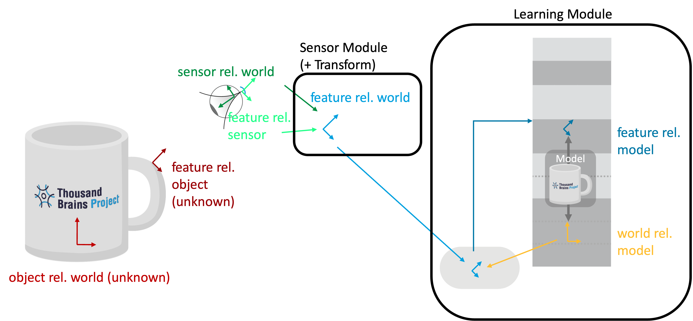
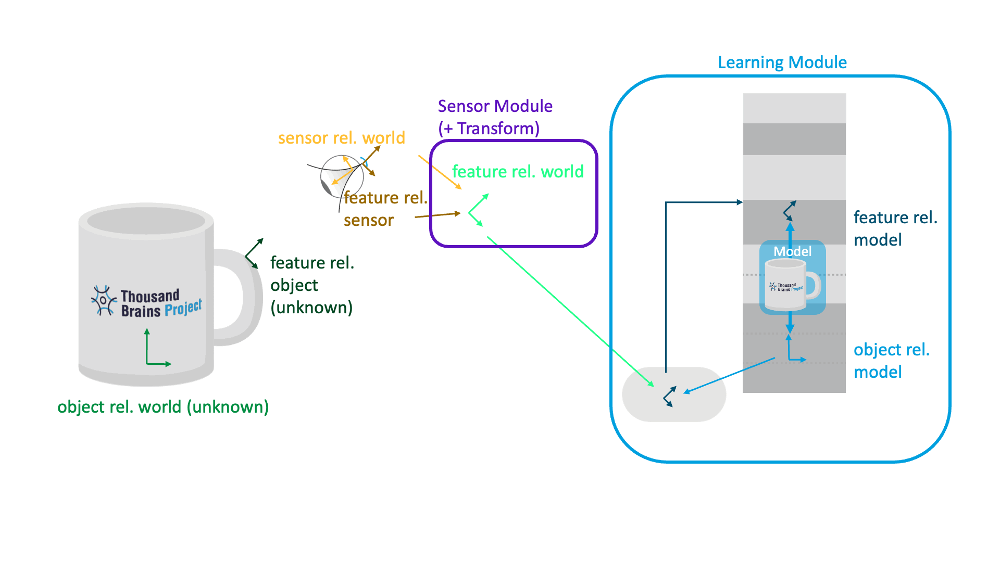
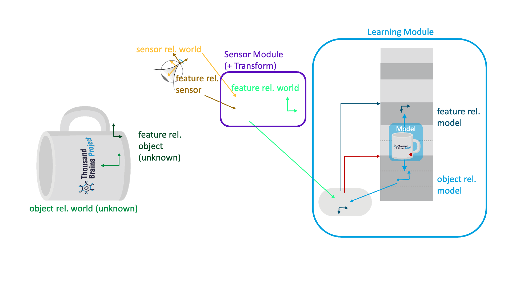
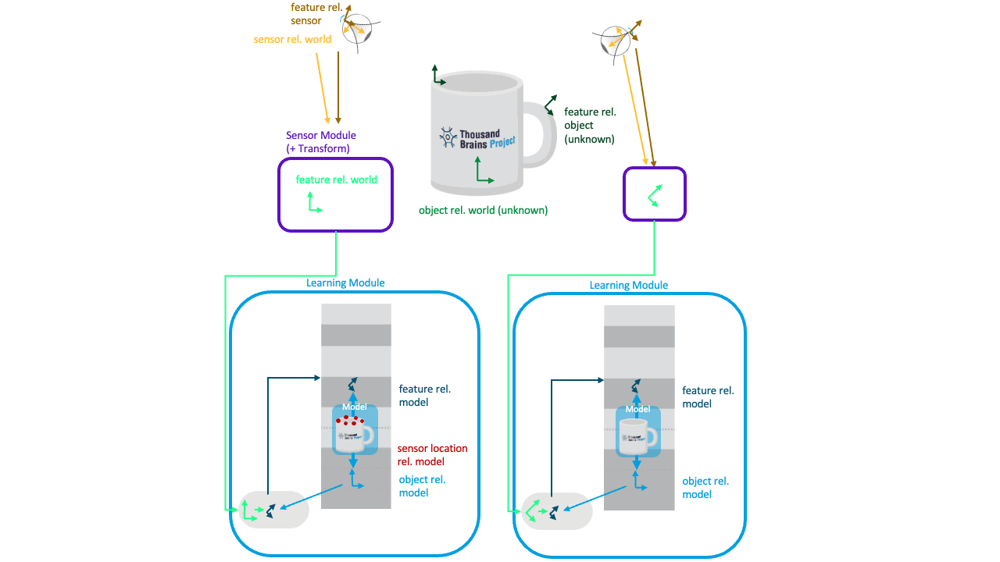

In a sensorimotor learning setup, one naturally encounters several different reference frames in which information can be represented. Additionally, Monty has internal reference frames in which it learns models of objects. Those can get confusing to wrap your head around and keep track of, so here is a brief overview of all the reference frames involved in a typical Monty setup.

# Reference Frames in a Typical Monty Experiment

### 🟢 Object rel. World
The orientation of the object in the world (unknown to Monty). For instance, if we use a simulator, this would be the configuration that specifies where the object is placed in the environment (like we do [here](https://github.com/thousandbrainsproject/tbp.monty/blob/4844ef17a4cadce455acb8d852fe3ed7038a298f/src/tbp/monty/frameworks/config_utils/make_dataset_configs.py#L229)). In the real world we don't have a specific origin but still, all objects are placed in a common reference frame with relative displacements between each other.
### 🟢⚫️ Feature rel. Object
The pose of all the features on the object (also unknown to the Monty). For instance, if you use a 3D simulator, this could be defined in the object meshes.
### 🟡 Sensor rel. World/Body
The sensor’s location and orientation in the world can be calculated from proprioceptive information and motor efference copies. Basically, as the system moves its sensors, it can use this information to update the locations of those sensors in a common reference frame. For the purposes of Monty it doesn't matter where the origin of this RF is (it could be the agent's body or an arbitrary location in the environment) but it matters that all sensor locations are represented in this common RF.
### 🟠 Feature rel. Sensor
This is the feature's orientation relative to the sensor. For instance in Monty, we often use the surface normal and curvature direction to define the sensed pose, which are extracted from the depth image of the sensor ([code](https://github.com/thousandbrainsproject/tbp.monty/blob/main/src/tbp/monty/frameworks/models/sensor_modules.py#L161-L167)).
### 🟢⚪️ Feature rel. World/Body
[bright green]
The estimated orientation of the sensed feature in the world (sensor_rel_world * feature_rel_sensor). In Monty, this currently happens to the depth values in [DepthTo3DLocations](https://github.com/thousandbrainsproject/tbp.monty/blob/4844ef17a4cadce455acb8d852fe3ed7038a298f/src/tbp/monty/frameworks/environment_utils/transforms.py#L220) while the surface normal and curvature extraction then happens in the SM, but in the end you get the same results.
### 🔵 Object rel. Model
This is the hypothesized orientation of the learned model relative to the object (in the world). This orientation needs to be inferred by the LM based on its sensory inputs. There are usually multiple hypotheses which Monty learning modules keeps track of in [`self.possible_poses`](https://github.com/thousandbrainsproject/tbp.monty/blob/4844ef17a4cadce455acb8d852fe3ed7038a298f/src/tbp/monty/frameworks/models/evidence_matching/learning_module.py#L227)
### 🔵⚫️ Feature rel. Model
This is the rotation of the currently sensed feature relative to the object model in the LM (feature_rel_world * object_rel_model, see code [here](https://github.com/thousandbrainsproject/tbp.monty/blob/main/src/tbp/monty/frameworks/models/evidence_matching/hypotheses_displacer.py#L141-L142)). The learning module uses its pose hypothesis to transform the feature relative to the world into its object's reference frame so that it can recognize the object in any orientation and location in the world, independent of where it was learned. 

> [!NOTE] 
> In the brain we hypothesize that the transformation of sensory input into the object's reference frame is done by the thalamus (see our [neuroscience theory paper](https://arxiv.org/abs/2507.05888) for more details).

## Keeping Input to the LM Constant as the Sensor Moves
The transform in the sensor module combines the sensor pose in the world with the sensed pose of the features relative to the sensor. This way, if the sensor moves while fixating on a point on the object, that feature pose will not change (see animation below). We are sending the same location and orientation of the feature in the world to the LM, no matter from which angle the sensor is "looking" at it.

This is one of the key definitions of the [CMP](../observations-transforms-sensor-modules.md#cmp-and-the-state-class): The pose sent out from all SMs is in a common reference frame. In Monty, we use the [DepthTo3DLocations](../../../src/tbp/monty/frameworks/environment_utils/transforms.py) transform for this calculation and report locations and orientations in an (arbitrary) world reference frame.

## Applying the Pose Hypothesis as the Object Rotates

If the object changes its pose in the world, the pose hypothesis in the LM comes into play. The LM has a hypothesis on how the object is rotated in the world relative to its model of the object. This is essentially the rotation that needs to be applied to rotate the incoming features and movements into the model’s reference frame.

The plot below only shows one pose hypothesis, but in practice, Monty has many of them, and it needs to infer this pose from what it is sensing (dark green orientations are unknown).

If the object is in a different rotation than how it was learned, all the features on the object will be sensed in different orientations and location in the world. This needs to be compensated by the light blue projection of the pose hypothesis.

## Applying the Pose Hypothesis to the Sensor Movement

What is not shown in the visualizations above is that the same rotation transform is also applied to the movement vector (displacement) of the sensor. In Monty we calculate how much the sensor has moved in the world by taking the difference between two successive location and orientation inputs to the LM ([code](https://github.com/thousandbrainsproject/tbp.monty/blob/a408bf6063852323b98e009da5e1373d097beb73/src/tbp/monty/frameworks/models/graph_matching.py#L1052)). The sensor movement is applied to update the hypothesized location on the object. 

Before we can apply the movement to update our hypothesized location on the object, the movement needs to be transformed from a movement in the world to movement in the object's reference frame. To do this, the hypothesized object orientation (light blue) is applied, the same way it is applied to the incoming features. So for example, if object is rotated by 90 degrees to the left and the sensor moved right to left on the object (like in the animation shown below), then the orientation transform will update the location on the object model (red dot) to change from bottom to top of the object. 

Applying the hypothesized object rotation to both the incoming movement and features means that Monty can recognize the object in any new location and orientation in the world.

# Reference Frame Transforms for Voting
Voting in Monty happens in object space. We directly translate between the object’s RF of the sending LM to the object RF of the receiving LM. This relies on the assumption that both LMs learned the object at the same time, and hence their reference frames line up in orientation and displacement (since we receive features rel. world, which will automatically line up if the LMs learn the object at the same time). Otherwise, we could store one displacement between their reference frames and apply that as well.

The two LMs receive input from two sensors that sense different locations and orientations in space. They receive that as a pose in a common coordinate system (rel. world in the image below). Since the sensors are at different locations on the object and our hypotheses are “locations of sensor rel. model” we can’t just vote on the hypotheses directly but have to account for the relative sensor displacement. So the sensor that is sensing the handle of the cup needs to incorporate the offset to the sensor that senses the rim to be able to use its hypotheses.

This offset can be easily calculated from the difference of the two LM’s inputs, as those poses are in a common coordinate system. The sending LM [attaches its sensed pose in the world to the vote message](https://github.com/thousandbrainsproject/tbp.monty/blob/a408bf6063852323b98e009da5e1373d097beb73/src/tbp/monty/frameworks/models/evidence_matching/learning_module.py#L394) it sends out (along with its hypotheses about the locations on the mug), and the receiving LM [compares it with its own sensed pose](https://github.com/thousandbrainsproject/tbp.monty/blob/a408bf6063852323b98e009da5e1373d097beb73/src/tbp/monty/frameworks/models/evidence_matching/model.py#L77) and [applies the difference to the vote hypotheses](https://github.com/thousandbrainsproject/tbp.monty/blob/main/src/tbp/monty/frameworks/models/evidence_matching/model.py#L106-L112).

Check out our evidence LM documentation for [more details on voting](../learning-module/evidence-based-learning-module.md#voting-with-evidence).