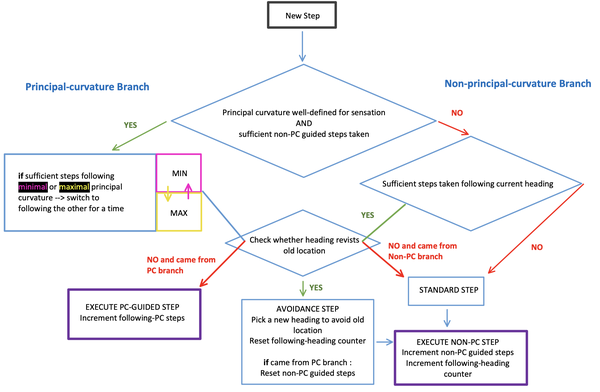

The policy is generated by the motor system and outputs actions for the agent's action space. If there are multiple agents in an environment, they will all have their own policy and may have different action spaces.

# Action Spaces

We currently have two broad types of action spaces for our agents. The first is a camera-like action space for what we call the distant agent, due to its physical separation from the surface of the object it is sensing. Like an eye, the action space is that of a "ball-and-socket" actuator that can look in different directions. In addition, the "socket" itself can move if directed by the hypothesis-driven policy (more on that in a moment).

The second action space is a more flexible one that allows easier movement through space, but is designed to move along the surface of an object (e.g. like a finger), hence we call it the surface agent (see figure below).

For both the distant agent and surface agent, the action space also includes the ability to make instantaneous "jumps" in the absolute coordinates of the environment. These are used by the **hypothesis-driven action policy** to evaluate candidate regions of an object, with the aim of rapidly disambiguating the ID or pose of the current object.

Given these action spaces, the **distant agent remains in one location unless moved by the hypothesis-driven policy, and can tilt** its sensors up, down, left, and right to explore the object from one perspective. The **surface agent moves close along the surface of the object** by always staying aligned with the sensed point normal ((→ facing the object surface head-on). It can therefore efficiently move around the entire object and theoretically reach any feature on the object even without the hypothesis-driven action policy.

Note that the differences between the agents and action spaces are in some sense arbitrary at this point; however, it is useful to explore inference with both of these approaches, owing to some unique properties that they might each afford:

- Distant agent:

  - Rapid movements: being far from the surface of an object affords the ability of an agent to make more rapid movements, without risking that these knock over or collide with an object; this might manifest as rapid saccades across the key points of an object.

  - Broad overview: by being distant, an agent can acquire a more broad overview of the structure and potential points of interest on an object, informing areas to rapidly test.

  - Simplicity: a distant agent is easier to implement in practice as it does not require a fine-tuned policy that can move along an object surface without colliding with the object or leaving the surface. Furthermore, the action space is generally easier to realize, e.g. it does not require a complex supporting body for something like a "finger" moving in the real world.

- Surface agent:

  - Additional modalities: all of the sensory modalities of the distant agent are limited to forms of propagating waves, in particular electromagnetic radiation (such as visible light), and sound waves; in contrast, the surface agent has the potential to feel physical textures directly, and as cameras are easy to come by (unlike biological eyes...) we can easily include one in our surface agent.

  - Fidelity: related to the above, one would imagine that the depth or temperature readings of a finger-like sensor exploring an object will be more accurate than those of a distant-agent relying on electromagnetic radiation alone; furthermore, the movements that constrain a surface-agent to move along the surface may provide an additional signal for accurately estimating the curvature of objects.

  - Interactivity: by proximity to an object, components of a Monty system that are "surface agents" are also likely able to interact with an object, affording additional capabilities.

  - Object enclosure: by using an array of 3D sensors that are still relatively nearby (such as the fingers on a hand), surface agents can more easily surround an object from all sides and instantaneously reduce object self-occlusion that otherwise affects distant-agent observations. By moving on the surface of an object it also significantly reduces the risk of other objects occluding the object of interest and makes it easier to isolate the object and detect when moving onto a new object.

# Utility Functions/Policies

Before an experiment starts, the agent is moved to an appropriate starting position relative to the object. This serves to setup the conditions desired by the human operator for the Monty agent, and is analogous to a neurophysiologist lifting an animal to place it in a particular location and orientation in a lab environment. As such, these are considered utility functions or "policies", in that they are not driven by the intelligence of the Monty system, although they currently make use of its internal action spaces. Furthermore, sensory observations that occur during the execution of a utility policy are not sent to the learning module(s) of the Monty system, as they have access to privileged information, such as a wider field-of-view camera. Two such policies exist, one for the distant agent (`get_good_view`), and one for the surface agent (`touch_object`).

For the former, the distant agent is moved to a "good view" such that small and large objects in the data set cover approximately a similar space in the camera image (see figure below). **To determine a good view we use the view-finder** which is a camera without zoom and which sees a larger picture than the sensor patch. Without `get_good_view`, small objects such as the dice may be smaller than the sensor patch, thereby preventing any movement of the sensor patch on the object (without adjusting the action amount). For large objects, there is a risk that the agent is initialized inside the object as shown in the second image in the first row of the below figure. 

`touch_object` serves a similar purpose - the surface agent is moved sufficiently close such that it is essentially on the surface of the object. This will be important in future work when the surface agent has access to sensory inputs, such as texture, that require maintaining physical contact with an object.

Some more details on the utility functions are provided below.

### Get Good View
- This is called by the distant agent in the pre-episode period, and makes use of the view-finder. To estimate whether it is on an object, it can either make use of the semantic-sensor (which provides ground-truth information about whether an object is in view and its label), or it can approximate this information using a heuristic based on depth-differences.
- Information in the view-finder is used to orient the view-finder, and the associated sensor-patch(es) onto the object, before moving closer to the object as required.
- Contains additional logic for handling multiple objects, in particular making sure the agent *begins* on the target object in an experiment where there are distractor objects. This is less relevant for the surface agent, as currently multi-object experiments are only for the distant agent.
- Key parameters that determine the behavior of the utility function are `good_view_percentage` and `desired_object_distance`. The primary check of the algorithm is to compare `perc_on_target_obj` (the percent of the view-finder's visual field that is filled by the object) against the desired `good_view_percentage`.  `closest_point_on_target_obj` simply serves to ensure we don't get too close to the object

### Touch Object
- This can be called by the surface agent when determining the next action (even within an episode), and makes use of the view-finder, but not the semantic-sensor.
- Contains a search-loop function that will orient around to find an object, even if it is not visible in the view-finder.
- The key parameter is `desired_object_distance`, which reflects the effective length of the agent and its sensors as it moves along the surface of the object.

### Planned Changes to the Utility Functions
As the utility functions were implemented in the early development of Monty, there are a number of aspects which we plan to adjust in the near future, and which should be reflected in any new utility functions.
1) Utility functions should only be called in `pre_episode`, i.e. before the episode begins.
2) Utility functions may make use of privileged information such as the view-finder and semantic-sensor, which are not available to the learning module. However, consistent with point (1), these should not be leveraged during learning or inference by the Monty agent.

These requirements are currently not enforced in the use of `get_good_view` and `touch_object` when an agent jumps to a location using a model-based policy. Similarly, `touch_object` is used by the surface agent if it loses contact with the object and cannot find it. Appropriately separating out the role of utility functions via the above requirements will clarify their role, and enable policies that do not make use of privileged information, but which serve similar purposes during an experiment.

# Input-Driven and Hypothesis-Driven Policies

We can divide policies into two broad categories: **Input-driven policies** which **use data directly from the sensor to determine the next action**, and **hypothesis-driven policies** which **use goal states from the learning module to determine the next action**. Besides this, we can also use a largely random policy that is not influenced by any factors. The input-driven policies are a bit more simplistic but can already have powerful effects while the hypothesis-driven policies can actively make use of the learned object models and current hypotheses to quickly narrow down the object ID and enable a more efficient exploration of an object. Importantly, input and hypothesis-driven policies can work in concert for maximal efficiency.

Input-driven policies are based on sensory input from the SM. It can be compared to a reflexive behavior where the agent reacts to the current sensory input without processing the input further or using models of the world to decide what to do. This direct connection between SM and motor policy currently does not enforce the CMP but might in the future. The hypothesis driven policies are based on goal states that are output from the goal state generator of the learning modules. These goal states follow the CMP and therefore contain a pose and features. Those are interpreted as target poses of objects that should be achieved in the world and get translated into motor commands in the motor system.

In the current default setup, observations of the distant agent are collected by **random movement** of the camera. The only input-driven influence is that if the sensor patch moves off the object, the previous action is reversed to make sure we stay on the object. Policies with random elements also have a momentum parameter (alpha) which regulates how likely it is to repeat the previous action and allows for more directional movement paths. If more predictable behavior is desired, pre-defined action-sequences can also be defined, and these are frequently employed in unit tests.

The surface agent can either use a random walk policy (again with an optional momentum parameter to bias following a consistent path), or alternatively make use of the "curvature-informed" policy. This policy makes use of sensed principle curvature directions (where they are present), attempting to then follow these, such as on the rim of a cup, or the handle of a mug. The details of this policy are expanded upon further below.

Finally, both the distant and surface agent can make use of the hypothesis-driven action policy.

The policies mentioned above are aimed at efficient inference. There is also a specialized policy that can be used to ensure good object coverage when learning about new objects called `NaiveScanPolicy`. This policy starts at the center of the object and moves outwards on a spiral path. This policy makes the most sense to use with the `MontySupervisedObjectPretraining` `Experiment` and is written for the distant agent. For hypothesis-driven policies during exploration, one would want to go to locations on the object that are not well represented in the model yet (not implemented). **Exploration policies generally aim at good object coverage** and exploring new areas of an object while **inference policies aim at efficiently viewing unique and distinguishing features** that are well represented in the object model.

[Examples of different policies in action](https://res.cloudinary.com/dtnazefys/video/upload/v1731248420/pretraining_mug.mp4)

| List of all policy classes         | Description                                                                                                                                                                                                                                                                                             |
| ---------------------------------- | ------------------------------------------------------------------------------------------------------------------------------------------------------------------------------------------------------------------------------------------------------------------------------------------------------- |
| **MotorSystem**                    | Abstract policy class.                                                                                                                                                                                                                                                                                  |
| **BasePolicy**                     | Policy that randomly selects actions from the action space. The switch_frequency parameter determines how likely it is to sample a new action compared to repeating the previous action. There is also an option to provide a file with predefined actions that are executed in that order.             |
| **InformedPolicy**                 | Receives the current observation as input and implements basic input-driven heuristics. This policy can search for the object if it is not in view, move to the desired distance to an object, and make sure to stay on the object by reversing the previous action if the sensor moves off the object. |
| **NaiveScanPolicy**                | Policy that moves in an outwards spiral. Is used for supervised pretraining with the distant agent to ensure even object coverage.                                                                                                                                                                      |
| **SurfacePolicy**                  | Moves perpendicular to the object's surface at a constant distance using the point normals. This is also a type of InformedPolicy.                                                                                                                                                                      |
| **SurfacePolicyCurvatureInformed** | Custom SurfacePolicy that follows the direction of the two principal curvatures and switches between them after a while.                                                                                                                                                                                |
| **HypothesisDrivenPolicyMixin**    | The hypothesis-driven policy is implemented as a mixin, such that it can be adopted by a variety of other core policies, such as the informed distant-agent policy, or the surface-agent, curvature-informed policy.                                                                                    |

Due to their relative complexity, the below sub-sections provide further detail on the curvature-informed and hypothesis-driven policies.

## Curvature Informed Policy Details

The curvature-informed surface-agent policy is designed to follow the principal curvatures on an object's surface (where these are present), so as to efficiently explore the relevant "parts" of an object. For example, this policy should be more likely than a random walk with momentum to efficiently explore components such as the rim of a cup, or the handle of a mug, when these are encountered.

To enable this, the policy is informed by the principal curvature information available from the sensor-module. It will alternate between following the minimal curvature (e.g. the rim of a cup) and the maximal curvature (e.g. the curved side of a cylinder). The decision process that guides the curvature-guided policy is elaborated in plain English in the below chart), and in more coding-terminology in Figure TODO.

> 🚧 TODO: add a figure for coding-terminology chart

**Avoidance of previous locations**: In addition to being guided by curvature, the policy has the ability to check whether the direction in which it is heading will bring it back to a previously visited location; if so, it will attempt to find a new heading that is more likely to explore a new region of the object. Some further points on this are:

- We typically limit the temporal horizon over which the agent performs this check, such that it won't worry about revisiting a location seen in the distant past. Furthermore, the angle (i.e. projected cone) over which we consider a previous location as being on our current heading-path progressively decreases as we iteratively search for a new direction. In other words, the more time we spend looking for a new heading, the more tolerant we are to passing nearby to previously visited locations. Both of these elements help reduce the chance of getting stuck in situations where the agent is surrounded by previously visited locations, and cannot find a path out of the situation.

- To further limit the risk of getting stuck in such encircled regions, once the agent has selected an avoidance heading, it will maintain it for a certain period of time before checking for conflicts again.

- Note that in the future, we may wish to sometimes _intentionally_ return to previous locations when we have noisy self-movement information, so as to correct our estimated path-integration.

In the figure below, two examples of the policy in action are shown.

![Two samples of the curvature-informed surface policy being used during inference. Blue segments represents a standard step, white represents following minimal principal curvature, black following maximal, and green taking an avoidance step. Note in particular how in (b), as the agent moves over the rim of the cup, it realizes it will revisit a previous location, and so takes an avoidance step (green) to bring it in a new direction. Further note that even when principal curvature might be evident to the human eye, the model may not be receiving a valid PC-input due to noise on the surface of the mesh. Finally, the end point shows the sensed orientation of the current feature (blue detected point-normal, red and orange detected principal curvatures).](../figures/how-monty-works/curve_pol_example.png)

## Hypothesis-Driven Policy Details

For the hypothesis-driven action policy, the Monty system uses its learned, internal models of objects, in combination with its hypotheses about the current ID and pose of the object it is perceiving, to propose a point in space to move to. This testing point should help disambiguate the ID and/or pose of the object as efficiently as possible. This policy is currently for LMs that use explicit 3D graphs to model objects.

**Selecting a Test Point:** A simple heuristic for where to test an object for this purpose might be to evaluate the point on the most-likely object that is farthest away from where the system currently believes it is. Such a "max-distance" condition is partially implemented, however the main method currently in use involves a moderately more sophisticated comparison of the two most likely hypotheses so as to identify the most distinguishing point to visit.

In particular, this "graph-mismatch" technique takes the most likely and second most likely object graphs, and using their most likely poses, overlays them in a "mental" space. It then determines for every point in the most likely graph, how far the nearest neighbor is in the second graph. The output is the point in the first graph that has the _most distant nearest neighbor_ (Figure below)

As an example, if the most likely object was a mug, and the second most likely object a can of soup, then a point on the handle of the mug would have the most-distant nearest neighbor to the can-of-soup graph. In general, this is a reasonable heuristic for identifying potentially diagnostic differences in the structures of two objects using Euclidean distance-alone, without requiring comparisons in feature-space. Eventually we want to extend this to include distance in feature space to efficiently distingush objects with the same morphology such as a coke can from a sparkling water can.

In addition to being able to compare the top two most likely objects in such a way, one can just focus on the most likely object, and use this same technique to compare the two most likely _poses_ of the same object.

**Determining When to Perform a Hypothesis-Driven Test:** There are currently a handful of conditions for when we perform a hypothesis-driven test, summarized below:

- The system is sufficiently confident about the object ID in question; in this case, Monty will focus on determining _pose_ as described above. With all other indications below, the process remains focused on distinguishing the ID amongst the top two most likely objects.

- The IDs or order of the top two most-likely object IDs change (e.g. we go from (1: fork, 2: spoon), to (1: spoon, 2: fork))

- The pose of the most likely object has changed.

- There has been a significant number of steps without performing a hypothesis-driven jump.

The above conditions can support performing a hypothesis-driven jump, but in addition, it is first necessary that we have taken a sufficient number of steps since our last hypothesis-driven jump, to reduce the probability of continuously jumping over the object, potentially to similar locations. In practice, this minimum number of steps is small however (e.g. 5 steps).

![An example showing where the agent is in the external world (left and right plots; agent "finger" represented with ball-and-pole, where the pole points in the direction the agent is facing), as well as its internal model of the hypothesis spaces (center, green-ish-blue). Based on its current location (on the handle of the spoon) and estimated poses of the two most likely objects (spoon and knife), the model overlays these, and the graph-mismatch technique proposes testing a part of the head of the spoon (red-spot, center). In the final panel, we see the agent after jumping to this point.](../figures/how-monty-works/hyp_driven_example.png)

## Long Term Policy View

It is worth emphasizing that the long-term view of improving the policy in Monty will certainly leverage various advanced learning techniques, including reinforcement learning and/or evolutionary algorithms. It is important to note therefore that the policies which we have been implementing so far do not mean to be extended to consider every possible scenario an agent might face. Rather, these are intended as a reasonable set of primitives that a more advanced policy might make use of, without having to learn them from the ground up.

It is also worth noting that these same primitives will likely prove useful as we move from 3D physical space, to more abstract spaces. For example, in such settings, we might still want to have the inductive biases that support following dimensions of maximal or minimal variation, or use the differences between internal models to determine test-points.