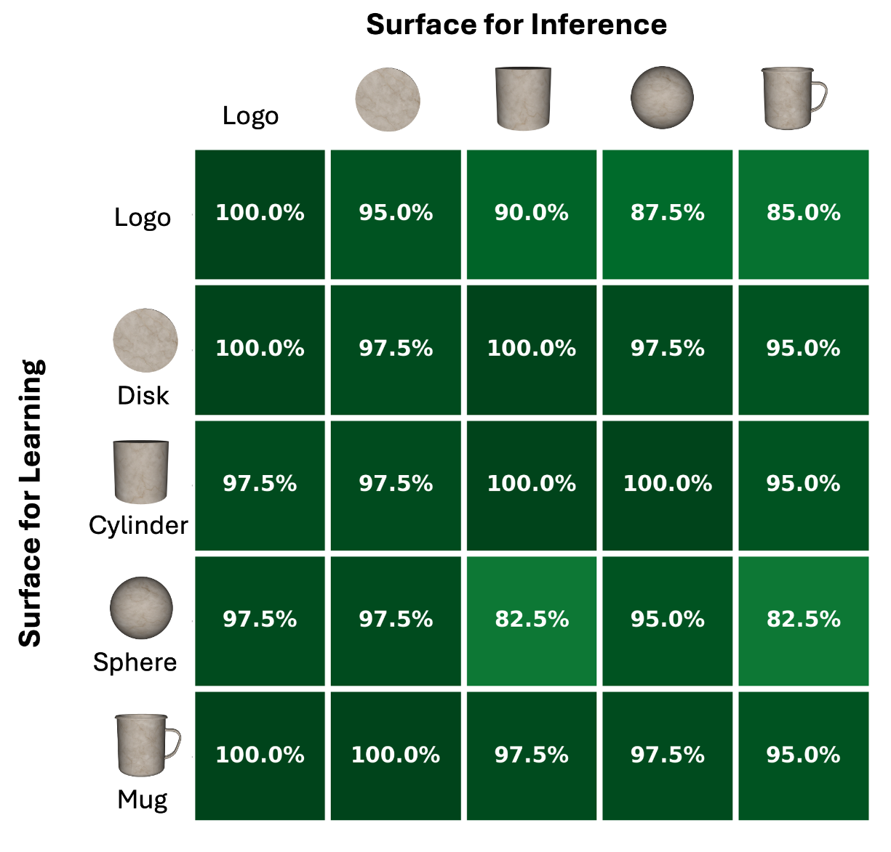

# TwoDSensorModule

`TwoDSensorModule` is a sensor module that enables learning 2D models of 2D objects that exist in a 3D world. 

The module extracts local texture edges as morphological features, providing local pose information, analogous to the surface normal and principle curvature directions in the standard `CameraSM`. In addition, it treats motion across the surface of an object as motion in a transported 2D coordinate system. This makes it possible to learn flattened edge layouts from curved surfaces while still sending `location`, `displacement`, and `pose_vectors` fields that downstream learning modules already understand.

For the detailed implementation notes, edge-detection math, movement derivation, and current experiment results, see the [TwoDSensorModule reference manual](https://www.overleaf.com/read/ppbgtdvrbvzz#e8f1c2).

## What Problem It Solves

A standard RGBD sensor module (`CameraSM`) can estimate 3D locations, surface normals, and curvature directions at the center of a patch. That is useful for modeling 3D shape, but has difficulty distinguishing information that is 2D texture printed or painted onto a surface such as our [compositionality dataset](../../overview/benchmark-experiments.md#compositional-datasets). For example, the TBP and Numenta logos on a disk or mug are defined by 2D edge layouts, even though the surface carrying the logo may be curved.

`TwoDSensorModule` addresses this by building a local 2D model of the surface texture. It still starts from RGBD observations, but it changes the interpretation of the outgoing message:

- The first two coordinates of `location` and `displacement` capture movement in a 2D plane, corresponding to movement along the surface of the object.
- The third coordinate is fixed at zero for compatibility with Monty's 3D-shaped message fields.
- When a reliable texture edge is detected, `pose_vectors` represents the local 2D edge direction rather than the original 3D curvature frame.

This keeps the representation compatible with Monty's existing learning modules while letting the learned graph describe a 2D surface layout. 

## How It Works

`TwoDSensorModule` has two main capabilities.

First, it detects a dominant texture-edge orientation in the RGB patch. The edge detector aggregates image-gradient evidence across the patch, scores whether there is a coherent edge, and rejects edges that look like depth discontinuities rather than texture on the object's surface. A detected logo edge can then become the pose feature that the learning module stores.

Second, it tracks movement in a local 2D reference frame. As the sensor moves over a curved surface, the tangent plane changes from one point to the next. `TwoDSensorModule` maintains a transported tangent frame so that the local 2D axes move smoothly across the surface. It then projects each 3D step into that frame and applies a curvature-aware correction so the accumulated displacement better approximates distance along the surface rather than a flattened chord through space.

## Recognizing Compositional Objects

In current experiments, `TwoDSensorModule` can learn 2D surface models of logo-bearing objects in the [compositionality dataset](../../overview/benchmark-experiments.md#compositional-datasets) across several supporting surfaces, as shown above.  

Surface-transfer experiments also show that models learned on one surface can generalize to the same logo object on another surface, despite distortions introduced by surface geometry. More broadly, SMs that extract lower-dimensional movement and morphological features may be key for robust generalization in settings beyond printed textures on surfaces. For example, a T-shirt could be modeled in 2D with its canonical "T" configuration, but recognized when crumpled in the 3D world by integrating small movements across the distorted surface in 2D space. Similar principles could apply to modeling an object such as a cable or string as a 1D object. The matrix below shows recognition accuracy when models are learned on each surface type and then used for inference on the same or a different supporting surface.

## Current Limitations

The current implementation has several important constraints:

- It detects one dominant texture edge per patch, so corners, repeated textures, or competing edges can produce ambiguous orientations.
- It embeds the 2D chart in a 3D-shaped message by fixing `z = 0`. 
- Curved surfaces with nonzero Gaussian curvature cannot be flattened without distortion, and the learned model depends on the exploration path for these objects. In practice, the uncorrected distortions appear minimal. 
