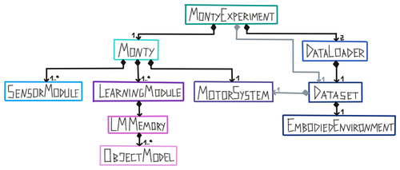

For more info on contributing custom modules, see [Ways to Contribute to Code](../contributing/ways-to-contribute-to-code.md)

Monty is designed as a modular framework where a user can easily swap out different implementations of the basic Monty components. For instance you should be able to switch out the type of learning module used without changing the sensor modules, environment, or motor system. The basic components of Monty are defined as abstract classes [`abstract_monty_classes.py`](../../src/tbp/monty/frameworks/models/abstract_monty_classes.py). To implement your own custom version of one of these classes, simply subclass from the abstract class or one of its existing subclasses. 



## Customizing a Class - Example: Learning Module

Here are step by step instructions of how to customize using the LearningModule class as an example.

Learning modules (LMs) can be loosely compared to cortical columns, and each learning module receives a subset of the input features. At each time step, each learning module performs a modeling step and a voting step. In the modeling step, LMs update in response to sensory inputs. In the voting step, each LM updates in response to the state of other LMs. Note that the operations each LM performs during the `step` and `receive votes` steps are customizable.

There is a 3-step process for creating a custom learning module. All other classes can be customized along the same lines. 

- **Define a new subclass of LearningModule (LM)** either in a local projects folder, or in `/src/tbp/monty/frameworks/models`. See the abstract class definitions in `/src/tbp/monty/frameworks/models/abstract_monty_classes.py` for the functions that every LM should implement. 
- **Define a config for your learning module**. You are encouraged but not required to define a dataclass with all the arguments to your LM like in `/src/tbp/monty/frameworks/config_utils/config_args.py`, with subclasses of that dataclass defining default arguments for different common instantiations of your LM. You are encouraged to define a dataclass config that extends the `MontyConfig` dataclass also in config_args.py, where the `learning_module_configs` is a dictionary defining a `learning_module_class` and its `learning_module_args` for each learning module.
- **Define an experiment config** in `benchmarks/configs/` (or in your own repository or in your `monty_lab` projects folder) and set `monty_config` to a config that fully specifies your model architecture, for example to the dataclass extending `MontyConfig` defined above.

You custom config could look like this:
```
my_custom_config = copy.deepcopy(base_config_10distinctobj_dist_agent)
my_custom_config.update(
    monty_config=PatchAndViewSOTAMontyConfig(
        learning_module_configs={
            learning_module_0={
                learning_module_class=YourCustomLM,
                learning_module_args=dict(
                    your_arg1=val1,
                    your_arg2=val2
                )
            }
        },
    ),
)
```

For simplicity we inherit all other default values from the `base_config_10distinctobj_dist_agent` config in `benchmarks/configs/ycb_experiments.py` and use the `monty_config` specifid in the `PatchAndViewSOTAMontyConfig` dataclass.