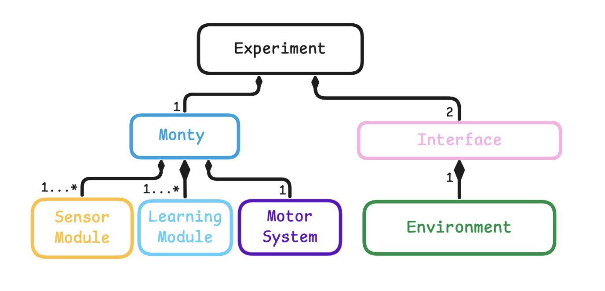

For more info on contributing custom modules, see [Ways to Contribute to Code](../contributing/ways-to-contribute-to-code.md)

Monty is designed as a modular framework where a user can easily swap out different implementations of the basic Monty components. For instance you should be able to switch out the type of learning module used without changing the sensor modules, environment, or motor system. The basic components of Monty are defined as abstract classes [`abstract_monty_classes.py`](https://github.com/thousandbrainsproject/tbp.monty/blob/main/src/tbp/monty/frameworks/models/abstract_monty_classes.py). To implement your own custom version of one of these classes, simply subclass from the abstract class or one of its existing subclasses.



## Customizing a Class - Example: Learning Module

Here are step by step instructions of how to customize a `LearningModule` class as an example.

Learning modules (LMs) can be loosely compared to cortical columns, and each learning module receives a subset of the input features. At each time step, each learning module performs a modeling step and a voting step. In the modeling step, LMs update in response to sensory inputs. In the voting step, each LM updates in response to the state of other LMs. Note that the operations each LM performs during the `step` and `receive_votes` invocations are customizable.

There is a 3-step process for creating a custom learning module. All other classes can be customized along the same lines.

- **Define a new subclass of LearningModule (LM)** either in a local projects folder, or in `/src/tbp/monty/frameworks/models`. See the abstract class definitions in `/src/tbp/monty/frameworks/models/abstract_monty_classes.py` for the functions that every LM should implement.
- **Define a config for your learning module**. You are encouraged but not required to provide default arguments to your LM. It may also be helpful to specify some common configurations for your LM in `src/tbp/monty/conf/monty/learning_module` directory for use in your experiment configurations. This is done by defining a dictionary of LM IDs and specifying `_target_` class and its arguments for each learning module.
- **Define an experiment config** in `src/tbp/monty/conf/experiment/` (or in your own repository).

You custom experiment config could look like this:
```yaml
# @package _global_

defaults:
  - /monty: evidencegraph_exp1000_emin_t3_tot2500
  - /monty/motor_system_config: distant_5
  - /monty/learning_module: my_custom_learning_module
  - /monty/sensor_module: camera_dist_delta
  - /monty/connectivity: 1lm_1sm
  - /environment: habitat_ycb_dist_agent_semantics0
  - /env_interface: eval_distinctobj_predefined
  - /env_interface/positioning_procedures_eval: getgoodview_viewfinder_patch
  - /env_interface/transform: missing_depthto3d_sensor2_semantic0
  - /logging: basic_warning_wandb_monty_runs

experiment:
  _target_: tbp.monty.frameworks.experiments.object_recognition_experiments.MontyObjectRecognitionExperiment
  config:
    show_sensor_output: false
    max_train_steps: 1000
    max_eval_steps: 500
    max_total_steps: 6000
    n_train_epochs: 3
    model_name_or_path: ${constants.pretrained_dir}/surf_agent_1lm_10distinctobj/pretrained/
    n_eval_epochs: ${constants.rotations_all_count}
    min_lms_match: 1
    seed: 42
    supervised_lm_ids: []
    python_log_level: DEBUG
    logging:
      run_name: my_experiment
```

Where, `my_custom_learning_module` would be in `src/tbp/monty/conf/monty/learning_module/my_custom_learning_module.yaml` that could look something like:
```yaml
# @package experiment.config.monty_config.learning_modules

learning_module_0:
  _target_: path.to.your.CustomLM
  your_arg1: val1
  your_arg2: val2
```

For simplicity, every other configuration parameter was copied from `base_config_10distinctobj_dist_agent` experiment configuration in `src/tbp/monty/conf/experiment/base_config_10distinctobj_dist_agent.yaml`.
