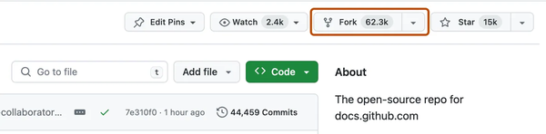
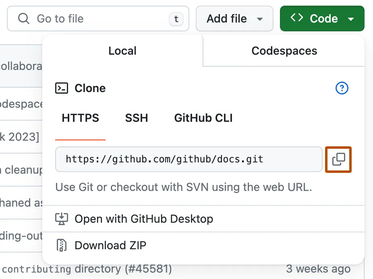
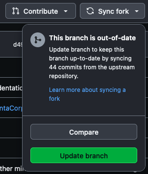
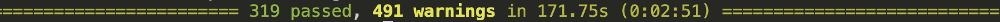

> [!NOTE]
> You can find our code at https://github.com/thousandbrainsproject/tbp.monty
>
> This is our open-source repository. We call it **Monty** after Vernon Mountcastle, who proposed cortical columns as a repeating functional unit across the neocortex.

# 1. Get the Code

It is best practice (and required if you ever want to contribute code) first to **make a fork of our repository** and then make any changes on your local fork. To do this you can simply [visit our repository](https://github.com/thousandbrainsproject/tbp.monty) and click on the fork button as shown in the picture below. For more detailed instructions see the [GitHub documentation on Forks](https://docs.github.com/en/pull-requests/collaborating-with-pull-requests/working-with-forks/fork-a-repo).




Next, you need to **clone the repository onto your device**. To do that, open the terminal, navigate to the folder where you want the code to be downloaded and run `git clone repository_path.git`. You can find the `repository_path.git` on GitHub by clicking on the `<>Code` button as shown below. For more details see the [GitHub documentation on cloning](https://docs.github.com/en/pull-requests/collaborating-with-pull-requests/working-with-forks/fork-a-repo#cloning-your-forked-repository).




> [!NOTE]
> If you want the same setup as we use at the Thousand Brains Project by default, clone the repository at `${HOME}/tbp/`. If you don't have a `tbp` folder in your home directory yet you can run `cd ~; mkdir tbp; cd tbp` to create it. It's not required to clone the code in this folder but it is the path we assume in our tutorials.

## 1.2 Make Sure Your Local Copy is Up-to-Date

If you just forked and cloned this repository, you may skip this step, but any other time you get back to this code, you will want to synchronize it to work with the latest changes.

To make sure your fork is up to date with our repository you need to click on `Sync fork` -> `Update branch` in the GitHub interface. Afterwards, you will need to **get the newest version of the code** into your local copy by running `git pull` inside this folder.




You can also update your code using the terminal by calling `git fetch upstream; git merge upstream/main` in the terminal. If you have not linked the upstream repository yet, you may first need to call `git remote add upstream upstream_repository_path.git`

# 2. Set up Your Environment

Monty requires Conda to install its dependencies. For instructions on how to install Conda (Miniconda or Anaconda) on your machine see <https://conda.io/projects/conda/en/latest/user-guide/install/index.html>.

To setup Monty, **use the conda commands below**. Make sure to `cd` into the `tbp.monty` directory before running these commands.

Note that the commands are slightly different depending on whether you are setting up the environment on an Intel or ARM64 architecture, and whether you are using the zsh shell or another shell.

You can create the environment with the following commands:

```shell Intel (zsh shell)
conda env create
conda init zsh
conda activate tbp.monty
```
```shell Intel (other shells)
conda env create
conda init
conda activate tbp.monty
```
```shell ARM64 (Apple Silicon) (zsh shell)
conda env create -f environment_arm64.yml --subdir=osx-64
conda init zsh
conda activate tbp.monty
conda config --env --set subdir osx-64
```
```shell ARM64 (Apple Silicon) (other shells)
conda env create -f environment_arm64.yml --subdir=osx-64
conda init
conda activate tbp.monty
conda config --env --set subdir osx-64
```

> [!NOTE]
> By default, Conda will activate the base environment when you open a new terminal. If you do not want Conda to change your global shell when you open a new terminal, run:
> ```shell
> conda config --set auto_activate_base false
> ```

# 3. Run the Code 🎉

The best way to see whether everything works is to **run the unit tests** using this command:

```shell
pytest
```

Running the tests might take a little while (depending on what hardware you are running on), but in the end, you should see something like this:




Note that by the time you read that, there may be more or less unit tests in the code base, so the exact numbers you see will not match with this screenshot. The important thing is that all tests either pass or are skipped and **none of the tests fail**.

# 4. Run an Experiment

In your usual interaction with this code base, you will most likely run experiments, not just unit tests. You can find experiment configs in the `benchmarks/configs/` folder.

## 4.1 Download the YCB Dataset

A lot of our current experiments are based on the [YCB dataset](https://www.ycbbenchmarks.com/) which is a dataset of 77 3D objects that we render in habitat. To download the dataset, run `python -m habitat_sim.utils.datasets_download --uids ycb --data-path ~/tbp/data/habitat`.

## 4.2 Download Pretrained Models

| Models | Archive Format | Download Link |
| --- | --- | --- |
| pretrained_ycb_v9 | tgz |  [pretrained_ycb_v9.tgz](https://tbp-pretrained-models-public-c9c24aef2e49b897.s3.us-east-2.amazonaws.com/tbp.monty/pretrained_ycb_v9.tgz) |
| pretrained_ycb_v9 | zip |  [pretrained_ycb_v9.zip](https://tbp-pretrained-models-public-c9c24aef2e49b897.s3.us-east-2.amazonaws.com/tbp.monty/pretrained_ycb_v9.zip) |

Unpack the archive in the `~/tbp/results/monty/pretrained_models/` folder. For example:

```plaintext tgz
mkdir -p ~/tbp/results/monty/pretrained_models/

cd ~/tbp/results/monty/pretrained_models/

curl -L https://tbp-pretrained-models-public-c9c24aef2e49b897.s3.us-east-2.amazonaws.com/tbp.monty/pretrained_ycb_v9.tgz | tar -xzf -
```
```plaintext zip
mkdir -p ~/tbp/results/monty/pretrained_models/

cd ~/tbp/results/monty/pretrained_models/

curl -O https://tbp-pretrained-models-public-c9c24aef2e49b897.s3.us-east-2.amazonaws.com/tbp.monty/pretrained_ycb_v9.zip

unzip pretrained_ycb_v9.zip
```


The folder should then have the following structure:

```
~/tbp/results/monty/pretrained_models/
|-- pretrained_ycb_v9/
|   |-- supervised_pre_training_5lms
|   |-- supervised_pre_training_5lms_all_objects
|   |-- ...
```

> [!NOTE]
> To unpack an archive you should be able to double click on it.
>
> To unpack via the command line, copy the archive into the `~/tbp/results/monty/pretrained_models/` folder and inside that folder run:
> - for a `tgz` archive, `tar -xzf pretrained_ycb_v9.tgz`.
> - for a `zip` archive, `unzip pretrained_ycb_v9.zip`.

## [Optional] Set Environment Variables

### MONTY_MODELS

If you did not save the pre-trained models in the `~/tbp/results/monty/pretrained_models/` folder, you will need to set the **MONTY_MODELS** environment variable.

```shell
export MONTY_MODELS=/path/to/your/pretrained/models/dir
```

This path should point to the `pretrained_models` folder that contains the`pretrained_ycb_v9`folders.

### MONTY_LOGS

If you would like to log your experiment results in a different folder than the default path (`~/tbp/results/monty/`) you need to set the **MONTY_LOGS** environment variable.

```shell
export MONTY_LOGS=/path/to/log/folder
```

### WANDB_DIR

We recommend not saving the wandb logs in the repository itself (default save location). If you have already set the MONTY_LOGS variable, you can set the directory like this:

```shell
export WANDB_DIR=${MONTY_LOGS}/wandb
```

## 4.3 Run the Experiment

Now you can finally run an experiment! To do this, simply use this command:

```shell
python benchmarks/run.py -e my_experiment
```

Replace `my_experiment` with the name of one of the experiment configs in `benchmarks/configs/`. For example, a good one to start with could be `randrot_noise_10distinctobj_surf_agent`.

If you want to run an experiment with parallel processing to make use of multiple CPUs, simply use the `run_parallel.py` script instead of the `run.py` script like this:

```shell
python benchmarks/run_parallel.py -e my_experiment
```