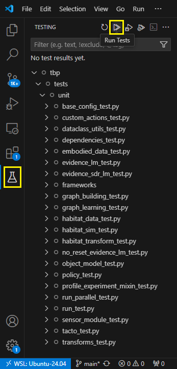
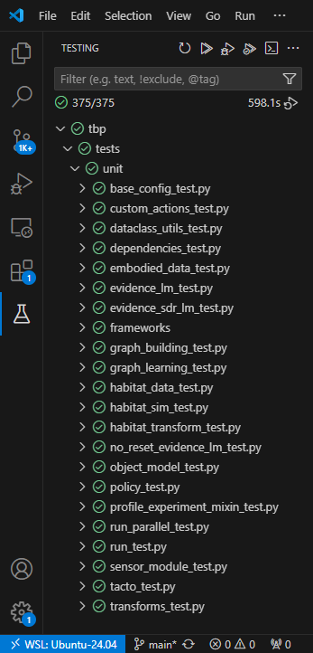
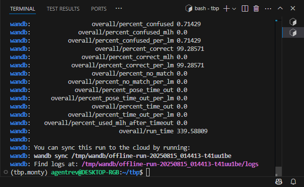

> [!NOTE]
> This guide is based off the main [Getting Started](../getting-started.md) guide for macOS and Linux, which you may refer to as needed.

> [!WARNING]
> While the repository contains a `uv.lock` file, this is currently experimental and not supported. In the future this will change, but for now, avoid trying to use `uv` with this project.


# 1. Install WSL and Ubuntu

Follow the Microsoft guide to install Windows Subsystem for Linux: https://learn.microsoft.com/en-us/windows/wsl/install-manual

It is important that you complete every step of their guide, otherwise you may encounter issues during the next steps below.

A fresh Linux installation is recommended for Monty. If desired, you may attempt to re-use an existing Linux installation, but be aware you might run into GPU-related errors if default libraries and settings were significantly altered.

Regarding the Linux distribution, [Ubuntu 24.04 LTS](https://apps.microsoft.com/detail/9nz3klhxdjp5) is recommended. Once installed, its filesystem can directly be accessed via the "Linux" section in the Windows File Explorer, which should normally point to `\\wsl.localhost\Ubuntu-24.04\` or `\\wsl$\Ubuntu-24.04\` 

> [!NOTE]
> If you plan on using Git for Windows on the WSL filesystem, Git might return an error saying `unsafe repository (\\wsl... is owned by someone else)` since it's a network share, which you can bypass by entering this command on Windows in PowerShell or CMD or Git Bash:
> ```shell
> git config --global --add safe.directory "*"
> ```


# 2. Install Miniconda

Monty requires [Conda](https://conda.io/projects/conda/en/latest/user-guide/install/index.html) to install its dependencies. For WSL, [Miniconda](https://www.anaconda.com/docs/getting-started/miniconda/main) is recommended.
To download and install Miniconda, follow this guide using the Ubuntu terminal: https://www.anaconda.com/docs/getting-started/miniconda/install#linux-2


# 3. Get the Code

It is best practice (and required if you ever want to contribute code) first to **make a fork of our repository** and then make any changes on your local fork. To do this you can simply [visit our repository](https://github.com/thousandbrainsproject/tbp.monty) and click on the fork button as shown in the picture below. For more detailed instructions see the [GitHub documentation on Forks](https://docs.github.com/en/pull-requests/collaborating-with-pull-requests/working-with-forks/fork-a-repo).


Next, you need to **clone the repository onto the system**. To do that, enter the following command in the Ubuntu terminal, adjusting `YOUR_GITHUB_USERNAME` accordingly:

```shell
git clone https://github.com/YOUR_GITHUB_USERNAME/tbp.monty ~/tbp
```

For more details see the [GitHub documentation on cloning](https://docs.github.com/en/pull-requests/collaborating-with-pull-requests/working-with-forks/fork-a-repo#cloning-your-forked-repository).

## 3.1 Make Sure Your Local Copy is Up-to-Date

If you just forked and cloned this repository, you may skip this step, but any other time you get back to this code, you will want to synchronize it to work with the latest changes.

To make sure your fork is up to date with our repository you need to click on `Sync fork` -> `Update branch` in the GitHub interface. Afterwards, you will need to **get the newest version of the code** into your local copy by running `git pull` inside this folder.


You can also update your code using the terminal by calling `git fetch upstream; git merge upstream/main`. If you have not linked the upstream repository yet, you may first need to call:

```shell
git -C ~/tbp remote add upstream https://github.com/thousandbrainsproject/tbp.monty.git
```


# 4. Set up Your Environment

Next, set up the conda environment for Monty. In the Ubuntu terminal, enter this:

```shell
cd ~/tbp
conda tos accept && conda env create && conda init && \
conda activate tbp.monty
```

This might take a few minutes or more to run, depending on your download speed.

> [!WARNING]
> Avoid manually installing or updating Habitat-Sim. `conda env create` will automatically install the required version.

> [!NOTE]
> By default, Conda will activate the base environment when you open a new terminal. If you'd prefer to have the Monty environment active by default, enter this:
> 
> ```shell
> conda config --set default_activation_env tbp.monty
> ```
> 
> Also, if you want the `~/tbp` folder active by default when opening the Ubuntu terminal, enter this:
> 
> ```shell
> echo '[ "$PWD" = "$HOME" ] && cd tbp' >> ~/.bashrc
> ```

Then, install libopengl0 to allow running Habitat-Sim:

```shell
sudo apt -y install libopengl0
```

> [!WARNING]
> Don’t install Linux GPU drivers in WSL, you don’t need them, NVIDIA even [warns against](https://docs.nvidia.com/cuda/wsl-user-guide/index.html#step-1-install-nvidia-driver-for-gpu-support) installing them.


# 5. Download Monty datasets

A lot of our current experiments are based on the [YCB dataset](../getting-started.md#41-download-the-ycb-dataset) which is a dataset of 77 3D objects that we render in habitat. To download the dataset, enter this:

```
python -m habitat_sim.utils.datasets_download --uids ycb --data-path ~/tbp/data/habitat
```

You can also get the [Pretrained Models](../getting-started.md#42-download-pretrained-models) for [inference](../tutorials/running-inference-with-a-pretrained-model.md) testing:

```shell
mkdir -p ~/tbp/results/monty/pretrained_models/ && cd "$_"
curl -L https://tbp-pretrained-models-public-c9c24aef2e49b897.s3.us-east-2.amazonaws.com/tbp.monty/pretrained_ycb_v11.tgz | tar -xzf -
```

Optionally, you can get the [Monty-Meets-World datasets](../../overview/benchmark-experiments.md#monty-meets-world) for [real-world testing](../../community/project-showcase.md#monty-for-object-detection-with-the-ipad-camera):

```shell
mkdir -p ~/tbp/data/ && cd "$_"
curl -L https://tbp-data-public-5e789bd48e75350c.s3.us-east-2.amazonaws.com/tbp.monty/numenta_lab.tgz | tar -xzf -
curl -L https://tbp-data-public-5e789bd48e75350c.s3.us-east-2.amazonaws.com/tbp.monty/worldimages.tgz | tar -xzf -
```

and the [Omniglot](../tutorials/using-monty-in-a-custom-application.md#example-1-omniglot) dataset:

```shell
sudo apt -y install unzip
mkdir -p ~/tbp/data/ && cd "$_"
git clone https://github.com/brendenlake/omniglot.git && cd omniglot/python
unzip images_background.zip && unzip strokes_background.zip
```


## 5.1. [Optional] Set Environment Variables

### MONTY_MODELS

If you did not save the pre-trained models in the `~/tbp/results/monty/pretrained_models/` folder, you will need to set the **MONTY_MODELS** environment variable.

```shell
export MONTY_MODELS=/path/to/your/pretrained/models/dir
```

This path should point to the `pretrained_models` folder that contains the `pretrained_ycb_v11` folders.

### MONTY_DATA

If you did not save the data (e.g., YCB objects) in the `~/tbp/data` folder, you will need to set the **MONTY_DATA** environment variable.

```shell
export MONTY_DATA=/path/to/your/data
```

This path should point to the `data` folder, which contains data used for your experiments. Examples of data stored in this folder are the `habitat` folder containing YCB objects, the `worldimages` folder containing camera images for the 'Monty Meets Worlds' experiments, and the `omniglot' folder containing the Omniglot dataset.

### MONTY_LOGS

If you would like to log your experiment results in a different folder than the default path (`~/tbp/results/monty/`) you need to set the **MONTY_LOGS** environment variable.

```shell
export MONTY_LOGS=/path/to/log/folder
```

### WANDB_DIR

We recommend not saving the wandb logs in the repository itself (default save location). If you have already set the MONTY_LOGS variable, you can set the directory like this:

```shell
export WANDB_DIR=${MONTY_LOGS}/wandb
```


# 6. Prepare VS Code

Install VS Code for Windows: https://code.visualstudio.com/download

Install the WSL extension: https://marketplace.visualstudio.com/items?itemName=ms-vscode-remote.remote-wsl

Install the Python extension: https://marketplace.visualstudio.com/items?itemName=ms-python.python

Install the Ruff extension: https://marketplace.visualstudio.com/items?itemName=charliermarsh.ruff

From Ubuntu, initialize the settings file for the repo:

```shell
mkdir -p ~/tbp/.vscode/ && echo '{ "python.defaultInterpreterPath": "~/miniconda3/envs/tbp.monty/bin/python", "python.testing.pytestEnabled": true, "python.testing.pytestArgs": ["tests"] }' > ~/tbp/.vscode/settings.json
```

Still from Ubuntu, enter this to launch VS Code with Monty:

```shell
cd ~/tbp && code .
```

The `code .` command launches both VS Code for Windows and the Linux VS Code Server directly into the current directory of WSL.


# 7. Run unit tests and a benchmark

If you followed all the previous steps, normally you should have VS Code open on the Monty project, ready to go. Try running the unit tests:



This will take some time, about 10 minutes on an 8-core i7-11700K for example:



Finally, let’s run a benchmark. You can do this in either the Ubuntu terminal or directly in the VS Code terminal. In the VS Code top menu, select Terminal > Open Terminal, then enter:

```shell
python run.py experiment=base_config_10distinctobj_dist_agent
```

In this case, it took a little over 5 minutes:




# 8. What Next?
A good next step to get more familiar with our approach and the Monty code base is to go through our [tutorials](../tutorials.md). They include follow-along code and detailed explanations on how Monty experiments are structured, how Monty can be configured in different ways, and what happens when you run a Monty experiment.

If you would like to contribute to the project, you can have a look at the many potential [ways to contribute](../../contributing/contributing.md), particularly [ways to contribute code](../../contributing/ways-to-contribute-to-code.md).

You can also have a look at the [capabilities of Monty](../../overview/vision-of-the-thousand-brains-project/capabilities-of-the-system.md) and our [project roadmap](../../future-work/project-roadmap.md) to get an idea of what Monty is currently capable of and what features our team is actively working on.

If you run into any issues or questions, please head over to our [Discourse forum](https://thousandbrains.discourse.group/) or [open an Issue](../../contributing/contributing.md#report-an-issue). We are always happy to help!
