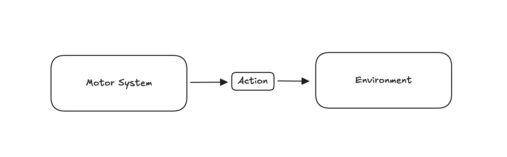
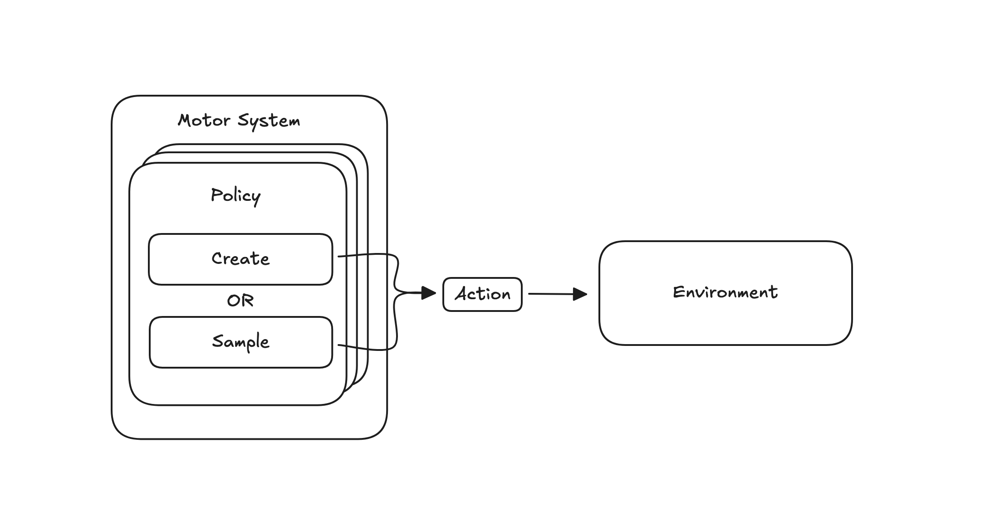
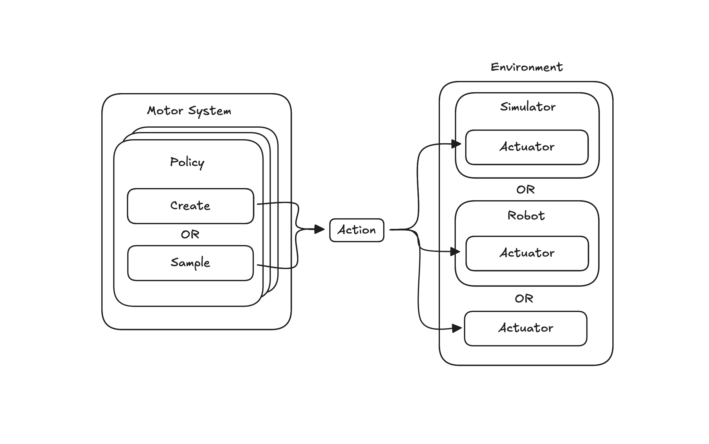
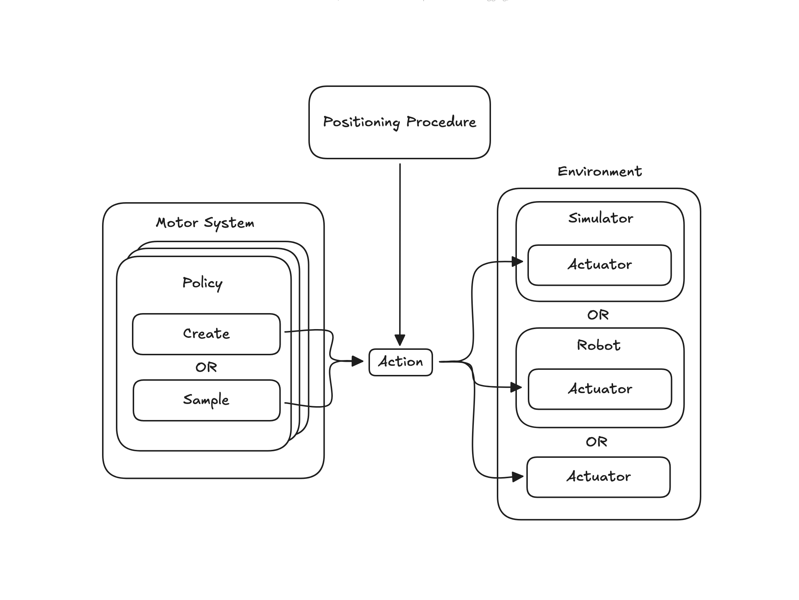

# What Are Actions?

**Actions** are how Monty moves **Agents** in its **Environment**. Monty's **Motor System** outputs **Actions**, which are then actuated within the **Environment**. An **Agent** is what Monty calls its end effectors, which carry out actions in the environment, physically or in simulation (like a robotic arm or a camera), or virtually (like a web browser navigating the Internet).

**Actions** are coupled to what can be actuated in the **Environment**. For example, if a simple robot can only go forward and backward, then the meaningful actions for that robot are restricted to going forward and backward. The robot environment would be unable to actuate a `Jump` action.

With that in mind, before creating a new **Action**, consider what can be actuated in the **Environment**.

# Action Lifecycle

At a high level, **Actions** are created by the **Motor System** and actuated by the **Environment**.



Within the **Motor System**, **Policies** either explicitly choose specific **Actions** by creating them directly (e.g., create `MoveForward`), or sample random **Actions** from a pool of actions available (e.g., sample `MoveForward` from the action space `{MoveForward, MoveBack}`).



Within the **Environment**, the **Actions** are actuated either within a simulator, by a robot, or directly.



Additionally, within an experimental framework, a **Positioning Procedure** can generate **Actions** before starting the experiment. This is analogous to an experimenter moving Monty into a starting position. The **Positioning Procedure** can use privileged information such as labels, ground truth object models, or task instructions, and is independent of Monty and the models learned in its learning modules.



# Creating Actions

Once you have a new **Action** in mind, to create it, you'll need to explicitly implement the **Action** protocol:

```python
class Jump(Action):

    def __init__(self, agent_id: str, how_high: float) -> None:
        super().__init__(agent_id=agent_id)
        self.how_high = how_high
```

If at any point this action will be read from a file, then be sure to update the `ActionJSONDecoder` as well:

```python
class ActionJSONDecoder(JSONDecoder):

    # ...

    def object_hook(self, obj: dict[str, Any]) -> Any:
        # ...
        elif action == Jump.action_name():
            return Jump(
                agent_id=obj["agent_id"]
                how_high=obj["how_high"]
            )
        # ...
```

With the above in place, the **Motor System** can now create the **Action** as needed.

# Sampling Actions

Action samplers can be used to randomly sample actions from a predefined action space. You can use different samplers to implement different sampling strategies. For example, one sampler could always return the same action. Another sampler could return predetermined sequence of actions. Another sampler could randomly pick an action. Additionally, samplers can parameterize the actions differently. One sampler could configure all movement actions with the same distance to move. Another sampler could randomly sample the specific distance to move. For examples of samplers currently used by Monty, see `src/tbp/monty/frameworks/actions/action_samplers.py`.

For the **Motor System** to be able to sample the **Action** with the help of a sampler, you will need to include a `sample` method and declare an action-specific sampler protocol:

```python
class JumpActionSampler(Protocol):
    def sample_jump(self, agent_id: str) -> Jump: ...

class Jump(Action):

    @staticmethod
    def sample(agent_id: str, sampler: JumpActionSampler) -> Jump:
        return sampler.sample_jump(agent_id)

    def __init__(self, agent_id: str, how_high: float) -> None:
        super().__init__(agent_id=agent_id)
        self.how_high = how_high
```

This prepares the **Action** to be used in a sampler.

The sampler itself will subclass `ActionSampler` and implement the requisite protocol:

```python
class MyConstantSampler(ActionSampler):

    def __init__(
        self,
        actions: list[type[Action]] | None = None,
        height: float = 1.8,
        rng: Generator | None = None
    ) -> None:
        super().__init__(actions=actions, rng=rng)
        self.height = 1.8

    def sample_jump(self, agent_id: str) -> Jump:
        return Jump(agent_id=agent_id, how_high=self.height)
```

The sampler then will be used along the lines of:

```python
sampler = MyConstantSampler(actions=[Jump])
action = sampler.sample("agent_0")
```

# Actuating Actions

For an **Action** to take effect within an **Environment**, it needs to be actuated. Include the `act` method and declare an action-specific actuator protocol:

```python
class JumpActuator(Protocol):
    def actuate_jump(self, action: Jump) -> None: ...

class Jump(Action):

    def __init__(self, agent_id: str, how_high: float) -> None:
        super().__init__(agent_id=agent_id)
        self.how_high = how_high

    def act(self, actuator: JumpActuator) -> None:
        actuator.actuate_jump(self)
```

The actuator itself will be specific to the **Environment** and the simulator, robot, or otherwise. However, in general, it will implement the actuator protocol:

```python
class MyActuator:

    def actuate_jump(self, action: Jump) -> None:
        # custom code to make Jump happen in your system
        pass
```

The **Environment**, simulator, or robot will invoke the actuator by calling the **Action**'s `act` method:

```python
SomeSimulatorAction = Union[Jump, Tumble] # Actions the simulator can actuate

class SomeSimulator:

    def step(self, actions: Sequence[SomeSimulatorAction]) -> Observations
        # ...
        for action in actions:
            action.act(self.actuator)
        # ...
```

You could implement the actuator as a Mixin, in that case it would look more like:

```python
class SomeSimulator(MyActuator):

    def step(self, actions: Sequence[SomeSimulatorAction]) -> Observations
        # ...
        for action in actions:
            action.act(self)
        # ...
```

For an example of an actuator, see `src/tbp/monty/simulators/habitat/simulator.py`
