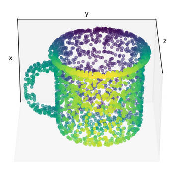
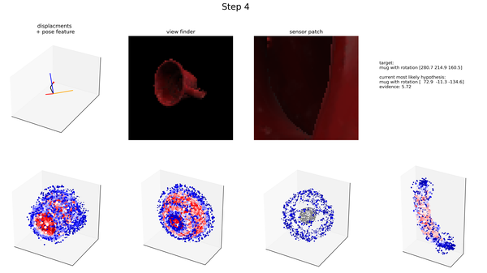
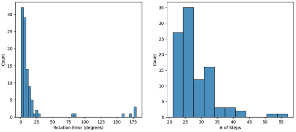
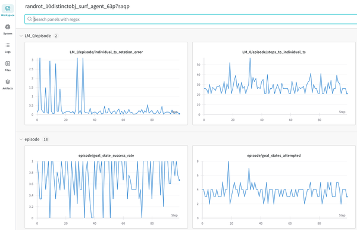
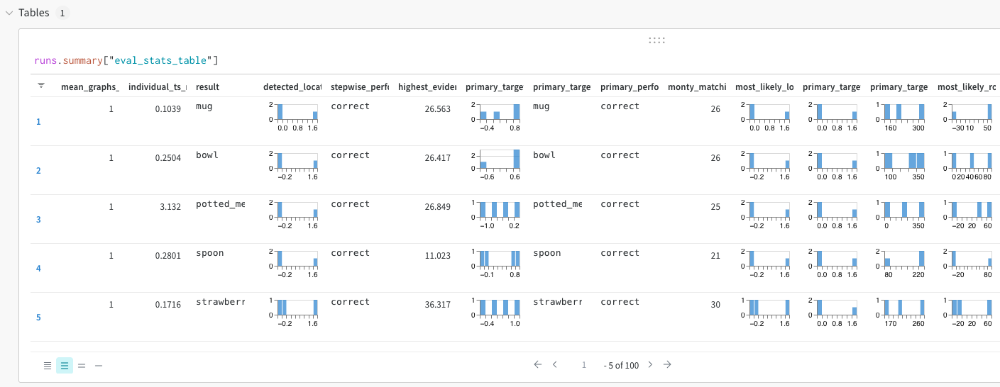
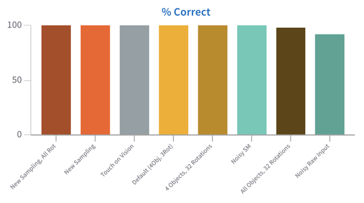

# Monty Loggers

To manage the logging for an experiment you can specify the handlers that should be used in the `logging_config`. The logging config has two fields for handlers. One for `monty_handlers` and one for `wandb_handlers`. The latter will start a wandb session if it does not contain an empty list. The former can contain all other non-wandb handlers.

## List of all Logging Handlers

| Class Name                        | Description                                                                                                                                                 |
| --------------------------------- | ----------------------------------------------------------------------------------------------------------------------------------------------------------- |
| **MontyHandler**                  | Abstract handler class.                                                                                                                                     |
| **DetailedJSONHandler**           | Logs detailed information about every step in a .json file. This is for detailed analysis and visualization. For longer experiments, it is not recommended. |
| **BasicCSVStatsHandler**          | Log a .csv file with one row per episode that contains the results and performance of this episode.                                                         |
| **ReproduceEpisodeHandler**       | Logs action sequence and target such that an episode can be exactly reproduced.                                                                             |
| **BasicWandbTableStatsHandler**   | Logs a table similar to the .csv table to wandb.                                                                                                            |
| **BasicWandbChartStatsHandler**   | Logs episode stats to wandb charts. When running in parallel this is done at the end of a run. Otherwise one can follow the run stats live on wanbd.        |
| **DetailedWandbHandler**          | Logs animations of raw observations to wandb.                                                                                                               |
| **DetailedWandbMarkedObsHandler** | Same as previous but marks the view-finder observation with a square indicating where the patch is.                                                         |

## Logging to Wandb

When logging to wanbd we recommend to run`export WANDB_DIR=~/tbp/results/monty/wandb`so the wandb logs are not stored in the repository folder.

The first time you run experiments that log to wandb you will need to set your WANDB_API key using `export WANDB_API_KEY=your_key`

# Analysis

## Analyzing Data from monty_handlers

The [`plot_utils.py`](../../src/tbp/monty/frameworks/utils/plot_utils.py) contains utils for plotting the logged data. The [`logging_utils.py`](../../src/tbp/monty/frameworks/utils/logging_utils.py) file contains some useful utils for loading logs and printing some summary statistics on them.

> [!NOTE]
> Install `analysis` optional dependencies to use `plot_utils.py`
>
> ```
> pip install -e .'[analysis]'
> ```

There are many ways of visualizing the logged data. Below are just some commonly use functions as examples but to get a full picture it is best to have a look at the functions in `logging_utils.py` and `plot_utils.py`.

### Loading Logged Data

The easiest way to load logged data is using the `load_stats` function. This function is useful if you use the `DetailedJSONHandler` or the `BasicCSVStatsHandler` or simply want to load learned models. You can use the function parameters to load only some of the stats selectively. For example, set `load_detailed` to `False` if you didn't collect detailed stats in a JSON file or set `load_train` to `False` if you only ran validation.

> 👍 You can Follow Along with this Code
>
> If you ran the `randrot_10distinctobj_surf_agent` benchmark experiment as described in the [Running Benchmarks](running-benchmarks.md) guide, you should be able to run the code below.

```python
import os
from tbp.monty.frameworks.utils.logging_utils import load_stats

pretrain_path = os.path.expanduser("~/tbp/results/monty/pretrained_models/")
pretrained_dict = pretrain_path + "pretrained_ycb_v8/surf_agent_1lm_10distinctobj/pretrained/"

log_path = os.path.expanduser("~/tbp/results/monty/projects/evidence_eval_runs/logs/")
exp_name = "randrot_10distinctobj_surf_agent"
exp_path = log_path + exp_name

train_stats, eval_stats, detailed_stats, lm_models = load_stats(exp_path,
                                                                load_train=False, # doesn't load train csv
                                                                load_eval=True, # loads eval_stats.csv
                                                                load_detailed=False, # doesn't load .json
                                                                load_models=True, # loads .pt models
                                                                pretrained_dict=pretrained_dict,
                                                               )
```

Alternatively, you can of course always just load the stats files (logged at `output_dir` specified in the experiment config) using `pd.read_csv`, `json.load`, `torch.load`, or any other library loading function you prefer using.

> 📘 JSON Logs can get Large Fast
>
> The detailed JSON logs save very detailed information for every step and episode. This includes for example the pixel observations at every step. The .json files can therefore get large very quickly. You should use the `DetailedJSONHandler` with care and only if needed. Remember to adjust the number of epochs and episodes to be as small as possible.
>
> If you need to load a larger JSON file, it makes sense to load it with the `deserialize_json_chunks` function. This way you can load one episode at a time, process its data, clear memory, and then load the next episode.

### Calculating Summary Statistics

We have a couple of useful utils to calculate and print summary statistics from the logged .csv files in `logging_utils.py`. Below are a few examples of how to use them after loading the data as shown above.

```python Evaluation
from tbp.monty.frameworks.utils.logging_utils import print_overall_stats

print_overall_stats(eval_stats)
```
```python Learning Unsupervised
from tbp.monty.frameworks.utils.logging_utils import print_unsupervised_stats

print_unsupervised_stats(train_stats, epoch_len=10)
```

> 👍 If you are Following Along you Should see Something like This:
>
> `Detected 100.0% correctly
> overall run time: 104.03 seconds (1.73 minutes), 1.04 seconds per episode, 0.04 seconds per step.`

### Plotting Object Graphs

When loading the `lm_models` (either using the `load_stats` function or `torch.load`) you get a dictionary of object graphs. Object graphs are represented as `torch_geometric.data` class instances with properties `x, pos, norm, feature_mapping` where `x` stores the features at each point in the graph, `pos` the locations, `norm` the point normal and `feature_mapping` is a dictionary that encodes which indices in `x` correspond to which features.

There are a range of graph plotting utils in the `plot_utils.py` file. Additionally, you can find some more examples of how to plot graphs and how to use the functions in `GraphVisualizations.ipynb`, `EvidenceLM.ipynb`, and `MultiLMViz.ipynb` in the monty_lab repository (TODO OSS: Add link). Below is just one illustrative example of how you can quickly plot an object graph after loading it as shown above.

```python Pretrained Models
import matplotlib.pyplot as plt
from tbp.monty.frameworks.utils.plot_utils import plot_graph

# Visualize the object called 'mug' from the pretrained graphs loaded above from pretrained_dict
plot_graph(lm_models['pretrained'][0]['mug']['patch'], rotation=120)
plt.show()
```
```python Learning from Scratch Data
from tbp.monty.frameworks.utils.plot_utils import plot_graph

# Visualize how the graph for the first object learned (new_object0) looks in epoch 3 in LM_0
plot_graph(lm_models['3']['LM_0']['new_object0']['patch'])
plt.show()
```




> 📘 Plotting in 3D
>
> Most plots shown here use the 3D projection feature of matplotlib. The plots can be viewed interactively by dragging the mouse over them to zoom and rotate. When you want to save figures with 3D plots programatically, it can be useful to set the `rotation` parameter in the `plot_graph` function such that the POV provides a good view of the 3D structure of the object.

### Plotting Matching Animations

Since Monty is a sensorimotor framework, everything happens as a timeseries of sensing and acting. Therefor, many aspects of the experiment are better visualized as an animation that can show how hypotheses evolve over time. We have a couple of functions to create animations in the `plot_utils.py` file. Below is one example how this could be applied to data loaded with the code above.

> 📘 To Follow Along Here You Need to Use the Detailed Logger
>
> Detailed JSON stats are not logged by default since they can get large quickly. To be able to run the following analysis, you need to update the experiment config with this line:
>
> `logging_config=DetailedEvidenceLMLoggingConfig(),`
>
> Remember that you will also need to import `DetailedEvidenceLMLoggingConfig` at the top of the file.
>
> It is also recommended to not log too many episodes with the detailed logger so to keep the file size small, we recommend to also update the number of objects tested and number of epochs like this:
>
> ```python
> # Changes to make to the randrot_10distinctobj_surf_agent config to follow along:
> experiment_args=EvalExperimentArgs(
>     model_name_or_path=model_path_10distinctobj,
>     n_eval_epochs=1, # <--- Setting n_eval_epochs to 1
>     max_total_steps=5000,
> ),
> logging_config=DetailedEvidenceLMLoggingConfig(), # <--- Setting the detailed logger
> eval_dataloader_args=EnvironmentDataloaderPerObjectArgs(
>     object_names=get_object_names_by_idx(
>         0, 1, object_list=DISTINCT_OBJECTS # <--- Only testing one object
>     ),
>     object_init_sampler=RandomRotationObjectInitializer(),
> ),
> ```

> 🚧 TODO: Add code for some of the animate functions
>
> Most of them are for the old LMs so probably won't make sense to show them here. Maybe we should even remove them from the code.
>
> There are some animation functions for policy visualizations. @Niels do you think it makes sense to demo them here?

Data generated from an experiment using the EvidenceLM (currently the default setup) is best plotted using a loop, as shown below.

```python
from tbp.monty.frameworks.utils.plot_utils import (show_initial_hypotheses,
                                                         plot_evidence_at_step)

episode = 0
lm = 'LM_0'
objects = ['mug','bowl','dice','banana'] # Up to 4 objects to visualize evidence for
current_evidence_update_threshold = -1
save_fig = True
save_path = exp_path + '/stepwise_examples/'

# [optional] Show initial hypotheses for each point on the object
show_initial_hypotheses(detailed_stats, episode, 'mug', rotation=[120,-90], axis=2,
                        save_fig=save_fig, save_path=save_path)
# Plot the evidence for each hypothesis on each of the objects & show the observations used for updating
for step in range(eval_stats['monty_matching_steps'][episode]):
    plot_evidence_at_step(detailed_stats,
                          lm_models,
                              episode,
                              step,
                              objects,
                              is_surface_sensor=True, # set this to False if not using the surface agent
                              save_fig=save_fig,
                              save_path=save_path)
```

The above code should create an image like the one shown below for each step in the experiment and save it in a folder called `stepwise_examples` inside the logs folder of this experiment.




### Plotting Results (CSV)

Since the episode statistics are saved in a .csv table, you can also do all the standard plot visualizations of this data (such as bar plots of # episodes correct, # of steps per episode, ...). For example you could create the plot below using this code:

```python
import numpy as np
import seaborn as sns # For this you will have to install seaborn
import matplotlib.pyplot as plt

rot_errs = np.array(eval_stats[eval_stats["primary_performance"]=="correct"]["rotation_error"])
rot_errs = rot_errs * 180 / np.pi

plt.figure(figsize=(12,5))
plt.subplot(1,2,1)
sns.histplot(rot_errs)
plt.xlabel("Rotation Error (degrees)")
plt.subplot(1,2,2)
sns.histplot(eval_stats, x="num_steps")
plt.xlabel("# of Steps")
plt.show()
```




Obviously, there are tons of options for visualizing the logged data. The code and images above are just some examples to provide inspiration.

## Analyzing Data from wandb_handlers

When logging into Wandb, you can track your experiment results at <https://wandb.ai/home> . When you navigate to your project (by default called "Monty") you should see all your experiments in the Wandb dashboard. If you click on one of the runs, you should see something like this:




If you are using the `BasicWandbTableStatsHandler`, you will also see a table like this:




You can then create all kinds of plots from this data. A convenient way of doing this is using wandb reports but you can also create custom plots within the dashboard or download the data and plot it with any software of your choice.


