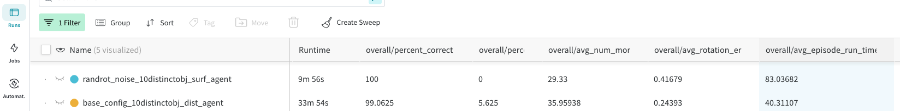

**Whenever you change something in the code's functionality, you need to run the benchmark experiments** to ensure it doesn't impede performance. Also, if you implement an alternative approach, the benchmark experiments can be a good way to compare it to our current best implementation.

The benchmark test suite is designed to evaluate the performance of Monty in different scenarios. These include rotated and translated objects, noisy observations, similar objects, different action spaces, multiple LMs, multiple objects, real-world data, and continual unsupervised learning.

For more details on the current benchmark experiments, see [this page.](../overview/benchmark-experiments.md)

**When merging a change that impacts the performance on the benchmark experiments, you need to update the table in our documentation [here](../overview/benchmark-experiments.md).**

# How to run a Benchmark Experiment

To run a benchmark experiment, simply call

```shell
python /benchmarks/run.py -e run_name
```

and replace `run_name` with the name of the benchmark experiment. All benchmark experiment configs are in the `benchmarks/configs/` folder. So for example, for running the quickest benchmark experiment you would call

```shell
python benchmarks/run.py -e randrot_10distinctobj_surf_agent
```

> 👍 Go Ahead and Run the Command Above!
> 
> If you run the `randrot_10distinctobj_surf_agent` experiment using the command above, you will be able to follow along with all the following data analysis guides since we use this as an example.
> 
> This should take about 1.5 minutes on an M3 MacBook or 5 minutes distributed on 16 CPU cores. 


# How to Report the Benchmark Performance

> 🚧 TODO: Figure out a way to have timings comparable
> 
> Currently we run all benchmark experiments on our cloud infrastructure, using 16 CPUs. However, external people will not have access to this and their hardware may give very different runtimes. How do we deal with this?

# How to Report Benchmark Performance

## Where to Find the Results

If you are using a wandb logger (used by default in the benchmark experiment configs), you can view the experiment results in the wandb dashboard. If you go into the "Runs" tab (selected on the left), you should see the summary statistics in the columns starting with "overall/".




If you are not using wandb, you can also calculate the statistics from the saved .csv file.

```python
from tbp.monty.frameworks.utils.logging_utils import (load_stats,
                                                        print_overall_stats,
                                                        print_unsupervised_stats)
_, eval_stats, _, _ = load_stats(log_path + 'run_name', 
                                 load_train=False, 
                                 load_eval=True,
                                 load_models=False, 
                                 load_detailed=False)

print_overall_stats(eval_stats)
# for the learning from scratch experiments, load the training csv instead and call
print_unsupervised_stats(train_stats, epoch_len=10) # 10 is the number of objects shown in an epoch

```

## Where to Report the Results

If your code affected any of the benchmark results you should update the benchmark results table [here](../overview/benchmark-experiments.md) in the same PR. See our guide on [contributing to documentation](../contributing/documentation.md) for instructions on how to edit documentation.