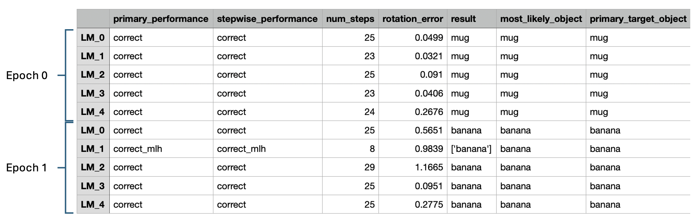
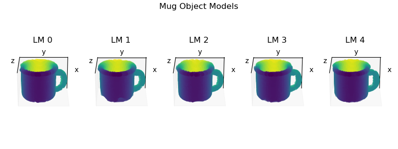

# Introduction
Thus far, we have been working with models that use a single agent with a single sensor which connects to a single learning module. In the context of vision, this is analogous to a small patch of retina that picks up a small region of the visual field and relays its information to its downstream target--a single cortical column in the primary visual cortex (V1). In human terms, this is like looking through a straw. While sufficient to recognize objects, one would have to make many successive eye movements to build up a picture of the environment. In reality, the retina contains many patches that tile the retinal surface, and they all send their information to their respective downstream target columns in V1. If, for example, a few neighboring retinal patches fall on different parts of the same object, then the object may be rapidly recognized once columns have communicated with each other about what they are seeing and where they are seeing it.

In this tutorial, we will show how Monty can be used to learn and recognize objects in a multiple sensor, multiple learning module setting. In this regime, we can perform object recognition with fewer steps than single-LM systems by allowing learning modules to communicate with one another through a process called [voting](../../overview/architecture-overview/other-aspects.md#votingconsensus). We will also introduce the distant agent, Monty's sensorimotor system that is most analogous to the human eye. Unlike the surface agent, the distant agent cannot move all around the object like a finger. Rather, it swivels left/right/up/down at a fixed distance from the object.

> [!NOTE]
> **Don't have the YCB Dataset Downloaded?**
>
> You can find instructions for downloading the YCB dataset [here](../getting-started.md#41-download-the-ycb-dataset). Alternatively, you can run these experiments using the builtin Habitat primitives, such as `capsule3DSolid` and `cubeSolid`. Simply change the items in the  `object_names` list.
>

# Setting up and Running a Multi-LM Pretraining Experiment

In this section, we'll show how to perform supervised pretraining with a model containing six sensor modules, of which five are connected in a 1:1 fashion to five learning modules (one sensor module is a viewfinder for experiment setup and visualization and is not connected to a learning module). By default, the sensor modules are arranged in cross shape, where four sensor modules are displaced a small distance from the center sensor module like so:


To follow along, open the `benchmarks/configs/my_experiments.py` file and paste the code snippets into it.

```python
import os
from dataclasses import asdict

from benchmarks.configs.names import MyExperiments
from tbp.monty.frameworks.config_utils.config_args import (
    FiveLMMontyConfig,
    MontyArgs,
    MotorSystemConfigNaiveScanSpiral,
    PretrainLoggingConfig,
    get_cube_face_and_corner_views_rotations,
)
from tbp.monty.frameworks.config_utils.make_dataset_configs import (
    EnvironmentDataloaderPerObjectArgs,
    ExperimentArgs,
    PredefinedObjectInitializer,
    get_env_dataloader_per_object_by_idx,
)
from tbp.monty.frameworks.config_utils.policy_setup_utils import (
    make_naive_scan_policy_config,
)
from tbp.monty.frameworks.environments import embodied_data as ED
from tbp.monty.frameworks.experiments import (
    MontySupervisedObjectPretrainingExperiment,
)
from tbp.monty.simulators.habitat.configs import (
    FiveLMMountHabitatDatasetArgs,
)

# Specify directory where an output directory will be created.
project_dir = os.path.expanduser("~/tbp/results/monty/projects")

# Specify a name for the model.
model_name = "dist_agent_5lm_2obj"

# Specify the objects to train on and 14 unique object poses.
object_names = ["mug", "banana"]
train_rotations = get_cube_face_and_corner_views_rotations()

# The config dictionary for the pretraining experiment.
dist_agent_5lm_2obj_train = dict(
    # Specify monty experiment class and its args.
    # The MontySupervisedObjectPretrainingExperiment class will provide the model
    # with object and pose labels for supervised pretraining.
    experiment_class=MontySupervisedObjectPretrainingExperiment,
    experiment_args=ExperimentArgs(
        do_eval=False,
        n_train_epochs=len(train_rotations),
    ),
    # Specify logging config.
    logging_config=PretrainLoggingConfig(
        output_dir=project_dir,
        run_name=model_name,
    ),
    # Specify the Monty model. The FiveLLMMontyConfig contains all of the sensor module
    # configs, learning module configs, and connectivity matrices we need.
    monty_config=FiveLMMontyConfig(
        monty_args=MontyArgs(num_exploratory_steps=500),
        motor_system_config=MotorSystemConfigNaiveScanSpiral(
            motor_system_args=dict(
                policy_class=NaiveScanPolicy,
                policy_args=make_naive_scan_policy_config(step_size=5),
            )
        ),
    ),
    # Set up the environment and agent.
    dataset_args=FiveLMMountHabitatDatasetArgs(),
    # Set up the training dataloader.
    train_dataloader_class=ED.InformedEnvironmentDataLoader,
    train_dataloader_args=EnvironmentDataloaderPerObjectArgs(
        object_names=object_names,
        object_init_sampler=PredefinedObjectInitializer(rotations=train_rotations),
    ),
    # Set up the evaluation dataloader. Unused, but required.
    eval_dataloader_class=ED.InformedEnvironmentDataLoader,  # just placeholder
    eval_dataloader_args=get_env_dataloader_per_object_by_idx(start=0, stop=1),
)
```
Finally, add your experiment to `MyExperiments` at the bottom of the file:

```python
experiments = MyExperiments(
    dist_agent_5lm_2obj_train=dist_agent_5lm_2obj_train,
)
CONFIGS = asdict(experiments)
```
If you've read the previous tutorials, much of this should look familiar. As in our [pretraining](./pretraining-a-model.md) tutorial, we've configured a `MontySupervisedObjectPretrainingExperiment` with a `PretrainLoggingConfig`. However, we are now using a built-in Monty model configuration called `FiveLMMontyConfig` that specifies everything we need to have five `HabitatSM` sensor modules that each connect to exactly one of five `DisplacementGraphLM` learning modules. `FiveLMMontyConfig` also specifies that each learning module connects to every other learning module through lateral voting connections. Note that `GraphLM` learning modules used in previous tutorials would work fine here, but we're going with the default `DisplacementGraphLM` for convenience (this is a graph-based LM that also stores displacements between points, although these are generally not used during inference at present). To see how this is done, we can take a closer look at the `FiveLMMontyConfig` class which contains the following lines:

```python
    sm_to_lm_matrix: List = field(
        default_factory=lambda: [
            [0],
            [1],
            [2],
            [3],
            [4],
        ],  # View finder (sm5) not connected to lm
    )

    # For hierarchically connected LMs.
    lm_to_lm_matrix: Optional[List] = None

    # All LMs connect to each other
    lm_to_lm_vote_matrix: List = field(
        default_factory=lambda: [
            [1, 2, 3, 4],
            [0, 2, 3, 4],
            [0, 1, 3, 4],
            [0, 1, 2, 4],
            [0, 1, 2, 3],
        ]
    )
```
`sm_to_lm_matrix` is a list where the *i*-th entry indicates the learning module that receives input from the *i*-th sensor module. Note, the view finder, which is configured as sensor module 5, is not connected to any learning modules since `sm_to_lm_matrix[5]` does not exist. Similarly, `lm_to_lm_vote_matrix` specifies which learning modules communicate with each for voting during inference. `lm_to_lm_vote_matrix[i]` is a list of learning module IDs that communicate with learning module *i*.

We have also specified that we want to use a `MotorSystemConfigNaiveScanSpiral` for the motor system. This is a *learning-focused* motor policy that directs the agent to look across the object surface in a spiraling motion. That way, we can ensure efficient coverage of the entire object (of what is visible from the current perspective) during learning.

Finally, we have also set the `dataset_args` to `FiveLMMountHabitatDatasetArgs`. This specifies that we have five `HabitatSM` sensor modules (and a view finder) mounted onto a single distant agent. By default, the sensor modules cover three nearby regions and otherwise vary by resolution and zoom factor. For the exact specifications, see the `FiveLMMountConfig` in `tbp/monty/frameworks/config_utils/make_dataset_configs.py`.

Before running this experiment, you will need to declare your experiment name as part of the `MyExperiments` dataclass in the `benchmarks/configs/names.py` file:

```python
@dataclass
class MyExperiments:
    dist_agent_5lm_2obj_train: dict
```
Then navigate to the `benchmarks/` folder in a terminal, and call the `run.py` script like so:
```bash
cd benchmarks
python run.py -e dist_agent_5lm_2obj_train
```

# Setting up and Running a Multi-LM Evaluation Experiment

We will now specify an experiment config to perform inference.
To follow along, open the `benchmarks/configs/my_experiments.py` file and paste the code snippets into it.

```python
import copy
import os

import numpy as np

from tbp.monty.frameworks.config_utils.config_args import (
    EvalLoggingConfig,
    FiveLMMontyConfig,
    MontyArgs,
    MotorSystemConfigInformedGoalStateDriven,
)
from tbp.monty.frameworks.config_utils.make_dataset_configs import (
    EnvironmentDataloaderPerObjectArgs,
    EvalExperimentArgs,
    PredefinedObjectInitializer,
    get_env_dataloader_per_object_by_idx,
)
from tbp.monty.frameworks.environments import embodied_data as ED
from tbp.monty.frameworks.experiments import (
    MontyObjectRecognitionExperiment,
)
from tbp.monty.frameworks.loggers.monty_handlers import BasicCSVStatsHandler
from tbp.monty.frameworks.models.evidence_matching.learning_module import (
    EvidenceGraphLM
)
from tbp.monty.frameworks.models.evidence_matching.model import (
    MontyForEvidenceGraphMatching
)
from tbp.monty.frameworks.models.goal_state_generation import (
    EvidenceGoalStateGenerator,
)
from tbp.monty.simulators.habitat.configs import (
    FiveLMMountHabitatDatasetArgs,
)

"""
Basic Info
"""

# Specify directory where an output directory will be created.
project_dir = os.path.expanduser("~/tbp/results/monty/projects")

# Specify a name for the model.
model_name = "dist_agent_5lm_2obj"

object_names = ["mug", "banana"]
test_rotations = [np.array([0, 15, 30])] # A previously unseen rotation of the objects

model_path = os.path.join(
    project_dir,
    model_name,
    "pretrained",
)
```
As usual, we set up our imports, save/load paths, and specify which objects to use and what rotations they'll be in. For simplicity, we'll only perform inference on each of the two objects once but you could easily test more by adding more rotations to the `test_rotations` array.

Now we specify the learning module config. For simplicity, we define one learning module config and copy it to reuse settings across learning modules. We need only make one change to each copy so that the tolerances reference the sensor ID connected to the learning module.

```python
"""
Learning Module Configs
"""
# Create a template config that we'll make copies of.
evidence_lm_config = dict(
    learning_module_class=EvidenceGraphLM,
    learning_module_args=dict(
        max_match_distance=0.01,  # =1cm
        feature_weights={
            "patch": {
                # Weighting saturation and value less since these might change under
                # different lighting conditions.
                "hsv": np.array([1, 0.5, 0.5]),
            }
        },
        # Use this to update all hypotheses > x_percent_threshold (faster)
        evidence_threshold_config="x_percent_threshold",
        x_percent_threshold=20,
        gsg_class=EvidenceGoalStateGenerator,
        gsg_args=dict(
            goal_tolerances=dict(
                location=0.015,  # distance in meters
            ),  # Tolerance(s) when determining goal-state success
            min_post_goal_success_steps=5,  # Number of necessary steps for a hypothesis
        ),
        hypotheses_updater_args=dict(
            max_nneighbors=10,
        )
    ),
)
# We'll also reuse these tolerances, so we specify them here.
tolerance_values = {
    "hsv": np.array([0.1, 0.2, 0.2]),
    "principal_curvatures_log": np.ones(2),
}

# Now we make 5 copies of the template config, each with the tolerances specified for
# one of the five sensor modules.
learning_module_configs = {}
for i in range(5):
    lm = copy.deepcopy(evidence_lm_config)
    lm["learning_module_args"]["tolerances"] = {f"patch_{i}": tolerance_values}
    learning_module_configs[f"learning_module_{i}"] = lm
```
Now we can create the final complete config dictionary.
```python
# The config dictionary for the pretraining experiment.
dist_agent_5lm_2obj_eval = dict(
    #  Specify monty experiment class and its args.
    experiment_class=MontyObjectRecognitionExperiment,
    experiment_args=EvalExperimentArgs(
        model_name_or_path=model_path,
        n_eval_epochs=len(test_rotations),
        min_lms_match=3,   # Terminate when 3 learning modules makes a decision.
    ),
    # Specify logging config.
    logging_config=EvalLoggingConfig(
        output_dir=os.path.join(project_dir, model_name),
        run_name="eval",
        monty_handlers=[BasicCSVStatsHandler],
        wandb_handlers=[],
    ),
    # Specify the Monty model. The FiveLLMMontyConfig contains all of the
    # sensor module configs and connectivity matrices. We will specify
    # evidence-based learning modules and MontyForEvidenceGraphMatching which
    # facilitates voting between evidence-based learning modules.
    monty_config=FiveLMMontyConfig(
        monty_args=MontyArgs(min_eval_steps=20),
        monty_class=MontyForEvidenceGraphMatching,
        learning_module_configs=learning_module_configs,
        motor_system_config=MotorSystemConfigInformedGoalStateDriven(),
    ),
    # Set up the environment and agent.
    dataset_args=FiveLMMountHabitatDatasetArgs(),
    # Set up the training dataloader. Unused, but must be included.
    train_dataloader_class=ED.InformedEnvironmentDataLoader,
    train_dataloader_args=get_env_dataloader_per_object_by_idx(start=0, stop=1),
    # Set up the evaluation dataloader.
    eval_dataloader_class=ED.InformedEnvironmentDataLoader,
    eval_dataloader_args=EnvironmentDataloaderPerObjectArgs(
        object_names=object_names,
        object_init_sampler=PredefinedObjectInitializer(rotations=test_rotations),
    ),
)
```
Finally, add your experiment to `MyExperiments` at the bottom of the file:

```python
experiments = MyExperiments(
    dist_agent_5lm_2obj_eval=dist_agent_5lm_2obj_eval,
)
CONFIGS = asdict(experiments)
```
Once again, declare your experiment name as part of the `MyExperiments` dataclass in the `benchmarks/configs/names.py` file:

```python
@dataclass
class MyExperiments:
    dist_agent_5lm_2obj_eval: dict
```
Finally, run the experiment from the `benchmarks/` folder.
```bash
python run.py -e dist_agent_5lm_2obj_eval
```
# Inspecting the Results

Let's have a look at part of the `eval_stats.csv` file located at `~/tbp/results/monty/projects/dist_agent_5lm_2obj/eval/eval_stats.csv`.


Each row corresponds to one learning module during one episode, and so each episode now occupies a 5-row block in the table. On the far right, the **primary_target_object** indicates the object being recognized. On the far left, the **primary_performance** column indicates the learning module's success. In episode 0, all LMs correctly decided that the mug was the object being shown. In episode 1, all LMs terminate with  `correct`  while LM_1 terminated with `correct_mlh` (correct most-likely hypothesis). In short, this means that LM_1 had not yet met its evidence thresholds to make a decision, but the right object was its leading candidate. Had LM_1 been able to continue observing the object, it may well have met the threshold needed to make a final decision. However, the episode was terminated as soon as three learning module met the evidence threshold needed to make a decision. We can require that any number of learning modules meet their evidence thresholds by changing the `min_lms_match` parameter supplied to the `EvalExperimentArgs`. See [here](../../how-monty-works/learning-module/evidence-based-learning-module.md#terminal-condition) for a more thorough discussion on how learning modules reach terminal conditions and [here](../../how-monty-works/learning-module/evidence-based-learning-module.md#voting-with-evidence) to learn about how voting works with the evidence LM.

Like in our benchmark experiments, here we have `min_lms_match` set to `3`. Setting this higher requires more steps but reduces the likelihood of incorrect classification. You can try adjusting `min_lms_steps` and see what effect it has on the number of steps required to reach a decision. In all cases, however, Monty should reach a decision quicker with five sensor modules than with one. This ability to reach a quicker decisions through voting is central to Monty. In our benchmark experiments, 5-LM models perform inference in roughly 1/3 of the steps needed for a single-LM distant agent model and with fewer instances of incorrect classification.

Lastly, note that `num_steps` is not the same for all learning modules in an episode. This is because one or more of the sensors can sometimes be aimed off to the side of an object. In this case, the off-object sensor module won't relay information downstream, and so its corresponding learning module will skip a step. (See [here](../../how-monty-works/experiment.md#) for more information about steps.) For example, we see that LM_1 in episode 1 only takes 8 steps while the others take 20-30. Since the sensor module connected to LM_1 was positioned higher than the others, we can surmise that sensor modules were aimed relatively high on the object, thereby causing the sensor module connected to LM_1 to be off-object for many of the steps.

Now you've seen how to set up and run a multi-LM models for both pretraining and evaluation. At present, Monty only supports distant agents with multi-LM models because the current infrastructure doesn't support multiple independently moving agents. We plan to support multiple surface-agent systems in the future.

# Visualizing Learned Object Models (Optional)
During pretraining, each learning module learns its own object models independently of the other LMs. To visualize the models learned by each LM, create and a script with the code below. The location and name of the script is unimportant so long as it can find and import Monty. 
```python
import os
import matplotlib.pyplot as plt
import torch
from tbp.monty.frameworks.utils.plot_utils import plot_graph

# Get path to pretrained model
project_dir = os.path.expanduser("~/tbp/results/monty/projects")
model_name = "dist_agent_5lm_2obj"
model_path = os.path.join(project_dir, model_name, "pretrained/model.pt")
state_dict = torch.load(model_path)

fig = plt.figure(figsize=(8, 3))
for lm_id in range(5):
    ax = fig.add_subplot(1, 5, lm_id + 1, projection="3d")
    graph = state_dict["lm_dict"][lm_id]["graph_memory"]["mug"][f"patch_{lm_id}"]
    plot_graph(graph, ax=ax)
    ax.view_init(-65, 0, 0)
    ax.set_title(f"LM {lm_id}")
fig.suptitle("Mug Object Models")
fig.tight_layout()
plt.show()
```
After running the script, you should see the following:

There are minor differences in the object models due to the different views each sensor module relayed to its respective learning modules, but each should contain a fairly complete representation of the mug.
