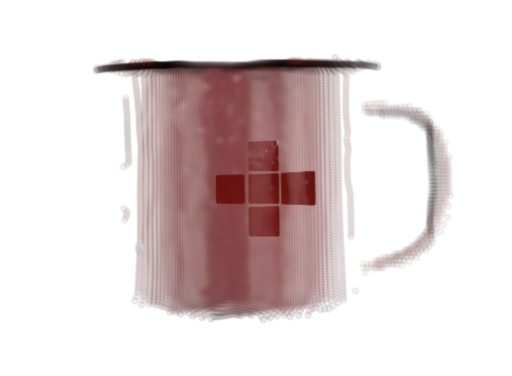
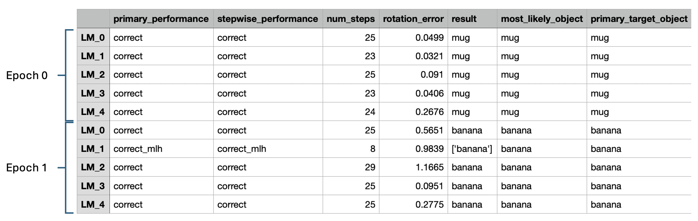
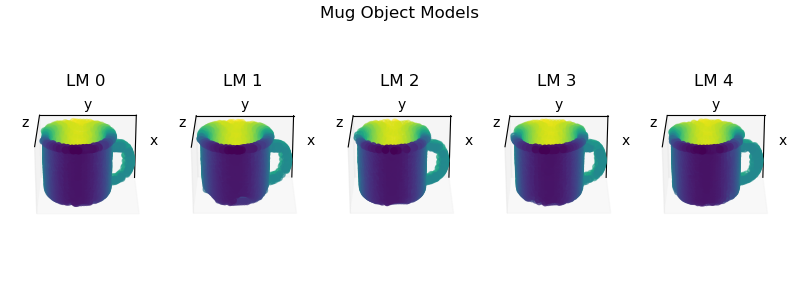

# Introduction
Thus far, we have been working with models that use a single agent with a single sensor which connects to a single learning module. In the context of vision, this is analogous to a small patch of retina that picks up a small region of the visual field and relays its information to its downstream target--a single cortical column in the primary visual cortex (V1). In human terms, this is like looking through a straw. While sufficient to recognize objects, one would have to make many successive eye movements to build up a picture of the environment. In reality, the retina contains many patches that tile the retinal surface, and they all send their information to their respective downstream target columns in V1. If, for example, a few neighboring retinal patches fall on different parts of the same object, then the object may be rapidly recognized once columns have communicated with each other about what they are seeing and where they are seeing it.

In this tutorial, we will show how Monty can be used to learn and recognize objects in a multiple sensor, multiple learning module setting. In this regime, we can perform object recognition with fewer steps than single-LM systems by allowing learning modules to communicate with one another through a process called [voting](../../overview/architecture-overview/other-aspects.md#votingconsensus). We will also introduce the distant agent, Monty's sensorimotor system that is most analogous to the human eye. Unlike the surface agent, the distant agent cannot move all around the object like a finger. Rather, it swivels left/right/up/down at a fixed distance from the object.

> [!NOTE]
> **Don't have the YCB Dataset Downloaded?**
>
> You can find instructions for downloading the YCB dataset [here](../getting-started.md#41-download-the-ycb-dataset). Alternatively, you can run these experiments using the builtin Habitat primitives, such as `capsule3DSolid` and `cubeSolid`. Simply change the items in the `object_names` list.
>

# Setting up and Running a Multi-LM Pretraining Experiment

In this section, we'll show how to perform supervised pretraining with a model containing six sensor modules, of which five are connected in a 1:1 fashion to five learning modules (one sensor module is a viewfinder for experiment setup and visualization and is not connected to a learning module). By default, the sensor modules are arranged in cross shape, where four sensor modules are displaced a small distance from the center sensor module like so:


To follow along, open the `src/tbp/monty/conf/experiment/tutorial/dist_agent_5lm_2obj_train.yaml` file.

```yaml
# @package _global_

defaults:
  - /monty: graph_exp500_e3_t3_tot2500
  - /monty/motor_system_config: naive_scan_5
  - /monty/learning_module: displacement_5lm
  - /monty/sensor_module: 5sm_camera
  - /monty/connectivity: 5lm_5sm
  - /environment: habitat_dist_agent_sensors5
  - /env_interface: tutorial_train_2obj_predefined
  - /env_interface/transform: missing_depthto3d_sensor6
  - /logging: silent_warning_train

experiment:
  _target_: tbp.monty.frameworks.experiments.pretraining_experiments.MontySupervisedObjectPretrainingExperiment
  config:
    max_train_steps: 1000
    max_eval_steps: 500
    max_total_steps: 6000
    n_train_epochs: ${constants.rotations_all_count}
    n_eval_epochs: 3 # unused but required
    model_name_or_path: ''
    min_lms_match: 1
    seed: 42
    show_sensor_output: false
    supervised_lm_ids: all
    logging:
      output_dir: ${path.expanduser:"~/tbp/results/monty/projects"}
      run_name: dist_agent_5lm_2obj_train
      wandb_group: debugging

```

If you've read the previous tutorials, much of this should look familiar. As in our [pretraining](./pretraining-a-model.md) tutorial, we've configured a `MontySupervisedObjectPretrainingExperiment` with a `silent_warning_train` logging configuration. However, we are now using a Monty model configuration that specifies everything we need to have five `CameraSM` sensor modules that each connect to exactly one of five `DisplacementGraphLM` learning modules. `/monty/connectivity` also specifies that each learning module connects to every other learning module through lateral voting connections. Note that `GraphLM` learning modules used in previous tutorials would work fine here, but we're going with the default `DisplacementGraphLM` for convenience (this is a graph-based LM that also stores displacements between points, although these are generally not used during inference at present). To see how this is done, we can take a closer look at the `/monty/connectivity/5lm_5sm` configuration which contains the following lines:

```yaml
sm_to_lm_matrix:
- - 0
- - 1
- - 2
- - 3
- - 4
lm_to_lm_matrix: null
lm_to_lm_vote_matrix:
- - 1
  - 2
  - 3
  - 4
- - 0
  - 2
  - 3
  - 4
- - 0
  - 1
  - 3
  - 4
- - 0
  - 1
  - 2
  - 4
- - 0
  - 1
  - 2
  - 3
```

`sm_to_lm_matrix` is a list where the *i*-th entry indicates the learning module that receives input from the *i*-th sensor module. Note, the view finder, which is configured as sensor module 5, is not connected to any learning modules since `sm_to_lm_matrix[5]` does not exist. Similarly, `lm_to_lm_vote_matrix` specifies which learning modules communicate with each for voting during inference. `lm_to_lm_vote_matrix[i]` is a list of learning module IDs that communicate with learning module *i*.

We have also specified that we want to use a `naive_scan_5` for the motor system. This is a *learning-focused* motor policy that directs the agent to look across the object surface in a spiraling motion. That way, we can ensure efficient coverage of the entire object (of what is visible from the current perspective) during learning.

Finally, we have also set the `/environment` to `habitat_dist_agent_sensors5`. This specifies that we have five `CameraSM` sensor modules (and a view finder) mounted onto a single distant agent. By default, the sensor modules cover three nearby regions and otherwise vary by resolution and zoom factor. For the exact specifications, see `src/tbp/monty/conf/environment/habitat_dist_agent_sensors5`.

To run this experiment, call the `run.py` script like so:
```bash
python run.py experiment=tutorial/dist_agent_5lm_2obj_train
```

# Setting up and Running a Multi-LM Evaluation Experiment

We will now specify an experiment config to perform inference.
To follow along, open the `src/tbp/monty/conf/experiment/tutorial/dist_agent_5lm_2obj_eval.yaml` file.

```yaml
# @package _global_

defaults:
  - /monty: evidencegraph_exp1000_emin_t3_tot2500
  - /monty/motor_system_config: informed_5_goal1
  - /monty/learning_module: tutorial_evidence_5lm
  - /monty/sensor_module: 5sm_camera
  - /monty/connectivity: 5lm_5sm
  - /environment: habitat_dist_agent_sensors5
  - /env_interface: tutorial_eval_2obj_predefined_r1
  - /env_interface/transform: missing_depthto3d_sensor6
  - /logging: basic_info_monty_runs

experiment:
  _target_: tbp.monty.frameworks.experiments.object_recognition_experiments.MontyObjectRecognitionExperiment
  config:
    max_train_steps: 1000
    max_eval_steps: 500
    max_total_steps: 6000
    n_train_epochs: 1 # unused but required
    n_eval_epochs: 1
    model_name_or_path: ${path.expanduser:"~/tbp/results/monty/projects/dist_agent_5lm_2obj_train/pretrained"}
    min_lms_match: 3
    python_log_level: DEBUG
    seed: 42
    show_sensor_output: false
    supervised_lm_ids: []
    logging:
      output_dir: ${path.expanduser:"~/tbp/results/monty/projects"}
      run_name: dist_agent_5lm_2obj_eval
      wandb_group: gm_eval_runs

```

As usual, we set up our imports, save/load paths, and specify which objects to use and what rotations they'll be in. For simplicity, we'll only perform inference on each of the two objects once but you could easily test more by adding more rotations to the `config.train_env_interface_args.object_init_sampler.rotations` array specified in `/env_interface/tutorial_eval_2obj_predefined_r1`.

Now we specify the learning module config. We define five learning modules with the same configuration. We need only make two changes to each copy so that the feature_weights and tolerances reference the sensor ID connected to the learning module.

```yaml
# src/tbp/monty/conf/monty/learning_module/tutorial_evidence_5lm.yaml
# ...
  _target_: tbp.monty.frameworks.models.evidence_matching.learning_module.EvidenceGraphLM
  max_match_distance: 0.01 # =1cm
  # Use this to update all hypotheses > 80% of the max hypothesis evidence
  evidence_threshold_config: 80%
  x_percent_threshold: 20
  gsg:
    _target_: tbp.monty.frameworks.models.goal_generation.EvidenceGoalGenerator
    # Tolerance(s) when determining goal success
    goal_tolerances:
      location: 0.015 # distance in meters
    min_post_goal_success_steps: 5 # Number of necessary steps for a hypothesis
  hypotheses_updater_args:
    max_nneighbors: 10
  feature_weights:
    patch_0:
      # Weighting saturation and value less since these might change under
      # different lighting conditions.
      hsv: ${np.array:[1, 0.5, 0.5]}
  tolerances:
    patch_0:
      hsv: ${np.array:[0.1, 0.2, 0.2]}
      principal_curvatures_log: ${np.ones:2}
```

These are then imported as `/monty/learning_module: tutorial_evidence_5lm` defaults.

Finally, run the experiment.
```bash
python run.py experiment=tutorial/dist_agent_5lm_2obj_eval
```

# Inspecting the Results

Let's have a look at part of the `eval_stats.csv` file located at `~/tbp/results/monty/projects/dist_agent_5lm_2obj_eval/eval_stats.csv`.


Each row corresponds to one learning module during one episode, and so each episode now occupies a 5-row block in the table. On the far right, the **primary_target_object** indicates the object being recognized. On the far left, the **primary_performance** column indicates the learning module's success. In episode 0, all LMs correctly decided that the mug was the object being shown. In episode 1, all LMs terminate with  `correct`  while LM_1 terminated with `correct_mlh` (correct most-likely hypothesis). In short, this means that LM_1 had not yet met its evidence thresholds to make a decision, but the right object was its leading candidate. Had LM_1 been able to continue observing the object, it may well have met the threshold needed to make a final decision. However, the episode was terminated as soon as three learning module met the evidence threshold needed to make a decision. We can require that any number of learning modules meet their evidence thresholds by changing the `min_lms_match` parameter supplied in the experiment `config`. See [here](../../how-monty-works/learning-module/evidence-based-learning-module.md#terminal-condition) for a more thorough discussion on how learning modules reach terminal conditions and [here](../../how-monty-works/learning-module/evidence-based-learning-module.md#voting-with-evidence) to learn about how voting works with the evidence LM.

Like in our benchmark experiments, here we have `min_lms_match` set to `3`. Setting this higher requires more steps but reduces the likelihood of incorrect classification. You can try adjusting `min_lms_steps` and see what effect it has on the number of steps required to reach a decision. In all cases, however, Monty should reach a decision quicker with five sensor modules than with one. This ability to reach a quicker decisions through voting is central to Monty. In our benchmark experiments, 5-LM models perform inference in roughly 1/3 of the steps needed for a single-LM distant agent model and with fewer instances of incorrect classification.

Lastly, note that `num_steps` is not the same for all learning modules in an episode. This is because one or more of the sensors can sometimes be aimed off to the side of an object. In this case, the off-object sensor module won't relay information downstream, and so its corresponding learning module will skip a step. (See [here](../../how-monty-works/experiment.md#) for more information about steps.) For example, we see that LM_1 in episode 1 only takes 8 steps while the others take 20-30. Since the sensor module connected to LM_1 was positioned higher than the others, we can surmise that sensor modules were aimed relatively high on the object, thereby causing the sensor module connected to LM_1 to be off-object for many of the steps.

Now you've seen how to set up and run a multi-LM models for both pretraining and evaluation. At present, Monty only supports distant agents with multi-LM models because the current infrastructure doesn't support multiple independently moving agents. We plan to support multiple surface-agent systems in the future.

# Visualizing Learned Object Models (Optional)
During pretraining, each learning module learns its own object models independently of the other LMs. To visualize the models learned by each LM, create and a script with the code below. The location and name of the script is unimportant so long as it can find and import Monty.
```python
import os
from pathlib import Path

import matplotlib.pyplot as plt
import torch

from tbp.monty.frameworks.utils.plot_utils_dev import plot_graph

# Get path to pretrained model
project_dir = Path("~/tbp/results/monty/projects").expanduser()
model_name = "dist_agent_5lm_2obj_train"
model_path = project_dir / model_name / "pretrained" / "model.pt"
state_dict = torch.load(model_path, weights_only=False)

fig = plt.figure(figsize=(8, 3))
for lm_id in range(5):
    ax = fig.add_subplot(1, 5, lm_id + 1, projection="3d")
    graph = state_dict["lm_dict"][lm_id]["graph_memory"]["mug"][f"patch_{lm_id}"]
    plot_graph(graph, ax=ax)
    ax.view_init(-65, 0, 0)
    ax.set_title(f"LM {lm_id}")
fig.suptitle("Mug Object Models")
fig.tight_layout()
plt.show()
```
After running the script, you should see the following:

There are minor differences in the object models due to the different views each sensor module relayed to its respective learning modules, but each should contain a fairly complete representation of the mug.
