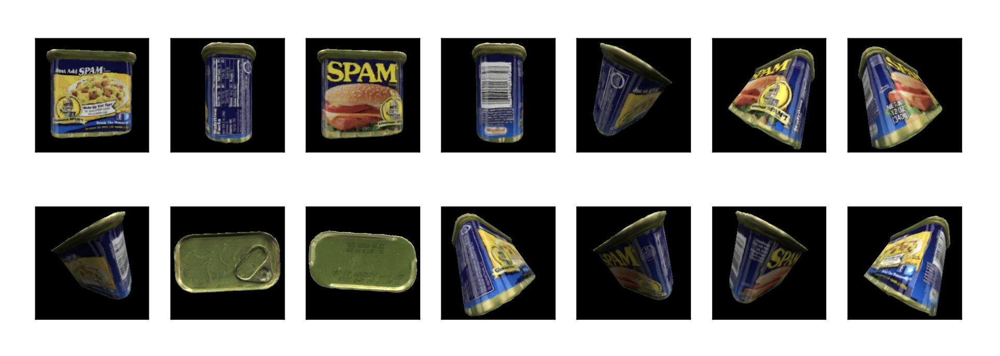
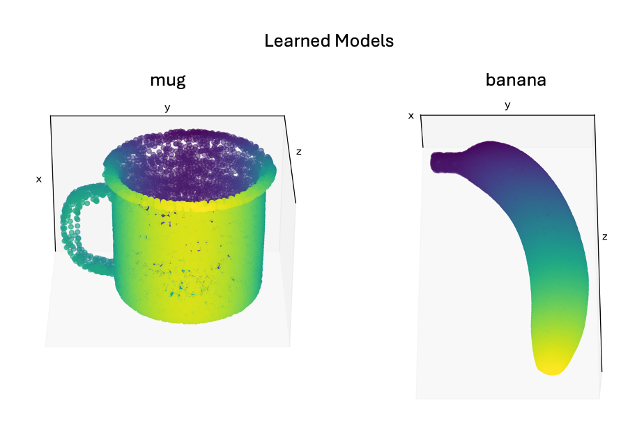

# Introduction

This tutorial demonstrates how to configure and run Monty experiments for pretraining. In the [next tutorial](running-inference-with-a-pretrained-model.md), we show how to load our pretrained model and use it to perform inference. Though Monty is designed for continual learning and does not require separate training and evaluation modes, this set of experiments is useful for understanding many of our [benchmarks experiments](../running-benchmarks.md).

The pretraining differs from [Monty's default learning setup](../../how-monty-works/experiment.md#different-phases-of-learning) in that it is supervised. Under normal conditions, Monty learns by first trying to recognize an object, and then updating its models depending on the outcome of this recognition (unsupervised). Here, we provide the object name and pose to the model directly, so there is no inference phase required. This provides an experimental condition where we can ensure that the model learns the correct models for each of the objects, and we can focus on the inference phase afterward. Naturally, unsupervised learning provides a more challenging but also more naturalistic learning condition, and we will cover this condition later.

Our model will have one surface agent connected to one sensor module connected to one learning module. For simplicity and speed, we will only train/test on two objects in the [YCB](https://www.ycbbenchmarks.com/) dataset.

> [!NOTE]
> **Don't have the YCB Dataset Downloaded?**
>
> You can find instructions for downloading the YCB dataset [here](../getting-started.md#41-download-the-ycb-dataset). Alternatively, you can run these experiments using the built-in Habitat primitives, such as `capsule3DSolid` and `cubeSolid`. Simply change the items in the  `object_names` list.
>


# Config Overview

Monty experiments are defined using a nested dictionary. These dictionaries define the experiment class and associated simulation parameters, logging configs, the Monty model (which includes sensor modules, learning modules, and a motor system), the environment dataset, and data loaders. This is the basic structure of a complete experiment config, along with their expected types:

- `experiment_class`: `MontyExperiment` Manages the highest-level calls to the environment and Monty model.
- `experiment_args`: `ExperimentArgs` Arguments supplied to the experiment class.
- `logging_config`: `LoggingConfig` Specifies which loggers should be used.
- `monty_config`: `MontyConfig`
  - `monty_class`: `Monty` The type of Monty model to use, e.g. for evidence-based graph matching: `MontyForEvidenceGraphMatching`.
  - `monty_args`: `MontyArgs` Arguments supplied to the Monty class.
  - `sensor_module_configs`: `Mapping[str:Mapping]`
  - `learning_module_configs`: `Mapping[str:Mapping]`
  - `motor_system_config`: `dataclass` (e.g., `MotorSystemConfigCurvatureInformedSurface`)
  - `sm_to_agent_dict`: mapping of which sensors connect to which sensor modules.
  - `sm_to_lm_matrix`: mapping of which sensor modules connect to which learning modules.
  - `lm_to_lm_matrix`: hierarchical connectivity between learning modules.
  - `lm_to_lm_vote_matrix`: lateral connectivity between learning modules.
- `dataset_args`: `dataclass` (specifies data-related args incl. transformations that occur before information reaches a sensor module; e.g. `SurfaceViewFinderMountHabitatDatasetArgs`)
- `train_dataloader_class`: `EnvironmentDataLoader`
- `train_dataloader_args`: e.g.`EnvironmentDataloaderPerObjectArgs`
- `eval_dataloader_class`: `EnvironmentDataLoader`
- `eval_dataloader_args`: e.g.`EnvironmentDataloaderPerObjectArgs`

Most configs come in pairs: a class to instantiate and arguments to instantiate it with. A set of arguments is specified as a Python data class, and Monty has many data classes that simplify setup by defining different sets of default parameters.

# Setting up the Experiment Config for Pretraining

To follow along, open the `benchmarks/configs/my_experiments.py` file and paste the code snippets into it. Let's set up the training experiment. First, we import everything we need and define names and paths.

```python
import os
from dataclasses import asdict

from benchmarks.configs.names import MyExperiments
from tbp.monty.frameworks.config_utils.config_args import (
    MontyArgs,
    MotorSystemConfigCurvatureInformedSurface,
    PatchAndViewMontyConfig,
    PretrainLoggingConfig,
    get_cube_face_and_corner_views_rotations,
)
from tbp.monty.frameworks.config_utils.make_dataset_configs import (
    EnvironmentDataloaderPerObjectArgs,
    ExperimentArgs,
    PredefinedObjectInitializer,
)
from tbp.monty.frameworks.environments import embodied_data as ED
from tbp.monty.frameworks.experiments import (
    MontySupervisedObjectPretrainingExperiment,
)
from tbp.monty.frameworks.models.graph_matching import GraphLM
from tbp.monty.frameworks.models.sensor_modules import (
    HabitatSM,
    Probe,
)
from tbp.monty.simulators.habitat.configs import (
    SurfaceViewFinderMountHabitatDatasetArgs,
)

"""
Basic setup
-----------
"""
# Specify directory where an output directory will be created.
project_dir = os.path.expanduser("~/tbp/results/monty/projects")

# Specify a name for the model.
model_name = "surf_agent_1lm_2obj"
```

> [!NOTE]
> **Where Logs and Models are Saved**
>
> Loggers have `output_dir` and `run_name` parameters, and output will typically be saved to `OUTPUT_DIR/RUN_NAME`. The `PretrainLoggingConfig` class is an exception to this as it stores output to `OUTPUT_DIR/RUN_NAME/pretrained`. We will set up the pretraining logger using `project_dir` as the `output_dir` and `model_name` as the `run_name`, so the final model will be stored at `~/tbp/results/monty/projects/surf_agent_1lm_2obj/pretrained`.
>
> Inference logs will be saved at `~/tbp/results/monty/projects/surf_agent_1lm_2obj/eval`.

Next, we specify which objects the model will train on in the dataset, including the rotations in which the objects will be presented. The following code specifies two objects ("mug" and "banana") and 14 unique rotations, which means that both the mug and the banana will be shown 14 times, each time in a different rotation. During each of the overall 28 episodes, the sensors will move over the respective object and collect multiple observations to update the model of the object.

```python
"""
Training
----------------------------------------------------------------------------------------
"""
# Here we specify which objects to learn. 'mug' and 'banana' come from the YCB dataset.
# If you don't have the YCB dataset, replace with names from habitat (e.g.,
# 'capsule3DSolid', 'cubeSolid', etc.).
object_names = ["mug", "banana"]
# Get predefined object rotations that give good views of the object from 14 angles.
train_rotations = get_cube_face_and_corner_views_rotations()
```
The function `get_cube_face_and_corner_views_rotations()` is used in our pretraining
and many of our benchmark experiments since the rotations it returns provide a good set
of views from all around the object. Its name comes from picturing an imaginary cube
surrounding an object. If we look at the object from each of the cube's faces, we
get 6 unique views that typically cover most of the object's surface. We can also look
at the object from each of the cube's 8 corners which provides an extra set of views
that help fill in any gaps. The 14 rotations provided by
`get_cube_face_and_corner_views_rotations` will rotate the object as if an observer
were looking at the object from each of the cube's faces and corners like so:



Now we define the entire nested dictionary that specifies one complete Monty experiment:

```python
# The config dictionary for the pretraining experiment.
surf_agent_2obj_train = dict(
    # Specify monty experiment and its args.
    # The MontySupervisedObjectPretrainingExperiment class will provide the model
    # with object and pose labels for supervised pretraining.
    experiment_class=MontySupervisedObjectPretrainingExperiment,
    experiment_args=ExperimentArgs(
        n_train_epochs=len(train_rotations),
        do_eval=False,
    ),
    # Specify logging config.
    logging_config=PretrainLoggingConfig(
        output_dir=project_dir,
        run_name=model_name,
        wandb_handlers=[],
    ),
    # Specify the Monty config.
    monty_config=PatchAndViewMontyConfig(
        monty_args=MontyArgs(num_exploratory_steps=500),
        # sensory module configs: one surface patch for training (sensor_module_0),
        # and one view-finder for initializing each episode and logging
        # (sensor_module_1).
        sensor_module_configs=dict(
            sensor_module_0=dict(
                sensor_module_class=HabitatSM,
                sensor_module_args=dict(
                    is_surface_sm=True,
                    sensor_module_id="patch",
                    # a list of features that the SM will extract and send to the LM
                    features=[
                        "pose_vectors",
                        "pose_fully_defined",
                        "on_object",
                        "object_coverage",
                        "rgba",
                        "hsv",
                        "min_depth",
                        "mean_depth",
                        "principal_curvatures",
                        "principal_curvatures_log",
                        "gaussian_curvature",
                        "mean_curvature",
                        "gaussian_curvature_sc",
                        "mean_curvature_sc",
                    ],
                    save_raw_obs=False,
                ),
            ),
            sensor_module_1=dict(
                sensor_module_class=Probe,
                sensor_module_args=dict(
                    sensor_module_id="view_finder",
                    save_raw_obs=False,
                ),
            ),
        ),
        # learning module config: 1 graph learning module.
        learning_module_configs=dict(
            learning_module_0=dict(
                learning_module_class=GraphLM,
                learning_module_args=dict(),  # Use default LM args
            )
        ),
        # Motor system config: class specific to surface agent.
        motor_system_config=MotorSystemConfigCurvatureInformedSurface(),
    ),
    # Set up the environment and agent
    dataset_args=SurfaceViewFinderMountHabitatDatasetArgs(),
    train_dataloader_class=ED.InformedEnvironmentDataLoader,
    train_dataloader_args=EnvironmentDataloaderPerObjectArgs(
        object_names=object_names,
        object_init_sampler=PredefinedObjectInitializer(rotations=train_rotations),
    ),
    # For a complete config we need to specify an eval_dataloader but since we only train here, this is unused
    eval_dataloader_class=ED.InformedEnvironmentDataLoader,
    eval_dataloader_args=EnvironmentDataloaderPerObjectArgs(
        object_names=object_names,
        object_init_sampler=PredefinedObjectInitializer(rotations=train_rotations),
    ),
)
```

Here, we explicitly specified most parameters in config classes for transparency. The remaining parameters (e.g., `sm_to_lm_matrix`, etc.) aren't supplied since `PatchAndViewMontyConfig`s defaults will work fine here. If you use a different number of SMs or LMs or want a custom connectivity between them, you will have to specify those as well.

Briefly, we specified our experiment class and the number of epochs to run. We also configured a [logger](../logging-and-analysis.md), the environment dataset, and a training data loader to initialize our objects at different orientations for each episode. We also specified a valid but unused eval dataloader (currently necessary). `monty_config` is a nested config that describes the complete sensorimotor modeling system. Here is a short breakdown of its components:

- `PatchAndViewMontyConfig`: the top-level Monty config object specifies that we will have a sensor patch and an additional viewfinder as inputs to the system. It also specifies the routing matrices between sensors, SMs and LMs (using defaults in this simple setup).
  - `monty_args`: a `MontyArgs`object specifying we want 500 exploratory steps per episode.
  - `sensor_module_configs`: a dictionary specifying sensor module class and arguments. These dictionaries specify that
    - `sensor_module_0` will be a `HabitatSM` with `is_surface_sm=True` (a small sensory patch for a surface agent). The sensor module will extract the given list of features for each patch. We won't save raw observations here since it is memory-intensive and only required for detailed logging/plotting.
    - `sensor_module_1` will be a `Probe` which we can use for logging. We could also store raw observations from the viewfinder for later visualization/analysis if needed. This sensor module is not connected to a learning module and, therefore, is not used for learning. It is called `view_finder` since it helps initialize each episode on the object.
  - `learning_module_configs`: a dictionary specifying the learning module class and arguments. This dictionary specifies that
    - `learning_module_0` will be a `GraphLM` that constructs a graph of the object being explored.
  - `motor_system_config`: a `MotorSystemConfigCurvatureInformedSurface` config object that specifies a motor policy class to use. This policy here will move orthogonal to the surface of the object with a preference of following principal curvatures that are sensed. When doing pretraining with the distant agent, the `MotorSystemConfigNaiveScanSpiral` policy is recommended since it ensures even coverage of the object from the available view point.

To get an idea of what each sensor module sees and the information passed on to the learning module, check out the documentation on [observations, transforms, and sensor modules](../../how-monty-works/observations-transforms-sensor-modules.md). To learn more about how learning modules construct object graphs from sensor output, refer to the [graph building](../../how-monty-works/learning-module/object-models.md#graph-building) documentation.

# Running the Pretraining Experiment

Finally, add your experiment to `MyExperiments` at the bottom of the file:

```python
experiments = MyExperiments(
    surf_agent_2obj_train=surf_agent_2obj_train,
)
CONFIGS = asdict(experiments)

```
Next you will need to declare your experiment name as part of the `MyExperiments` dataclass in the `benchmarks/configs/names.py` file:

```python
@dataclass
class MyExperiments:
    surf_agent_2obj_train: dict
```
To run this experiment, navigate to the `benchmarks/` folder in a terminal and call the `run.py` script with the experiment name as the -e argument.
```shell
cd benchmarks
python run.py -e surf_agent_2obj_train
```

This will take a few minutes to complete and then you can inspect and visualize the learned models. To do so, create a script and paste in the following code. The location and name of the script is unimportant, but we called it `pretraining_tutorial_analysis.py` and placed it outside of the repository at `~/monty_scripts`.

```python
import os
import matplotlib.pyplot as plt
from tbp.monty.frameworks.utils.logging_utils import load_stats
from tbp.monty.frameworks.utils.plot_utils import plot_graph

# Specify where pretraining data is stored.
exp_path = os.path.expanduser("~/tbp/results/monty/projects/surf_agent_1lm_2obj")
pretrained_dict = os.path.join(exp_path, "pretrained")

train_stats, eval_stats, detailed_stats, lm_models = load_stats(
    exp_path,
    load_train=False,  # doesn't load train csv
    load_eval=False,  # doesn't try to load eval csv
    load_detailed=False,  # doesn't load detailed json output
    load_models=True,  # loads models
    pretrained_dict=pretrained_dict,
)

# Visualize the mug graph from the pretrained graphs loaded above from
# pretrained_dict. Replace 'mug' with 'banana' to plot the banana graph.
plot_graph(lm_models["pretrained"][0]["mug"]["patch"], rotation=120)
plt.show()
```
Replace `"mug"` with `"banana"` in the second to last line to visualize the banana's graph. After running the script, you should see a graph of the mug/banana.



See [logging and analysis](../logging-and-analysis.md) for more detailed information about experiment logs and how to work with them. You can now move on to [part two](running-inference-with-a-pretrained-model.md) of this tutorial where we load our pretrained model and use it for inference.
