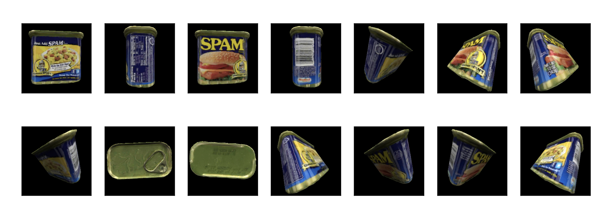
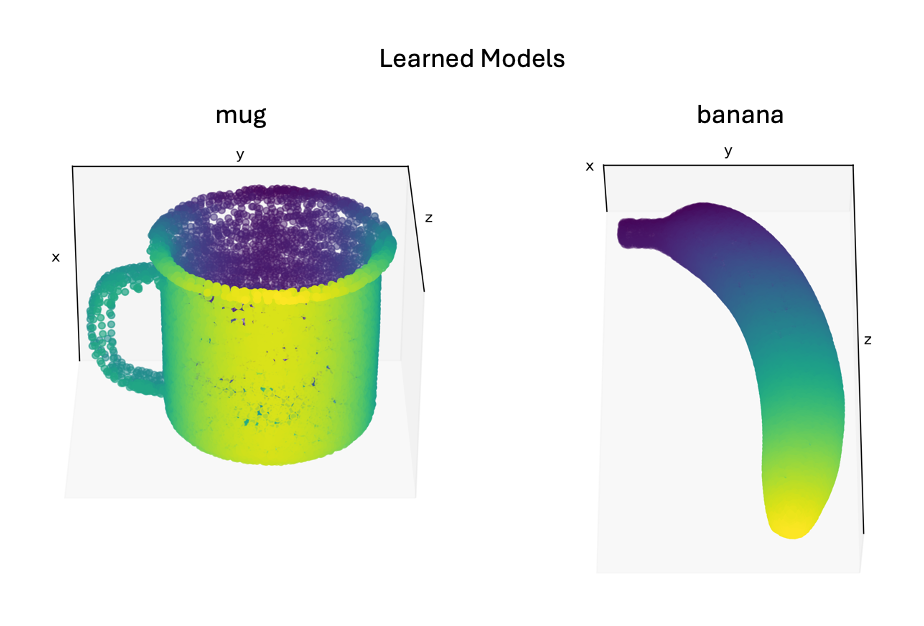

# Introduction

This tutorial demonstrates how to configure and run Monty experiments for pretraining. In the [next tutorial](running-inference-with-a-pretrained-model.md), we show how to load our pretrained model and use it to perform inference. Though Monty is designed for continual learning and does not require separate training and evaluation modes, this set of experiments is useful for understanding many of our [benchmarks experiments](../running-benchmarks.md).

The pretraining differs from [Monty's default learning setup](../../how-monty-works/experiment.md#different-phases-of-learning) in that it is supervised. Under normal conditions, Monty learns by first trying to recognize an object, and then updating its models depending on the outcome of this recognition (unsupervised). Here, we provide the object name and pose to the model directly, so there is no inference phase required. This provides an experimental condition where we can ensure that the model learns the correct models for each of the objects, and we can focus on the inference phase afterward. Naturally, unsupervised learning provides a more challenging but also more naturalistic learning condition, and we will cover this condition later.

Our model will have one surface agent connected to one sensor module connected to one learning module. For simplicity and speed, we will only train/test on two objects in the [YCB](https://www.ycbbenchmarks.com/) dataset.

> [!NOTE]
> **Don't have the YCB Dataset Downloaded?**
>
> You can find instructions for downloading the YCB dataset [here](../getting-started.md#41-download-the-ycb-dataset). Alternatively, you can run these experiments using the built-in Habitat primitives, such as `capsule3DSolid` and `cubeSolid`. Simply change the items in the  `object_names` list.
>


# Config Overview

Monty experiments are defined and configured using [Hydra](https://hydra.cc/). These configurations define the experiment class and associated simulation parameters, logging configs, the Monty model (which includes sensor modules, learning modules, and a motor system), and the environment interface. This is the basic structure of a complete experiment config, along with their expected types:

- `experiment`:
  - `_target_`: `MontyExperiment` Manages the highest-level calls to the environment and Monty model.
  - `config`: The configuration passed to the experiment class.
    - `logging`: Specifies which loggers should be used.
    - `monty_config`: Configuration for the Monty model.
      - `monty_class`: `Monty` The type of Monty model to use, e.g. for evidence-based graph matching: `MontyForEvidenceGraphMatching`.
      - `monty_args`: Arguments supplied to the Monty class.
      - `sensor_modules`: `Mapping[str:Mapping]` Sensor module configurations.
      - `learning_modules`: `Mapping[str:Mapping]` Learning module configurations.
      - `motor_system_config`: Configuration of the motor system and motor policies.
      - `sm_to_agent_dict`: Connectivity mapping of which sensors connect to which sensor modules.
      - `sm_to_lm_matrix`: Connectivity mapping of which sensor modules connect to which learning modules.
      - `lm_to_lm_matrix`: Hierarchical connectivity between learning modules.
      - `lm_to_lm_vote_matrix`: Lateral connectivity between learning modules.
    - `environment`: Configuration for the environment.
      - `env_init_func`: The environment class.
      - `env_init_args`: The arguments for initializing the environment, such as the agent and sensor configuration.
      - `transform`: Optional transformations that occur before information reaches a sensor module
    - `train_env_interface_class`: environment `Interface`
    - `train_env_interface_args`: Specifies how the interface should interact with the environment. For instance, which objects should be shown in what episodes and in which orientations and locations.
    - `eval_env_interface_class`: environment `Interface`
    - `eval_env_interface_args`: Same purpose as `train_env_interface_args` but allows for presenting Monty with different conditions between training and evaluation.

# Setting up the Experiment Config for Pretraining

To follow along, open the `src/tbp/monty/conf/experiment/tutorial/surf_agent_2obj_train.yaml`. Let's highlight the various aspects of a training experiment configuration.

```yaml
# @package _global_

defaults:
  # ...
  - /logging: silent_warning_train

experiment:
  _target_: tbp.monty.frameworks.experiments.pretraining_experiments.MontySupervisedObjectPretrainingExperiment
  config:
    # ...
    logging:
      output_dir: ${path.expanduser:"~/tbp/results/monty/projects"}
      run_name: surf_agent_1lm_2obj_train
```

> [!NOTE]
> **Where Logs and Models are Saved**
>
> Loggers have `output_dir` and `run_name` parameters, and since we will use `run.py`, the output will be saved to `OUTPUT_DIR/RUN_NAME`. The `MontySupervisedObjectPretrainingExperiment` suffixes `pretrained`, so the final model will be stored at `OUTPUT_DIR/RUN_NAME/pretrained`, which in our case will be `~/tbp/results/monty/projects/surf_agent_1lm_2obj_train/pretrained`.
>

Next, we specify which objects the model will train on in the dataset, including the rotations in which the objects will be presented. The following code specifies two objects ("mug" and "banana") and 14 unique rotations, which means that both the mug and the banana will be shown 14 times, each time in a different rotation. During each of the overall 28 episodes, the sensors will move over the respective object and collect multiple observations to update the model of the object.

The configuration points us to where the details are specified:
```yaml
# @package _global_

defaults:
  # ...
  - /env_interface: tutorial_train_2obj_predefined
  # ...

experiment:
  # ...
```

Opening `src/tbp/monty/conf/env_interface/tutorial_train_2obj_predefined.yaml` we see:

```yaml
# @package experiment.config

do_train: true
train_env_interface_args:
  parent_to_child_mapping: null
  # Here we specify which objects to learn. "mug" and "banana" come from the YCB dataset.
  # If you don't have the YCB dataset, replace with names from habitat (e.g.,
  # "capsule3DSolid", "cubeSolid", etc.).
  object_names:
  - mug
  - banana
  # Use all predefined object rotations that give good views of the object from 14 angles.
  object_init_sampler:
    _target_: tbp.monty.frameworks.environments.object_init_samplers.Predefined
    rotations: ${constants.rotations_all}
train_env_interface_class: ${monty.class:tbp.monty.experiment.environment.OneObjectPerEpisodeInterface}
```

The constant `${constants.rotations_all}` is used in our pretraining and many of our benchmark experiments since the rotations it returns provide a good set of views from all around the object. Its name comes from picturing an imaginary cube surrounding an object. If we look at the object from each of the cube's faces, we get 6 unique views that typically cover most of the object's surface. We can also look at the object from each of the cube's 8 corners which provides an extra set of views that help fill in any gaps. The 14 rotations provided by `${constants.rotations_all}` will rotate the object as if an observer were looking at the object from each of the cube's faces and corners like so:



Now we define the entire configuration that specifies one complete Monty experiment:

```yaml
# @package _global_

# The configuration for the pretraining experiment.
defaults:
  # The Monty configuration details.
  - /monty: graph_exp500_e3_t3_tot2500
  # The Monty motor system configuration specific to a surface agent.
  - /monty/motor_system_config: surface_curvature_informed_5_goal0
  # The Monty learning module configuration.
  - /monty/learning_module: graph_1lm
  # The Monty sensor module configuration.
  #
  # One surface patch for training and one view-finder probe for initializing each
  # episode and logging.
  - /monty/sensor_module: camera_surf_rgba_raw0
  # The Monty connectivity configuration.
  - /monty/connectivity: 1lm_1sm
  # The environment configuration.
  - /environment: habitat_ycb_surf_agent
  # The environment interface configures how the experiment controls the environment.
  - /env_interface: tutorial_train_2obj_predefined
  - /env_interface/transform: missing_depthto3d_sensor2_semantic0_clip
  # The logging configuration.
  - /logging: silent_warning_train

experiment:
  # The MontySupervisedObjectPretrainingExperiment will provide the model with the
  # object and pose labels for supervised pretraining.
  _target_: tbp.monty.frameworks.experiments.pretraining_experiments.MontySupervisedObjectPretrainingExperiment
  config:
    show_sensor_output: false
    max_train_steps: 1000
    max_eval_steps: 500
    max_total_steps: 6000
    n_train_epochs: ${constants.rotations_all_count}
    n_eval_epochs: 3
    model_name_or_path: ''
    min_lms_match: 1
    seed: 42
    supervised_lm_ids: all
    logging:
      output_dir: ${path.expanduser:"~/tbp/results/monty/projects"}
      # Ensure the run name is unique per experiment configuration.
      run_name: surf_agent_1lm_2obj_train
```

Briefly, we specified our experiment class and the number of epochs to run. We also configured a [logger](../logging-and-analysis.md) and a training environment interface to initialize our objects at different orientations for each episode. `/monty/*` composes multiple configs that together describe the complete sensorimotor modeling system. Here is a short breakdown of its components:

- `/monty: graph_exp500_e3_t3_tot2500`: The top-level Monty configuration that specifies how many exploratory, eval, train, and total steps to take.
- `/monty/motor_system_config: surface_curvature_informed_5_goal0`: A motor system configuration that specifies a motor policy to use. This policy here will move orthogonal to the surface of the object with a preference of following principal curvatures that are sensed. When doing pretraining with the distant agent, one of the `/src/tbp/monty/conf/monty/motor_system_config/naive_scan_*` policies is recommended since they ensures even coverage of the object from the available view point.
- `/monty/learning_module: graph_1lm`: Specifies a single `GraphLM` that constructs a graph of the object being explored.
- `/monty/sensor_module: camera_surf_rgba_raw0`: Specifies two sensor modules. One will be a `CameraSM` with `is_surface_sm=True` (a small sensory patch for a surface agent). The sensor module will extract the given list of features for each patch. We won't save raw observations here since it is memory-intensive and only required for detailed logging/plotting. The other will be a `Probe` which we can use for logging. We could also store raw observations from the viewfinder for later visualization/analysis if needed. This sensor module is not connected to a learning module and, therefore, is not used for learning. It is called `view_finder` since it helps initialize each episode on the object.

To get an idea of what each sensor module sees and the information passed on to the learning module, check out the documentation on [observations, transforms, and sensor modules](../../how-monty-works/observations-transforms-sensor-modules.md). To learn more about how learning modules construct object graphs from sensor output, refer to the [graph building](../../how-monty-works/learning-module/object-models.md#graph-building) documentation.

# Running the Pretraining Experiment

To run this experiment, call the `run.py` script with the experiment name as the `experiment` argument.
```shell
python run.py experiment=tutorial/surf_agent_2obj_train
```

This will take a few minutes to complete and then you can inspect and visualize the learned models. To do so, create a script and paste in the following code. The location and name of the script is unimportant, but we called it `pretraining_tutorial_analysis.py` and placed it outside of the repository at `~/monty_scripts`.

```python
from pathlib import Path

import matplotlib.pyplot as plt

from tbp.monty.frameworks.utils.logging_utils import load_stats
from tbp.monty.frameworks.utils.plot_utils_dev import plot_graph

# Specify where pretraining data is stored.
exp_path = Path("~/tbp/results/monty/projects/surf_agent_1lm_2obj_train").expanduser()
pretrained_dict = exp_path / "pretrained"

train_stats, eval_stats, detailed_stats, lm_models = load_stats(
    exp_path,
    load_train=False,  # doesn't load train csv
    load_eval=False,  # doesn't try to load eval csv
    load_detailed=False,  # doesn't load detailed json output
    load_models=True,  # loads models
    pretrained_dict=pretrained_dict,
)

# Visualize the mug graph from the pretrained graphs loaded above from
# pretrained_dict. Replace "mug" with "banana" to plot the banana graph.
plot_graph(lm_models["pretrained"][0]["mug"]["patch"], rotation=120)
plt.show()
```
Replace `"mug"` with `"banana"` in the second to last line to visualize the banana's graph. After running the script, you should see a graph of the mug/banana.



See [logging and analysis](../logging-and-analysis.md) for more detailed information about experiment logs and how to work with them. You can now move on to [part two](running-inference-with-a-pretrained-model.md) of this tutorial where we load our pretrained model and use it for inference.
