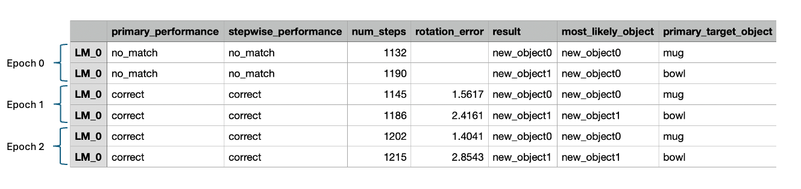
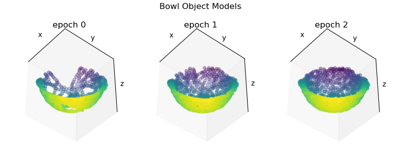

# Introduction

This tutorial demonstrates how to configure and run Monty experiments for [unsupervised continual learning](../../how-monty-works/experiment.md#different-phases-of-learning). In this regime, Monty learns while it explores an object and attempts to identify its identity and pose. If an object has been recognized as a previously seen item, then any knowledge gained during its exploration is added to an existing model and committed to memory. If Monty does not recognize the object, then a new model is generated for the object and stored. In this way, Monty jointly performs unsupervised learning and object/pose recognition. This mode of operation is distinct from those used in our tutorials on [pretraining](pretraining-a-model.md) and [model evaluation](running-inference-with-a-pretrained-model.md) in which learning and inference were performed in separate stages which is useful for more controlled experiments on one of the two. It is closer to the ultimate vision of Monty, where learning and inference are closely intertwined, much as they are in humans.

Our model will have one surface agent connected to one sensor module connected to one learning module. Our dataset will be comprised of two objects in the [YCB](https://www.ycbbenchmarks.com/) dataset, and each will be shown at a different random rotation for each episode. Monty will see each object three times in total.

> 📘 Don't have the YCB Dataset Downloaded?
> You can find instructions for downloading the YCB dataset [here](../getting-started.md#41-download-the-ycb-dataset).
>

# Setting up the Experiment Config for Continual Learning

To follow along, open the `benchmarks/configs/my_experiments.py` file and paste the code snippets into it.

```python
import os
from dataclasses import asdict

import numpy as np

from benchmarks.configs.names import MyExperiments
from tbp.monty.frameworks.config_utils.config_args import (
    CSVLoggingConfig,
    MontyArgs,
    SurfaceAndViewMontyConfig,
)
from tbp.monty.frameworks.config_utils.make_dataset_configs import (
    EnvironmentDataloaderPerObjectArgs,
    ExperimentArgs,
    RandomRotationObjectInitializer,
)
from tbp.monty.frameworks.environments import embodied_data as ED
from tbp.monty.frameworks.experiments import (
    MontyObjectRecognitionExperiment,
)
from tbp.monty.frameworks.models.evidence_matching.learning_module import (
    EvidenceGraphLM
)
from tbp.monty.simulators.habitat.configs import (
    SurfaceViewFinderMountHabitatDatasetArgs,
)

"""
Basic setup
-----------
"""

# Specify directory where an output directory will be created.
project_dir = os.path.expanduser("~/tbp/results/monty/projects")

# Specify a name for the model.
model_name = "surf_agent_2obj_unsupervised"

# Here we specify which objects to learn. We are going to use the mug and bowl
# from the YCB dataset.
object_names = ["mug", "bowl"]
```
We now set up the learning module configs.
```python
# Set up config for an evidence graph learning module.
learning_module_0 = dict(
    learning_module_class=EvidenceGraphLM,
    learning_module_args=dict(
        max_match_distance=0.01,
        # Tolerances within which features must match stored values in order to add
        # evidence to a hypothesis.
        tolerances={
            "patch": {
                "hsv": np.array([0.05, 0.1, 0.1]),
                "principal_curvatures_log": np.ones(2),
            }
        },
        feature_weights={
            "patch": {
                # Weighting saturation and value less since these might change
                # under different lighting conditions.
                "hsv": np.array([1, 0.5, 0.5]),
            }
        },
        x_percent_threshold=20,
        # Thresholds to use for when two points are considered different enough to
        # both be stored in memory.
        graph_delta_thresholds=dict(
            patch=dict(
                distance=0.01,
                pose_vectors=[np.pi / 8, np.pi * 2, np.pi * 2],
                principal_curvatures_log=[1.0, 1.0],
                hsv=[0.1, 1, 1],
            )
        ),
        # object_evidence_th sets a minimum threshold on the amount of evidence we have
        # for the current object in order to converge; while we can also set min_steps
        # for the experiment, this puts a more stringent requirement that we've had
        # many steps that have contributed evidence.
        object_evidence_threshold=100,
        # Symmetry evidence (indicating possibly symmetry in rotations) increments a lot
        # after 100 steps and easily reaches the default required evidence. The below
        # parameter value partially addresses this, altough we note these are temporary
        # fixes and we intend to implement a more principled approach in the future.
        required_symmetry_evidence=20,
        hypotheses_updater_args=dict(
            max_nneighbors=5
        )
    ),
)
learning_module_configs = dict(learning_module_0=learning_module_0)
```
Now we define the full experiment config which will include our learning module config.
```python
# The config dictionary for the unsupervised learning experiment.
surf_agent_2obj_unsupervised = dict(
    # Set up unsupervised experiment.
    experiment_class=MontyObjectRecognitionExperiment,
    experiment_args=ExperimentArgs(
        # Not running eval here. The only difference between training and evaluation
        # is that during evaluation, no models are updated.
        do_eval=False,
        n_train_epochs=3,
        max_train_steps=2000,
        max_total_steps=5000,
    ),
    logging_config=CSVLoggingConfig(
        python_log_level="INFO",
        output_dir=project_dir,
        run_name=model_name,
    ),
    # Set up monty, including LM, SM, and motor system. We will use the default
    # sensor modules (1 habitat surface patch, one logging view finder), motor system,
    # and connectivity matrices given by `SurfaceAndViewMontyConfig`.
    monty_config=SurfaceAndViewMontyConfig(
        # Take 1000 exploratory steps after recognizing the object to collect more
        # information about it. Require at least 100 steps before recognizing an object
        # to avoid early misclassifications when we have few objects in memory.
        monty_args=MontyArgs(num_exploratory_steps=1000, min_train_steps=100),
        learning_module_configs=learning_module_configs,
    ),
    # Set up the environment and agent.
    dataset_args=SurfaceViewFinderMountHabitatDatasetArgs(),
    train_dataloader_class=ED.InformedEnvironmentDataLoader,
    train_dataloader_args=EnvironmentDataloaderPerObjectArgs(
        object_names=object_names,
        object_init_sampler=RandomRotationObjectInitializer(),
    ),
    # Doesn't get used, but currently needs to be set anyways.
    eval_dataloader_class=ED.InformedEnvironmentDataLoader,
    eval_dataloader_args=EnvironmentDataloaderPerObjectArgs(
        object_names=object_names,
        object_init_sampler=RandomRotationObjectInitializer(),
    ),
)
```
If you have read our previous tutorials on [pretraining](pretraining-a-model.md) or [running inference with a pretrained model](running-inference-with-a-pretrained-model.md), you may spot a few differences in this setup. For pretraining, we used the `MontySupervisedObjectPretrainingExperiment` class which also performs training (and not evaluation). While that was a training-only setup, it is different from our unsupervised continual learning config since it supplies object labels to learning modules. For running inference with a pretrained model, we used the `MontyObjectRecognitionExperiment` class but specified that we only wanted to perform evaluation (i.e., `do_train=False` and `do_eval=True`). In contrast, here we used the `MontyObjectRecognitionExperiment` with arguments `do_train=True` and `do_eval=False`. This combination of experiment class and `do_train`/`do_eval` arguments is specific to unsupervised continual learning. We have also increased `min_training_steps`, `object_evidence_threshold`, and `required_symmetry_evidence` to avoid early misclassification when there are fewer objects in memory.

Besides these crucial changes, we have also made a few minor adjustments to simplify the rest of the configs. First, we did not explicitly define our sensor module or motor system configs. This is because we are using `SurfaceAndViewMontyConfig`'s default sensor modules, motor system, and matrices that define connectivity between agents, sensors, and learning modules. Second, we are using a `RandomRotationObjectInitializer` which randomly rotates an object at the beginning of each episode rather than rotating an object by a specific user-defined rotation. Third, we are using the `CSVLoggingConfig`. This is equivalent to setting up a base `LoggingConfig` and specifying that we only want a `BasicCSVStatsHandler`, but it's a bit more succinct. Monty has many config classes provided for this kind of convenience.

# Running the Unsupervised Continual Learning Experiment

Finally, add your experiment to `MyExperiments` at the bottom of the file:

```python
experiments = MyExperiments(
    surf_agent_2obj_unsupervised=surf_agent_2obj_unsupervised,
)
CONFIGS = asdict(experiments)
```
Next you will need to declare your experiment name as part of the `MyExperiments` dataclass in the `benchmarks/configs/names.py` file:

```python
@dataclass
class MyExperiments:
    surf_agent_2obj_unsupervised: dict
```
To run this experiment, navigate to the `benchmarks/` folder in a terminal and call the `run.py` script with an experiment name as the -e argument like so:
```shell
cd benchmarks
python run.py -e surf_agent_2obj_unsupervised
```
# Inspecting the Results
Once complete, you can inspect the simulation results and visualize the learned models. The logs are located at `~/tbp/results/monty/projects/surf_agent_2obj_unsupervised`. Open `train_stats.csv`, and you should see a table with six rows--one row for each episode. The first 7 columns should look something like this:



During epoch 0, Monty saw the mug and bowl objects for the first time. Since the observations collected during these episodes do not match any objects stored in memory, Monty reports that `no_match` has been found in the **primary_performance_column**. When no match has been found, Monty creates a new object ID for the unrecognized object and stores the learned model in memory. In the **result** column, we see that the new IDs for the mug and bowl are `new_object_0` and `new_object_1`, respectively. The objects don't have meaningful names, since no labels are provided.

In all subsequent episodes, Monty correctly identified the objects as indicated by `correct` in the **primary_performance** column. When Monty finds a match for an object in its memory, it does not simply terminate the episode. Instead, it continues to explore the object for `num_exploratory_steps` steps and then updates the object model with the new information collected during the episode. 

Note that Monty receives minimal information about when a new epoch has started, with the only indication of this being that evidence scores are reset to 0 (an assumption which we intend to relax in the future). If a new object was introduced in the second or third epoch it should again detect no_match and learn a new model for this object. Also note that for logging purposes we save which object was sensed during each episode and what model was updated or associated with this object. Monty has no access to this information. It can happen that multiple objects are merged into one object or that multiple models are learned for one object. This is tracked in `mean_objects_per_graph` and `mean_graphs_per_object` in the .csv statistics as well as in `possible_match_sources` for each model to calculate whether the performance was `correct` or 'confused'.

We can visualize how models are acquired and refined by plotting an object's model after different epochs. To do so, create a script and paste in the following code. The name and location of the script is arbitrary, but we called it `unsupervised_learning_analysis.py` and placed it at `~/monty_scripts`.
```python
import os

import matplotlib.pyplot as plt
import torch
from tbp.monty.frameworks.models.object_model import GraphObjectModel
from tbp.monty.frameworks.utils.plot_utils import plot_graph


def load_graph(exp_dir: str, epoch: int, object_name: str) -> GraphObjectModel:
    load_lm_models = {}
    model_path = os.path.join(exp_dir, str(epoch), "model.pt")
    state_dict = torch.load(model_path)
    return state_dict["lm_dict"][0]["graph_memory"][object_name]["patch"]


exp_dir = os.path.expanduser(
    "~/tbp/results/monty/projects/surf_agent_2obj_unsupervised"
)
n_epochs = 3
obj_name = "new_object1"   # The generated object ID corresponding to the bowl

# Load object graphs
graphs = [load_graph(exp_dir, epoch, obj_name) for epoch in range(n_epochs)]

fig = plt.figure(figsize=(8, 3))
for epoch in range(n_epochs):
    ax = fig.add_subplot(1, n_epochs, epoch + 1, projection="3d")
    plot_graph(graphs[epoch], ax=ax)
    ax.view_init(137, 40, 0)
    ax.set_title(f"epoch {epoch}")
fig.suptitle("Bowl Object Models")
fig.tight_layout()
plt.show()

```
After running this script, you should see a plot with three views of the bowl object model at each epoch like so:



After Monty's first pass (epoch 0), Monty's internal model of the bowl is somewhat incomplete. As Monty continues to encounter the bowl in subsequent epochs, the model becomes further refined by new observations. In this way, Monty learns about new and existing object continuously without the need for supervision or distinct training periods. To update existing models, the detected pose is used to transform new observations into the existing models reference frame. For more details on how learning modules operate in this mode, see our documentation on [how learning modules work](../../how-monty-works/learning-module.md).

Thus far we have demonstrated how to build models that use a single sensor module connected to one learning module. In the [next tutorial](multiple-learning-modules.md), we will demonstrate how to configure multiple sensors and connect them to multiple learning modules to perform faster inference.
