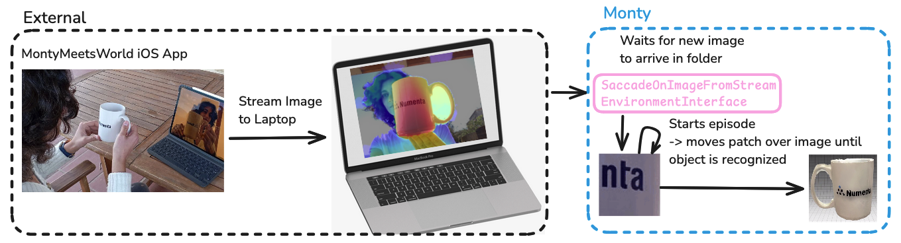
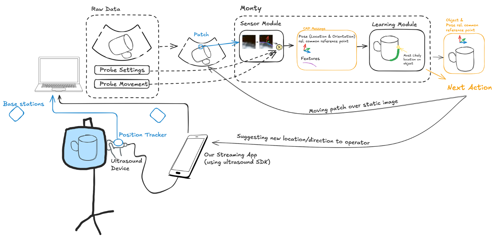
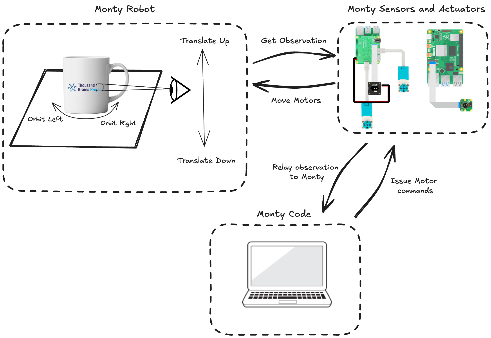

> ❗️ This is an Advanced Tutorial
> If you've arrived at this page and you're relatively new to Monty, then we would recommend you start by reading some of our other documentation first. Once you're comfortable with the core concepts of Monty, then we think you'll enjoy learning about how to apply it to robotics in the following tutorial!

# Introduction
As Monty is a sensorimotor learning system, robotics is a large application area that naturally comes to mind. This tutorial explains in more detail how Monty can be used for robotics applications outside a simulator. It builds on the [previous tutorial](./using-monty-in-a-custom-application.md), so if you haven't read it yet, we highly recommend starting there.

# Monty <-> Robot Interface
Currently, Monty relies on a couple of dependencies that [can NOT be installed on standard robotics hardware, such as the Raspberry Pi](https://github.com/thousandbrainsproject/tbp.monty/issues/85). We are working on removing those from the default dependencies, but for now, we recommend not running Monty on the robot's hardware directly. Instead, one can **stream the sensor outputs and action commands back and forth, between lightweight code running on the physical system, and Monty running on a laptop** (or other cloud computing infrastructure). This has the advantage of simplifying debugging and visualizing what happens in Monty. It also makes it easier to run more complex instances of Monty (many learning modules) without running into the limitations of on-device computational power. For some applications, the additional delay of streaming the data may cause issues, and future work will investigate how big of a problem this is and how we can allow Monty to run on the device in those cases.

When choosing hardware to use with Monty, we recommend thinking through certain requirements in advance to avoid pain points later on. In particular, Monty's performance depends on its ability to accurately map its observations into a fixed reference frame. For this to be successful, we recommend designing your system so that it can accurately measure the following:
   - **An object's position relative to the sensor**. Example: A well-calibrated RGBD camera with precise, consistent depth measurements.
   - **A sensor's position and orientation relative to the robot's body**. Example: A swiveling camera fixed to a platform by a vertical rod, where the rod's dimensions and mounting points are known, and the swiveling mechanism provides up-to-date measurements of its current angle.
   - **The robot's position and orientation.**. Example: A handheld device whose position and orientation are measured by external (6DoF) trackers. In principal, one can use relative changes to update a pose estimate in place of external tracking. In practice, the updating method introduces drift which can quickly become a problem. It may be easier to use external trackers, depending on the setting. Otherwise, plan on having a way to minimize or compensate for drift.

# Example 1: Monty Meets World iPad App
Monty Meets World is the code name for our first demo of Monty on real-world data. For a video of this demo, see our [project showcase page](https://thousandbrainsproject.readme.io/docs/project-showcase#monty-for-object-detection-with-the-ipad-camera). In a previous tutorial we showed how we can recognize objects and their pose from a dataset collected with the iPad camera. Now we will turn this into a live demo where the iPad directly streams its camera image to Monty.

In this application, we wrote a [MontyMeetsWorld iOS app](https://github.com/thousandbrainsproject/monty_lab/tree/main/monty_meets_world ) that runs locally on the iPad (or iPhone). The app has a button that the user can press to take an image with the user-facing TrueDepth camera. When a picture is taken, it is streamed to a server running locally on a laptop, where it gets saved in a dedicated folder. At the same time, Monty is running on the laptop.

Monty is configured to use the `SaccadeOnImageFromStreamEnvironmentInterface`. The environment interface's `pre_epoch` function calls `switch_to_scene` on the `SaccadeOnImageFromSteamEnvironment`, which does nothing until a new image is found in the dedicated folder. Once it detects that a new image was saved there, it loads this image, and the episode starts. The environment interface then moves a small patch over the image (the same way as in the non-streamed version explained in the [previous tutorial](./using-monty-in-a-custom-application.md)) and sends the observations from the moving patch to Monty until Monty recognizes the object. After that, it ends the current episode and returns to waiting for the next image, which will start the next episode.

Note that in this example, we are not controlling any external actuators. All of Monty's movements happen virtually by moving a small patch over the larger image. In theory, there is nothing preventing Monty from streaming an action command back to the robot. However, in this case, there isn't an automated way to move an iPad in space. There could be an option to move the iPad manually and send this movement information to Monty along with the sensed image. However, this would require movement tracking of the iPad which was out of the scope of the five-day hackathon when we implemented this.

> 📘 Follow Along
> If you would like to test the MontyMeetsWorld app, you can find code and run instructions [here](https://github.com/thousandbrainsproject/monty_lab/tree/main/monty_meets_world). To run the demo there are three main steps involved:
> 1)  Open the MontyMeetsWorld project in XCode and run the iOS app on your iPad or iPhone (instructions in [this README](https://github.com/thousandbrainsproject/monty_lab/blob/main/monty_meets_world/README.md))
> 2) Start a server on your laptop to listen for images streamed from the app by running `python src/tbp/monty/frameworks/environment_utils/server.py`
> 3) Start a Monty experiment that will wait for an image to be received and then run an episode to recognize the object. Use this command in a separate terminal window (while the server script and app are running): `python benchmarks/run.py -e world_image_from_stream_on_scanned_model`
>
> Make sure to set your WiFi's IP address in the server.py script and the app settings on your device. Then, once the app, the server, and the Monty Experiment are running, you can show an object to the camera and press the `Save Image` button in the app.

# Example 2: Ultrasound

During the [2025 Robot Hackathon](https://thousandbrains.org/2025-05-robot-hackathon/) a working version of the Ultrasound application was prototyped. You can see the code here: https://github.com/thousandbrainsproject/ultrasound_perception

For the ultrasound demo project, we went through the same thought process as outlined for any Monty application in the [previous tutorial](./using-monty-in-a-custom-application.md). We needed to define observations, movement, and how movement affects the state of the sensor and its observations. The sensor is a handheld ultrasound device. In this case, Monty is not actively moving the sensor. Instead, a human operator moves the ultrasound device while Monty can (optionally) suggest positions that the operator should move the sensor to. Although Monty is not actively moving the sensor, it still needs to know how the sensor is moving. For this, we decided to attach a [Vive Tracker](https://github.com/snuvclab/Vive_Tracker) to the ultrasound device, which uses two wall-mounted base stations to track the pose (6DOF location and orientation) of the sensor in the room.

Both the location information and the ultrasound recordings are streamed to a laptop that runs Monty. To stream the ultrasound data, we can write a small iOS app, similar to the MontyMeetsWorld app, using the ultrasound device SDK. Once the ultrasound image arrives on the laptop, Monty can move a small patch over it. It can also use the tracked sensor location in the room to integrate the physical movement of the probe.

A custom sensor module can then extract features and poses from the ultrasound image. The pose could be extracted from the surface normal detected at borders in the patch. Features could summarize information about measured density and texture.

For the first test, we recognize 3D objects inside a phantom (a clear bag filled with fluid). For simplicity, the objects can be learned beforehand in simulation, similar to the Monty Meets World application. However, since we have 6DOF pose tracking of the sensor, we can also learn the objects directly from the ultrasound data in the real world.

Monty can use three types of action output to recognize the sensed objects efficiently.
1) It can move the patch over the full ultrasound image, akin to moving it over the full camera image from the iPad.
2) It can suggest a location in the room for the human operator to move the ultrasound probe to in order to get a different view.
3) It can adjust the settings of the probe, such as depth of field and gain. These are not required for object recognition to work, but they can help make recognition more efficient and robust.

> 📘 Follow Along
>
> If you’re curious to see how this was set up, you can check out the [Ultrasound Perception repository](https://github.com/thousandbrainsproject/ultrasound_perception).
> See the videos and more pictures on the [showcase page](../../community/project-showcase.md#ultrasound_perception)

# Example 3: LEGO-Based Robot

During the [2025 Robot Hackathon](https://thousandbrains.org/2025-05-robot-hackathon/) a working version of the LEGO robot application was prototyped. You can see the code here: https://github.com/thousandbrainsproject/everything_is_awesome

This robot used Monty to explore and learn about real-world objects. This project was our first full integration of Monty with a physical robot that could sense the environment on it's own and move in 3D space.

The robot was built from LEGO Technic parts, Raspberry Pi boards, and off-the-shelf sensors. We used two Pis, one to control the motors and read from a depth sensor, and another to read the RGB image sensor.
Monty itself ran on a nearby laptop, which communicated with the robot over a local Wi-Fi network. This setup allowed us to keep the computation off the robot while still enabling real-time streaming of sensor data and motor commands.

Rather than move the entire robot around an object, we placed the object on a rotating platform. As the object turned, the robot’s camera experienced the same kind of movement as if the robot were orbiting the object. This trick made things simpler mechanically while still allowing Monty to build a 3D model of the object using its depth and RGB observations.

The core idea behind the project was to create a real robot that could explore the target object, learn what it looks like, and later recognize it, even if it was moved or rotated.
It was exciting to see Monty, originally tested in simulated environments, start to perceive and interact with the physical world in real time.

> 📘 Follow Along
>
> If you’re curious to see how this was set up, you can check out the [Everything Is Awesome repository](https://github.com/thousandbrainsproject/everything_is_awesome).
> We include the parts list, Raspberry Pi setup guides, custom `everything_is_awesome` classes and some project visualizations.
> See the videos and more pictures on the [showcase page](../../community/project-showcase.md#lego-robot)

# Conclusion
The current solution for running Monty on robots is to stream the sensor data and action commands back and forth between the robot and a Monty instance running on a laptop. Outside of that, defining a custom environment interface for Monty is analogous to how it was outlined in the [previous tutorial](./using-monty-in-a-custom-application.md).
