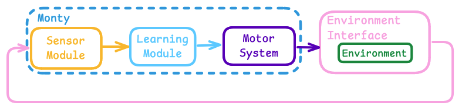
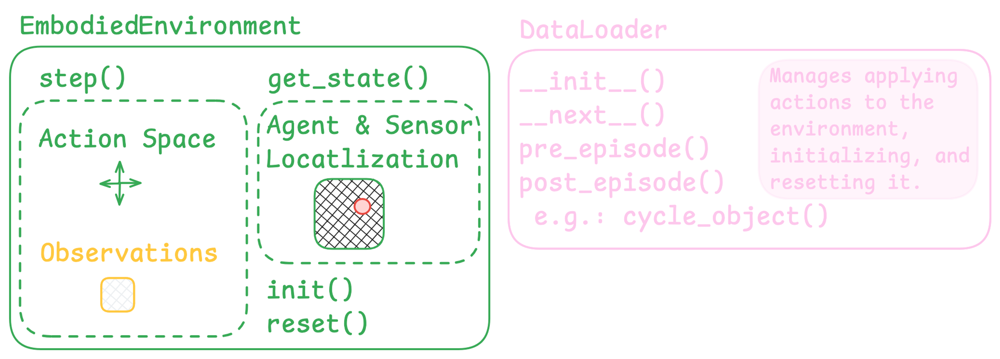
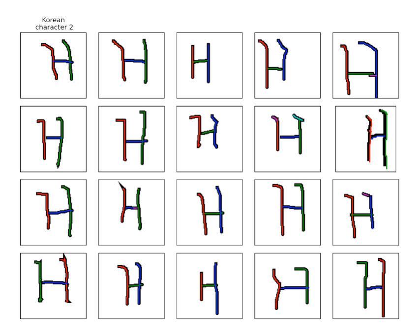

> ⚠️ This is an Advanced Tutorial
> If you've arrived at this page and you're relatively new to Monty, then we would recommend you start by reading some of our other documentation first. Once you're comfortable with the core concepts of Monty, then we think you'll enjoy learning about how to apply it to custom applications in the following tutorial!

# Introduction
Monty aims to implement a **general-purpose algorithm for understanding and interacting with the world**. It was designed to be very modular so that the same Monty configuration can be tested in many different environments and various Monty configurations can be compared in the same environment. Up to now, the tutorials have demonstrated Monty in a simulated environment (HabitatSim) where a sensor explores 3D objects and recognizes their ID and pose. Here, we will show you how to use Monty in other environments.

## What Kind of Applications can Monty Be Used For?
**Monty is a sensorimotor modeling system. It is NOT made for learning from static datasets** (although some can be framed to introduce movement, such as the Omniglot example below). Any application where you want to use Monty should have some concept of movement and how movement will change the state of the agent and what is being observed.

> ⚠️ Monty Currently Expects Movement to be in 3D Euclidean Space
In the current implementation, movement should happen in 3D (or less) space and be tracked using Euclidean location coordinates. Although we are convinced that the basic principles of Monty will also apply to abstract spaces ([potentially embedded in 3D space](https://thousandbrains.discourse.group/t/abstract-concept-in-monty/533/4)) and we know that the [brain uses different mechanisms to encode space](https://youtu.be/zRRazfFstvY), the current implementation relies on 3D Euclidean space.

# Customizing Monty for Your Application
The diagram below shows the base abstract classes in Monty. For general information on how to customize those classes, see our guide on [Customizing Monty](../customizing-monty.md).
The Experiment class coordinates the experiment (learning and evaluation). It initializes and controls Monty and the environment and coordinates the interaction between them.
The `EmbodiedEnvironment` class is wrapped in a DataSet class, which can be accessed using a DataLoader. An experiment can have two data loaders associated with it: one for training and one for evaluation.

> ⚠️ Subject to Change in the Near Future
 The use of `DataSet` and `DataLoader` follows common PyTorch conventions. However, since Monty is not made for static datasets, we plan to refactor this to be more analogous to environment interfaces used, for instance, in reinforcement learning.
 Additionally, we are working on cleaning up the data access between the motor system, data loader, and dataset (grey arrows).


Information flow in Monty implements a sensorimotor loop. Observations from the environment are first processed by the sensor module. The resulting CMP-compliant output is then used by the learning modules to model and recognize what it is sensing. The learning modules can suggest an action (`GoalState`) to the motor system at each step. The motor system decides which action to execute and translates it into motor commands. The data loader then uses this action to extract the next observation from the dataset, which in turn gets it from the environment. The next observation is sent to the sensor module(s) and the loop repeats.



Additionally, the DataLoader and Environment can implement specific functions to be executed at different points in the experiment, such as resetting the agent position and showing a new object or scene at the beginning of a new episode.

To use Monty in a custom environment, you usually need to customize the `DataLoader` and `EmbodiedEnvironment` classes. For example, if you look back at the previous tutorials, you will see that for those Habitat experiments, we've been using the `EnvironmentDataLoaderPerObject` and the `HabitatEnvironment`. The diagram below shows some key elements that need to be defined for these two classes. It's best to start thinking about the environment setup first, as this will force you to think through how to structure your application correctly for Monty to tackle.


### EmbodiedEnvironment
The first thing to figure out is how movement should be defined in your environment. What actions are possible, and how do these actions change the agent's state and observations?

If you are working with an existing environment, such as one used for reinforcement learning (for example, `gym` environments or the Habitat environment we are using), you might just need to wrap this into the `.step()` function of your custom `EmbodiedEnvironment` class such that when `env.step(actions)` is called, an observation is returned. If you work with an application that isn't already set up like that, defining how actions lead to the next observation may be more involved. You can look at the `OmniglotEnvironment` or `SaccadeOnImageEnvironment` as examples (more details below).

The observations should be returned as a nested dictionary with one entry per agent in the environment. Each agent should have sub-dictionaries with observations for each of its sensors. For example, if there is one agent with two sensors that each sense two types of features, it would look like this:

```
obs = {
	"agent_id_0": {
    	"patch_0": {
        	"depth": depth_sensed_by_patch_0,
        	"rgba": rgba_sensed_by_patch_0
    	},
    	"patch_1": {
        	"depth": depth_sensed_by_patch_1,
        	"semantic": semantic_sensed_by_patch_1,
    	},
	}
}
```

Related to defining how actions change observations, you will also need to define how actions change the state of the agent. This is what the `get_state()` function returns. The returned state needs to be a dictionary with an entry per agent in the environment. The entry should contain the agent's position and orientation relative to some global reference point. For each sensor associated with that agent, a sub-dictionary should return the sensor's position and orientation relative to the agent.

For example, if you have one agent with two sensors, the state dictionary could look like this:
```
state = {
	"agent_id_0": {
		"position": current_agent_location,
		"rotation": current_agent_orientation,
    	"sensors": {
        	"patch_0.depth": {
            	"rotation": current_depth_sensor_orientation,
            	"position": current_depth_sensor_location,
        	},
        	"patch_0.rgba": {
            	"rotation": current_rgba_sensor_orientation,
            	"position": current_rgba_sensor_orientation,
        	},
    	},
	}
}
```

Lastly, you need to define what happens when the environment is initialized (`__init__()`), when it is reset (`reset()`, usually at the end of an episode), and when it is closed (`close()`, at the end of an experiment). Resetting could include loading a new scene, resetting the agent position, or changing the arrangement of objects in the environment. It might also reset some of the environment's internal variables, such as step counters. Note that, as customary for RL environments, the `reset()` function is also expected to return an observation.

### DataLoader
The `EnvironmentDataLoader` manages retrieving observations from the `EmbodiedEnvironment` given actions. The EmbodiedEnvironment, in turn, applies basic transforms to the raw observations from the environment.

The `EnvironmentDataLoader` should define all the key events at which the environment needs to be accessed or modified. This includes initializing the environment (`__init__()`), retrieving the next observation (`__next__()`), and things that happen at the beginning or end of episodes and epochs (`pre_episode()`, `post_episode()`, `pre_epoch()`, `post_epoch()`). Note that not all of those are relevant to every application.

Think about how your experiment should be structured. What defines an episode? What happens with the environment at the beginning or end of each episode? What happens at the beginning or end of epochs? Does anything need to happen at every step besides retrieving the observation and environment state?

## Example 1: Omniglot
As one of Monty's strengths is the ability to learn from small amounts of data, one interesting application is the [Omniglot dataset](https://github.com/brendenlake/omniglot). It contains drawings of 1623 characters from 50 alphabets. Each of the characters is drawn 20 times by different people, as shown below.


Since this is a static dataset, and Monty is a sensorimotor learning system, we first have to define how movement looks on this dataset. A sensor module in Monty always receives a small patch as input and the learning module then integrates the extracted features and locations over time to learn and infer complete objects. So, in this case, we can take a small patch on the character (as shown on the right in the figure below) and move this patch further along the strokes at each step. Following the strokes is easy in this case as the Omniglot dataset also contains the temporal sequence of x,y, and z coordinates in which the characters were drawn (the example image above is colored by the order in which the strokes were drawn but also within each stroke we have access to the temporal sequence in which it was drawn). If this information were unavailable, the patch could be moved arbitrarily or use heuristics such as following the sensed principal curvature directions.


At each step, the sensor module will extract a location and pose in a common reference frame and send it to the learning module. To define the pose at each location, we extract a [surface normal and two principal curvature directions](https://thousandbrainsproject.readme.io/docs/observations-transforms-sensor-modules#surface-normals-and-principle-curvatures) from a gaussian smoothed image of the patch. As you can see in the images below, the surface normal will always point straight out of the image (as this is a 2D image, not a 3D object surface) and the first principal curvature direction aligns with the stroke direction while the second one is orthogonal to it. The learning module then stores those relative locations and orientations in the model of the respective character and can use them to recognize a character during inference.


Learning and inference on Omniglot characters can be implemented by writing two custom classes, the [OmniglotEnvironment](https://github.com/thousandbrainsproject/tbp.monty/blob/4bc857580ae6ac015586af1a61b3e292a7827b6f/src/tbp/monty/frameworks/environments/two_d_data.py#L61) and the [OmniglotDataLoader](https://github.com/thousandbrainsproject/tbp.monty/blob/4bc857580ae6ac015586af1a61b3e292a7827b6f/src/tbp/monty/frameworks/environments/embodied_data.py#L920):
1. `OmniglotEnvironment`:
   - Defines initialization of all basic variables in the `__init__(patch_size, data_path)` function.
   - In this example, we define the action space as `None` because we give Monty no choice in how to move. The step function just returns the next observation by following the predefined stroke order in the dataset. Note this will still be formulated as a sensorimotor task, as the retrieval of the next observation corresponds to a (pre-defined) movement and we get a relative displacement of the sensor.
   - Defines the `step(actions)` function, which uses the current `step_num` in the episode to determine where we are in the stroke sequence and extracts a patch around that location. It then returns a Gaussian smoothed version of this patch as the observation.
   - Defines `get_state()`, which returns the current x, y, z location on the character as a state dict (z is always zero since we are in 2D space here).
   - Defines `reset()` to reset the `step_num` counter and return the first observation on a new character.
   - Helper functions such as 
     - `switch_to_object` and `load_new_character_data` to load a new character
     - `get_image_patch(img, loc, patch_size)` to extract the patch around a given pixel location
     - `motor_to_locations` to convert the movement information from the Omniglot dataset into locations (pixel indices) on the character image
2. `OmniglotDataLoader`:
   - Defines initialization of basic variables such as episode and epoch counters in the `__init__` function
   - Defines the `post_episode` function, which calls `cycle_object` to call the environment's `switch_to_object` function. Using the episode and epoch counters, it keeps track of which character needs to be shown next.


An experiment config for training on the Omniglot dataset can then look like this:
```
omniglot_training = dict(
	experiment_class=MontySupervisedObjectPretrainingExperiment,
	experiment_args=ExperimentArgs(
    	n_train_epochs=1,
    	do_eval=False,
	),
	logging_config=PretrainLoggingConfig(
    	output_dir=pretrain_dir,
	),
	monty_config=PatchAndViewMontyConfig(
    	# Take 1 step at a time, following the drawing path of the letter
    	motor_system_config=MotorSystemConfigInformedNoTransStepS1(),
    	sensor_module_configs=omniglot_sensor_module_config,
	),
	dataset_args=OmniglotDatasetArgs(),
	train_dataloader_class=ED.OmniglotDataLoader,
	# Train on the first version of each character (there are 20 drawings for each
	# character in each alphabet, here we see one of them). The default
	# OmniglotDataloaderArgs specify alphabets = [0, 0, 0, 1, 1, 1] and
    # characters = [1, 2, 3, 1, 2, 3]) so in the first episode we will see version 1
	# of character 1 in alphabet 0, in the next episode version 1 of character 2 in
	# alphabet 0, and so on.
	train_dataloader_args=OmniglotDataloaderArgs(versions=[1, 1, 1, 1, 1, 1]),
)
```

And a config for inference on those trained models could look like this:
```python
omniglot_inference = dict(
    experiment_class=MontyObjectRecognitionExperiment,
    experiment_args=ExperimentArgs(
        model_name_or_path=pretrain_dir + "/omniglot_training/pretrained/",
        do_train=False,
        n_eval_epochs=1,
    ),
    logging_config=LoggingConfig(),
    monty_config=PatchAndViewMontyConfig(
        monty_class=MontyForEvidenceGraphMatching,
        learning_module_configs=dict(
            learning_module_0=dict(
                learning_module_class=EvidenceGraphLM,
                learning_module_args=dict(
                    # xyz values are in larger range so need to increase mmd
                    max_match_distance=5,
                    tolerances={
                        "patch": {
                            "principal_curvatures_log": np.ones(2),
                            "pose_vectors": np.ones(3) * 45,
                        }
                    },
                    # Surface normal always points up, so they are not useful
                    feature_weights={
                        "patch": {
                            "pose_vectors": [0, 1, 0],
                        }
                    },
                    hypotheses_updater_args=dict(
                        # We assume the letter is presented upright
                        initial_possible_poses=[[0, 0, 0]],
                    )
                ),
            )
        ),
        sensor_module_configs=omniglot_sensor_module_config,
    ),
    dataset_args=OmniglotDatasetArgs(),
    eval_dataloader_class=ED.OmniglotDataLoader,
    # Using version 1 means testing on the same version of the character as trained.
    # Version 2 is a new drawing of the previously seen characters. In this small test
    # setting these are 3 characters from 2 alphabets.
    eval_dataloader_args=OmniglotDataloaderArgs(versions=[1, 1, 1, 1, 1, 1]),
    # eval_dataloader_args=OmniglotDataloaderArgs(versions=[2, 2, 2, 2, 2, 2]),
)
```

> 📘 Follow Along
> To run the above experiment, you first need to download the [Omniglot dataset](https://github.com/brendenlake/omniglot). You can do this by running `cd ~/tbp/data` and `git clone https://github.com/brendenlake/omniglot.git`. You will need to unzip the `omniglot/python/images_background.zip` and `omniglot/python/strokes_background.zip` files.

To test this, go ahead and copy the configs above into the `benchmarks/configs/my_experiments.py` file. To complete the configs, you will need to add the following imports, sensor module config and model_path at the top of the file.
```python
import os
from dataclasses import asdict

import numpy as np

from benchmarks.configs.names import MyExperiments
from tbp.monty.frameworks.config_utils.config_args import (
	LoggingConfig,
	MotorSystemConfigInformedNoTransStepS1,
	PatchAndViewMontyConfig,
	PretrainLoggingConfig,
)
from tbp.monty.frameworks.config_utils.make_dataset_configs import (
	ExperimentArgs,
	OmniglotDataloaderArgs,
	OmniglotDatasetArgs,
)
from tbp.monty.frameworks.environments import embodied_data as ED
from tbp.monty.frameworks.experiments import (
	MontyObjectRecognitionExperiment,
	MontySupervisedObjectPretrainingExperiment,
)
from tbp.monty.frameworks.models.evidence_matching.learning_module import (
	EvidenceGraphLM
)
from tbp.monty.frameworks.models.evidence_matching.model import (
	MontyForEvidenceGraphMatching
)
from tbp.monty.frameworks.models.sensor_modules import (
	DetailedLoggingSM,
	HabitatDistantPatchSM,
)

monty_models_dir = os.getenv("MONTY_MODELS")

pretrain_dir = os.path.expanduser(os.path.join(monty_models_dir, "omniglot"))

omniglot_sensor_module_config = dict(
	sensor_module_0=dict(
    	sensor_module_class=HabitatDistantPatchSM,
    	sensor_module_args=dict(
        	sensor_module_id="patch",
        	features=[
            	"pose_vectors",
            	"pose_fully_defined",
            	"on_object",
            	"principal_curvatures_log",
        	],
        	save_raw_obs=False,
        	# Need to set this lower since curvature is generally lower
        	pc1_is_pc2_threshold=1,
    	),
	),
	sensor_module_1=dict(
    	sensor_module_class=DetailedLoggingSM,
    	sensor_module_args=dict(
        	sensor_module_id="view_finder",
        	save_raw_obs=False,
    	),
	),
)
```

Finally, you will need to set the `experiments` variable at the bottom of the file to this:
```
experiments = MyExperiments(
	omniglot_training=omniglot_training,
	omniglot_inference=omniglot_inference,
)
```
And add the two experiments into the `MyExperiment` class in `benchmarks/configs/names.py`.

Now you can run training by calling `python benchmarks/run.py -e omniglot_training` and then inference on these models by calling `python benchmarks/run.py -e omniglot_inference`. You can check the `eval_stats.csv` file in `~/tbp/results/monty/projects/monty_runs/omniglot_inference/` to see how Monty did. If you copied the code above, it should have recognized all six characters correctly.

> ❗️ Generalization Performance on Omniglot is Bad Without Hierarchy
> Note that we currently don't get good generalization performance on the Omniglot dataset. If you use the commented-out dataset_args (`eval_dataloader_args=OmniglotDataloaderArgs(versions=[2, 2, 2, 2, 2, 2])`) in the inference config, which shows previously unseen versions of the characters, you will see that performance degrades a lot. This is because the Omniglot characters are fundamentally compositional objects (strokes relative to each other), and compositional objects can only be modeled by stacking two learning modules hierarchically. The above configs do not do this. Our research team is hard at work getting Monty to model compositional objects.
 
## Example 2: Monty Meets World
Monty Meets World is the code name for our first demo of Monty on real-world data. For a video of this momentous moment (or is that Montymentous?), see our [project showcase page](https://thousandbrainsproject.readme.io/docs/project-showcase#monty-for-object-detection-with-the-ipad-camera).

In this application we test Monty's object recognition skills on 2.5D images, which means a photograph that includes depth information (RGBD). In this case, the pictures are taken with the iPad's TrueDepth camera (the user-facing camera used for face recognition).

In this use case, we assume that Monty has already learned 3D models of the objects, and we just test its inference capabilities. For training, we scanned a set of real-world objects using photogrammetry, providing us with 3D models of the objects. You can find instructions to download this `numenta_lab` dataset [here](https://thousandbrainsproject.readme.io/docs/benchmark-experiments#monty-meets-world). We then render those 3D models in Habitat and learn them by moving a sensor patch over them, just as we do with the YCB dataset. We train Monty in the 3D simulator because in the 2D image setup, Monty has no way of moving around the object and, therefore, would have a hard time learning complete 3D models.


To run this pre-training yourself, you can use the [only_surf_agent_training_numenta_lab_obj](https://github.com/thousandbrainsproject/tbp.monty/blob/2518a246214d8a487e1054da8ac57269e5014399/benchmarks/configs/pretraining_experiments.py#L237) config. Alternatively, you can download the pre-trained models using the [benchmark experiment instructions](https://thousandbrainsproject.readme.io/docs/benchmark-experiments#monty-meets-world).

For inference, we use the RGBD images taken with the iPad camera. Movement is defined as a small patch on the image moving up, down, left, and right. At the beginning of an episode, the depth image is converted into a 3D point cloud with one point per pixel. The sensor's location at every step is then determined by looking up the current center pixel location in that 3D point cloud. Each episode presents Monty with one image, and Monty takes as many steps as needed to make a confident classification of the object and its pose.


This can be implemented using two custom classes the [SaccadeOnImageEnvironment](https://github.com/thousandbrainsproject/tbp.monty/blob/4bc857580ae6ac015586af1a61b3e292a7827b6f/src/tbp/monty/frameworks/environments/two_d_data.py#L258) and [SaccadeOnImageDataLoader](https://github.com/thousandbrainsproject/tbp.monty/blob/4bc857580ae6ac015586af1a61b3e292a7827b6f/src/tbp/monty/frameworks/environments/embodied_data.py#L1014):
1. `SaccadeOnImageEnvironment`:
   - Defines initialization of all basic variables in the `__init__(patch_size, data_path)` function.
   - Defines the `TwoDDataActionSpace` to move up, down, left, and right on the image by a given amount of pixels.
   - Defines the `step(actions)` function, which uses the sensor's current location, the given actions, and their amounts to determine the new location on the image and extract a patch. It updates `self.current_loc` and returns the sensor patch observations as a dictionary.
   - Defines `get_state()`, which returns the current state as a dictionary. The dictionary mostly contains `self.current_loc` and placeholders for the orientation, as the sensor and agent orientation never change.
   - Helper functions such as 
     - `switch_to_object(scene_id, scene_version_id)` to load a new image
     - `get_3d_scene_point_cloud` to extract a 3D point cloud from the depth image
     - `get_next_loc(action_name, amount)` to determine valid next locations in pixel space
     - `get_3d_coordinates_from_pixel_indices(pixel_ids)` to get the 3D location from a pixel index
     - `get_image_patch(loc)` to extract a patch at a location in the image. 
  	These functions are all used internally within the `__init__`, `step`, and `get_state` functions (except for the `switch_to_object` function, which is called by the `SaccadeOnImageDataLoader`).
2. `SaccadeOnImageDataLoader`:
   - Defines initialization of basic variables such as episode and epoch counters in the `__init__` function.
   - Defines the `post_episode` function, which calls `cycle_object` to call the environment's `switch_to_object` function. Using the episode and epoch counters, it keeps track of which image needs to be shown next.


An experiment config can then look like this:
```
monty_meets_world_2dimage_inference = dict(
	experiment_class=MontyObjectRecognitionExperiment,
	experiment_args=EvalExperimentArgs(
    	model_name_or_path=model_path_numenta_lab_obj,
    	n_eval_epochs=1,
	),
	logging_config=ParallelEvidenceLMLoggingConfig(wandb_group="benchmark_experiments"),
	monty_config=PatchAndViewMontyConfig(
    	learning_module_configs=default_evidence_1lm_config,
    	monty_args=MontyArgs(min_eval_steps=min_eval_steps),
    	# move 20 pixels at a time
    	motor_system_config=MotorSystemConfigInformedNoTransStepS20(),
	),
	dataset_args=WorldImageDatasetArgs(
    	env_init_args=EnvInitArgsMontyWorldStandardScenes()
	),
	eval_dataloader_class=ED.SaccadeOnImageDataLoader,
	eval_dataloader_args=WorldImageDataloaderArgs(
    	scenes=list(np.repeat(range(12), 4)),
    	versions=list(np.tile(range(4), 12)),
	),
)
```
For more configs to test on different subsets of the Monty Meets World dataset (such as bright or dark images, hand intrusion, and multiple objects), you can find all RGBD image benchmark configs [here](../../../benchmarks/configs/monty_world_experiments.py).

> 📘 Follow Along
> To run this experiment, you first need to download our 2D image dataset called `worldimages`. You can find instructions for this [here](https://thousandbrainsproject.readme.io/docs/benchmark-experiments#monty-meets-world).
>
> You will also need to [download the pre-trained models](https://thousandbrainsproject.readme.io/docs/getting-started#42-download-pretrained-models). Alternatively, you can run pre-training yourself by running `python benchmarks/run.py -e only_surf_agent_training_numenta_lab_obj`. Running pre-training requires the Habitat simulator and [downloading the `numenta_lab` 3D mesh dataset](https://thousandbrainsproject.readme.io/docs/benchmark-experiments#monty-meets-world).

 Analogous to the previous tutorials, you can copy the config above into the `benchmarks/configs/my_experiments.py` file. You must also add `monty_meets_world_2dimage_inference: dict` to the `MyExperiments` class in `benchmarks/configs/names.py`. Finally, you will need to add the following imports at the top of the `my_experiments.py` file:
```
import os
from dataclasses import asdict

import numpy as np

from benchmarks.configs.defaults import (
	default_evidence_1lm_config,
	min_eval_steps,
	pretrained_dir,
)
from benchmarks.configs.names import MyExperiments
from tbp.monty.frameworks.config_utils.config_args import (
	MontyArgs,
	MotorSystemConfigInformedNoTransStepS20,
	ParallelEvidenceLMLoggingConfig,
	PatchAndViewMontyConfig,
)
from tbp.monty.frameworks.config_utils.make_dataset_configs import (
	EnvInitArgsMontyWorldStandardScenes,
	EvalExperimentArgs,
	WorldImageDataloaderArgs,
	WorldImageDatasetArgs,
)
from tbp.monty.frameworks.environments import embodied_data as ED
from tbp.monty.frameworks.experiments import MontyObjectRecognitionExperiment

model_path_numenta_lab_obj = os.path.join(
	pretrained_dir,
	"surf_agent_1lm_numenta_lab_obj/pretrained/",
)
```

To run the experiment, call `python benchmarks/run.py -e monty_meets_world_2dimage_inference`. If you don't want to log to wandb, add ` wandb_handlers=[]` to the `logging_config`. If you just want to run a quick test on a few of the images, simply adjust the `scenes` and `versions` parameters in the `eval_dataloader_args`.

# Other Things You May Need to Customize
If your application uses sensors different from our commonly used cameras and depth sensors, or you want to extract specific features from your sensory input, you will need to define a custom sensor module. The sensor module receives the raw observations from the dataloader and converts them into the CMP, which contains features at poses. For more details on converting raw observations into the CMP, see our [documentation on sensor modules](https://thousandbrainsproject.readme.io/docs/observations-transforms-sensor-modules).

If your application requires a specific policy to move through the environment or you have a complex actuator to control, you might want to implement a custom `MotorSystem` or `MotorPolicy` class. For more details on our existing motor system and policies, see our [documentation on Monty's policies](https://thousandbrainsproject.readme.io/docs/policy).

Writing those custom classes works the same way as it does for the `DataLoader` and `EmbodiedEnvironment` classes. For general information, see our documentation on [customizing Monty](https://thousandbrainsproject.readme.io/docs/customizing-monty).

# Conclusion
This tutorial was a bit more text than practical code. This is because every application is different, and we try to convey the general principles here. The first step for any application is to think about if and how the task can be phrased as a sensorimotor environment. What is Monty's action space? How is movement defined? How does it change observations? How do movement and sensation determine the sensor's location and orientation in space? This will then help you figure out how to define a custom `EmbodiedEnvironment` and `DataLoader` and their associated `__init__`, `step`, `get_state`,`reset`, `pre_episode`, and `post_episode` functions. If you run into issues customizing Monty to your application, please come over to our [Discourse Forum](https://thousandbrains.discourse.group/) and ask for help!
