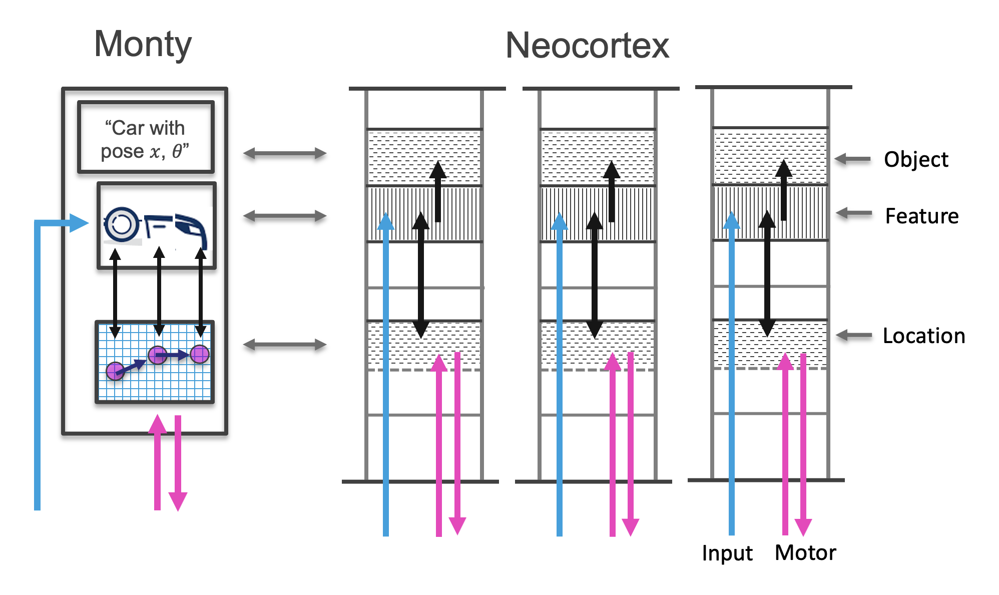

The basic building block for sensorimotor processing and modeling the output from the sensor module is a learning module. These are repeating elements, each with the same input and output information format. Each learning module should function as a stand-alone unit and be able to recognize objects on its own. Combining multiple learning modules can speed up recognition (e.g. recognizing a cup using five fingers vs. one), allows for learning modules to focus on storing only some objects, and enables learning compositional objects.

Learning modules receive either feature IDs from a sensor or estimated object IDs (also interpreted as features) from a lower-level learning module \[[1](#footnote1)]. The feature or object representation might be in the form of a discrete ID (e.g., the color red, a cylinder), or could be represented in a more high dimensional space (e.g., an SDR representing hue or corresponding to a fork-like object). Additionally, learning modules receive the feature's or object's pose relative to _the body_, where the pose includes location and rotation. In this way, pose relative to the body serves as a common reference frame for spatial computations, as opposed to the pose of features relative to each individual sensor. From this information higher level learning modules can build up graphs of compositional objects (e.g., large objects or scenes) and vote on the ID of the currently visible object(s).

The features and relative poses are incorporated into a model of the object. All models have an inductive bias towards learning the world as based in 3-dimensional space with an additional temporal dimension. However the exact structure of space can potentially be learned, such that the lower-dimensional space of a melody, or the abstract space of a family tree, can be represented. When interacting with the physical world, the 3D inductive bias is used to place features in internal models accordingly.

The learning module therefore encompasses two major principles of the TBT: Sensorimotor learning, and building models using reference frames. Both ideas are motivated by studies of cortical columns in the neocortex (see figure below).

Besides learning new models, the learning module also tries to match the observed features and relative poses to already learned models stored in memory. In addition to performing such inference within a single LM, an LM's current hypotheses can be sent through lateral connections to other learning modules using the cortical messaging protocol. We note again that the CMP is independent of modality, and as such, LMs that have learned objects in different modalities (e.g., vision vs. touch), can still 'vote' with each other to quickly reach a consensus. This voting process is inspired by the voting process described in Hawkins, Ahmad, and Cui, 2017. Unlike when the CMP is used for the input and output of an LM, votes consist of multiple CMP-compliant messages, representing the union of multiple possible object hypotheses.

To generate the LM's output, we need to get the pose of the sensed object relative to the body. We can calculate this from the current incoming pose (pose of the sensed feature relative to the body) and the poses stored in the model of the object. This pose of the object can then be passed hierarchically to another learning module in the same format as the sensory input (features at a pose relative to the body).

Once the learning module has determined the ID of an object and its pose, it can take the most recent observations (and possibly collect more) to update its model of this object. We can therefore continually learn more about the world and learning and inference are two intertwined processes.

# Footnotes

<a name="footnote1">1</a>: By **object**, we mean a discrete entity composed of a collection of one or more other objects, each with their own associated pose. As such, an object could also be a scene or any other composition of sub-objects. At the lowest level of object hierarchy, an object is composed of 'proto-objects' (commonly thought of as features), which are also discrete entities with a location and orientation in space, but which are output by the sensor modules; as such, these cannot be further decomposed into constituent objects. Wherever an object (or proto-object) is being processed at a higher level, it can also be referred to as a **feature**.
