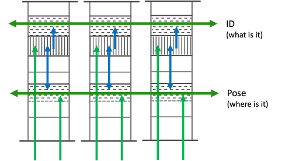

Below are additional details of the architecture, including how the three components outlined above interact. Further details of how these are implemented in Monty can be found in the following chapter.

# Learning on Different Spatial Scales (Hierarchy):

Learning modules can be stacked in a hierarchical fashion to process larger input patches and higher-level concepts. A higher-level learning module receives feature and pose information from the output of a lower-level module and/or from a sensor patch with a larger receptive field, mirroring the connectivity of the cortex. The lower-level LM never sees the entire object it is modeling at once but infers it either through multiple consecutive movements and/or voting with other modules. The higher-level LM can then use the recognized model ID as a feature in its own models. This makes it more efficient to learn larger and more complex models as we do not need to represent all object details within one model. It also makes it easier to make use of object compositionality by quickly associating different object parts with each other as relative features in a higher-level model.

# Learning on Different Time-Scales

Additionally to learning on different spatial scales, modules can learn on different temporal scales. A low-level module may slowly learn to model general input statistics while a higher-level module may quickly build up temporary graphs of the current state of the world, as a form of short-term memory. Of course, low-level modules may also be able to learn quickly, depending on the application. This could be implemented by introducing a (fixed or learnable) speed parameter for each learning module.

# Voting/Consensus

Learning modules have lateral connections to each other to communicate their estimates of the current object ID and pose. For voting, we use a similar feature-pose communication as we use to communicate to higher-level modules. However, in this case we communicate a union of all possible objects and poses under the current evidence (multiple messages adhering to the CMP). Through the lateral voting connections between modules they try to reach a consensus on which object they are sensing at the moment and its pose (see figure below). This helps to recognize objects faster than a single module could.

# Motor Input

The movement information (pose displacement) can be a copy of the selected action command (efference copy) or deduced from the sensory input. Without the efference copy, movement can for example be detected from optical flow or proprioception. Sensor modules use movement information to update their pose relative to the body. Learning modules use it to update their hypothesized location within an object's reference frame.

# Motor Output

Each learning module produces a motor output. The motor output is formalized as a goal state and also adheres to the common messaging protocol. The goal state could for example be generated using the learned models and current hypotheses by calculating a sensor state which would resolve the most uncertainty between different possible object models. It can also help to guide directed and more efficient exploration to known features in a reference frame stored in memory. Different policies can be leveraged depending on whether we are trying to recognize an object or trying to learn new information about an object.

Hierarchy can also be leveraged for goal-states, where a more abstract goal-state in a high-level learning module can be achieved by decomposing it into simpler goal-states for lower-level learning modules. Importantly, the same learning modules that learn models of objects are used to generate goal-states, enabling hierarchical, model-based policies, no matter how novel the task.

# Sub-Cortical Motor Areas

The architecture is an entire sensorimotor system. Each learning module receives sensory input and an efference copy of the motor command and outputs a feature-at-pose along with a motor command. Since many modules may produce conflicting motor commands (e.g., different patches on the retina cannot move in opposite directions) they usually need to be coordinated in a motor area. This motor area contains an action policy that decides which action commands to execute in the world based on the motor outputs from all learning modules. It also needs to translate the goal state outputs of the learning modules into motor commands for the actuators. It then sends this motor command to the actuators of the body and an efference copy of it back to the sensor modules.

In the brain, a lot of this processing occurs subcortically. Therefore in our system, we also don't need to resolve these issues within a learning module but can do it within a separate motor area. However, we need to keep in mind that the motor area does not know about the models of objects that are learned in the learning modules and therefore needs to receive useful model-based motor commands from the LMs.

# Predictions

Learned models in the memory of the learning module can be used to make predictions about future observations. If there are multiple models that match the current observations, the predictions would have more uncertainty attached to them. The prediction error can be used as a learning signal to update models or as a criterion for matching during object recognition.

Currently there is no prediction in time, although in the future such capabilities will be added via the inclusion of a temporal dimension. This will help support encoding behaviors of objects, as well as predictions that can be used for motor-policy planning. For example, the long-term aim is for the architecture to be able to predict how a simple object such as a stapler evolves as it is opened or closed, or to coarsely model the physical properties of common materials.
