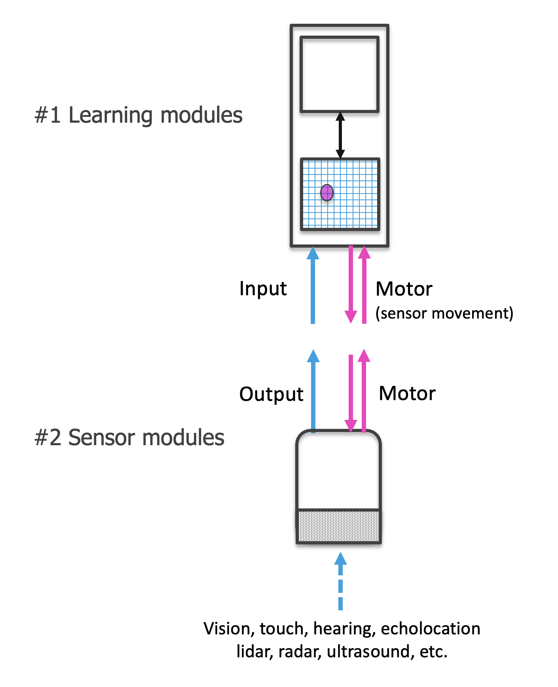

Each sensor module receives information from a small sensory patch as input. This is analogous to a small patch on the retina (as in the figure below), or a patch of skin, or the pressure information at one whisker of a mouse. One sensor module sends information to one learning module which models this information. Knowledge of the whole scene is integrated through the communication between multiple learning modules that each receive different patches of the input space or through time by one learning module moving over the scene.

The sensor module contains a sensor and associates the input to the sensor with a feature representation. The information processing within the sensor module can turn the raw information from the sensor patch into a common representation (e.g. a Sparse Distributed Representation or _SDR_) which could be compared to light hitting the retina and being converted into a spike train, the pulses of electricity emitted by biological neurons. Additionally, the feature pose relative to the body is calculated from the feature's pose relative to the sensor and the sensor pose relative to the body. This means each sensor module outputs its current pose (location and rotation) as well as the features it senses at that pose. We emphasize that the available pose information is central to how the architecture operates.

A general principle of the system is that **any processing specific to a modality happens in the sensor module**. The output of the sensor module is not modality-specific anymore and can be processed by any learning module. A crucial requirement here is that each sensor module knows the pose of the feature relative to the sensor. This means that sensors need to be able to detect features and poses of features. The system can work with any type of sensor (vision, touch, radar, LiDAR,...) and integrate information from multiple sensory modalities without effort. For this to work, sensors need to communicate sensory information in a common language.

