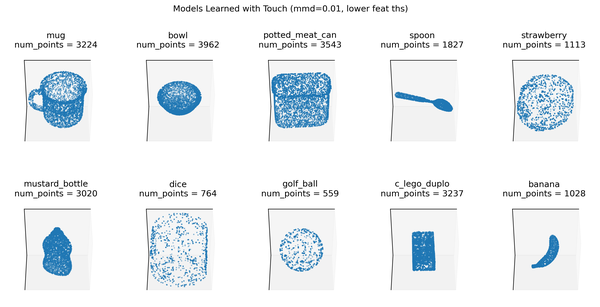
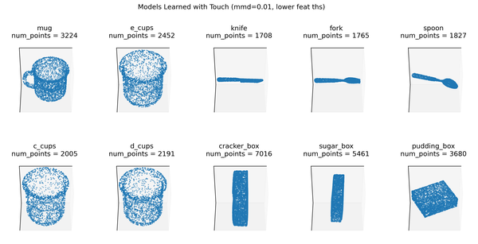
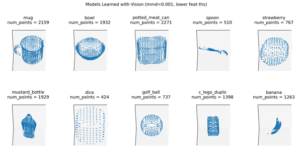
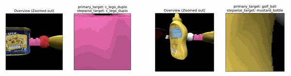

# Object and Pose Recognition on the YCB Dataset

## What Do We Test?

We split up the experiments into a short benchmark test suite and a long one. The short suite tests performance on a subset of 10 out of the 77 [YCB](https://www.ycbbenchmarks.com/) objects which allows us to assess performance under different conditions more quickly. Unless otherwise indicated, the 10 objects are chosen to be distinct in morphology and models are learned using the surface agent, which follows the object surface much like a finger. 

When building the graph we add a new point if it differs in location by more than 1cm from other points already learned, or its features are different from physically nearby learned points (a difference of 0.1 for hue and 1 for log curvature). Experiments using these models have `10distobj` in their name.




To be able to test the ability to distinguish similar objects (for example by using more sophisticated policies) we also have a test set of 10 similar objects (shown below) learned in the same way. Experiments using these models have `10simobj` in their name.




For experiments with multiple sensors and learning modules we currently only have a setup with the distant agent so we also have to train the models with the distant agent. These models have less even coverage of points since we just see the objects from several fixed viewpoints and can't move as freely around the object as we can with the surface agent. This is why these models have a few missing areas where parts of the object were never visible during training. In the 5LM experiments, each LM has learned slightly different models, depending on their sensor parameters. The image below shows the models learned in one LM. Results with one LM for comparability are given in the experiment marked with `dist_on_distm` (i.e., distant agent evaluated on distant-agent trained models). 




Configs with `multi` in the name have additional distractor objects, in addition to the primary target object. These experiments are designed to evaluate the model's ability to stay on an object until it is recognized. As a result, these are currently setup so that the agent should always begin on a "primary" target object, and recognition of this object is the primary metric that we evaluate. In addition however, there is a "step-wise" target, which is whatever object an LM's sensor is currently viewing; the ultimate MLH or converged ID of an LM is therefore also compared to the step-wise target that the LM was observing at the time. To make recognition of the primary target relatively challenging, distractor objects are added as close as possible along the horizontal axis, while ensuring that i) the objects do not clip into each other, and ii) that an initial view of the primary target is achieved at the start of the episode. Note these experiments cannot currently be run with multi-processing (the -m flag), as the Object Initializer classes need to be updated. Example multi-object environments are shown below. 




Configs with `_dist_agent` in the name use the distant agent for inference (by default they still use the models learned with the surface agent). This means that the sensor is fixed in one location and can only tilt up, down, left, and right following a random walk. When using the model-based hypothesis-testing policy, the agent can also "jump" to new locations in space. Configs with `surf_agent` in the name use the surface agent for inference which can freely move around the entire object. Both the surface and the distant agent can execute model-based actions using the hypothesis testing policy. For more details, see our documentation on [policies](../how-monty-works/policy.md).

Configs with `base` in their name test each object in the 14 orientations in which they were learned. No noise is added to the sensor.

Configs with `randrot` in their name test each object in 10 random, new rotations (different rotations for each object).

Configs with `noise` in their name test with noisy sensor modules where we add Gaussian noise to the sensed locations (0.002), point-normals (2), curvature directions (2), log curvatures (0.1), pose_fully_defined (0.01), and hue (0.1). Numbers in brackets are the standard deviations used for sampling the noisy observations. Note that the learned models were acquired without sensor noise. The image below should visualize how much location noise we get during inference but the LM still contains the noiseless models shown above.


Configs with `rawnoise` in the name test with noisy raw sensor input where Gaussian noise is applied directly to the depth image which is used for location, point normal, and curvature estimation. Here we use a standard deviation of 0.001. This allows us to test the noise robustness of the sensor module compared to testing the noise robustness of the learning module in the `noise` experiments.

Note that all benchmark experiments were performed with the total least-squares regression implementation for computing the point-normals, and the distance-weighted quadratic regression for the principal curvatures (with their default parameters).

## Shorter Experiments with 10 Objects

The following results are obtained from experiments using the 10-object subsets of the YCB dataset described above. `base` configs test with all 14 known rotations (10 objects * 14 rotations each = 140 episodes), and `randrot` configs test with 10 random rotations (10 objects * 10 rotation each = 100 episodes). All experiments were run on 16 CPUs with parallelization except for `base_10multi_distinctobj_dist_agent`; this experiment must be run without parallelization.

### Results

!table[../../benchmarks/results/ycb_10objs.csv]

## Longer Experiments With all 77 YCB Objects

The following results are obtained from experiments on the entire YCB dataset (77 objects). Since this means having 77 instead of 10 objects in memory, having to disambiguate between them, and running 77 episodes instead of 10 per epoch, these runs take significantly longer. Due to that we only test 3 known rotations ([0, 0, 0], [0, 90, 0], [0, 180, 0]) for the `base` configs and 3 random rotations for the `randrot` configs. The 5LM experiment is currently just run with 1 epoch (1 random rotation per object) but might be extended to 3. The 5LM experiment is run on 48 CPUs instead of 16.


### Results

!table[../../benchmarks/results/ycb_77objs.csv]

### Explanation of Some of the Results

- **Why does the distant agent do worse than the surface agent?**
  The distant agent has limited capabilities to move along the object. In particular, the distant agent currently uses an almost random policy which is not as efficient and informative as the surface agent which follows the principal curvatures of the object. Note however that both the distant and surface agent can now move around the object using the hypothesis-testing action policy, and so the difference in performance between the two is not as great as it previously was.

- **Why is the distant agent on the distant agent models worse than on the surface agent model?**
  As you can see in the figure above, the models learned with distant agent have several blind spots and unevenly sampled areas. When we test random rotations we may see the object from views that are underrepresented in the object model. If we use a 10% threshold instead of 20% we can actually get a little better performance with the distant agent since we allow it to converge faster. This may be because it gets less time to move into badly represented areas and because it reaches the time-out condition less often.

- **Why is the accuracy on distinct objects higher than on similar objects?**
  Since we need to be able to deal with noise, it can happen that objects that are similar to each other get confused. In particular, objects that only differ in some specific locations (like the fork and the spoon) can be difficult to distinguish if the policy doesn't efficiently move to the distinguishable features and if there is noise.

- **Why is raw sensor noise so much worse than the standard noise condition?**
  This is not related to the capabilities of the learning module but to the sensor module. Currently, our point normal and principal curvature estimates are not implemented to be very robust to sensor noise such that noise in the depth image can distort the point normal by more than 70 degrees. We don't want our learning module to be robust to this much noise in the point normals but instead want the sensor module to communicate better features. We already added some improvements on our point normal estimates which helped a lot on the raw noise experiment.

- **Why do the distant agent experiments take longer and have more episodes where the most likely hypothesis is used?**
  Since the distant agent policy is less efficient in how it explores a given view (random walk of tilting the camera), we take more steps to converge with the distant agent or sometimes do not resolve the object at all (this is when we reach a time-out and use the MLH). If we have to take more steps for each episode, the runtime also increases.

- **Why is the run time for 77 objects longer than for 10?**
  For one, we run more episodes per epoch (77 instead of 10) so each epoch will take longer. However, in the current benchmark, we test with fewer rotations (only 3 epochs instead of 14 or 10 epochs in the shorter experiments). Therefore the main factor here is that the number of evidence updates we need to perform at each step scales linearly with the number of objects an LM has in its memory (going down over time as we remove objects from our hypothesis space). Additionally, we need to take more steps to distinguish 77 objects than to distinguish 10 (especially if the 10 objects are distinct).

## Unsupervised Learning

In general, we want to be able to dynamically learn and infer instead of having a clear-cut separation between supervised pre-training followed by inference. We also want to be able to learn unsupervised. This is tested in the following experiment using the surface agent. We test the same 10 objects set as above with 10 fixed rotations. In the first epoch, each object should be recognized as new (no_match) leading to the creation of a new graph. The following episodes should correctly recognize the object and add new points to the existing graphs. Since we do not provide labels it can happen that one object is recognized as another one and then their graphs are merged. This can especially happen with similar objects but ideally, their graphs are still aligned well because of the pose recognition. It can also happen that one object is represented using multiple graphs if it was not recognized. Those scenarios are tracked with the `mean_objects_per_graph` and `mean_graphs_per_object` statistics.

An object is classified as detected correctly if the detected object ID is in the list of objects used for building the graph. This means, if a model was built from multiple objects, there are multiple correct classifications for this model. For example, if we learned a graph from a tomato can and later merge points from a peach can into the same graph, then this graph would be the correct label for tomato and peach cans in the future. This is also why the experiment with similar objects reaches a higher accuracy after the first epoch. Since in the first epoch we build fewer graphs than we saw objects (representing similar objects in the same model) it makes it easier later to recognize these combined models since, for this accuracy measure, we do not need to distinguish the similar objects anymore if they are represented in the same graph. In the most extreme case, if during the first epoch, all objects were merged into a single graph, then the following epochs would get 100% accuracy. As such, future work emphasizing unsupervised learning will also require more fine-grained metrics, such as a dataset with hierarchical labels that appropriately distinguish specific instances (peach-can vs tomato-can), from general ones (cans or even just "cylindrical objects").

## Results

!table[../../benchmarks/results/ycb_unsupervised.csv]

To obtain these results use `print_unsupervised_stats(train_stats, epoch_len=10)` (wandb logging is currently not written for unsupervised stats). Unsupervised, continual learning can, by definition, not be parallelized across epochs. Therefore these experiments were run without multiprocessing on the laptop (running on cloud CPUs works as well but since these are slower without parallelization these were run on the laptop).

# Monty-Meets-World

The following experiments evaluate a Monty model on real-world images derived from the RGBD camera of an iPad/iPhone device. The models that the Monty system leverages are based on photogrammetry scans of the same objects in the real world, and Monty learns on these in the simulated Habitat environment; this approach is taken because currently, we cannot track the movements of the iPad through space, and so Monty cannot leverage its typical sensorimotor learning to build the internal models.

These experiments have been designed to evaluate Monty's robustness to real-world data, and in this particular case, its ability to generalize from simulation to the real-world. In the world_image experiments, the model is evaluated on the aforementioned iPad extracted images, while in the randrot_noise_sim_on_scan_monty_world experiment, we evaluate the model in simulation at inference time, albeit with some noise added and with the distant agent fixed to a single location (i.e., no hypothesis-testing policy). This enables a reasonable evaluation of the sim-to-real change in performance. Furthermore, the world_image experiments are intended to capture a variety of possible adversarial settings.

The dataset itself consists of 12 objects, with some representing multiple instances of similar objects (e.g. the Numenta mug vs the terracotta mug, or the hot sauce bottle vs the cocktail bitters bottle). Each one of the world_image datasets contains 4 different views of each of these objects, for a total of 48 views for each dataset, or 240 views across all 5 real-world settings. The experimental conditions are i) standard (no adversarial modifications), ii) dark (low-lighting), iii) bright, iv) hand intrusion (a hand is significantly encircling and thereby occluding parts of the object), and v) multi-object (the first 2/4 images are the object paired with a similar object next to it, and the latter 2/4 images are the object paired with a structurally different object).

You can download the data:

| Dataset | Archive Format | Download Link |
| --- | --- | --- |
| worldimages | tgz | [worldimages.tgz](https://tbp-data-public-5e789bd48e75350c.s3.us-east-2.amazonaws.com/tbp.monty/worldimages.tgz) |
| worldimages | zip | [worldimages.zip](https://tbp-data-public-5e789bd48e75350c.s3.us-east-2.amazonaws.com/tbp.monty/worldimages.zip) |

Unpack the archive in the `~/tbp/data/` folder. For example:

```plaintext tgz
mkdir -p ~/tbp/data/

cd ~/tbp/data/

curl -L https://tbp-data-public-5e789bd48e75350c.s3.us-east-2.amazonaws.com/tbp.monty/worldimages.tgz | tar -xzf -
```
```plaintext zip
mkdir -p ~/tbp/data/

cd ~/tbp/data/

curl -O https://tbp-data-public-5e789bd48e75350c.s3.us-east-2.amazonaws.com/tbp.monty/worldimages.zip

unzip worldimages.zip
```

Finally, note that the world_image experimental runs **do not support running with multi-processing, so you cannot use the run_parallel.py script** when running these. This is because an appropriate object_init_sampler has yet to be defined for this experimental setup. All experiments are run with 16 CPUs for benchmarking purposes.

See the [monty_lab project folder](https://github.com/thousandbrainsproject/monty_lab/tree/main/monty_meets_world) for the code.

> [!NOTE]
> The `randrot_noise_sim_on_scan_monty_world` experiment requires HabitatSim to be installed as well as additional data containing the meshes for the simulator to use.
>
>You can download the data:
>
> | Dataset | Archive Format | Download Link |
> | --- | --- | --- |
> | numenta_lab | tgz | [numenta_lab.tgz](https://tbp-data-public-5e789bd48e75350c.s3.us-east-2.amazonaws.com/tbp.monty/numenta_lab.tgz) |
> | numenta_lab | zip | [numenta_lab.zip](https://tbp-data-public-5e789bd48e75350c.s3.us-east-2.amazonaws.com/tbp.monty/numenta_lab.zip) |
>
> Unpack the archive in the `~/tbp/data/` folder. For example:
>
> ```plaintext tgz
> mkdir -p ~/tbp/data/
>
> cd ~/tbp/data/
>
> curl -L https://tbp-data-public-5e789bd48e75350c.s3.us-east-2.amazonaws.com/tbp.monty/numenta_lab.tgz | tar -xzf -
> ```
> ```plaintext zip
> mkdir -p ~/tbp/data/
>
> cd ~/tbp/data/
>
> curl -O https://tbp-data-public-5e789bd48e75350c.s3.us-east-2.amazonaws.com/tbp.monty/numenta_lab.zip
>
> unzip numenta_lab.zip
> ```

### Results

!table[../../benchmarks/results/montymeetsworld.csv]

**Note that rotation errors are meaningless since no ground truth rotation is provided**

### Explanation of Some of the Results

- **Why is there such a drop in performance going from sim-to-real?**  
  Although there are likely a variety of factors at play, it is worth emphasizing that it is highly non trivial to learn on photogrammetry scanned objects, and then generalize to images extracted from an RGBD depth camera, as this is a significant shift in the source of data available to the model. Furthermore, note that due to structural similarity of several of the objects in the dataset to one another, it is not too surprising that the model may converge to an incorrect hypothesis given only a single view.
- **Why is the percent MLH used so high?**  
  Each episode is restricted to a single viewing angle of an object, resulting in significant ambiguity. Furthermore, episodes use a maximum of 100 matching steps so that these experiments can be run quickly.
- **Are there any other factors contributing to performance differences to be aware of?**  
  During the collection of some of the datasets, the "smoothing" setting was unfortunately not active; this affects the standard (world_image_on_scanned_model) dataset, as well as the bright and hand-intrusion experiments. Broadly, this appears to not have had too much of an impact, given that e.g., dark and bright perform comparably (with bright actually being better, even though it was acquired without smoothing). There appear to be a couple of images (around 5 out of the 240 images), where this has resulted in a large step-change in the depth reading, and as a result of this, the experiment begins with the model "off" the object, even though to a human eye, the initial position of the patch is clearly on the object. This will be addressed in a future update to the data-sets, where we can also implement any additional changes we may wish to make during data collection (e.g., more control of object poses, or the inclusion of motor data).
- **What steps should be noted when acquiring new images?**  
  In addition to ensuring that the "smoothing" option is toggled on (currently off by default), lie the iPad on its side, ensuring that the volume bottom is at the top, so that the orientation of images are consistent across the data-sets. In general, objects should be as close to the camera as possible when taking images, while ensuring the depth values do not begin to clip. 

# Future Capabilities

In the future, we will expand this test suite to cover more capabilities such as more multiple object scenarios (touching vs. occluding objects), compositional objects, object categories, distorted objects, different features on the same morphology, objects in different states, object behaviors, and abstract concepts.
