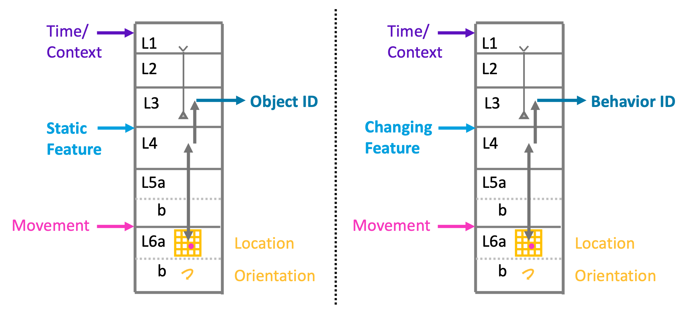
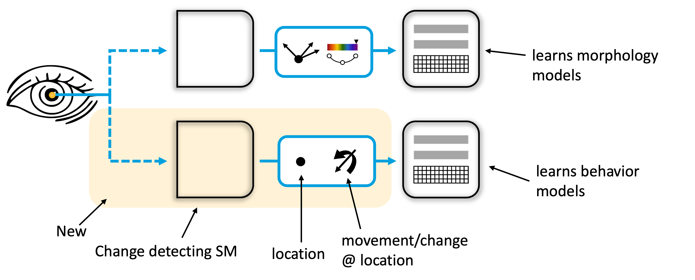

# Extending Monty to Learn Behaviors of Objects

The world is both static and dynamic. Some features of the world have a fixed arrangement relative to each other and don’t change over time. For example, the arrangement of edges and surfaces of a coffee cup or the arrangement of rooms in a house do not change from moment to moment. Sometimes, however, the arrangement of features in the world changes over time and in predictable ways. For example, a stapler does not have a fixed morphology; it can open and close and emit staples, a traffic light can change color, a human can move its limbs to run, and a lever may rotate, causing a door to open. We refer to these changes as object behaviors.

Learning the behaviors of objects is an essential component of any intelligent system. If an intelligent system is going to generate novel behaviors, it first needs to learn the behaviors of objects and then enact those behaviors in both familiar and novel situations.

In the TBT, static objects are learned as a set of features at poses (location and orientation) in a reference frame. There is an assumption that the features are not changing or moving, therefore, the existing theory and implementation work well for representing static structure. Here, we describe how to extend the TBT to learn the dynamic structure of the world.

# Learning Object Behaviors is an Extension of the Current Theory

To learn and represent object behaviors, we use the same mechanism as we use for learning static structure. The main difference is what the input features represent. In the static models, the features are also static, such as the edge of a mug. In the dynamic models, the features represent changes, such as the moving edge of a stapler top as it opens. Static features are stored at locations in static/morphology models, and changing features are similarly stored at locations in behavior models. Additionally, behaviors occur over time. As a stapler opens, the locations where moving edges occur change over time. Therefore, behavior models are sequences of changes at locations.

Static models and dynamic models are learned in separate reference frames, but they share sensor patches and how the sensor patch is moving. Therefore, when we observe a stapler, we can simultaneously learn both the morphology of the stapler and how that morphology changes over time. But because the behavioral model has its own reference frame, it exists independently of the stapler. Now imagine we see a new object that doesn’t look like a stapler. If this new object starts to open like a stapler, then the stapler’s behavior model will be recognized and we will predict the new object behaves like a stapler. This method is very general and applies to every type of behavior we observe in the world.

# Behavioral Models in the Brain

The above figure shows our current theory for how morphology and behavioral models are implemented in the neocortex. Two cortical columns are shown. Each cortical column uses the same modeling mechanism of associating whatever input it receives to L4 with location representations in L6a. The location representations are updated using sensor movement input. The columns are agnostic to what type of input goes to L4. The column on the left receives static features and will learn morphology models. The column on the right receives changing features and will learn behavioral models.

Consider vision. Two main inputs from the eyes to the cortex are the parvocellular and magnocellular pathways. The cells in both pathways have center-surround receptive fields. If the associated patch of retina is uniformly lit, these cells will not fire. If the retinal patch is not uniformly lit, they will fire. The parvocellular cells respond to static, non-moving input patterns. The magnocellular cells respond to moving, non-static patterns. If parvocellular cells are input to L4, the column will learn the static morphology of an object. If magnocellular cells are input to L4, the column will learn the dynamic behavior of an object.

We considered whether the two models could coexist in a single column. Maintaining two reference frames in one column proved complex, and we ultimately decided it was more likely that behavior and morphology models would exist in separate columns. One possibility is that morphology models exist in ventral/what visual regions and behavioral models exist in the dorsal/where visual regions.

Models of dynamic structure consist of sequences of behavioral elements over time, and the timing between elements is often important. Many cells have apical dendrites that extend to L1. We propose that the apical dendrites in L1 learn the timing between events via a projection from matrix cells in the thalamus. (This is the same mechanism we previously proposed as part of the HTM sequence memory.) While static models don’t require learning temporal sequences, they can still use state to predict the current morphology.

The figure below illustrates how state and time relate to the two types of models. The behavioral model on the left stores where changes occur over time. It does not represent the morphology of the object exhibiting the behavior. It represents behaviors independent of any particular object. The morphology model on the right stores where static features occur for a particular object. It may have learned several morphology models for the object, such as an open and closed stapler, but on its own, it doesn’t know how the stapler moves. The concept of state applies to both models. On the left, state represents where the model is in a sequence. On the right, state represents different learned morphologies for an object.

 
As we have previously demonstrated [2, 7, 10], cortical columns can vote to quickly reach a consensus of the static object being observed. The same mechanism applies to behaviors. Multiple columns can vote to quickly infer behaviors.  

Analogous to object models, behavior models can be recognized in any location, orientation, and scale by transforming the physical movement vector into the behavior's reference frame [11]. This allows for recognizing a behavior at different locations on an object in varying orientations and scales, and therefore represents a flexible way to apply and recognize behaviors in novel situations. Notably, the behavior can be recognized independently of the object on which it was learned.

## Associating Morphology and Behavior Models

Any particular object may exhibit multiple independent behaviors. For example, the top of a stapler can be raised or lowered and, independently, the stapler deflection plate can be rotated. A coffee maker may have a power switch, a lid to add water, and a filter basket that swings out. Each of these parts exhibits its own behaviors.

In general, any morphological model can exhibit multiple behaviors, and any behavioral model can apply to different morphological models. This is analogous to compositional structure. The theory and mechanism we proposed for how the cortex learns compositional structure were derived for compositions of physical objects, such as a logo on a mug.

We propose that the same mechanism applies to behavioral models. Specifically, as illustrated below, a behavioral object can be learned as a feature of a morphological model in a higher region. This way, a behavior can be associated with different locations on an object. This association also encodes the behavior's orientation and scale relative to the object.

Note that the parent object, on the right in the figure, does not know if the child object is a morphology or behavioral object.

The above examples illustrate that the two modeling systems, morphology/static and behavior/dynamic are similar and share many mechanisms and attributes. This commonality makes it easier to understand and implement the two systems. 

## Sequence Learning and Representation of Time

In many ways, the two modeling systems are similar. As mentioned, a major difference is that behavioral models require a temporal dimension, whereas our morphology models could do without it so far, although they may also make use of time and represent different states for the same object. Behaviors are high-order sequences, and the time between sequence elements is often important.
 
Previous work at Numenta showed how any layer of neurons can learn high-order sequences [1]. This mechanism will work well for learning behavioral sequences. In addition, there is a need for learning the time between sequence elements.

Matrix cells in the thalamus could encode the time passed since the last event and broadcast this signal widely across the neocortex. Matrix cells project to L1, where they form synapses on the apical dendrites of L3 and L5 cells, allowing the behavioral model to encode the timing between behavioral states. The static model does not require time but could still learn state/context-conditioned models using the same mechanism. For instance, the stapler's morphology is different depending on whether it is in the opened or closed state.

During inference, the model can be used to speed up or slow down the global time signal. If input features arrive earlier than expected, the interval timer is sped up. If they arrive later than expected, the interval timer is slowed down. This allows for recognizing the same behavior at different speeds.

> [!NOTE] For a more detailed description of the time mechanism see our future work page on the [interval timer](../../future-work/cmp-hierarchy-improvements/global-interval-timer.md).

# Implementation in Monty

We have implemented a software-based system for learning and recognizing static object models based on the Thousand Brains Theory. This implementation is in an open-source project called Monty [9]. The static object models learned by Monty are represented as features (vectors) at locations and orientations in Euclidean space. We then use sensed features and movements (displacements) to recognize an object in any location and orientation in the world. This is done by iteratively updating hypotheses about sensed objects and their poses. The pose hypothesis is used to rotate the sensed displacement into the model’s reference frame. The features stored in the model at the location in the object’s reference frame are then compared to the sensed features. For a detailed explanation of the algorithm, see our publications [7, 8, 12] and documentation [10]. 
 
For behavior models, we propose using the same mechanism. The main difference is that the LM modeling behaviors only receives input when changes are detected. This could be a local movement (e.g., a moving edge) or a feature change (e.g., color changing). It therefore encodes changes at locations. We use the same mechanism of iteratively testing hypotheses when inferring a behavior. Analogous to the object recognition mechanism, we apply a pose hypothesis to the sensed sensor displacement to transform it into the behavior model’s reference frame. We can then compare the sensed change to the stored change at that location.  

For a concrete implementation in tbp.monty, we need to add a capability to sensor modules to detect changes. Those could, for example, be local optic flow (indicating movement of the object) or features appearing or disappearing. Analogous to static features, these changes would be communicated to learning modules as part of the CMP messages. The static mechanisms are what we have implemented to date. We would use the same mechanisms for learning and inference for the behavior model, only that the LM receives input from an SM that detects changes.

Additionally, models require a temporal input as well as conditioning the state of the model based on this input. This could be implemented as multiple graphs or sets of points in the same reference frame that are traversed as time passes. There are many possible ways to achieve this in code. The important thing is that the state in the temporal sequence can condition the changes to expect at a location.  

The inferred state of models is then communicated in the CMP output of learning modules, both for voting and for passing it as input to the higher-level LM.

Recognizing a behavior model in practice will likely depend more strongly on voting between multiple learning modules (at least for more complex behaviors where one sensor patch may not be able to observe enough of the behavioral state on its own before it changes). The voting process for behavior models would work analogously to the voting process already implemented for object models.

## Concrete Steps to Implement this in Monty
### Desired Capabilities
1. Learn models of object behaviors
2. Recognize object behaviors (+pose & state) independent of morphology
3. Learn associations between behavior & morphology models (using hierarchy) to speed up recognition + learn compositional models
4. Compensate for object movement to make accurate predictions in the morphology model (using behavior model and/or model-free signals) 
5. Use behavior models to inform actions (+ learn how actions influence state)

We can start with 1 and 2 for the first prototype. 3 should fall out of that solution (+ work on modeling compositional objects in general). 4 and 5 still have many unresolved questions and can be added in a second phase. 

### Action Items

The following items focus on concrete steps to get capabilities 1-3 into Monty.

* [New type of SM for change detection.](../../future-work/sensor-module-improvements/change-detecting-sm.md)
* Add 'state' to Monty's model representation.
  * [Add state conditioning to models learned in LMs.](../../future-work/learning-module-improvements/include-state-in-models.md)
  * [Extend hypothesis representation and updates to incorporate model state.](../../future-work/learning-module-improvements/include-state-in-hypotheses.md)
  * [Extend the CMP output to incorporate model state.](../../future-work/cmp-hierarchy-improvements/include-state-in-CMP.md)
  * [Update the voting algorithm to take model state into account.](../../future-work/voting-improvements/vote-on-state.md)
* Add time interval representation to Monty
  * [Add a global interval timer and provide its input to LMs.](../../future-work/cmp-hierarchy-improvements/global-interval-timer.md)
  * [Add the ability to detect significant events to LMs and use them to reset the global interval timer.](../../future-work/learning-module-improvements/event-detection-to-reset-timer.md)
  * [Add the ability for LMs to adjust the speed of the global interval timer.](../../future-work/learning-module-improvements/speed-detection-to-adjust-timer.md)
* Object behavior testbed
  * [Set up a basic test environment to learn and infer behaviors under various conditions.](../../future-work/environment-improvements/object-behavior-test-bed.md)
  * Set up a basic Monty configuration with one change-detecting SM and one static feature SM, and connect it to two LMs. Evaluate Monty's performance on the object behavior test bed.

See [this video](https://www.youtube.com/watch?v=3TwG6qyvEs4) for a walkthrough of the above capabilities and action items.

# Videos of Meetings Discussing the Invention

For in-depth descriptions of the invention presented here, see the series of meeting recordings in which we conceived of the idea, formalized the general mechanism, and discussed its implementation in the brain and in Monty.  
You can find the whole Playlist here:    
[https://www.youtube.com/playlist?list=PLXpTU6oIscrn\_v8pVxwJKnfKPpKSMEUvU](https://www.youtube.com/playlist?list=PLXpTU6oIscrn_v8pVxwJKnfKPpKSMEUvU)   
We are continually adding more videos to this playlist as we continue to explore the remaining open questions. 

# References

[1] Hawkins, J., & Ahmad, S. (2016). **Why neurons have thousands of synapses: A theory of sequence memory in neocortex.** Frontiers in Neural Circuits, 10, Article 23\. [https://doi.org/10.3389/fncir.2016.00023](https://doi.org/10.3389/fncir.2016.00023)  
[2] Hawkins, J., Ahmad, S., & Cui, Y. (2017). **A theory of how columns in the neocortex enable learning the structure of the world.** Frontiers in Neural Circuits, 11, Article 81\. [https://doi.org/10.3389/fncir.2017.00081](https://doi.org/10.3389/fncir.2017.00081)  
[3] Hawkins, J., Lewis, M., Klukas, M., Purdy, S., & Ahmad, S. (2019). **A framework for intelligence and cortical function based on grid cells in the neocortex.** Frontiers in Neural Circuits, 12, Article 121\. [https://doi.org/10.3389/fncir.2018.00121](https://doi.org/10.3389/fncir.2018.00121)  
[4] Hawkins, J. (2021). **A Thousand Brains: A New Theory of Intelligence.** Basic Books. ISBN 9781541675810\. URL: [https://books.google.de/books?id=FQ-pzQEACAAJ](https://books.google.de/books?id=FQ-pzQEACAAJ).  
[5] Hawkins, J. C., Ahmad, S., Cui, Y., & Lewis, M. A. (2021). *U.S. Patent No. 10,977,566*. **Inferencing and learning based on sensorimotor input data.** Washington, DC: U.S. Patent and Trademark Office.  
[6] Hawkins, J. C., & Ahmad, S. (2024). *U.S. Patent No. 12,094,192*. **Inferencing and learning based on sensorimotor input data.** Washington, DC: U.S. Patent and Trademark Office.  
[7] Clay, V., Leadholm, N., and Hawkins, J. (2024). **The thousand brains project: A new paradigm for sensorimotor intelligence.** URL: [https://arxiv.org/abs/2412.18354](https://arxiv.org/abs/2412.18354).  
[8] Hawkins, J. C., Ahmad, S., Clay, V., & Leadholm, N. (2025). **Architecture and Operation of Intelligent System.** *U.S. Patent Application No. 18/751,199*.  
[9] **Monty code:** [https://github.com/thousandbrainsproject/tbp.monty](https://github.com/thousandbrainsproject/tbp.monty)  
[10] **TBP documentation**: [https://thousandbrainsproject.readme.io/docs/welcome-to-the-thousand-brains-project-documentation](https://thousandbrainsproject.readme.io/docs/welcome-to-the-thousand-brains-project-documentation) 
[11] Hawkins, J., Leadholm, N. and Clay, V. (2025) **Hierarchy or Heterarchy? A Theory of Long-Range Connections for the Sensorimotor Brain** URL: [https://arxiv.org/pdf/2507.05888](https://arxiv.org/pdf/2507.05888)
[12] Leadholm, N., Clay, V., Knudstrup, S., Lee, H., and Hawkins, J. (2025) **Thousand-Brains Systems: Sensorimotor Intelligence for Rapid, Robust Learning and Inference** URL: [https://arxiv.org/abs/2507.04494](https://arxiv.org/abs/2507.04494)
