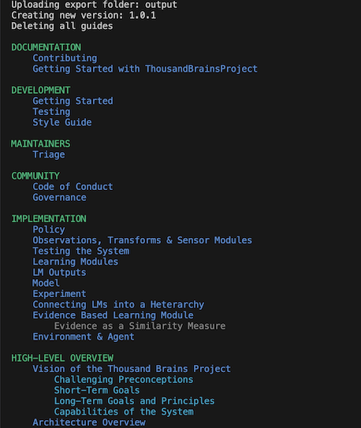

- Start Date: 2024-08-20
- RFC PR: Unavailable

# Summary

[summary]: #summary

Currently, our docs are edited on readme.com. This RFC proposes to move our docs to github and sync them with readme.com using their API.

# Motivation

[motivation]: #motivation

1. Code changes and documentation changes are made in separate systems and ideally they should be an atomic unit of change.
1. The review / edit process on readme is simplistic.
   - The diff screen is not great.
   - Doesn’t integrate with VSCode
   - Structural changes can’t be reviewed
   - Reviewers can’t easily segregate out their suggestions.
   - Cannot comment on specific lines.
   - Basically it’s not as good as Github version control.

# Guide-level explanation

[guide-level-explanation]: #guide-level-explanation

There are two steps to this process as the export from readme.com loses the ordering of the categories, documents and sub-documents.

1. Export the docs from readme.com and generate a hierarchy file that maintains the correct ordering, this only has to be done once.
1. Setup automated sync with readme.com and turn off editing on readme.com.

### Step 1 - Export

1. Export your docs from readme.com.
1. Run the export command on which will contact readme.com through their APIs and ensure that the correct ordering is applied to all the documents, sub-documents and folders.

   ```bash
   python tools/readme-sync.py export <folder>
   ```

1. Ensure all the needed content from the legacy docs folder is moved into the output folder.
1. Delete the old /docs folder and rename the output folder to /docs
1. Delete the v1.x folder from the root of the project.
1. Commit the changes to the docs folder.

### Step 2 - Sync'ing

1. Run the sync command which will send the docs to github.

   ```bash
   python tools/readme-sync.py upload <folder> version <vX>
   ```

   Where version is the version of the docs you are syncing. For example v1.1, v1.2, v2.0 etc...

   

Note 1: Sync'ing is a destructive operation. It will delete all the categories and documents for that version on readme.com and replace them with the ones in the /docs folder. Any changes made in readme.com will be obliterated without warning. (This was your warning)

Note 2: Step 2 can be automated by creating a CI job that only gets run if files in the `/docs` folder have changed.

Note 3: Frontmatter on the docs is used to derive the title and optionally, whether the document is hidden

Note 4: The tool prechecks for slug conflicts and fails the process before any changes are made to readme.com.

Note 5: The tool prechecks that file is in a directory that matches the hierarchy file

## Example file:

```markdown
---
title: My doc
hidden: true
---

The document content.
```

## Example hierarchy file:

```markdown
# category-name: Cateory Name

    - page-a
    - page-b
        - sub-page-1
```

# Reference-level explanation

[reference-level-explanation]: #reference-level-explanation

All sync operations are done through the [readme API](https://docs.readme.com/main/reference/intro-to-the-readme-api)

If the version being sync'd does not exist on readme, v1.0 is forked on readme using their versioning API, and then all the docs are uploaded from the specified folder.
If the version being sync'd does exist on readme, docs are updated in place using the following procedure.

- get all categories and docs from the server for that version.
- create a new doc with a new slug
  - create a new doc at the new slug
- update doc with existing slug
  - update the doc in place with the existing slug
- delete doc with existing slug
  - delete the doc in place with the existing slug
- move a doc to a new location
  - update doc in place with existing slug
  - ensure new parents are in place
  - move the doc to a new location, retaining the slug
- delete all the remaining docs that have not been processed from the server call.

Interaction with other features: replaces the current readme docs process with a github based one.
The feature will be implemented as a python command in the tools directory.

## Corner cases

None at time of last iteration.

# Drawbacks

[drawbacks]: #drawbacks

- We can no longer accept edits through readme.com and have to rely on PRs to the docs folder. Which will need to be disabled on the project settings:

  

  Note 1: Readme is working on a feature to allow a sync from github to readme.com, so this may be a temporary issue.

- Documents can no longer be truly invisible as they'll be visible in the github repo even if they're being marked as hidden on readme by the sync process.

# Rationale and alternatives

[rationale-and-alternatives]: #rationale-and-alternatives

The rationale is that there are no viable alternatives.

## rdme cli

This tool is not in a state to do full syncing of a folder of docs / dealing with images.

## github.com/flowcommerce/readme-sync

This tool does not deal with categories, or versions or images and is written in typescript.

## Readme is working on this feature

1. Support says it will be ready, hopefully, by the end of the year which doesn't meet our timelines.
2. The feature is not yet documented so we're not certain it will meet our needs.

# Prior art and references

[prior-art-and-references]: #prior-art-and-references

n/a

# Unresolved questions

[unresolved-questions]: #unresolved-questions

None at time of writing.

# Future possibilities

[future-possibilities]: #future-possibilities

## Open source

This project could be made into an open source project, put into the python package ecosystem and therefore removed from the monty repo to reduce complexity.

## Functional extensions

- add a spell checker
- reusable components (image with captions, text blocks)
- insert glossary terms into the readme format of our terms
- generate a PDF for downloadable
- generate a single HTML page
- generate internationalized versions
