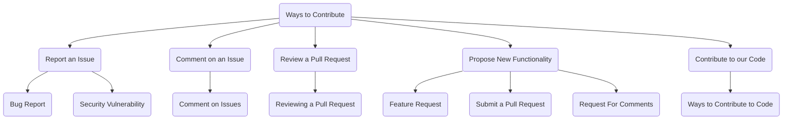
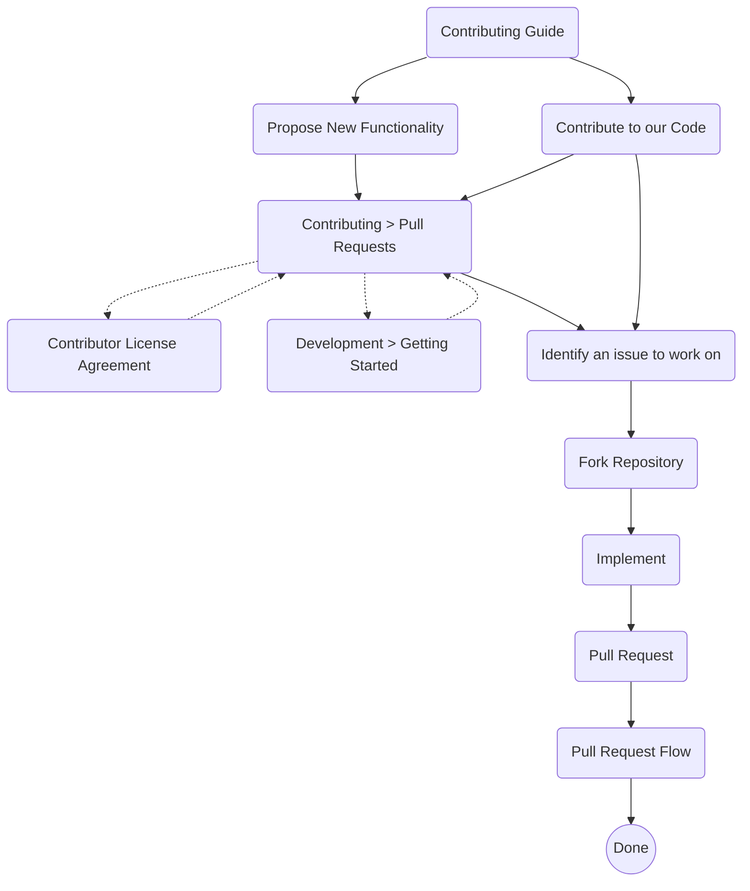
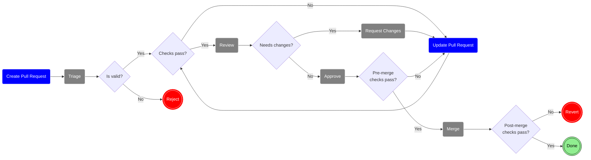
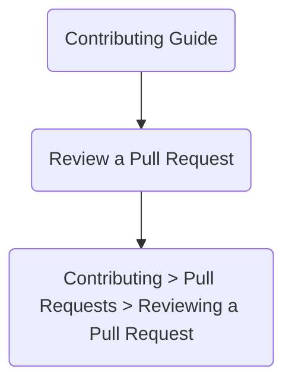
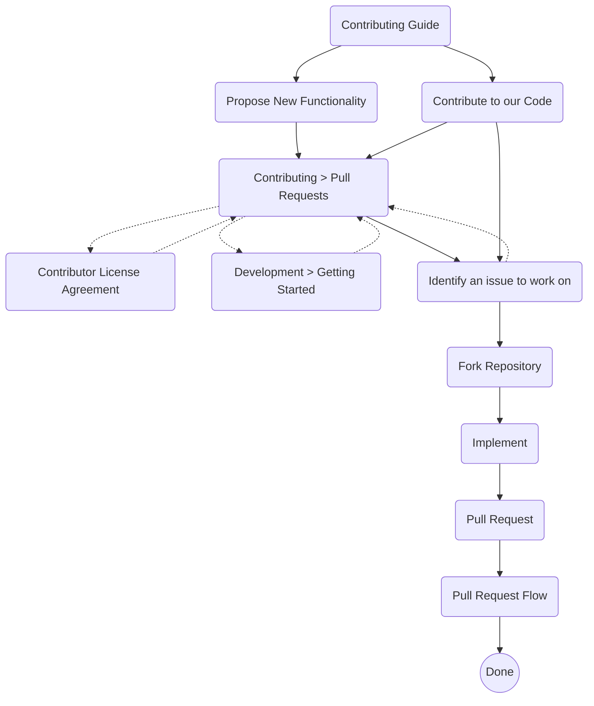

- Start Date: 2024-08-07
- RFC PR: Unavailable

# Summary
[summary]: #summary

This RFC establishes initial Issue and Pull Request Review guidance for Maintainers.

The key words "MUST", "MUST NOT", "REQUIRED", "SHALL", "SHALL
NOT", "SHOULD", "SHOULD NOT", "RECOMMENDED",  "MAY", and
"OPTIONAL" in this document are to be interpreted as described in
[IETF RFC 2119](https://datatracker.ietf.org/doc/html/rfc2119).

# Motivation
[motivation]: #motivation

With Monty's open sourcing, Maintainers want to ensure that new Contributors can contribute to the project easily. Maintainers also want to ensure that contributions are integrated as fast as practicable. As a project on GitHub, it is common to handle issue tracking via Issues inside the project and integrate code contributions via the GitHub Pull Request mechanism. The guidance herein is intended to set clear and unambiguous expectations of how a Contributor's work (in the form of an Issue or a Pull Request) will be handled by the Maintainers. Additionally, this guidance provides a minimal bar for Maintainers to strive for in order to provide a good experience for Contributors.

The expectation is that there is a clear and unambiguous path for contributions to be integrated into Monty. The speed of integration could be a possible health metric.

# Guide-level explanation
[guide-level-explanation]: #guide-level-explanation

Contributors are invited to submit and comment on Issues and to submit and review Pull Requests in the top-level Ways to Contribute.

When reading the documentation, the anticipated Contributor paths through documentation are as follows:

---
Links:
- [Ways to Contribute](https://thousandbrainsproject.readme.io/docs/contributing)
  - [Report an Issue](https://thousandbrainsproject.readme.io/docs/contributing#report-an-issue)
    - [Bug Report](https://github.com/thousandbrainsproject/tbp.monty/issues/new?template=01_bug_report.yml)
    - Security Vulnerability (will be available once the repository is open-sourced)
  - [Comment on an Issue](https://thousandbrainsproject.readme.io/docs/contributing#comment-on-an-issue)
    - [Comment on Issues](https://thousandbrainsproject.readme.io/docs/comment-on-issues)
  - [Review a Pull Request](https://thousandbrainsproject.readme.io/docs/contributing#review-a-pull-request)
    - [Reviewing a Pull Request](https://thousandbrainsproject.readme.io/docs/pr-reviews)
  - [Propose New Functionality](https://thousandbrainsproject.readme.io/docs/contributing#propose-new-functionality)
    - [Feature Request](https://github.com/thousandbrainsproject/tbp.monty/issues/new?template=02_feature_request.yml)
    - [Submit a Pull Request](https://thousandbrainsproject.readme.io/docs/contributing-pull-requests)
    - [Request For Comments](https://thousandbrainsproject.readme.io/docs/contributing-rfcs)
  - [Contribute to our Code](https://thousandbrainsproject.readme.io/docs/contributing#contribute-to-our-code)
    - [Ways to Contribute to Code](https://thousandbrainsproject.readme.io/docs/contributing-code)

## Issues

Maintainers SHALL NOT assign priority, or severity to Issues.

### Security Vulnerabilities

Maintainers will establish a _public_ mechanism for Contributors to _privately_ report Security Vulnerabilities.

### Comment on an Issue

Contributors and Maintainers MAY comment on Issues.

## Pull Requests

### Submit a Pull Request

The [Submit a Pull Request](https://thousandbrainsproject.readme.io/docs/contributing#submit-a-pull-request) section of the Contributing Guide invites Contributors to submit Pull Requests.

A Contributor's path in order to successfully submit and merge a Pull Request is depicted at high level below. It starts with documentation and then proceeds through the mechanics of selecting work and getting the Pull Request approved:

Details of signing the "Contributor License Agreement" and "Development > Getting Started" are out of the scope of this RFC. If interested, see [Contributor License Agreement](https://thousandbrainsproject.readme.io/docs/contributor-license-agreement) or [Development Getting Started](https://thousandbrainsproject.readme.io/docs/development-getting-started).

As part of the [Pull Request Flow](#pull-request-flow), Maintainers are asked to [Review a Pull Request](#review-a-pull-request).

### Pull Request Flow

The following is a summary of Pull Request Flow. For details, see the [Reference-level explanation](#reference-level-explanation).

### Review a Pull Request

The [Review a Pull Request](https://thousandbrainsproject.readme.io/docs/contributing#review-a-pull-request) section invites Contributors to review Pull Requests.

A Contributor's path in order to successfully review a Pull Request is depicted at high level below:

For a Pull Request to be Reviewed, it SHOULD pass automated checks. For a Pull Request to be Merged, it MUST be Approved by at least one Maintainer, and Pre-merge checks MUST pass (see: [Pull Request Flow](#pull-request-flow) for reference).

Contributors MAY review the Pull Request but MUST NOT Approve it. This implies that Contributors can greatly influence any Pull Request but only lack the authority to promote the code to be included in Monty, which requires a Maintainer.

Maintainers SHOULD review the Pull Request and MAY Approve it.

Maintainers MAY Request Changes to the Pull Request.

A Pull Request MAY be Approved by one or more Maintainers.

Multiple aspects must be considered when conducting a Pull Request Review. **Generally, Maintainers should favor approving the Pull Request if it improves things.** Consider people, design, functionality, complexity, tests, naming, comments, style, documentation, every line, context, and highlight good things. See [Reference-level explanation](#reference-level-explanation) for details.

# Reference-level explanation
[reference-level-explanation]: #reference-level-explanation

Contributors are invited to submit and comment on Issues and to submit and review Pull Requests in the top-level Ways to Contribute.

When reading the documentation, the anticipated Contributor paths through documentation are as follows:

---
Links:
- [Ways to Contribute](https://thousandbrainsproject.readme.io/docs/contributing)
  - [Report an Issue](https://thousandbrainsproject.readme.io/docs/contributing#report-an-issue)
    - [Bug Report](https://github.com/thousandbrainsproject/tbp.monty/issues/new?template=01_bug_report.yml)
    - Security Vulnerability (will be available once the repository is open-sourced)
  - [Comment on an Issue](https://thousandbrainsproject.readme.io/docs/contributing#comment-on-an-issue)
    - [Comment on Issues](https://thousandbrainsproject.readme.io/docs/comment-on-issues)
  - [Review a Pull Request](https://thousandbrainsproject.readme.io/docs/contributing#review-a-pull-request)
    - [Reviewing a Pull Request](https://thousandbrainsproject.readme.io/docs/pr-reviews)
  - [Propose New Functionality](https://thousandbrainsproject.readme.io/docs/contributing#propose-new-functionality)
    - [Feature Request](https://github.com/thousandbrainsproject/tbp.monty/issues/new?template=02_feature_request.yml)
    - [Submit a Pull Request](https://thousandbrainsproject.readme.io/docs/contributing-pull-requests)
    - [Request For Comments](https://thousandbrainsproject.readme.io/docs/contributing-rfcs)
  - [Contribute to our Code](https://thousandbrainsproject.readme.io/docs/contributing#contribute-to-our-code)
    - [Ways to Contribute to Code](https://thousandbrainsproject.readme.io/docs/contributing-code)

## Issue

Maintainers SHALL NOT assign priority, or severity to Issues.

The reason for not assigning priority or serverity to Issues stems from the constraints that may arise or that we are likely to adopt:
- we will not assign issues to people (anyone can work on anything they want; better pull request wins)
- we will not commit to any due dates for resolving any issues
- if successful, we expect the number of open issues to grow without bound
- people with different agendas will work on issues they are paid to work on by their employer or care about personally
- we will have a separate and private mechanism for reporting security vulnerabilities (https://docs.github.com/en/code-security/security-advisories/guidance-on-reporting-and-writing-information-about-vulnerabilities/privately-reporting-a-security-vulnerability)
- Maintainers will disagree on priority and severity

With the above constraints in place, the use cases for priority and severity are not clear.

The possibility that in the future we may want some sort of high priority label is acknowledged and deferred. If, in the future, a need for high priority label arises, it is expected to play out as follows: This RFC would tell us not to label priorities. So we would say something in the comments as "This is important; please work on this." Then, we could create an RFC citing that use case as a reason for needing a priority indicator.

### Security Vulnerabilities

Maintainers will establish a _public_ mechanism for Contributors to _privately_ report Security Vulnerabilities.

Security vulnerabilities are difficult to anticipate, almost by definition. While it is not currently obvious what constitutes a security vulnerability in Monty, it is a good practice to have a private mechanism for reporting Security Vulnerabilities so that we can handle them responsibly.

### Comment on an Issue

Contributors and Maintainers MAY comment on Issues.

In general, we do not provide much guidance on commenting on Issues anticipating that people will comment on what they want to comment.

The proposed text of the guide for commenting on Issues is included below and initially located at https://thousandbrainsproject.readme.io/docs/comment-on-issues.

---

#### Guide

We value your feedback and insights. If you have suggestions, ideas, or questions, feel free to comment on existing issues. Engaging in discussions helps shape Monty's direction and ensures that the community's needs and concerns are considered.

Please consider the following when commenting.

##### People

Remember the people involved in the Pull Request. Be welcoming. If there is a conflict or coming to an agreement is difficult, having an audio or video call can help. Remember to always be polite and that everyone is just trying to help in their own way.

###### Understanding

When commenting on issues, please favor gaining an understanding of what is being communicated. What is the other person's context? 

###### Bug Reports

We encourage everyone to reproduce Bug Reports. If you generate a reproduction, please comment on the Issue with your reproduction to verify the problem.

###### Feature Requests

If you begin working on a Feature Request, it is helpful to let people know. While Feature Requests are not assigned to specific people, in some cases, it may be beneficial to discuss them with others who are also working on them.

---

#### Bug Reports

Authors SHOULD provide minimal code reproduction of the Bug.

Contributors MAY attempt to reproduce a Bug Report.

Maintainers SHOULD attempt to reproduce a Bug Report.

Maintainers SHOULD acknowledge the reproduction of a Bug Report by commenting on the Issue.

#### Feature Requests

Contributors and Maintainers SHOULD comment on a Feature Request if they start working on it.

Contributors and Maintainers SHOULD NOT prevent others from working on a Feature Request.

As part of not preventing others from working on a Feature Request, Maintainers SHALL NOT assign Issues.

## Pull Request

### Submit a Pull Request

The [Submit a Pull Request](https://thousandbrainsproject.readme.io/docs/contributing#submit-a-pull-request) section of the Contributing Guide invites Contributors to submit Pull Requests.

A Contributor's path in order to successfully submit and merge a Pull Request is depicted at high level below. It starts with documentation and then proceeds through the mechanics of selecting work and getting the Pull Request approved:

The path `Contributing Guide` -> `Contribute to our Code` -> `Identify an issue to work on` may be somewhat confusing for initial Contributors as they are led directly to a listing of Issues. This path is expected for people who are mainly interested in any open-source contributions and want to get into code immediately. They should eventually find their way back to `Contributing > Pull Requests`.

Details of signing the "Contributor License Agreement" and "Development > Getting Started" are out of the scope of this RFC. If interested, see [Contributor License Agreement](https://thousandbrainsproject.readme.io/docs/contributor-license-agreement) or [Development Getting Started](https://thousandbrainsproject.readme.io/docs/development-getting-started).

As part of the [Pull Request Flow](#pull-request-flow-1), Maintainers are asked to [Review a Pull Request](#review-a-pull-request-1).

### Pull Request Flow

Notice that there are pre-merge checks as well as post-merge checks. Ideally, we want all checks to be pre-merge so that we identify any issues before the merge. However, some checks tend to occur only after the Merge. For example, updating all ReadMe documentation after documentation changes are Merged. Therefore, we explicitly call these out as post-merge checks and acknowledge that they may lead to Reverts.

The proposed text of the Pull Request Flow guide is included below and located at https://thousandbrainsproject.readme.io/docs/pull-request-flow.

---

The Pull Request flow begins when you **Create a Pull Request** to our [GitHub repository](https://github.com/thousandbrainsproject/tbp.monty/pulls).

#### 1. Triage

A **Maintainer** will check the Pull Request for validity. If it is invalid, it will be **Rejected**. The **Maintainer** should include an explanation for why the Pull Request has been rejected.

A valid Pull Request is on-topic, well-formatted, and contains expected information.

A **Maintainer** will apply the appropriate labels (`triaged` at a minimum) as part of **[Triage](https://thousandbrainsproject.readme.io/docs/triage#pull-request-triage)**.

##### Reject

If your Pull Request has been **Rejected** and you want to resubmit it, you should start over and **Create a new Pull Request** with appropriate changes. Depending on the reason for rejection, it might be good to [submit an RFC](https://thousandbrainsproject.readme.io/docs/contributing-rfcs) first.

#### 2. Review and Request Changes

Automated checks run against the Pull Request as part of the **Review**. If the automated checks fail, you should **Update Pull Request**.

If all automated checks pass, **Maintainers** will **Review** the Pull Request. If changes are needed, **Maintainers** will **Request Changes**.

> ℹ️ **Maintainers**
> 
> A handy link to [view Pull Requests that were **Triaged** and are ready for your **Review**](https://github.com/thousandbrainsproject/tbp.monty/pulls?q=is%3Aopen+is%3Apr+label%3Atriaged+review-requested%3A@me)

#### 3. Update Pull Request

If automated checks fail or **Maintainers** **Request Changes**, you are responsible for **Updating the Pull Request**. Once you updated, the Pull Request will again enter **Review**.

#### 4. Approve

Once the **Maintainers** **Approve** your Pull Request, pre-merge checks will be initiated. If pre-merge checks fail, it is your responsibility to **Update the Pull Request**. [What is the difference between pre-merge checks and automated checks mentioned under 2. review?]

#### 5. Merge

Once pre-merge checks succeed, **Maintainers** will **Merge** your Pull Request.

After **Merge**, automated post-merge checks will run. If automated checks fail, the Pull Request will be **Reverted**. If automated checks succeed, you are **Done** 🥳🎉🎊.

#### Revert

If your Pull Request is **Reverted**, you should start over and **Create Pull Request** with appropriate changes.

---

### Review a Pull Request

For a Pull Request to be Reviewed, it SHOULD pass automated checks. For a Pull Request to be Merged, it MUST be Approved by at least one Maintainer, and Pre-merge checks MUST pass (see [Pull Request Flow](https://thousandbrainsproject.readme.io/docs/pull-request-flow) for reference).

Contributors MAY review the Pull Request but MUST NOT Approve it. This implies that Contributors can greatly influence any Pull Request but only lack the authority to promote the code to be included in Monty, which requires a Maintainer.

Maintainers SHOULD review the Pull Request and MAY Approve it.

The proposed text of the guide for reviewing Pull Requests is included below and located at https://thousandbrainsproject.readme.io/docs/pr-reviews.

---

Thank you for reviewing a Pull Request. Below are some guidelines to consider.

#### Prerequisite: Automated Checks Pass

Before a Pull Request is reviewed, it should pass the automated checks. If the automated checks fail, you may want to wait until the author makes the required updates.

#### Merge Criteria

For a Pull Request to be **Merged**, it must be **Approved** by at least one **Maintainer**, and the **Pre-merge checks** must pass. See [Pull Request Flow](https://thousandbrainsproject.readme.io/edit/pull-request-flow) for additional details.

If you are not a **Maintainer**, you may still review the Pull Request and provide insights. While unable to **Approve** the Pull Request, you still can influence what sort of code is included in Monty.

#### Reviewing

Multiple aspects must be considered when conducting a Pull Request Review. **Generally, Maintainers should favor approving a Pull Request if it improves things** along one or several of the dimensions listed below.

##### Design

Consider the overall design of the change. Does it make sense? Does it belong in Monty? Is now the time for this functionality? Does it fit with the design patterns within Monty?

##### Functionality

Does the code do what the author intended? Are the changes good for both end-users and developers? Is there a demo available so that you can evaluate the functionality by experiencing it instead of reading the code? 

##### Performance

Does the code perform as the author intended? Is it an improvement over current performance on our benchmarks (or at least no degradation)?

##### Complexity

Complex code is more difficult to debug. The code should be as simple as possible, but not simpler.

##### Tests

If applicable, ask for unit, integration, or end-to-end tests. The tests should fail when the code is broken. Complex tests are more difficult to debug. The tests should be as simple as possible, but not simpler.

##### Benchmarks

If applicable, ask for benchmarks. Existing benchmarks should not worsen with the change.

##### Naming

A good name is unambiguously telling the reader what the variable, class, or function is for.

##### Style

Does the code follow the [Style Guide](https://thousandbrainsproject.readme.io/docs/style-guide)? Prefer automated style formatting. 

##### Comments

Are the comments necessary? Usually, comments should explain _why_, not the what or how.

Note that comments are distinct from _documentation_ in the code, such as class or method descriptions.

##### Documentation

Is the change sufficiently documented? Can a user understand the new code or feature without any other background knowledge (like things discussed in Pull Request review comments or meetings)? Does every class and function have appropriate doc strings explaining their purpose, inputs and outputs? 

Note: code documentation can also be too verbose. If docstrings are getting too long, consider adding a new page to overall documentation instead. Comments don't need to explain every line of code.

##### Every Line

Generally, look at every line of the Pull Request. If asked to review only a portion of the Pull Request, comment on what was reviewed.

If you have difficulty reading the code, others will also have difficulty; ask for clarification. Approach each pull request with fresh eyes and consider whether other uses will understand the changes. Just because you understand something (maybe because you talked about it in another conversation or you spent a lot of time thinking about the change) doesn't mean that others will. The code should be intuitive to understand and easy to read.

If you feel unqualified to review some of the code, ask someone else to review that portion of the code.

##### Context

"Zoom out." Consider the change in the broader context of the file or the system as a whole. Should the changes now include refactoring or re-architecture?

##### Scope

Does the pull request have an appropriate scope? Each pull request should address one specific problem or add one specific feature. If there are multiple additions in a pull request, consider asking the contributor to split them into separate pull requests. 

##### Good Things

If you see things you like, let the author know. This keeps the review from being fully focused on mistakes and invites future contributions. Celebrate the awesome work of this individual.

#### People

Remember the people involved in the Pull Request. Be welcoming. If there is a conflict or coming to an agreement is difficult, changing the medium from Pull Request comments to audio or video can help. Sometimes, complex topics can be more easily discussed with a real-time meeting, so don't hesitate to suggest a time when everyone can meet synchronously.  
Be cordial and polite in your review. A Pull Request is a gift and should be treated as such. Assume the best of intentions in submitted Pull Requests, even if that Pull Request is eventually rejected.

#### Request Changes

Feel free to **Request Changes** on a Pull Request. Once changes are requested, it is up to the author to **Update the Pull Request**, at which point the Pull Request will again be **Reviewed**. See [Pull Request Flow](#pull-request-flow-1) for additional details.

We encourage including the prefix `nit:` for suggestions or changes that are minor and wouldn’t prevent you from approving the Pull Request. This helps distinguish nitpicks from essential, blocking requests.

#### Approve

A Pull Request only requires **Approval** from one **Maintainer**.

Once **Approved**, before the Pull Request is **Merged**, pre-merge checks must pass. See [Pull Request Flow](#pull-request-flow-1) for additional details.

---

### Request Changes

Contributors or Maintainers MAY Request Changes on a Pull Request. Once changes are requested, it is up to the author to Update the Pull Request, at which point the Pull Request will once again be Reviewed (see [Pull Request Flow](#pull-request-flow-1) for reference).

### Approve

A Pull Request MAY be Approved by one or more Maintainers.

Once Approved, before the Pull Request is Merged, Pre-merge checks MUST pass (see [Pull Request Flow](#pull-request-flow-1) for reference). These criteria MUST be enforced by automation.

# Drawbacks
[drawbacks]: #drawbacks

One reason not to provide too much guidance is that the guidance can continue to expand without people necessarily reading it.

# Rationale and alternatives
[rationale-and-alternatives]: #rationale-and-alternatives

We could adopt someone else's code review guidance and point people to it.

# Prior art and references
[prior-art-and-references]: #prior-art-and-references

Individuals and large engineering organizations have written volumes on dealing with issues and reviewing code submissions. Providing guidance on these topics is difficult without copying someone else's ideas.

Below are some randomly chosen references that may be useful for informing this RFC.

## References

- https://github.com/pytorch/pytorch/wiki/Code-review-values
- https://google.github.io/eng-practices/review/reviewer/
- https://rewind.com/blog/best-practices-for-reviewing-pull-requests-in-github/
- https://github.com/ZhangHanDong/rust-code-review-guidelines

# Unresolved questions
[unresolved-questions]: #unresolved-questions

No unresolved questions remaining.

# Future possibilities
[future-possibilities]: #future-possibilities

We can start with minimal guidance and continue to evolve it into a more elaborate format based on the random path of our particular Pull Request review experience.
