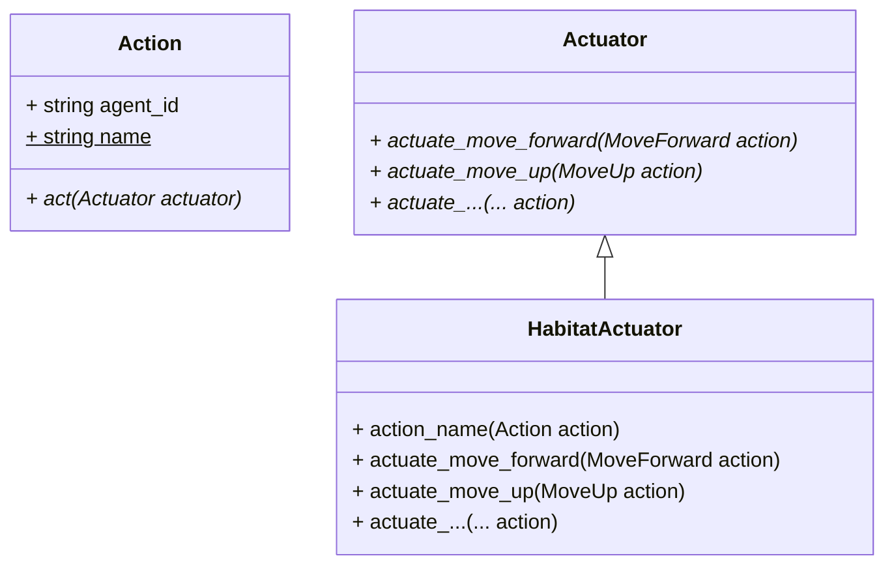
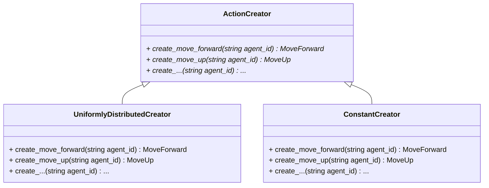

- Start Date: 2024-08-26
- RFC PR: Unavailable

NOTE: While this RFC process is document-based, you are encouraged to also include visual media to help convey your ideas.

# Summary
[summary]: #summary

> A brief explanation of the feature.

Instead of handling `action, amount` tuples between system components, use an `action: Action` object that supports any number of parameters for the action instead of the single `amount`.

# Motivation
[motivation]: #motivation

> Why are we doing this? What use cases does it support? What is the expected outcome? Which metrics will this improve? What capabilities will it add?
>
> Please focus on explaining the motivation so that if this RFC is not accepted, the motivation could be used to develop alternative solutions. In other words, enumerate the constraints you are trying to solve without coupling them too closely to the solution you have in mind.

The `MotorSystem.__call__` returns a tuple of `action, amount` for eventual use with `HabitatSim`. This tuple interface is insufficient, overconstrained, and violated.

## Insufficient

The `action, amount` tuple is insufficient because the `InformedEnvironmentDataLoader` implements the `update_habitat_sim_agent_actuation_constraint()` method as follows:

```python
    def update_habitat_sim_agent_actuation_constraint(self):
        constraint = self.motor_system.get_next_constraint(self._action, self._amount)
        self.dataset.env._env._sim.agents[0].agent_config.action_space[
            self._action
        ].actuation.constraint = constraint
```

For a previously generated `action` and `amount` stored in `self._action` and `self._amount`, the data loader requests the Motor System to generate a `constraint`. This `constraint` is then used as an additional parameter to the action (alongside `amount`) in order to correctly actuate the `action`.

The setting of `....actuation.constraint = constraint` is an implementation detail of working around Habitat agent constraints. See implementation of `HabitatSim.apply_action` for details of the workaround. By being unable to pass `constraint` alongside the `action, amount` tuple, the `InformedEnvironmentDataLoader` implements a workaround that should be confined within `HabitatSim`.

## Overconstrained

The current `action, amount` convention appears to be motivated by [the default Habitat Agent ActuationSpec](https://aihabitat.org/docs/habitat-sim/habitat_sim.agent.ActuationSpec.html)

> ### Special methods
>
> ```python
> def __init__(self,
>   """Method generated by attrs for class ActuationSpec."""
>   amount: float,
>   constraint: typing.Optional[float] = None) -> None
> ```
>
> ### Properties
>
> `amount: float` get set del
>
> > The amount the control moves the scene node by
>
> `constraint: typing.Optional[float]` get set del
>
> > A constraint on the actuation. Currently only applies to the maximum amount the agent can lookup or loopdown

The `ActuationSpec` dictates that `amount` is a `float` and `constraint` is an additional optional `float`. However, some actions require more than two `float` parameters.

This can be accomplished by specifying non-default actuation specifications as described in https://aihabitat.org/docs/habitat-sim/new-actions.html.

Customizing acutation specification is already being done in the case of `ActuationVecSpec` class:

```python
@attr.s(auto_attribs=True)  # TODO check significance of this decorator
class ActuationVecSpec(ActuationSpec):
    """
    Inherits from Meta's habitat-sim class

    Expects a list of lists

    Enables passing in two lists to set_pose --> the first is the xyz absolute positions
    for the agent, and the second list contains the coefficients of a quaternion
    specifying absolute rotation
    """

    amount: List[List[float]]
    constraint: Optional[float] = None
```

And we see here that `amount` is set to `List[List[float]]`, while maintaining an optional `constraint`. This `amount`, `constraint` structure is not necessary as we can specify _arbitrary_ actuation specifications. For example (from https://aihabitat.org/docs/habitat-sim/new-actions.html):

```python
@attr.s(auto_attribs=True, slots=True)
class MoveAndSpinSpec:
    forward_amount: float
    spin_amount: float


@attr.s(auto_attribs=True, slots=True)
class StrafeActuationSpec:
    forward_amount: float
    # Classic strafing is to move perpendicular (90 deg) to the forward direction
    strafe_angle: float = 90.0
```

## Violated

The code already violates the existing actuation specifications. The `ActionSpaceMixin` uses `amount` in a way that conforms neither to the default `AcutationSpec` nor the custom `ActuationVecSpec`:

```python
    ["set_sensor_rotation", [[qt.one]], None],
    ["set_sensor_pose", [[0.0, 0.0, 0.0], qt.one], None],
```

Both, the `[[qt.one]]` and the `[[0.0, 0.0, 0.0], qt.one]` parameters are intended to be `amount`, but they correspond neither to `float` nor `List[List[float]]` data types. `qt.one` will evaluate as a `List[float]` in this context, but it is of type `np.quaternion`.

# Guide-level explanation
[guide-level-explanation]: #guide-level-explanation

> Explain the proposal as if it was already included in Monty and you were teaching it to another Monty user. That generally means:
>
> - Introducing new named concepts.
> - Explaining the feature largely in terms of examples.
> - Explaining how Monty developers should *think* about the feature and how it should impact the way they use Monty. It should explain the impact as concretely as possible.
> - If applicable, provide sample error messages, deprecation warnings, or migration guidance.
> - If applicable, describe the differences between teaching this to existing Monty users and new Monty users.
> - If applicable, include pictures or other media if possible to visualize the idea.
> - If applicable, provide pseudo plots (even if hand-drawn) showing the intended impact on performance (e.g., the model converges quicker, accuracy is better, etc.).
> - Discuss how this impacts the ability to read, understand, and maintain Monty code. Code is read and modified far more often than written; will the proposed feature make code easier to maintain?
>
> Keep in mind that it may be appropriate to defer some details to the [Reference-level explanation](#reference-level-explanation) section.
>
> For implementation-oriented RFCs, this section should focus on how developer contributors should think about the change and give examples of its concrete impact. For administrative RFCs, this section should provide an example-driven introduction to the policy and explain its impact in concrete terms.

---

## Current State

### How actions are currently instantiated

Actions are divided into two major types: `"uniform"` distribution type, and `"const"` distribution type. Action names, distribution to sample from, and parameters for the sampling are all kept and configured separately from each other.

### How actions are currently used

- `action` is a `string`
- `amount` is a `float` or `List[List[float]]` or `any`
- `constraint` is an optional `float`

Below sequence diagram shows how the `HabitatEnvironment` processes a `step(action, amount)` invocation.

See: [0004_action_object/habitatenv_step_seq_diagram_current.md](0004_action_object/habitatenv_step_seq_diagram_current.md).

The [Law of Demeter](https://en.wikipedia.org/wiki/Law_of_Demeter) violation in the alt else case in the sequence diagram above is a workaround for Habitat interface and not a concern for this RFC. It may be beneficial to encapsulate the logic into a method. The workaround is summarized in the following code comment:
```python
# FIXME: Habitat does not expose API passing amount to actions.
# Work around this limitation by temporary changing the action
# actuation amount
```

## Desired State

In order to support the ability of taking a generic `Action` and using it with different environments, we can use the [Visitor pattern](https://refactoring.guru/design-patterns/visitor) to declare `Actions` independent of environments. `Actuator` would declare the visitor interface and any concrete environment would implement a concrete visitor, such as `HabitatActuator`, that would handle actuating an `Action` into an environment-specific act.

Specifically in the Habitat case, `HabitatActuator` can be a mixin to keep implementation methods together without throwing everything into `HabitatSim`.



### Creating Actions

When policies explicitly create actions, they are free to invoke action constructors directly:

```python
return MoveForward(agent_id=self.agent_id, forward_amount=0.01)
```

Instead of action names, distribution to sample from, and parameters for the sampling being kept and configured separately from each other, we could use an [Abstract factory pattern](https://refactoring.guru/design-patterns/abstract-factory) to generate actions that sample from one of the available distributions. Configuration would configure what concrete distribution we want to use, and when we need a specific action for an agent with an amount, invoking the factory would result in that action.



The `self.action_space.sample()` would be replaced by a concrete method in `ActionCreator` along the lines of `sample(agent_id)` below. (NOTE: This makes `ActionCreator` awfully similar to `ActionSpace`, but will defer any further refactoring for now).

```python
class ActionCreator(abc.ABC):

    ...

    @abc.abstractmethod
    def create_move_forward(self, agent_id: str) -> MoveForward:
        pass

    @abc.abstractmethod
    def create_move_up(self, agent_id: str) -> MoveUp:
        pass

    ...

    def sample(self, agent_id: str) -> Action:
        methods = [method for method in dir(self) if method.startswith("create_")]
        random_create_method_name = self.rng.choice(methods)
        random_create_method = getattr(self, random_create_method_name)
        action = random_create_method(agent_id)
        return cast(Action, action)
```

### Using actions

List of changes in the desired state, where the `HabitatEnvironment` will process a `step(action: Action)` invocation, without a separate `amount`:

- `HabitatEnvironment.step(action: Action)` instead of `HabitatEnvironment.step(action, amount)`
- `HabitatSim.apply_action(action: Action)` instead of `HabitatSim.apply_action(action, amount)`
- new `HabitatActuator.action_name(action: Action)` that encodes Habitat-specific action naming convention based on `Action.name` and `Action.agent_id`. Returns `f"{Action.agent_id}.{Action.name}"`.
- Instead of iterating through agents, retreive specific agent by `Action.agent_id`.
- Each `HabitatActuator.actuate_...(action: Action)` method knows whether there are action parameters or not. If needed, each actuation method implements the Habitat API workaround by manipulating action parameters directly in the simulator.
- We no longer restore action parameters in the simulator after they are altered since they are explicitly set prior to each action.

See: [0004_action_object/habitatenv_step_seq_diagram_desired.md](0004_action_object/habitatenv_step_seq_diagram_desired.md).

We end up with something like the following for `HabitatSim.apply_action`:

```python
def apply_action(self, action: Action):
    action_name = self.action_name(action)
    if action_name not in self._action_space:
        raise ValueError(f"Invalid action name: {action_name}")

    action.act(self)

    observations = self.get_observations()
    return observations
```

The complexity of Habitat API ends up encapsulated in `HabitatActuator`, with the usual interaction for new actions restricted to defining `actuate_EXAMPLE_ACTION(...)` method along with creating a `EXAMPLEACTIONParameterizer` class. In the example below, `actuate` is used for code reuse and is not part of the `Actuator` visitor interface:

```python
class HabitatActuator(Actuator):

    def actuate(self, action: Action, parameterizer: Type[HabitatParameterizer]):
        """
        Common actuate implementation for actuate methods
        """
        agent = self.get_agent(action.agent_id)
        action_name = self.action_name(action)
        action_space = agent.agent_config.action_space
        if action_name not in action_space:
            raise ValueError(f"Invalid action name: {action_name}")

        action_params = action_space[action_name].actuation
        parameterizer.parameterize(action_params, action)

        agent.act(action_name)

    ...

    def actuate_move_forward(self, action: MoveForward):
        self.actuate(action, MoveForwardParameterizer)

    ...


class HabitatParameterizer(abc.ABC):
    @staticmethod
    @abc.abstractmethod
    def parameterize(params, action: Action):
        pass

class MoveForwardParameterizer(HabitatParameterizer):
    @staticmethod
    def parameterize(params, action: MoveForward):
        params.forward_amount = action.forward_amount

# NOTE: In this example, we defined MoveForward along with MoveForwardSpec
#       in the Habitat simulator elsewhere

@attr.s(auto_attribs=True, slots=True)
class MoveForwardSpec:
    forward_amount: float

@registry.register_move_fn(body_action=True)
class MoveForward(SceneNodeControl):
    def __call__(self, scene_node: SceneNode, actuation_spec: MoveForwardSpec) -> None:
        _move_along(scene_node, -actuation_spec.forward_amount, _Z_AXIS)
```

This visitor pattern design allows us to quickly modify or create actions. After specifying the actions in Habitat simulator, the actuator code requires creation/update of `actuate_EXAMPLE_ACTION(...)` method along with creating/updating the corresponding `EXAMPLEACTIONParameterizer` class. Note that the knowledge of what specific action we are dealing with is entirely encapsulated in `actuate_EXAMPLE_ACTION(...)` method.

All actions will be made into explicit classes that inherit from `Action`.

The declarations for creating actions in the motor system, like the one below will be updated from:

```python
ACTION_NAMES_DISTANT_AGENT = [
    "look_up",
    "look_down",
    "turn_left",
    "turn_right",
    "move_forward",
    "set_agent_pose",
    "set_sensor_rotation",
]
```

to:

```python
ACTION_NAMES_DISTANT_AGENT = [
    LookUp.name,
    LookDown.name,
    TurnLeft.name,
    TurnRight.name,
    MoveForward.name,
    SetAgentPose.name,
    SetSensorRotation.name
]
```

# Reference-level explanation
[reference-level-explanation]: #reference-level-explanation

> This is the technical portion of the RFC. Explain the design in sufficient detail that:
>
> - Its interaction with other features is clear.
> - It is reasonably clear how the feature would be implemented.
> - Corner cases are dissected by example.
>
> The section should return to the examples from the previous section and explain more fully how the detailed proposal makes those examples work.

---

## Current State

### How actions are currently instantiated

During configuration, inside `policy_setup_utils.py`, `generate_action_space(agent_id, action_space_type)` generates a `HabitatActionSpace` along with a list of action names. Within `policy_setup_utils.py` are also declarations `ACTION_NAMES_DISTANT_AGENT`, `ACTION_NAMES_DISTANT_AGENT_NO_TRANSLATION`, `ACTION_NAMES_ABSOLUTE_ONLY`, `ACTION_NAMES_SURFACE_AGENT`. We note that `generate_action_space(...)` immediately couples `agent_id` with `action_name`, generating a list of `f"{agent_id}.{action_name}"`.

```python
def generate_action_space(agent_id, action_space_type):
    """Generate an action space list based on a given action space type

    Args:
        agent_id (str): name of the agent, typically "agent_0"
        action_space_type (str): name of action space (current there are 4)

    Returns:
        list[str]: list of action names, formatted properly for Habitat to use
    """
    assert action_space_type in [
        "distant_agent",
        "distant_agent_no_translation",
        "absolute_only",
        "surface_agent",
    ]
    if action_space_type == "distant_agent":
        action_names = ACTION_NAMES_DISTANT_AGENT
    elif action_space_type == "distant_agent_no_translation":
        action_names = ACTION_NAMES_DISTANT_AGENT_NO_TRANSLATION
    elif action_space_type == "absolute_only":
        action_names = ACTION_NAMES_ABSOLUTE_ONLY
    elif action_space_type == "surface_agent":
        action_names = ACTION_NAMES_SURFACE_AGENT
    action_list = []
    for action_name in action_names:
        action_list.append(f"{agent_id}.{action_name}")
    action_space = HabitatActionSpace(action_list)
    return action_space, action_names
```

Actions are divided into two major types: `"uniform"` distribution type, and `"const"` distribution type. This becomes relevant when motor policies generate parameters to parameterize an action via:

```python
def get_next_amount(self, action):
    return self.action_name_to_sample_fn[action](
        **self.action_names_to_params[action]
    )
```

`self.action_name_to_sample_fn` is created via:

```python
def create_action_name_to_sample_fn(self):
    """Go from {action: str} -> {action: function}"""
    action_name_to_sample_fn = {}

    for key, val in self.action_to_dist.items():
        action_name = self.action_names[key]
        if val == "const":
            sample_fn = const_sampler
        else:
            sample_fn = getattr(self.rng, val)  # eg "uniform"
        action_name_to_sample_fn[action_name] = sample_fn
    return action_name_to_sample_fn
```

and `self.action_names_to_params` is created via:

```python
def amounts(
    self,
    translation_amount=0.004,
    rotation_amount=5.0,
    low_translation=-0.05,
    high_translation=0.05,
    low_rotation=0,
    high_rotation=20,
    low_absolute=0,
    high_absolute=360,
):
    """generate action amount dict"""
    assert self.distribution_type in [
        "uniform",
        "const",
    ], "Distribution type must be uniform or const"
    amount_dict = {}
    if self.distribution_type == "uniform":
        for action_name in self.action_names:
            if (
                "look" in action_name
                or "turn" in action_name
                or "orient" in action_name
            ):
                low = low_rotation
                high = high_rotation
            elif "move" in action_name:
                low = low_translation
                high = high_translation
            elif "set" in action_name:
                low = low_absolute
                high = high_absolute
                # Note set_pose does not currently take into account any maximum
                # or minimum values; TODO consider adding this
            amount_dict[action_name] = dict(low=low, high=high)

    elif self.distribution_type == "const":
        for action_name in self.action_names:
            if (
                "look" in action_name
                or "turn" in action_name
                or "orient" in action_name
            ):
                amount = rotation_amount
            elif "move" in action_name:
                amount = translation_amount
            elif "set" in action_name:
                amount = 0
                # Absolute change, so no need to specify a standard amount
            else:
                raise ValueError(
                    "Only look, turn, orient, or move actions currently apply"
                )
            amount_dict[action_name] = dict(amount=amount)

    return amount_dict
```

So, action names, distribution to sample from, and parameters for the sampling are all kept and configured separately from each other.

### How actions are currently used

- `action` is a `string`
- `amount` is a `float` or `List[List[float]]` or `any`
- `constraint` is an optional `float`

```python
"""
(...)

.. note::
    Actions are registered by each agent and it is assumed to be unique,
    however this constraint is not enforced. When multiple agents register
    an action with the same name then only the first one will receive the
    action event when this method is called.
"""
```

The excerpt from a code comment above highlights that even though each action contains agent ID as part of the action name, it can register duplicates. If we enforce the constraint of no duplicates, then ensuring only one agent in HabitatSim executes the action will become extraneous. Nevertheless, we may want to keep it as a form of defensive programming even if the constraint is enforced.

Below sequence diagram shows how the `HabitatEnvironment` processes a `step(action, amount)` invocation.

See: [0004_action_object/habitatenv_step_seq_diagram_current.md](0004_action_object/habitatenv_step_seq_diagram_current.md).

The [Law of Demeter](https://en.wikipedia.org/wiki/Law_of_Demeter) violation in the alt else case in the sequence diagram above is a workaround for Habitat interface and not a concern for this RFC. It may be beneficial to encapsulate the logic into a method. The workaround is summarized in the following code comment:
```python
# FIXME: Habitat does not expose API passing amount to actions.
# Work around this limitation by temporary changing the action
# actuation amount
```

## Desired State

In order to support the ability of taking a generic `Action` and using it with different environments, we can use the [Visitor pattern](https://refactoring.guru/design-patterns/visitor) to declare `Actions` independent of environments. `Actuator` would declare the visitor interface and any concrete environment would implement a concrete visitor, such as `HabitatActuator`, that would handle actuating an `Action` into an environment-specific act.

Specifically in the Habitat case, `HabitatActuator` can be a mixin to keep implementation methods together without throwing everything into `HabitatSim`.


### Creating Actions

When policies explicitly create actions, they are free to invoke action constructors directly, for example, instead of:

```python
return self.agent_id + ".move_forward", 0.01, False
```

The code can now be:

```python
return MoveForward(agent_id=self.agent_id, forward_amount=0.01)
```

Another "before" example:

```python
distance_from_center = np.linalg.norm(
    np.array(self.state["agent_id_0"]["position"]) - np.array([0, 1.5, 0])
)  # TODO shouldn't use hard-coded initilaziation of agent position i.e. 1.5,
# setup getting this organically

self.action = self.agent_id + ".orient_horizontal"
self.amount = 180
move_left_amount = np.tan(np.radians(self.amount)) * distance_from_center
move_forward_amount = (
    distance_from_center
    * (1 - np.cos(np.radians(self.amount)))
    / np.cos(np.radians(self.amount))
)
constraint = (move_left_amount, move_forward_amount)
return self.action, self.amount, constraint
```

And the code can now be:

```python
distance_from_center = np.linalg.norm(
    np.array(self.state["agent_id_0"]["position"]) - np.array([0, 1.5, 0])
)  # TODO shouldn't use hard-coded initilaziation of agent position i.e. 1.5,
# setup getting this organically

move_left_amount = np.tan(np.radians(180)) * distance_from_center
move_forward_amount = (
    distance_from_center
    * (1 - np.cos(np.radians(180)))
    / np.cos(np.radians(180))
)
return OrientHorizontal(
    agent_id=self.agent_id,
    rotate_amount=180,
    move_left_amount=move_left_amount,
    move_forward_amount=move_forward_amount
)
```

Instead of action names, distribution to sample from, and parameters for the sampling being kept and configured separately from each other, we could use an [Abstract factory pattern](https://refactoring.guru/design-patterns/abstract-factory) to generate actions that sample from one of the available distributions. Configuration would configure what concrete distribution we want to use, and when we need a specific action for an agent with an amount, invoking the factory would result in that action.


With encapsulation offered by either `UniformlyDistributedCreator` or `ConstantCreator` we can make some of the code more explicit. For example, in `ConstantCreator` it is more explicit that we are setting a constant `forward_amount`:

```python
class ConstantCreator:

    def __init__(
        self,
        rotation_amount=5.0,
        translation_amount=0.004,
        ...
    ):
        self.rotation_amount=rotation_amount
        self.translation_amount=translation_amount
        ...

    def create_move_forward(self, agent_id: string):
        return MoveForward(agent_id=agent_id, forward_amount=self.translation_amount)
```

Similarly in `UniformlyDistributedCreator` it is more explicit that we are sampling the `forward_amount` from a distribution and returning the action containing that.

```python
import numpy as np

class UniformlyDistributedCreator:

    def __init__(
        self,
        rng=np.random.default_rng(),
        rotation_high=20,
        rotation_low=0,
        translation_high=0.05
        translation_low=0.05,
        ...
    ):
        self.rng=rng
        self.rotation_high=rotation_high
        self.rotation_low=rotation_low
        self.translation_high=translation_high
        self.translation_low=translation_low
        ...

    def create_move_forward(self, agent_id: string):
        forward_amount = self.rng.uniform(low=self.translation_low, high=self.translation_high)
        return MoveForward(agent_id=agent_id, forward_amount=forward_amount)
```

Policies may want to choose random actions, for example:

```python
action = self.action_space.sample()
```

The `self.action_space.sample()` would be replaced by a concrete method in `ActionCreator` along the lines of `sample(agent_id)` below. (NOTE: This makes `ActionCreator` awfully similar to `ActionSpace`, but will defer any further refactoring for now).

```python
class ActionCreator(abc.ABC):

    ...

    @abc.abstractmethod
    def create_move_forward(self, agent_id: str) -> MoveForward:
        pass

    @abc.abstractmethod
    def create_move_up(self, agent_id: str) -> MoveUp:
        pass

    ...

    def sample(self, agent_id: str) -> Action:
        methods = [method for method in dir(self) if method.startswith("create_")]
        random_create_method_name = self.rng.choice(methods)
        random_create_method = getattr(self, random_create_method_name)
        action = random_create_method(agent_id)
        return cast(Action, action)
```

With the above in place, instead of:

```python
action = self.action_space.sample()
amount = self.get_next_amount(action)
```

We would now do:

```python
action = self.action_creator.sample(self.agent_id)
```

There is a use case in `get_random_action` where we keep the same action but may resample the amount, which would need to be taken into consideration when rewriting `get_random_action`. Also, as mentioned before, `action_creator.sample` looks a lot like `action_space.sample` but leaving it alone for now.

### Using actions

List of changes in the desired state, where the `HabitatEnvironment` will process a `step(action: Action)` invocation, without a separate `amount`:

- `HabitatEnvironment.step(action: Action)` instead of `HabitatEnvironment.step(action, amount)`
- `HabitatSim.apply_action(action: Action)` instead of `HabitatSim.apply_action(action, amount)`
- new `HabitatActuator.action_name(action: Action)` that encodes Habitat-specific action naming convention based on `Action.name` and `Action.agent_id`. Returns `f"{Action.agent_id}.{Action.name}"`.
- Instead of iterating through agents, retreive specific agent by `Action.agent_id`.
- Each `HabitatActuator.actuate_...(action: Action)` method knows whether there are action parameters or not. If needed, each actuation method implements the Habitat API workaround by manipulating action parameters directly in the simulator.
- We no longer restore action parameters in the simulator after they are altered since they are explicitly set prior to each action.

See: [0004_action_object/habitatenv_step_seq_diagram_desired.md](0004_action_object/habitatenv_step_seq_diagram_desired.md).

We end up with something like the following for `HabitatSim.apply_action`:

```python
def apply_action(self, action: Action):
    action_name = self.action_name(action)
    if action_name not in self._action_space:
        raise ValueError(f"Invalid action name: {action_name}")

    action.act(self)

    observations = self.get_observations()
    return observations
```

The complexity of Habitat API ends up encapsulated in `HabitatActuator`, with the usual interaction for new actions restricted to defining `actuate_EXAMPLE_ACTION(...)` method along with creating a `EXAMPLEACTIONParameterizer` class. In the example below, `actuate` is used for code reuse and is not part of the `Actuator` visitor interface:

```python
class HabitatActuator(Actuator):

    def actuate(self, action: Action, parameterizer: Type[HabitatParameterizer]):
        """
        Common actuate implementation for actuate methods
        """
        agent = self.get_agent(action.agent_id)
        action_name = self.action_name(action)
        action_space = agent.agent_config.action_space
        if action_name not in action_space:
            raise ValueError(f"Invalid action name: {action_name}")

        action_params = action_space[action_name].actuation
        parameterizer.parameterize(action_params, action)

        agent.act(action_name)

    ...

    def actuate_move_forward(self, action: MoveForward):
        self.actuate(action, MoveForwardParameterizer)

    ...


class HabitatParameterizer(abc.ABC):
    @staticmethod
    @abc.abstractmethod
    def parameterize(params, action: Action):
        pass

class MoveForwardParameterizer(HabitatParameterizer):
    @staticmethod
    def parameterize(params, action: MoveForward):
        params.forward_amount = action.forward_amount

# NOTE: In this example, we defined MoveForward along with MoveForwardSpec
#       in the Habitat simulator elsewhere

@attr.s(auto_attribs=True, slots=True)
class MoveForwardSpec:
    forward_amount: float

@registry.register_move_fn(body_action=True)
class MoveForward(SceneNodeControl):
    def __call__(self, scene_node: SceneNode, actuation_spec: MoveForwardSpec) -> None:
        _move_along(scene_node, -actuation_spec.forward_amount, _Z_AXIS)
```

This visitor pattern design allows us to quickly modify or create actions. After specifying the actions in Habitat simulator, the actuator code requires creation/update of `actuate_EXAMPLE_ACTION(...)` method along with creating/updating the corresponding `EXAMPLEACTIONParameterizer` class. Note that the knowledge of what specific action we are dealing with is entirely encapsulated in `actuate_EXAMPLE_ACTION(...)` method.

All actions will be made into explicit classes that inherit from `Action`.

The declarations for creating actions in the motor system, like the one below will be updated from:

```python
ACTION_NAMES_DISTANT_AGENT = [
    "look_up",
    "look_down",
    "turn_left",
    "turn_right",
    "move_forward",
    "set_agent_pose",
    "set_sensor_rotation",
]
```

to:

```python
ACTION_NAMES_DISTANT_AGENT = [
    LookUp.name,
    LookDown.name,
    TurnLeft.name,
    TurnRight.name,
    MoveForward.name,
    SetAgentPose.name,
    SetSensorRotation.name
]
```

# Drawbacks
[drawbacks]: #drawbacks

> Why should we *not* do this? Please consider:
>
> - Implementation cost, both in terms of code size and complexity
> - Whether the proposed feature can be implemented outside of Monty
> - The impact on teaching people Monty
> - Integration of this feature with other existing and planned features
> - The cost of migrating existing Monty users (is it a breaking change?)
>
> There are tradeoffs to choosing any path. Please attempt to identify them here.

It may initially seem that using the visitor pattern restricts `Environment` implementations to use it as well. However, there is nothing stopping an `Environment` implementation to ignore the pattern and inspect `Action` contents however is deemed appropriate. Thus, the visitor pattern support is there to facilitate ease of use but does not restrict other uses.

This design assumes that each `Action` is targeted at an `Agent` by expecting an `agent_id` to be provided on `Action` creation. This mechanism might need to change if we want non-agent-specific actions in the future. However, it seems that should be a future refactoring as existing code already couples `agent_id` to `action` via action name of `f"{agent_id}.{name}"`.

# Rationale and alternatives
[rationale-and-alternatives]: #rationale-and-alternatives

> - Why is this design the best in the space of possible designs?
> - What other designs have been considered, and what is the rationale for not choosing them?
> - What is the impact of not doing this?

Some of below rationale include type-checking as a benefit. In general, it is the opinion of the author that types aid in authoring code and reducing time between a coding mistake and its discovery. Additionally, types aid in learning new code by specifying additional significant constraints within which the student can focus their learning.

[Visitor pattern](https://refactoring.guru/design-patterns/visitor) is a documented approach for decoupling a general framework algorithm from concrete details incidental to each specific instance. Hence the suggestion of its use for decoupling Monty actions from environment-specific actuations of each Monty action. Additional benefit is type-checking of action-related code.

The use of static methods in minimal classes for `HabitatParameterizer` is an approach of doing type-checked static configuration. Static, in the sense that `actuate_move_forward(...)` is statically configured to always use `MoveForwardParameterizer`.

# Prior art and references
[prior-art-and-references]: #prior-art-and-references

> Discuss prior art, both the good and the bad, in relation to this proposal.
> A few examples of what this can include are:
>
> - References
> - Does this functionality exist in other frameworks, and what experience has their community had?
> - Papers: Are there any published papers or great posts that discuss this? If you have some relevant papers to refer to, this can serve as a more detailed theoretical background.
> - Is this done by some other community and what were their experiences with it?
> - What lessons can we learn from what other communities have done here?
>
> This section is intended to encourage you as an author to think about the lessons from other frameworks and provide readers of your RFC with a fuller picture.
> If there is no prior art, that is fine. Your ideas are interesting to us, whether they are brand new or adaptations from other places.
>
> Note that while precedent set by other frameworks is some motivation, it does not on its own motivate an RFC.
> Please consider that Monty sometimes intentionally diverges from common approaches.

# Unresolved questions
[unresolved-questions]: #unresolved-questions

> Optional, but suggested for first drafts.
>
> What parts of the design are still TBD?

This refactoring impacts testing. In theory, using the visitor pattern and relying more on objects should make testing easier. In practice, this is not yet fully thought out and worked through.

# Future possibilities
[future-possibilities]: #future-possibilities

> Optional.
>
> Think about what the natural extension and evolution of your proposal would
> be and how it would affect Monty and the Thousand Brains Project as a whole in a holistic way.
> Try to use this section as a tool to more fully consider all possible
> interactions with the Thousand Brains Project and Monty in your proposal.
> Also consider how this all fits into the future of Monty.
>
> This is also a good place to "dump ideas" if they are out of the scope of the
> RFC you are writing but otherwise related.
>
> If you have tried and cannot think of any future possibilities,
> you may simply state that you cannot think of anything.
>
> Note that having something written down in the future-possibilities section
> is not a reason to accept the current or a future RFC; such notes should be
> in the section on motivation or rationale in this or subsequent RFCs.
> The section merely provides additional information.