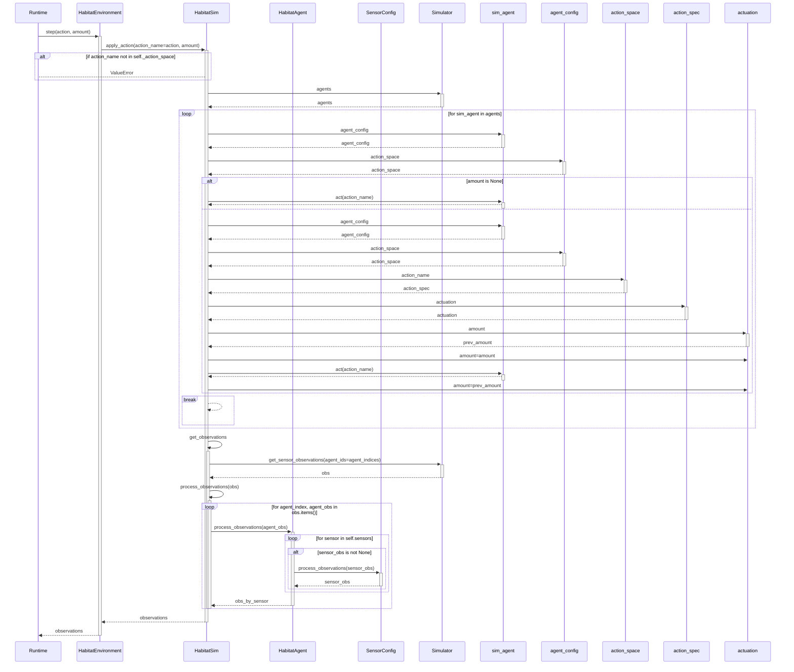

```mermaid
sequenceDiagram
    participant R as Runtime
    participant HE as HabitatEnvironment
    participant HS as HabitatSim
    participant HA as HabitatAgent
    participant SC as SensorConfig
    participant S as Simulator

    R ->>+ HE : step(action, amount)
    HE ->>+ HS : apply_action(action_name=action, amount)
    alt if action_name not in self._action_space
        HS --> R : ValueError
    end
    HS ->>+ S : agents
    S -->>- HS : agents
    loop for sim_agent in agents
        HS ->>+ sim_agent : agent_config
        sim_agent -->>- HS : agent_config
        HS ->>+ agent_config : action_space
        agent_config -->>- HS : action_space
        alt amount is None
            HS ->>+ sim_agent : act(action_name)
            sim_agent -->>- HS : 
        else
            HS ->>+ sim_agent : agent_config
            sim_agent -->>- HS : agent_config
            HS ->>+ agent_config : action_space
            agent_config -->>- HS : action_space
            HS ->>+ action_space : action_name
            action_space -->>- HS : action_spec
            HS ->>+ action_spec : actuation
            action_spec -->>- HS : actuation
            HS ->>+ actuation : amount
            actuation -->>- HS : prev_amount
            HS ->> actuation : amount=amount
            HS ->>+ sim_agent : act(action_name)
            sim_agent -->>- HS : 
            HS ->> actuation : amount=prev_amount
        end
        break
            HS -->> HS : 
        end
    end
    HS ->> HS : get_observations
    activate HS
        HS ->>+ S : get_sensor_observations(agent_ids=agent_indices)
        S -->>- HS : obs
        HS ->> HS : process_observations(obs)
        activate HS
            loop for agent_index, agent_obs in obs.items()
                HS ->>+ HA : process_observations(agent_obs)
                loop for sensor in self.sensors
                    alt sensor_obs is not None
                        HA ->>+ SC : process_observations(sensor_obs)
                        SC -->>- HA : sensor_obs
                    end
                end
                HA -->>- HS : obs_by_sensor
            end
        deactivate HS
    deactivate HS
    HS -->>- HE : observations
    HE -->>- R : observations
```