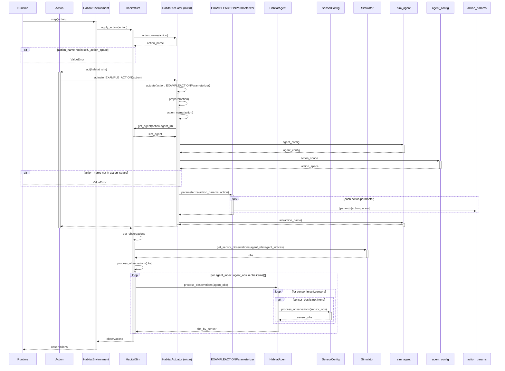

```mermaid
sequenceDiagram
    participant R as Runtime
    participant A as Action
    participant HE as HabitatEnvironment
    participant HS as HabitatSim
    participant HAct as HabitatActuator (mixin)
    participant HP as EXAMPLEACTIONParameterizer
    participant HA as HabitatAgent
    participant SC as SensorConfig
    participant S as Simulator

    R ->>+ HE : step(action)
    HE ->>+ HS : apply_action(action)
    HS ->>+ HAct : action_name(action)
    HAct -->>- HS : action_name
    alt action_name not in self._action_space
        HS --> R : ValueError
    end
    HS ->>+ A : act(habitat_sim)
    A ->>+ HAct : actuate_EXAMPLE_ACTION(action)
    HAct ->> HAct : actuate(action, EXAMPLEACTIONParameterizer)
    activate HAct
        HAct ->> HAct : prepare(action)
        activate HAct
            HAct ->> HAct : action_name(action)
            HAct ->>+ HS : get_agent(action.agent_id)
            HS -->>- HAct : sim_agent
            HAct ->>+ sim_agent : agent_config
            sim_agent -->>- HAct : agent_config
            HAct ->>+ agent_config : action_space
            agent_config -->>- HAct : action_space
            alt action_name not in action_space
                HAct --> R : ValueError
            end
        deactivate HAct
        HAct ->>+ HP : parameterize(action_params, action)
            loop each action parameter
                HP ->>+ action_params : [param]=[action.param]
            end
        HP -->>- HAct :
        HAct ->>+ sim_agent : act(action_name)
        sim_agent -->>- HAct :
    deactivate HAct

    HAct -->>- A :
    A -->>- HS :
    HS ->> HS : get_observations
    activate HS
        HS ->>+ S : get_sensor_observations(agent_ids=agent_indices)
        S -->>- HS : obs
        HS ->> HS : process_observations(obs)
        activate HS
            loop for agent_index, agent_obs in obs.items()
                HS ->>+ HA : process_observations(agent_obs)
                loop for sensor in self.sensors
                    alt sensor_obs is not None
                        HA ->>+ SC : process_observations(sensor_obs)
                        SC -->>- HA : sensor_obs
                    end
                end
                HA -->>- HS : obs_by_sensor
            end
        deactivate HS
    deactivate HS
    HS -->>- HE : observations
    HE -->>- R : observations
```