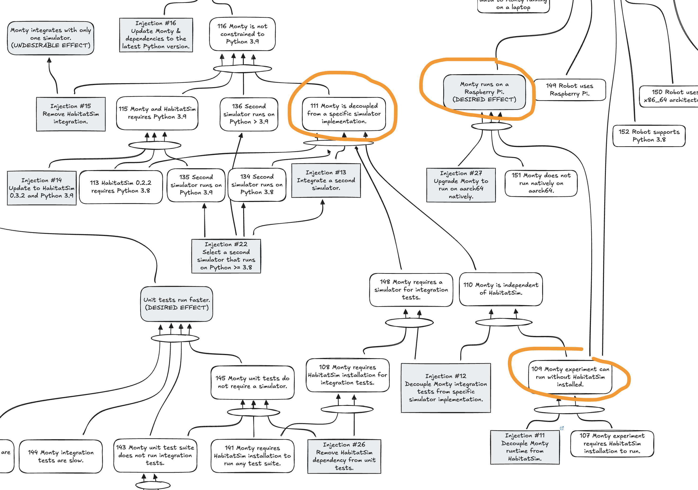

- Start Date: 2025-01-23
- RFC PR: https://github.com/thousandbrainsproject/tbp.monty/pull/150

# Summary

The proposal is to compartmentalize the HabitatSim-related code into its own folder, specifically `tbp/monty/simulators/habitat`.

1. Move HabitatSim-dependent config utils out of `frameworks/config_utils/make_dataset_configs.py` and into `simulators/habitat/configs.py`.
2. Move `frameworks/environments/habitat.py` into `simulators/habitat/environment.py`.
3. Move `frameworks/environment_utils/habitat_utils.py` into `simulators/habitat/environment_utils.py`.

The end result will be that the `frameworks` folder will retain the general framework code, while the `simulators` folder will contain the simulator-specific code.

An example of what `simulators/habitat` folder will look like after refactoring:

```
simulators/habitat/
├── __init__.py
├── actions.py
├── actuator.py
├── agents.py
├── configs.py
├── environment.py
├── environment_utils.py
├── sensors.py
├── simulator.py
```

Additionally, this organization makes it much easier to spot specific simulator-dependent code. This should facilitate further refactoring. You can see an example of this in the [refactor: compartmentalize habitat simulator dependent code Pull Request](https://github.com/thousandbrainsproject/tbp.monty/pull/149)

# Motivation

As part of the Monty code roadmap, we are looking toward being able to run Monty without having HabitatSim (or any other simulator) installed. For example, when running on hardware interacting with the real world. In the future, we will also want to support additional simulators. This implies a future use case of: "Integrate a new simulator into Monty", which is a factor to consider when reorganizing the code structure.



# Future possibilities

In the future, when we want to support an additional simulator, then we can create a new folder in the `simulators` folder and have a place to put that simulator-specific code.