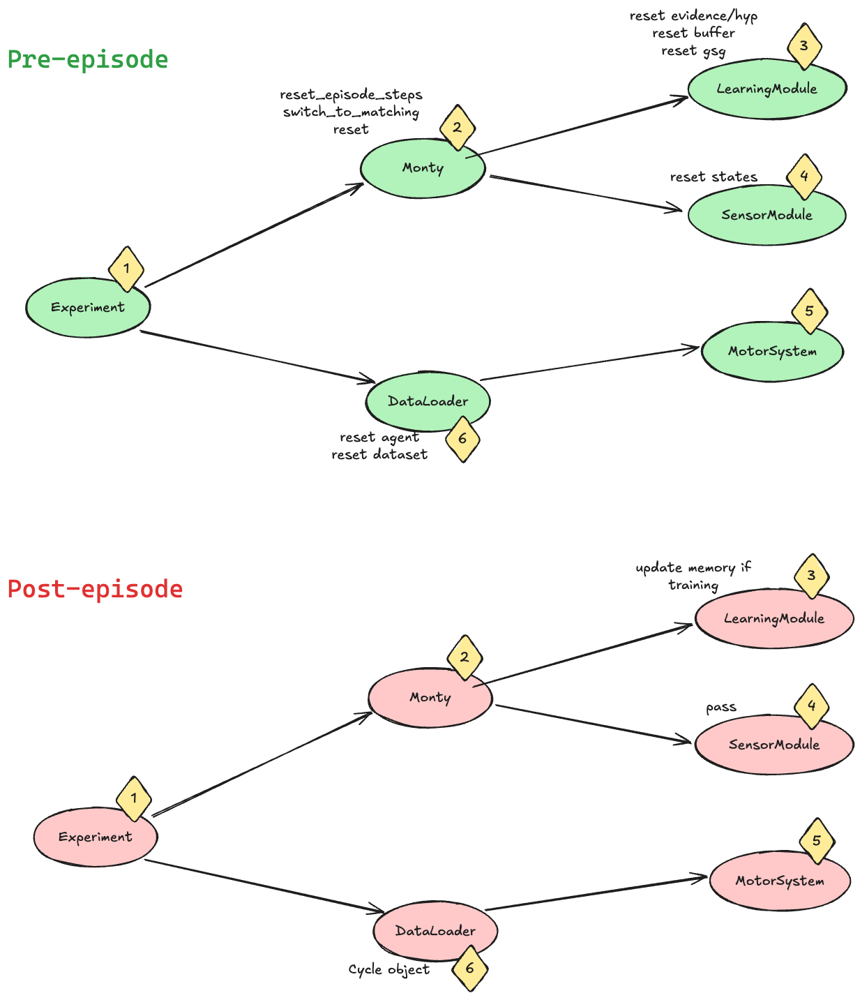
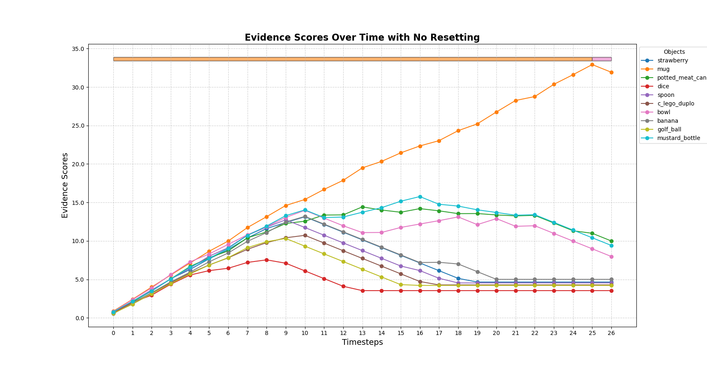
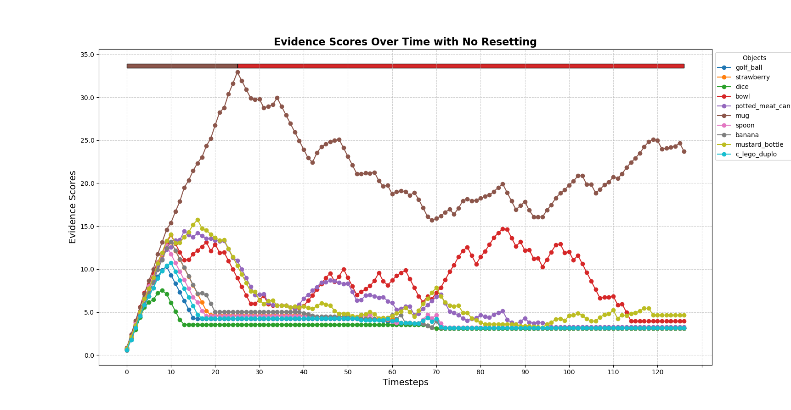
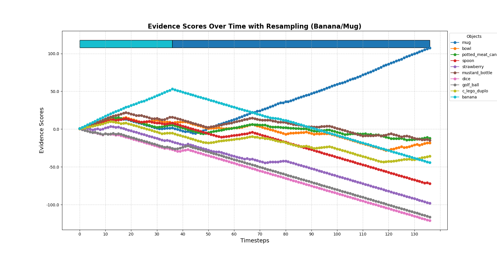
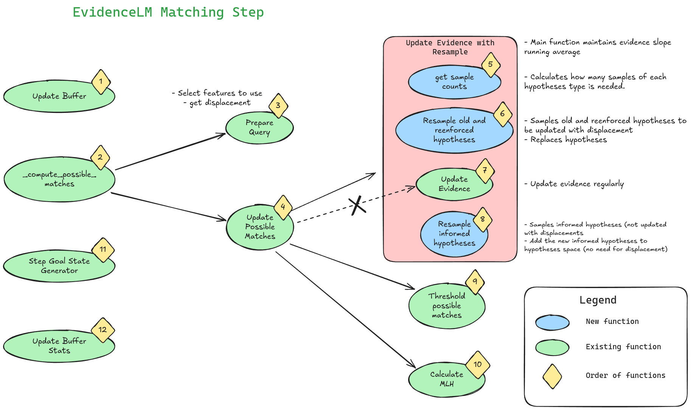

- Start Date: 2025-02-27
- RFC PR: [#196](https://github.com/thousandbrainsproject/tbp.monty/pull/196)

# Summary

Resample hypotheses at every step in a manner inspired by particle-filters. This is the first step for Monty to interact with multiple objects and recognize compositional objects. The newly sampled hypotheses will come from:
1) **Informed Hypotheses:** a subset (uniformly sampled) of new hypotheses initialized based on the current step observation (i.e., sensed pose).
2) **Reinforced Hypotheses:** a set of newly sampled hypotheses from the distribution of the most rapidly rising hypotheses.
3) **Old Hypotheses:** a subset of the old hypotheses, maintained based on the most rapidly rising hypotheses.

The total of these three hypotheses will be used to replace the existing hypotheses at each **matching step** of `EvidenceGraphLM`.

#### Background Material
* This RFC contributes to the Learning Module improvement: "[Test Particle-Filter-Like resampling of Hypothesis Space](https://thousandbrainsproject.readme.io/docs/test-particle-filter-like-resampling-of-hypothesis-space)"
* A nice introduction to Particle Filters can be found here: "[Particle Filters](https://www.youtube.com/watch?v=NrzmH_yerBU)"


# High-Level Motivation

In an unsupervised experiment setup, Monty may be presented with multiple objects in a single episode. Ideally, we would like to move away from the traditional data loading setup of machine learning where there is a strict definition of an epoch, episode and step. As Monty starts to interact with the real world, the definition of epoch and episode will start to fade away and we'll be left with simple time discretization (i.e., step). The current definitions are:
* Epoch: Used by the experiment class to denote one full pass through all the objects at a specified rotation
* Episode: Denotes a change in object
* Step:  Denotes a single sensation and action in the sensorimotor framework.

Real world interactions do not have epochs or episodes (these are only used for performance benchmarks), instead we could imagine the agent wandering around in a multi-object dynamic environment. The objects can be occluded, moving, or even disappearing behind new objects. The objects could also be compositional, such as logo on a coffee mug.

**We want Monty to handle dynamic environments by seamlessly switching from one object to another as it's sensors move around on the different - potentially compositional - objects.**

*We note that for learning, we will continue to assume for now that Monty learns about objects in an isolated manner (i.e. one at a time), whether or not it receives a supervisory signal in the form of an object label. This is akin to a child holding an object and devoting it's attention to it at the exclusion of the rest of the world (something which the nearsightedness of infants may actually assist with). Relaxing this learning assumption would therefore be a separate topic for future work.*

# The Problem
Monty is designed to receive a weak supervision signal during inference when an episode ends and a new episode begins (denoting a change of object). This signal performs a full reset of all states within Monty. This reset includes counters, buffer, goal state generators, learning modules and sensory modules. Additionally, this reset sets Monty back into Matching mode. The below figure shows where this resetting is done. Most resetting happens in the `pre_episode` functions of the Monty and SMs and LMs classes.



If we simply disable this resetting signal for the Monty class (and by extension SMs and LMs) between episodes, there will not be enough evidence update in the first step of a new object to get out of a terminal state. Monty will still think it is seeing the old object after getting a single observation of the new object. See the plot below.



To overcome this, I manually `reset_episode_steps()` such that the `matching_steps` would still be under the `min_eval_steps` and allow Monty time to gather enough evidence on the new object. Additionally, I manually `switch_to_matching_step()` between episodes since the `_compute_possible_matches` function that accumulates evidence is only called during matching, not exploration. This results in the following plot.



This reveals the main problem. Monty is still unable to accumulate evidence on the existing hypotheses. The current implementation of Monty uses `_get_all_informed_possible_poses()` to initialize hypotheses after seeing a single pose of the object. This is a smart way to reduce the number of initial hypotheses based on the principal curvature but it assumes that the object doesn't change and that these hypotheses will always be valid. However, when we change the object we would need to update these initial hypotheses based on a new pose observation of the new object. A simple test of sampling additional hypotheses (with informed poses) on the second object pose shows that we are able to accumulate evidence on these new hypotheses. See figure below.

*Note that even when testing a single object, a noisy initial pose observation can affect the quality of the initially sampled hypotheses. Using these incorrect hypotheses (without resampling) will limit Monty's performance until the end of the episode.*



# The Proposed Solution


Monty doesn't know when the object will be swapped, or if the next observation will move onto a different object. We have to resample hypotheses every step in a systematic manner, because an object change could happen in any step. Inspired by particle filters, we could come up with a modified resampling procedure.

## A New Metric

We currently use the total evidence score to decide which hypotheses are more promising. This is true if the object doesn't change, because these accumulated evidence scores are tied to a specific object. I propose to use the mean slope (over the last S steps) of evidence to decide on the goodness of a hypothesis. After swapping the object, the most promising hypotheses are the ones with higher positive slope not the ones with high accumulated evidence.

Why:
* **Faster**: we don't have to wait for high unbounded evidence to decay enough to realize that a new hypothesis is more likely. We also may not need to worry about initializing new hypotheses with mean evidence, giving them fighting chance against other old hypotheses. Average slope is more fair in this sense.
* **Accurate resampling**:  If we sample new hypotheses close to the hypotheses with high total accumulated evidence (e.g., particle filter), we could be sampling from the incorrect hypotheses (if we had just switched objects). If we sample close to the hypotheses with high evidence slope, we may converge faster.
* **Practical**: The total evidence can still be unbounded, it doesn't matter because we only consider the slope. This metric does not care about how much evidence we've accumulated already. In other words, a hypothesis with a high evidence, can be removed if it hasn't accumulated evidence in a while, while a consistently growing hypothesis is less likely to be removed even if it was just added.

## Assumptions and constraints:
* Sampling of likely and unlikely hypotheses is based on evidence change instead of absolute evidence.
* Terminal state calculation is still based on accumulated evidence and `x_percent_threshold`.

## The Resampling Procedure

1) Calculate the needed hypotheses counts to be sampled based on the defined parameters as shown [here](#The-Resampling-Count-Calculation).
2) Select `old_sampled` from the existing hypotheses based on highest evidence slope. We will keep these old hypotheses and remove the rest.
3) Uniformly sample `new_informed` from the new informed hypotheses based on the observed pose. We will add these new hypotheses.
4) Sample `new_reinforced` from the existing hypotheses distribution of highest evidence slope. These sampled hypotheses should be "close" to the most likely hypotheses.


## High Level Code Changes

The needed modification will only change the `EvidenceGraphLM` class. More specifically, we would modify either the `_update_evidence` function
directly or define another function that calls `_update_evidence` as one of its steps. A rough proposal of the needed changes is shown below.



*Note that the two types (reinforced and informed) of resampled hypotheses are treated differently. 
Unlike reinforced hypotheses, the current positions of the informed hypotheses do not need to be rotated and displaced at resampling.
Informed hypotheses are added after the reinforced (and old) hypotheses are updated/displaced.*


## The Resampling Count Calculation <a name="The-Resampling-Count-Calculation"></a>

This is a proposed approach to calculating the new set of hypotheses at every step. 
This should take care of dynamically increasing or decreasing the hypotheses count.
For example, if we want to start by coarse sampling of hypotheses and then increase the number of hypotheses (and vice versa), we should be able to do that here.

I'm introducing three new parameters. The naming of these parameters is preliminary and subject to change.

| Parameter | Description | Range |
| ----------|-------------|-------|
| **hypotheses_count_multiplier** | A multiplier for the needed number of hypotheses at this new step. `1` means maintain the same number of hypotheses. | [0, inf) |
| **hypotheses_old_to_new_ratio** | How many old to new hypotheses to be added. `0` means all old, `1` means all new | [0, 1] |
| **hypotheses_informed_to_reinforced_ratio** | How many informed (sampled based on newly observed pose) to reinforced hypotheses (sampled close to existing likely hypotheses) to be added. `0` means all informed, `1` means all reinforced | [0, 1] |

*Note that it is possible to configure these parameters to remove the effect of resampling and return to the current `EvidenceGraphLM` behavior. Simply set `hypotheses_count_multiplier=1` to keep the same number of hypotheses and `hypotheses_old_to_new_ratio=0` to sample only from existing hypotheses.*


```python

# a multiplier for the needed number of hypotheses at this new step
hypotheses_count_multiplier = 1

# 0 means all sampled from old, 1 means all sampled from new
hypotheses_old_to_new_ratio = 0.5


# 0 means all sampled from informed hypotheses, 1 means all sampled from reinforced hypotheses
hypotheses_informed_to_reinforced_ratio = 0.5


def calculate_new_hypotheses_counts(
    current, informed
):
    """
    This is a proposed function for calculating the needed count of each type of
    hypotheses ("informed", "reinforced", "old").

    Inputs:
    - `current`: The current number of hypotheses
    - `informed`: The total number of informed hypotheses
        sampled based on the current pose observation. Assuming there are x points
        in the object graph, these can be 2x if the PC is defined or 8x if PC is undefined. 

    Outputs:
    - `old_maintained`: The number of existing hypotheses to be kept from the
        previous step. Will not exceed `current`.
    - `new_informed`: The number of informed hypotheses to be sampled from
        the pool of informed hypotheses. Will not exceed `informed`.
    - `new_reinforced`: The number of needed reinforced hypotheses. Can technically
        be an infinite amount.
    """

    # calculate the total number of hypotheses needed
    needed = current * hypotheses_count_multiplier

    # calculate how many old and new hypotheses needed
    old_maintained, new_sampled = (
        needed * (1 - hypotheses_old_to_new_ratio),
        needed * hypotheses_old_to_new_ratio,
    )
    # needed old hypotheses should not exceed the existing hypotheses
    # if trying to maintain more hypotheses, set the available count as ceiling
    if old_maintained > current:
        old_maintained = current
        new_sampled = needed - current

    # calculate how many informed and reinforced hypotheses needed
    new_informed, new_reinforced = (
        new_sampled * (1 - hypotheses_informed_to_reinforced_ratio),
        new_sampled * hypotheses_informed_to_reinforced_ratio,
    )
    # needed informed hypotheses should not exceed the available informed hypotheses
    # if trying to sample more hypotheses, set the available count as ceiling
    if new_informed > informed:
        new_informed = informed
        new_reinforced = new_sampled - informed

    return (
        int(old_maintained),
        int(new_informed),
        int(new_reinforced),
    )


calculate_new_hypotheses_counts(
    current=100, informed=100
)
```

# Alternatives Considered:
* Detect change with evidence decay and hard reset?
	* Here we would focus on detecting the change that triggers full reset of Monty states. 
	* Detecting the object change will likely be based on evidence decay and can be problematic. If an object was added and quickly changed before accumulating enough evidence, it will be difficult to detect change based on evidence decay. This will still result in incorrect initial hypotheses. Resampling without a hard reset is more general.

# Future possibilities
* This only works in inference assuming that we have good object models learned in isolation. It likely breaks learning from scratch experiments.
* I manually force Monty back into the matching phase and reset it's counters between episodes. 
	* Maybe we should brainstorm about what a terminal state should be in a multi-object environment.
	* Maybe also brainstorm about ways to more seamlessly switch between matching and exploration? I don't like forcing Monty to always be in matching mode, by doing this it feels that we are making the gap between learning and inference wider.
* Start designing environments with multiple objects aiming towards compositional models.
	* Will require motor policy change to allow for moving between objects.
