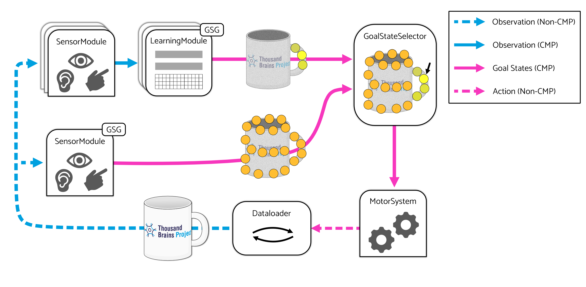

- Start Date: 2025-07-15
- RFC PR: https://github.com/thousandbrainsproject/tbp.monty/pull/376

# Summary
This RFC proposes several additions to Monty's architecture aimed at expanding the scope of Monty's goal-state system. The new components and pathways presented here were originally conceived of to improve the [efficiency of saccades driven by model-free and model-based signals](https://thousandbrainsproject.readme.io/docs/implement-efficient-saccades-driven-by-model-free-and-model-based-signals) and to [expand support for compositional objects](https://thousandbrainsproject.readme.io/docs/short-term-goals) and [multi-object environments](https://thousandbrainsproject.readme.io/docs/model-based-policy-to-recognize-an-object-before-moving-onto-a-new-object). However, several of the proposed changes to Monty's architecture are quite general, and we expect them to be broadly useful beyond our original objectives.

Briefly, the most significant changes proposed here are as follows:
 1. Sensor modules may be equipped with goal state generators.
 2. Goal states generated by learning modules and sensor modules will be sent to a `GoalStateSelector`, a new Monty component.
 3. The role of the `GoalStateSelector` is to produce a single output goal state from any number of input goal states.
 4. Motor systems will be responsible for selecting a policy appropriate to the goal state chosen by the `GoalStateSelector`.
 
**Note**: This RFC is an outgrowth of [a previous RFC](https://github.com/thousandbrainsproject/tbp.monty/pull/328). Review that document for additional context, especially with respect to the improved saccade efficiency and supporting compositional and multi-object configurations. This RFC is intentionally limited to only the architectural changes required to facilitate work on those objectives.

# Implementation

**Proposed Routing Pathways**. Learning module (LM) and sensor module (SM) derived goal states will be routed to the `GoalStateSelector`, and the `GoalStateSelector`'s output will be routed to the motor system.

The `GoalStateSelector` will receive any number of goal states derived from learning and sensor modules, and it will produce at most one goal state for consumption by the motor system. There are many potential strategies for choosing a goal state, but the simplest initial approach will be to select the goal state with the largest `confidence` value. In this way, it will act exactly as the `Monty` class currently does. More complex methods are outside the scope of this RFC.

Many other Monty components will require modification. Below is a non-exhaustive list of anticipated changes.

### `SensorModule`
 - Will have an optional `gsg` attribute (i.e., it will be a `GoalStateGenerator` or `None`).
 - Will call its `gsg`'s `step_gsg` method before exiting its own `step` method (if `gsg` is not `None`).
 - Will have a `propose_goal_state` method that returns any number of goal states. Note that this differs from the learning module's `propose_goal_state` method which returns at most 1 goal state. Returing many goal states will enable planned work on salience-based targeting methods.

All of the above changes are meant to mirror existing learning-module/GSG behavior.

### `Monty`
 - Will have a `goal_state_selector` attribute to hold a `GoalStateSelector`.
 - Existing machinery that collects goal states, performs selection, and updates the motor system will be replaced. More specifically, `Monty` will collect goal states from both learning modules and sensor modules, but it will defer goal state selection to its `goal_state_selector` object. The output of the `goal_state_selector` object will then be used to update the motor system. See the for-loop associated with `best_goal_confidence` in `_pass_infos_to_motor_system` for how this is currently implemented.
 - Optionally, `Monty` may be equipped with additional `lm_to_gss` and `sm_to_gss` connectivity matrices to support more complex routing pathways, but this is not an immediate need.

### `MotorSystem`
 - Will be initialized with any number of policies. As before, these will all be model-free.
 - Will perform policy/action selection based on a given goal state. Note that a goal state may not always be set, in which case it is expected that an appropriate model-free policy will be selected to produce an action. For example, when goal-states from `GetGoodView` are not used, the motor system can randomly saccade.

### `GoalState`
 - May be augmented with metadata indicating the target of the goal, such as the agent's position or a sensor's sensed location. Specific modifications to `GoalState` will likely evolve as they become more expressive. For example, a goal states may eventually capture a drive to observing anywhere within some bounded region rather than a specific point in space.

Specific modifications to `GoalState` objects are not yet well understood. However, we expect that additional metadata may be required for the motor system to make correct judgments about which policies and actions to select. To understand why, consider that a goal state currently contains a location and (optionally) morphological and non-morphological metadata. In principal, "location" could refer to many things -- the position of an agent, a sensed location in 3D space, etc. In practice, goal states have only been used to represent a sensed location, and policies have safely assumed that any goal state means "observation located at xyz".

In contrast, a behavior like `GetGoodView` performs agent translation in addition to sensor rotations. Therefore, a goal-state-driven implemention of `GetGoodView` would produce some goal states in which "location" should be interpreted as "agent located at xyz" and not "observation located at xyz". Our current thinking is that we can attach disambiguating metadata to goal states which can be used by the motor system to select the appropriate action without being specific about how it is chosen or executed.

However, adding new metadata in the form of non-morphological features will be limited to only what is needed for appropriate policies/action selection. We do not want to specify an entirely new set of features when the subject of a goal state changes. For example, goal states that target an agent's position and goal states that target a sensed location may both have an "object_id" feature, though its meaning may change based on context.

# Long-Term Objectives

Following discussions prior to this RFC, we have identified three objectives related to the functional and architectural changes proposed here.

  1. Implement a `GetGoodView` policy that operates similar to the `GetGoodView` positioning procedure. This `GetGoodView` policy will be an inherent part of Monty, and can be called, for example, after a `JumpToGoalState` causes Monty to lose the object. This is distinct from the `GetGoodView` positioning procedure which cannot be called by Monty and happens outside of the normal course of an episode. A `GetGoodView` policy may be implemented by having goal-state-generating SMs provide model-free signals used to orient the agent to on-object regions.
  2. Integration of model-free segmentation and model-based policies to recognize an object before moving on to a new object. This objective is the primary motive that led to the formation of this specific RFC.
  3. Improve efficiency by learning and using sparser models. It has been suggested that our learned models are unnecessarily dense owing to the fact that non-salient and salient parts of an object are represented equally. If we can ensure that only the most salient parts of an object are attended to during inference, then we can effectively ignore (or at least sample less frequently) the non-salient areas during training without degrading performance.

Each of these tasks is significant, likely warranting its own RFC. Further discussion is outside the scope of this RFC.

# Discussion

### Dataloader
The changes proposed here may disrupt the existing goal-state-execution system. More specifically, the dataloader is currently responsible for checking whether a motor system has a valid goal state. If so, it attempts to satisfy the goal state by "jumping" to a new location. In the proposed system, goal states will no longer be coupled to a single execution method, and all conversions between goal states to actions will be performed within the motor system. Consequently, the dataloader's "jump-to-goal-state" code will need to live elsewhere, preferably somewhere it can be reused by different polices. Fortunately, removing any reliance on the dataloader to execute goal states is consistent with existing plans.

### Computing Goal-State Success
We are still determining the best way to verify when a goal state has been achieved. As it stands, each `GoalStateGenerator` performs this task by reaching into its parent LM, grabbing its input observations, and comparing them with the previously generated goal state. Setting aside parent-access, reimplementing this pattern for goal-state-generating sensor modules won't work for a couple of reasons:
  1. The sensor module's GSG may have produced any number of goal states on the previous step. We need some way to indicate which goal state (if any) was selected and attempted. Note that multi-LM systems can also produce multiple goal states, so there is already a need to implement this behavior.
  2. The observations delivered to the GSG's owning/parent LM or SM may not necessarily contain the information needed to check whether a goal state was achieved. For example, an SM may generate a goal state targeting the agent's position. In this case a goal-state-generator may need access to proprioceptive data for computing goal-state-success. We can also imagine a goal might be to have a minimum percentage of the visual field occuppied an object. In this case, success can only be computed with raw sensor data which isn't available to the GSG (by default).

For the time being, we will continue the approach that the GSG must be able to map an output goal state into a sensory prediction and, finally, determine whether the predicted and actual observations are equivalent. In principal, mappings between goals and predictions may be learned or innate, but our approach will focus on the later for now.

### Future Complexity
More complex agents in the future might have multiple Goal State Selectors, and these could each output a goal-state to different parts of the motor-system. This is non-trivial however, and not something necessary at the moment. The analogy to the body is that we can sometimes do multiple things at once (e.g. walking or driving while talking), but this is often challenging, especially if similar parts of the motor system are involved (e.g. brushing your teeth side-to-side while rubbing your stomach in a circular motion). For now, there will be one Goal-State Selector for the entire Monty system.
